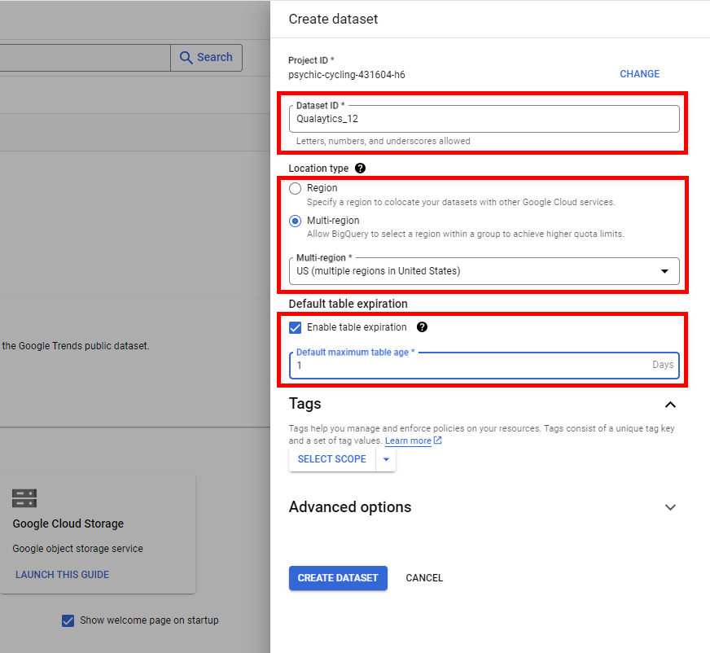
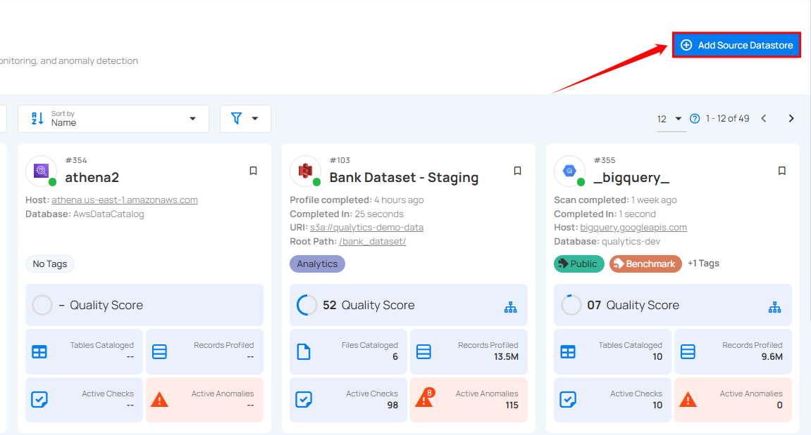
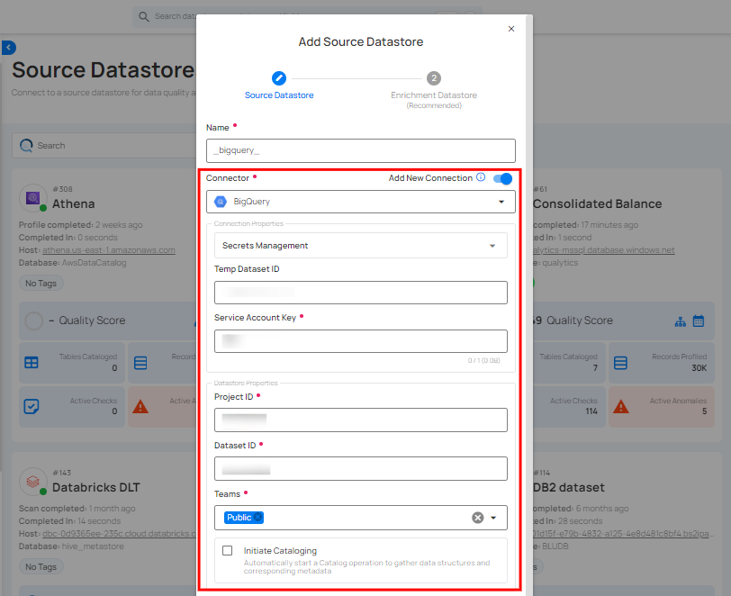
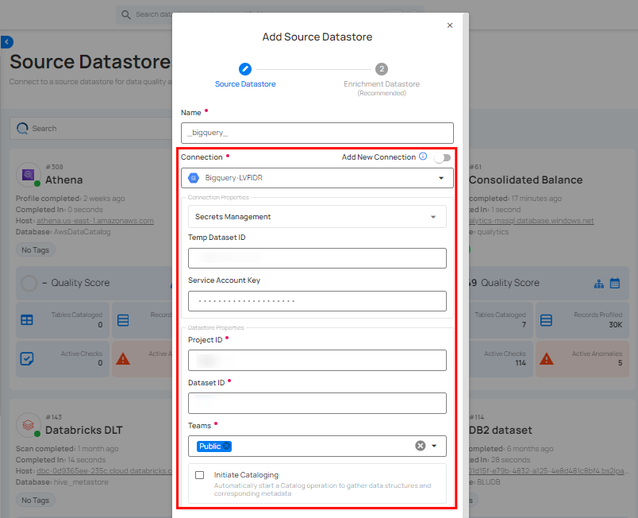
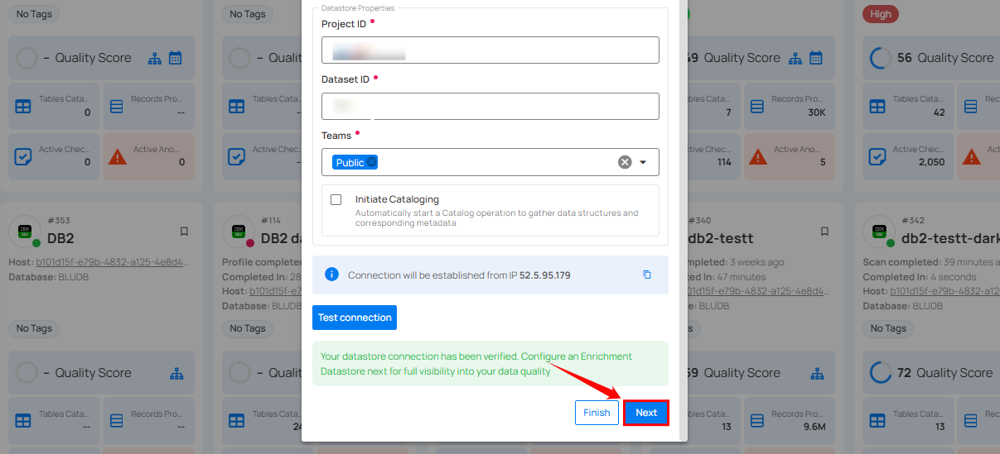
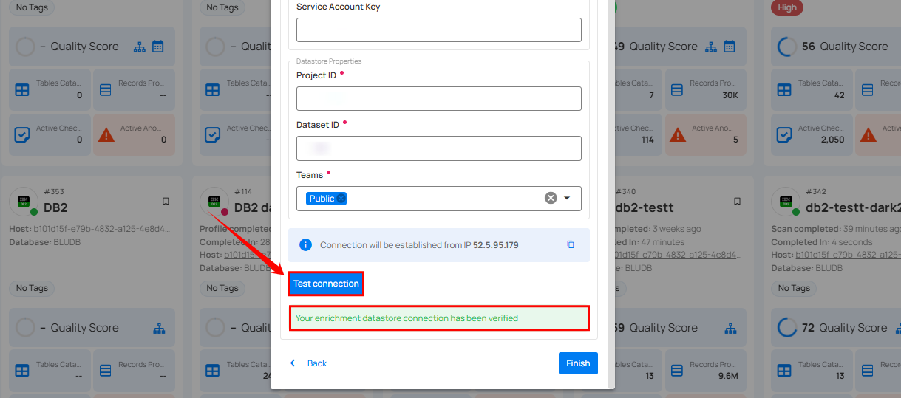
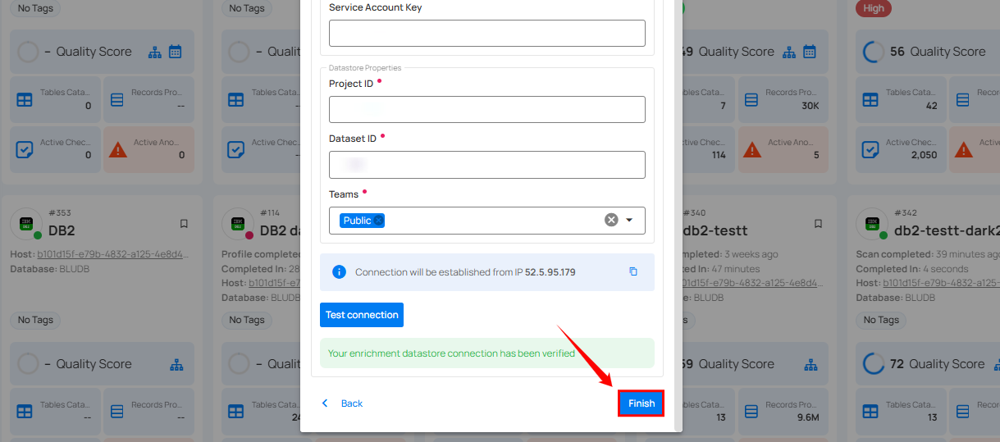
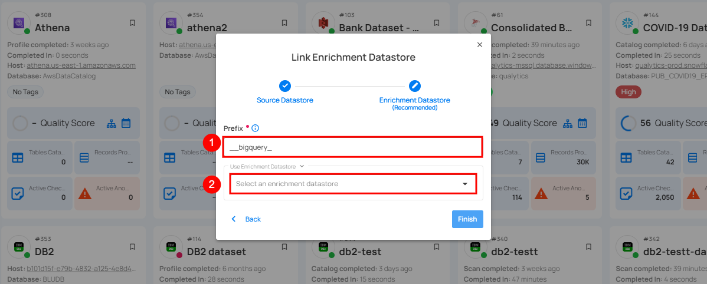
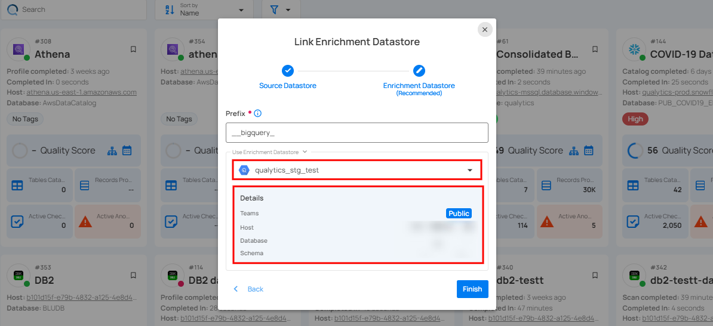
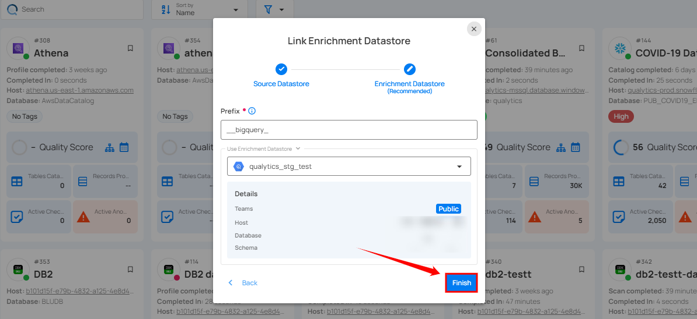

# BigQuery

Adding and configuring a BigQuery connection within Qualytics empowers the platform to build a symbolic link with your schema to perform operations like data discovery, visualization, reporting, cataloging, profiling, scanning, anomaly surveillance, and more.  

This documentation provides a step-by-step guide on adding BigQuery as both a source and enrichment datastore in Qualytics. It covers the entire process, from initial connection setup to testing and finalizing the configuration.

By following these instructions, enterprises can ensure their BigQuery environment is properly connected with Qualytics, unlocking the platform's potential to help you proactively manage your full data quality lifecycle.

Let's get started 🚀

## BigQuery Setup Guide

This guide explains how to create and use a temporary dataset with an expiration time in BigQuery. This dataset helps manage intermediate query results and temporary tables when using the Google BigQuery JDBC driver.

It is recommended for efficient data management, performance optimization, and automatic reduction of storage costs by deleting data when it is no longer needed.

### Access the BigQuery Console

**Step 1:** Navigate to the BigQuery console within your Google Cloud Platform (GCP) account.


**Step 2:** Click on the **vertical ellipsis**, it will open a popup menu for creating a dataset. Click on the **Create dataset** to set up a new dataset.


**Step 3:** Fill details for the following fields to create a new dataset.

!!! info
    - **Dataset Location:** Select the location that aligns with where your other datasets reside to minimize data transfer delays.
    - **Default Table Expiration:** Set the expiration to `1 day` to ensure any table created in this dataset is automatically deleted one day after its creation.

{: style=width:650px}

**Step 4:** Click the **Create Dataset** button to apply the configuration and create the dataset.

{: style=width:650px}

**Step 5:** Navigate to the **created dataset** and find the **Dataset ID** in the **Dataset Info**.

{: style=width:650px}

The Dataset info section contains the Dataset ID and other information related to the created dataset. This generated Dataset ID is used to configure the BigQuery datastore.

### BigQuery Roles and Permissions

This section explains the roles required for viewing, editing, and running jobs in BigQuery. To integrate BigQuery with Qualytics, you need specific roles and permissions.

Assigning these roles ensures Qualytics can perform data discovery, management, and analytics tasks efficiently while maintaining security and access control.

#### BigQuery Roles

- **BigQuery Data Editor (`roles/bigquery.dataEditor`)**
    Allows modification of data within BigQuery, including adding new tables and changing table schemas. It is suitable if you want to regularly update or insert data.

- **BigQuery Data Viewer (`roles/bigquery.dataViewer`)**
    Enables viewing datasets, tables, and the contents. It is essential if you need to read data structures and information.

- **BigQuery Job User (`roles/bigquery.jobUser`)**
    Allows creating and managing jobs in BigQuery, such as queries, data imports, and data exports. It is important if you want to run automated queries.

- **BigQuery Read Session User (`roles/bigquery.readSessionUser`)**
    Allows usage of the BigQuery Storage API for efficient retrieval of large data volumes. It provides capabilities to create and manage read sessions, facilitating large-scale data transfers.

!!! warning
    If a temporary dataset already exists in BigQuery and users want to use it when creating a new datastore connection, the service account must have the `bigquery.tables.create` permission to perform the test connection and proceed to the datastore creation.

### Datastore BigQuery Privileges

The following table outlines the privileges associated with BigQuery roles when configuring datastore connections in Qualytics:

#### Source Datastore Permissions (Read-Only)

Provides read access to view table data and metadata:

| REF. | READ-ONLY PERMISSIONS | DESCRIPTION |
| ---- | ----------------------| ----------- |
| 1.  | `roles/bigquery.dataViewer` | Allows viewing of datasets, tables, and their data. |
| 2.  | `roles/bigquery.jobUser` | Enables running of jobs such as queries and data loading. |
| 3.  | `roles/bigquery.readSessionUser` | Facilitates the creation of read sessions for efficient data retrieval. |

#### Enrichment Datastore Permissions (Read-Write)

Grants read and write access for data editing and management:

| REF. | WRITE-ONLY PERMISSIONS | DESCRIPTION |
| ---- | -----------------------| ----------- |
| 1.  | `roles/bigquery.dataEditor` | Provides editing permissions for table data and schemas. |
| 2.  | `roles/bigquery.dataViewer` | Allows viewing of datasets, tables, and their data. |
| 3.  | `roles/bigquery.jobUser` | Enables running of jobs such as queries and data loading. |
| 4.  | `roles/bigquery.readSessionUser` | Facilitates the creation of read sessions for efficient data retrieval. |

## Add a Source Datastore

A source datastore is a storage location used to connect to and access data from external sources. BigQuery is an example of a source datastore, specifically a type of JDBC datastore that supports connectivity through the JDBC API. Configuring the JDBC datastore enables the Qualytics platform to access and perform operations on the data, thereby generating valuable insights.

**Step 1:** Log in to your Qualytics account and click on the **Add Source Datastore** button located at the top-right corner of the interface.



**Step 2:** A modal window - **Add Datastore** will appear, providing you with the options to connect a datastore.


| REF. | FIELDS          | ACTIONS                                   |
|------|-----------------|-------------------------------------------|
| 1.   | Name (Required)  | Specify the name of the datastore (e.g. The specified name will appear on the datastore cards). |
  | 2.  | Toggle Button   | Toggle **ON** to create a new source datastore from scratch, or toggle **OFF** to reuse
  credentials from an existing connection. |
| 3. | Connector (Required) | Select **BigQuery** from the dropdown list. |

### Option I: Create a Source Datastore with a new Connection

If the toggle for **Add New Connection** is turned on, then this will prompt you to add and configure the source datastore from scratch without using existing connection details.

**Step 1:** Select the **BigQuery** connector from the dropdown list and add connection details such as temp dataset ID, service account key, project ID, and dataset ID.



**Secrets Management**: This is an optional connection property that allows you to securely store and manage credentials by integrating with HashiCorp Vault and other secret management systems. Toggle it **ON** to enable Vault integration for managing secrets.

!!! note
    After configuring **HashiCorp Vault** integration, you can use ${key} in any Connection property to reference a key from the configured Vault secret. Each time the Connection is initiated, the corresponding secret value will be retrieved dynamically.

| REF.| FIELDS               | ACTIONS                                                                 |
|-----|----------------------|-------------------------------------------------------------------------|
| 1.  | Login URL            | Enter the URL used to authenticate with HashiCorp Vault.                |
| 2.  | Credentials Payload  | Input a valid JSON containing credentials for Vault authentication.     |
| 3.  | Token JSONPath       | Specify the JSONPath to retrieve the client authentication token from the response (e.g., $.auth.client_token). |
| 4.  | Secret URL           | Enter the URL where the secret is stored in Vault.                      |
| 5.  | Token Header Name    | Set the header name used for the authentication token (e.g., X-Vault-Token). |
| 6.  | Data JSONPath        | Specify the JSONPath to retrieve the secret data (e.g., $.data).        |


**Step 2:** The configuration form, requesting credential details before establishing the connection.


| REF. | FIELDS                               | ACTIONS                                    |
|------|--------------------------------------|--------------------------------------------|
|   1.   | Temp Dataset ID (Optional)         | Enter a temporary Dataset ID for intermediate data storage during BigQuery operations.        |
|   2.   | [Service Account Key](https://cloud.google.com/iam/docs/keys-create-delete){:target="_blank"} (Required)   | Upload a JSON file that contains the credentials required for accessing BigQuery. |
|   3.   | [Project ID](https://support.google.com/googleapi/answer/7014113?hl=en&ref_topic=7014522){:target="_blank"} (Required)                 | Enter the Project ID associated with BigQuery.    |
|   4.   | Dataset ID (Required)              | Enter the Dataset ID (schema name) associated with BigQuery.  |
|   5.   | Teams (Required)                   | Select one or more teams from the dropdown to associate with this source datastore. |
|   6.   | Initiate Cataloging (Optional)     | Tick the checkbox to automatically perform catalog operation on the configured source datastore to gather data structures and corresponding metadata. |

**Step 3:** After adding the source datastore details, click on the **Test Connection** button to check and verify its connection.


If the credentials and provided details are verified, a success message will be displayed indicating that the connection has been verified.

### Option II: Use an Existing Connection

If the toggle for **Add New Connection** is turned off, then this will prompt you to configure the source datastore using the existing connection details.

**Step 1:** Select a **connection** to reuse existing credentials.



!!! note
    If you are using existing credentials, you can only edit the details such as Project ID, Dataset ID, Teams, and Initiate Cataloging.

**Step 2:** Click on the **Test Connection** button to verify the existing connection details. If connection details are verified, a success message will be displayed.


!!! note
    Clicking on the **Finish** button will create the source datastore and bypass the **enrichment datastore** configuration step.

!!! tip
    It is recommended to click on the **Next** button, which will take you to the **enrichment datastore** configuration page.

## Add Enrichment Datastore

Once you have successfully tested and verified your source datastore connection, you have the option to add the enrichment datastore (recommended). The enrichment datastore is used to store the analyzed results, including any anomalies and additional metadata in tables. This setup provides full visibility into your data quality, helping you manage and improve it effectively.

**Step 1:** Whether you have added a source datastore by creating a new datastore connection or using an existing connection, click on the **Next** button to start adding the **Enrichment Datastore**.



**Step 2:** A modal window - **Link Enrichment Datastore** will appear, providing you with the options to configure an **enrichment datastore**.


| REF. | FIELDS | ACTIONS |
|------|--------|---------|
|   1. | Prefix (Required) | Add a prefix name to uniquely identify tables/files when Qualytics writes metadata for your selected datastore. |
| 2.                | Caret Down Button   | Click the caret down to select either **Use Enrichment Datastore** or **Add Enrichment Datastore**.|
| 3.                | Enrichment Datastore         | Select an enrichment datastore from the dropdown list. |

### Option I: Create an Enrichment Datastore with a new Connection

If the toggle for **Add New Connection** is turned on, then this will prompt you to add and configure the enrichment datastore from scratch without using an existing enrichment datastore and its connection details.

**Step 1:** Click on the caret button and select **Add Enrichment Datastore**.


A modal window **Link Enrichment Datastore** will appear. Enter the following details to create an enrichment datastore with a new connection.


| REF.              | FIELDS       | ACTIONS                                    |
|-------------------|--------------|--------------------------------------------|
| 1.                | Prefix       | Add a prefix name to uniquely identify tables/files when Qualytics writes metadata from the source datastore to your enrichment datastore. |
| 2.                | Name   | Give a name for the enrichment datastore.|
| 3.                |Toggle Button for Add New Connection | Toggle ON to create a new enrichment from scratch or toggle OFF to reuse credentials from an existing connection. |
| 4.                |Connector | Select a datastore connector from the dropdown list.|

**Step 2:** Add connection details for your selected **enrichment datastore** connector.


**Secrets Management**: This is an optional connection property that allows you to securely store and manage credentials by integrating with HashiCorp Vault and other secret management systems. Toggle it **ON** to enable Vault integration for managing secrets.

!!! note
    Once the **HashiCorp Vault** is set up, use the ${key} format in Connection form to reference a Vault secret.

| REF.| FIELDS               | ACTIONS                                                                 |
|-----|----------------------|-------------------------------------------------------------------------|
| 1.  | Login URL            | Enter the URL used to authenticate with HashiCorp Vault.                |
| 2.  | Credentials Payload  | Input a valid JSON containing credentials for Vault authentication.     |
| 3.  | Token JSONPath       | Specify the JSONPath to retrieve the client authentication token from the response (e.g., $.auth.client_token). |
| 4.  | Secret URL           | Enter the URL where the secret is stored in Vault.                      |
| 5.  | Token Header Name    | Set the header name used for the authentication token (e.g., X-Vault-Token). |
| 6.  | Data JSONPath        | Specify the JSONPath to retrieve the secret data (e.g., $.data).        |


**Step 3:** The configuration form, requesting credential details after selecting **enrichment datastore** connector.


| REF. | FIELD | ACTIONS |
|------|-------|---------|
|   1. | Temp Dataset ID (Optional) | Enter a temporary Dataset ID for intermediate data storage during BigQuery operations.  |
|   2. | [Service Account Key](https://cloud.google.com/iam/docs/keys-create-delete){:target="_blank"} (Required) | Upload a JSON file that contains the credentials required for accessing BigQuery.|
|   3. | [Project ID](https://support.google.com/googleapi/answer/7014113?hl=en&ref_topic=7014522){:target="_blank"} (Required) | Enter the Project ID associated with BigQuery.|
|   4. | Dataset ID (Required) | Enter the Dataset ID (schema name) associated with BigQuery.|
|   5. | Teams (Required) | Select one or more teams from the dropdown to associate with this source datastore. |

**Step 4:** Click on the **Test Connection** button to verify the selected enrichment datastore connection. If the connection is verified, a flash message will indicate that the connection with the enrichment datastore has been successfully verified.



**Step 5:** Click on the **Finish** button to complete the configuration process.



When the configuration process is finished, a success notification appears on the screen indicating that the datastore was added successfully.

**Step 6:** Close the success dialog and the page will automatically redirect you to the **Source Datastore Details** page where you can perform data operations on your configured **source datastore**.


### Option II: Use an Existing Connection

If the **Use Enrichment Datastore** option is selected from the dropdown menu, you will be prompted to configure the datastore using existing connection details.

**Step 1:** Click on the caret button and select **Use Enrichment Datastore**.


**Step 2:** A modal window **Link Enrichment Datastore** will appear. Add a prefix name and select an existing enrichment datastore from the dropdown list.



| REF. | FIELDS  | ACTIONS  |
|------|---------|----------|
|  1.  | Prefix (Required) | Add a prefix name to uniquely identify tables/files when Qualytics writes metadata from the source datastore to your enrichment datastore. |
|  2.  | Enrichment Datastore  | Select an enrichment datastore from the dropdown list. |

**Step 3:** After selecting an existing **enrichment datastore** connection, you will view the following details related to the selected enrichment:

- **Teams:** The team associated with managing the enrichment datastore is based on the role of public or private. Example- Marked as **Public** means that this datastore is accessible to all the users.

- **Host:** This is the server address where the **BigQuery** instance is hosted. It is the endpoint used to connect to the BigQuery environment.

- **Database:** Refers to the specific database within the BigQuery environment where the data is stored.

- **Schema:** The schema used in the enrichment datastore. The schema is a logical grouping of database objects (tables, views, etc.). Each schema belongs to a single database.



**Step 4:** Click on the **Finish** button to complete the configuration process for the existing **enrichment datastore**.



When the configuration process is finished, a success notification appears on the screen indicating that the datastore was added successfully.

Close the success message and you will be automatically redirected to the **Source Datastore Details** page where you can perform data operations on your configured **source datastore**.


## API Payload Examples

This section provides detailed examples of API payloads to guide you through the process of creating and managing datastores using Qualytics API. Each example includes endpoint details, sample payloads, and instructions on how to replace placeholder values with actual data relevant to your setup.

### Creating a Source Datastore

This section provides sample payloads for creating a BigQuery datastore. Replace the placeholder values with actual data relevant to your setup.

**Endpoint:** `/api/datastores (post)`

=== "Create a Source Datastore with a new Connection"
    ```json
    {
        "name": "your_datastore_name",
        "teams": ["Public"],
        "database": "your_project_id",
        "schema": "your_dataset_id",
        "enrich_only": false,
        "trigger_catalog": true,
        "connection": {
            "name": "your_connection_name",
            "type": "bigquery",
            "password": "your_service_account_key"
        }
    }
    ```
=== "Create a Source Datastore with an existing Connection"
    ```json
    {
        "name": "your_datastore_name",
        "teams": ["Public"],
        "database": "your_project_id",
        "schema": "your_dataset_id",
        "enrich_only": false,
        "trigger_catalog": true,
        "connection_id": connection-id
    }
    ```
### Creating an Enrichment Datastore

This section provides sample payloads for creating an enrichment datastore. Replace the placeholder values with actual data relevant to your setup.

**Endpoint:**  `/api/datastores (post)`

=== "Create an Enrichment Datastore with a new Connection"
    ```json
    {
        "name": "your_datastore_name",
        "teams": ["Public"],
        "database": "your_project_id",
        "schema": "your_enrichment_dataset_id",
        "enrich_only": true,
        "connection": {
            "name": "your_connection_name",
            "type": "bigquery",
            "password": "your_service_account_key"
        }
    }
    ```
=== "Create an Enrichment Datastore with an Existing Connection"
    ```json
    {
        "name": "your_datastore_name",
        "teams": ["Public"],
        "database": "your_project_id",
        "schema": "your_enrichment_dataset_id",
        "enrich_only": true,
        "connection_id": connection-id
    }
    ```
### Link an Enrichment Datastore to a Source Datastore

Use the provided endpoint to link an enrichment datastore to a source datastore: 

**Endpoint Details:** ```/api/datastores/{datastore-id}/enrichment/{enrichment-id} (patch)```