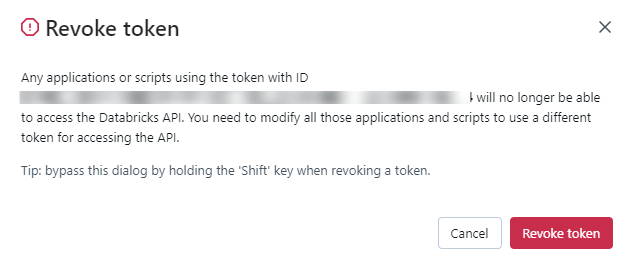

# Databricks 

Adding and configuring Databricks connection within Qualytics empowers the platform to build a symbolic link with your database to perform operations like data discovery, visualization, reporting, cataloging, profiling, scanning, anomaly surveillance, and more.  

This documentation provides a step-by-step guide on how to add Databricks as both a source and enrichment datastore in Qualytics. It covers the entire process, from initial connection setup to testing and finalizing the configuration. 

By following these instructions, enterprises can ensure their Databricks environment is properly connected with Qualytics, unlocking the platform's potential to help you proactively manage your full data quality lifecycle.

Let's get started 🚀

## Databricks Setup Guide

This guide provides a comprehensive walkthrough for setting up Databricks. It highlights the distinction between SQL Warehouses and All-Purpose Compute, the functionality of node pools, and the enhancements they offer.

Additionally, it details the process for attaching compute resources to node pools and explains the minimum requirements for effective operation.

### Understanding SQL Warehouses and All-Purpose Compute

#### SQL Warehouses (Serverless)

SQL Warehouses (Serverless) in Databricks utilize serverless SQL endpoints for running SQL queries.

| REF | ATTRIBUTE            | DESCRIPTION                            |
| --- | -------------------- | -------------------------------------- |
| 1️.  | Cost-effectiveness   | Serverless SQL endpoints allow you to pay only for the queries you execute, without the need to provision or manage dedicated infrastructure, making it more cost-effective for ad-hoc or sporadic queries. |
| 2️.  | Scalability          | Serverless architectures automatically scale resources based on demand, ensuring optimal performance for varying workloads. |
| 3️.  | Simplified Management | With serverless SQL endpoints, you don't need to manage clusters or infrastructure, reducing operational overhead. |
| 4️.  | Minimum Requirements  | The minimum requirements for using SQL Warehouse with serverless typically include access to a Databricks workspace and appropriate permissions to create and run SQL queries. |

#### All-Purpose Compute

All-purpose compute in Databricks refers to clusters that are not optimized for specific tasks. While they offer flexibility, they may not provide the best performance or cost-effectiveness for certain workloads.

| REF | ATTRIBUTE           | DESCRIPTION         |
| --- | ------------------- | ------------------- |
| 1️.  | Slow Spin-up Time   | All-purpose compute clusters may take longer to spin up compared to specialized clusters, resulting in delays before processing can begin. |
| 2️.  | Timeout Connections | Due to longer spin-up times, there's a risk of timeout connections, especially for applications or services that expect quick responses. |

### Node Pool and Its Usage

A node pool in Databricks is a set of homogeneous virtual machines (VMs) within a cluster. It allows you to have a fixed set of instances dedicated to specific tasks, ensuring consistent performance and resource isolation.

| REF | ATTRIBUTE            | DESCRIPTION                     |
| --- | -------------------- | ------------------------------- |
| 1️.  | Resource Isolation    | Node pools provide resource isolation, allowing different workloads or applications to run without impacting each other's performance. |
| 2️.  | Optimized Performance | By dedicating specific nodes to particular tasks, you can optimize performance for those workloads.                                 |
| 3️.  | Cost-effectiveness    | Node pools can be more cost-effective than using all-purpose compute for certain workloads, as you can scale resources according to the specific requirements of each task. |

### Improving All-Purpose Compute with Node Pools

To improve the performance of all-purpose compute using node pools, you can follow these steps:

| REF | ATTRIBUTE                    | DESCRIPTION                    |
| --- | ---------------------------- | ------------------------------ |
| 1️.  | Define Workload-Specific Node Pools | Identify the specific tasks or workloads that require optimized performance and create dedicated node pools for them. |
| 2️.  | Specify Minimum Requirements       | Determine the minimum resources (such as CPU, memory, and disk) required for each workload and configure the node pools accordingly. |
| 3️.  | Monitor and Adjust                | Continuously monitor the performance of your node pools and adjust resource allocations as needed to ensure optimal performance. |

**Step 1:** Configure details for Qualytics Node Pool.


**Step 2:** Attach Compute details with the Node Pool.


### Retrieve the Connection Details

This section explains how to retrieve the connection details that you need to connect to Databricks.

#### Credentials to Connect with Qualytics

To configure Databricks, you need the following credentials:

| REF | FIELDS               | ACTIONS                        |
| --- | -------------------- | ------------------------------ |
| 1️.  | Host (Required)      | Get **Hostname** from your Databricks account and add it to this field. |
| 2️.  | HTTP Path (Required) | Add HTTP Path (web address) to fetch data from your Databricks account. |
| 3️.  | Catalog (Required)   | Add a **Catalog** to fetch data structures and metadata from Databricks. |
| 4️.  | Database (Required)  | Specify the database name to be accessed. |
| 5️.  | Personal Access Token (Required) | Generate a Personal Access Token from your Databricks account and add it for authentication.|

#### Get Connection Details for the SQL Warehouse

Follow the given steps to get the connection details for the SQL warehouse:

1. Click on the **SQL Warehouses** in the sidebar.
2. Choose a **warehouse** to connect to.
3. Navigate to the **Connection Details** tab.
4. Copy the connection details.


#### Get Connection Details for the Cluster

Follow the given steps to get the connection details for the cluster:

1. Click on the **Compute** in the sidebar.
2. Choose a **cluster** to connect to.
3. Navigate to the **Advanced Options**.
4. Click on the **JDBC/ODBC** tab.
5. Copy the connection details.


#### Get the Access Token

**Step 1:** In your Databricks workspace, click your Databricks username in the top bar, and then select **User Settings** from the drop-down menu.


!!! note
    Refer to the [**Databricks Official Docs**](https://docs.databricks.com/en/dev-tools/auth/pat.html){:target="_blank"} to generate the **Access Token**.

**Step 2:** In the **Settings** page, select the **Developer** option in the **User** section.


**Step 3:** In the **Developer** page, click on **Manage** in Access Tokens.


**Step 4:** In the **Access Tokens** page, click on the **Generate new token** button.


**Step 5:** You will see a modal to add a description and validation time (in days) for the token.


**Step 6:** After adding the contents, click on **Generate**, and it will show the **token**


!!! warning
    Before closing the modal window by clicking on the **Done** button, ensure the **Personal Access Token** is saved to a secure location

**Step 7:** You can see the new **token** on the **Access Tokens** page.


You can also revoke a **token** on the **Access Tokens** page by clicking on the **Revoke token** button



## Add a Source Datastore

A source datastore is a storage location used to connect to and access data from external sources. Databricks is an example of a source datastore, specifically a type of JDBC datastore that supports connectivity through the JDBC API. Configuring the JDBC datastore enables the Qualytics platform to access and perform operations on the data, thereby generating valuable insights.

**Step 1:** Log in to your Qualytics account and click on the **Add Source Datastore** button located at the top-right corner of the interface. 


**Step 2:** A modal window- **Add Datastore** will appear, providing you with the options to connect a datastore.


| REF. | FIELDS         | ACTIONS              |
|------|----------------|----------------------|
| 1️.   | Name (Reqired) | Specify the datastore name (e.g., This name will appear on the datastore cards) |
| 2️.   | Toggle Button  | Toggle ON to create a new source datastore from scratch, or toggle OFF to reuse credentials from an existing connection. |
| 3️.   | Connector (Required)     | Select **Databricks** from the dropdown list. |                  

### Option I: Create a Source Datastore with a new Connection

If the toggle for **Add new connection** is turned on, then this will prompt you to add and configure the source datastore from scratch without using existing connection details.

**Step 1:** Select the **Databricks** connector from the dropdown list and add connection details such as Secrets Management, host, HTTP path, database, and personal access token.


**Secrets Management**: This is an optional connection property that allows you to securely store and manage credentials by integrating with HashiCorp Vault and other secret management systems. Toggle it **ON** to enable Vault integration for managing secrets.

!!! note
    Once the **HashiCorp Vault** is set up, use the $ format in Connection form to reference a Vault secret.

| REF | FIELDS               | ACTIONS                                                                 |
|-----|----------------------|-------------------------------------------------------------------------|
| 1   | Login URL            | Enter the URL used to authenticate with HashiCorp Vault.                |
| 2   | Credentials Payload  | Input a valid JSON containing credentials for Vault authentication.      |
| 3   | Token JSONPath       | Specify the JSONPath to retrieve the client authentication token from the response (e.g., $.auth.client_token). |
| 4   | Secret URL           | Enter the URL where the secret is stored in Vault.                      |
| 5   | Token Header Name    | Set the header name used for the authentication token (e.g., X-Vault-Token). |
| 6   | Data JSONPath        | Specify the JSONPath to retrieve the secret data (e.g., $.data).       |


**Step 2:** The configuration form will expand, requesting credential details before establishing the connection.


| REF. | FIELD   | ACTIONS   |
|------|---------|-----------|
| 1️.   | Host (Required)     | Get the [**hostname**](https://docs.databricks.com/en/integrations/compute-details.html){:target="_blank"} from your Databricks account and add it to this field.|
| 2️.   | HTTP Path (Required) | Add the HTTP Path (web address) to fetch data from your Databricks account. |
| 3️.   | Personal Access Token (Required)  | Generate a [**Personal Access Token**](https://docs.databricks.com/en/dev-tools/auth/pat.html){:target="_blank"} from your Databricks account and add it for authentication.  |
| 4️.   | Catalog (Required)  | Add a **Catalog** to fetch data structures and metadata from the Databricks. |
| 5️.   | Database (Optional) | Specify the database name to be accessed.|
| 6️.   | Teams (Required)    | Select one or more teams from the dropdown to associate with this source datastore.|
| 7️.   | Initiate Cataloging (Optional) | Tick the checkbox to automatically perform catalog operation on the configured source datastore to gather data structures and corresponding metadata. |

**Step 3:** After adding the source datastore details, click on the **Test Connection** button to check and verify its connection.


                                  
If the credentials and provided details are verified, a success message will be displayed indicating that the connection has been verified. 

### Option II: Use an Existing Connection

If the toggle for **Add new connection** is turned off, then this will prompt you to configure the source datastore using the existing connection details.

**Step 1:** Select a **connection** to reuse existing credentials.


    
!!!note
    If you are using existing credentials, you can only edit the details such as Catalog, Database, Teams, and Initiate Cataloging.

**Step 2:** Click on the **Test Connection** button to verify the existing connection details. If connection details are verified, a success message will be displayed.


!!!note
    Clicking on the **Finish** button will create the source datastore and bypass the **enrichment datastore** configuration step.

!!!tip
    It is recommended to click on the **Next** button, which will take you to the **enrichment datastore** configuration page.

## Add Enrichment Datastore

Once you have successfully tested and verified your source datastore connection, you have the option to add the enrichment datastore (recommended). The enrichment datastore is used to store the analyzed results, including any anomalies and additional metadata in tables. This setup provides full visibility into your data quality, helping you manage and improve it effectively. 

**Step 1:** Whether you have added a source datastore by creating a new datastore connection or using an existing connection, click on the **Next** button to start adding the **Enrichment Datastore**.


**Step 2:** A modal window- **Link Enrichment Datastore** will appear, providing you with the options to configure an **enrichment datastore**.


| REF. | FIELDS  | ACTIONS   |
|------|---------|-----------|
| 1️.   | Prefix (Required) | Add a prefix name to uniquely identify tables/files when Qualytics writes metadata from the source datastore to your enrichment datastore. |
| 2.| Caret Down Button   | Click the caret down to select either **Use Enrichment Datastore** or **Add Enrichment Datastore**.|
| 3.| Enrichment Datastore| Select an enrichment datastore from the dropdown list. |

### Option I: Create an Enrichment Datastore with a new Connection

If the toggles **Add new connection** is turned on, then this will prompt you to add and configure the enrichment datastore from scratch without using an existing enrichment datastore and its connection details.

**Step 1**: Click on the caret button and select Add Enrichment Datastore.


A modal window **Link Enrichment Datastore** will appear. Enter the following details to create an enrichment datastore with a new connection.


| REF.              | FIELDS       | ACTIONS                                    |
|-------------------|--------------|--------------------------------------------|
| 1.                | Prefix       | Add a prefix name to uniquely identify tables/files when Qualytics writes metadata from the source datastore to your enrichment datastore. |
| 2.                | Name   | Give a name for the enrichment datastore.|
| 3.                |Toggle Button for add new connection | Toggle ON to create a new enrichment from scratch or toggle OFF to reuse credentials from an existing connection. |
| 4.                |Connector | Select a datastore connector from the dropdown list.|

**Step 2:** Add connection details for your selected **enrichment datastore** connector.


**Secrets Management**: This is an optional connection property that allows you to securely store and manage credentials by integrating with HashiCorp Vault and other secret management systems. Toggle it **ON** to enable Vault integration for managing secrets.

!!! note
    Once the **HashiCorp Vault** is set up, use the $ format in Connection form to reference a Vault secret.

| REF | FIELDS               | ACTIONS                                                                 |
|-----|----------------------|-------------------------------------------------------------------------|
| 1.  | Login URL            | Enter the URL used to authenticate with HashiCorp Vault.                |
| 2.  | Credentials Payload  | Input a valid JSON containing credentials for Vault authentication.     |
| 3.  | Token JSONPath       | Specify the JSONPath to retrieve the client authentication token from the response (e.g., $.auth.client_token). |
| 4.  | Secret URL           | Enter the URL where the secret is stored in Vault.                      |
| 5.  | Token Header Name    | Set the header name used for the authentication token (e.g., X-Vault-Token). |
| 6.  | Data JSONPath        | Specify the JSONPath to retrieve the secret data (e.g., $.data).        |


**Step 3:** The configuration form, requesting credential details after selected **enrichment datastore** connector.


| REF. | FIELD     | ACTIONS     |
|------|------------|-------------|
| 1️.   | Host (Required) | Get the [**hostname**](https://docs.databricks.com/en/integrations/compute-details.html){:target="_blank"} from your Databricks account and add it to this field. |
| 2️.   | HTTP Path (Required) | Add the HTTP Path (web address) to fetch data from your Databricks account. |
| 3️.   | Personal Access Token (Required) | Generate a [**Personal Access Token**](https://docs.databricks.com/en/dev-tools/auth/pat.html){:target="_blank"} from your Databricks account and add it for authentication. |
| 4️.   | Catalog (Required) | Add a **Catalog** to fetch data structures and metadata from Databricks. |
| 5️.   | Database (Optional) | Specify the database name |
| 6️.   | Teams (Required)  | Select one or more teams from the dropdown to associate with this enrichment datastore. |

**Step 4:** Click on the **Test Connection** button to verify the selected enrichment datastore connection. If the connection is verified, a flash message will indicate that the connection with the enrichment datastore has been successfully verified. 

   
   

**Step 5:** Click on the **Finish** button to complete the configuration process. 


When the configuration process is finished, a modal will display a **success message** indicating that **your datastore has been successfully added**.


**Step 6:** Close the Success dialog and the page will automatically redirect you to the **Source Datastore Details** page where you can perform data operations on your configured **source datastore**.


### Option II: Use an Existing Connection

If the **Use enrichment datastore** option is selected from the caret button, you will be prompted to configure the datastore using existing connection details. 

**Step 1**: Click on the caret button and select **Use Enrichment Datastore**.


**Step 2:** A modal window **Link Enrichment Datastore** will appear. Add a prefix name and select an existing enrichment datastore from the dropdown list.


| REF. | FIELDS  | ACTIONS   |
|------|---------|-----------|
| 1️.   | Prefix (Required) | Add a prefix name to uniquely identify tables/files when Qualytics writes metadata. |
| 2.   | Enrichment Datastore  | Select an enrichment datastore from the dropdown list. |

**Step 3:** After selecting an existing **enrichment datastore** connection, you will view the following details related to the selected enrichment: 

- **Teams:** The team associated with managing the enrichment datastore is based on the role of public or private. Example- Marked as **Public** means that this datastore is accessible to all the users. 

- **Host:** This is the server address where the Databricks instance is hosted. It is the endpoint used to connect to the Databricks environment. 

- **Database:** Refers to the specific database within the Databricks environment where the data is stored.

- **Schema:** The schema used in the enrichment datastore. The schema is a logical grouping of database objects (tables, views, etc.). Each schema belongs to a single database.


**Step 4:** Click on the **Finish** button to complete the configuration process for the existing **enrichment datastore**.


When the configuration process is finished, a modal will display a **success message** indicating that **your data has been successfully added**.


Close the success message and you will be automatically redirected to the **Source Datastore Details** page where you can perform data operations on your configured **source datastore**.


## API Payload Examples

This section provides detailed examples of API payloads to guide you through the process of creating and managing datastores using Qualytics API. Each example includes endpoint details, sample payloads, and instructions on how to replace placeholder values with actual data relevant to your setup.

### Creating a Source Datastore

This section provides sample payloads for creating a Databricks datastore. Replace the placeholder values with actual data relevant to your setup.

**Endpoint:** ```/api/datastores (post)```

=== "Create a Source Datastore with a new Connection"
    ```json
    {
        "name": "your_datastore_name",
        "teams": ["Public"],
        "database": "databricks_database",
        "schema": "databricks_catalog",
        "enrich_only": false,
        "trigger_catalog": true,
        "connection": {
            "name": "your_connection_name",
            "type": "databricks",
            "host": "databricks_host",
            "password": "databricks_token",
            "parameters": {
                "path": "databricks_http_path"
            }
        }
    }
    ```
=== "Create a Source Datastore with an existing Connection"
    ```json
    {
        "name": "your_datastore_name",
        "teams": ["Public"],
        "database": "databricks_database",
        "schema": "databricks_catalog",
        "enrich_only": false,
        "trigger_catalog": true,
        "connection_id": connection-id
    }
    ```
### Creating an Enrichment Datastore

This section provides sample payloads for creating an enrichment datastore. Replace the placeholder values with actual data relevant to your setup.

**Endpoint:**  ```/api/datastores (post)```

=== "Create an Enrichment Datastore with a new Connection"
    ```json
    {
        "name": "your_datastore_name",
        "teams": ["Public"],
        "database": "databricks_database",
        "schema": "databricks_enrichment_catalog",
        "enrich_only": true,
        "connection": {
            "name": "your_connection_name",
            "type": "databricks",
            "host": "databricks_host",
            "password": "databricks_token",
            "parameters": {
                "path": "databricks_http_path"
            }
        }
    }
    ```
=== "Create an Enrichment Datastore with an Existing Connection"
    ```json
    {
        "name": "your_datastore_name",
        "teams": ["Public"],
        "database": "databricks_database",
        "schema": "databricks_enrichment_catalog",
        "enrich_only": true,
        "connection_id": connection-id
    }
    ```
### Link an Enrichment Datastore to a Source Datastore
Use the provided endpoint to link an enrichment datastore to a source datastore: 

**Endpoint Details:** ```/api/datastores/{datastore-id}/enrichment/{enrichment-id} (patch)```


