# Fabric Analytics

Adding and configuring a Fabric Analytics connection within Qualytics empowers the platform to build a symbolic link with your schema to perform operations like data discovery, visualization, reporting, cataloging, profiling, scanning, anomaly surveillance, and more.

This documentation provides a step-by-step guide on how to add Fabric Analytics as both a source and enrichment datastore in Qualytics. It covers the entire process, from initial connection setup to testing and finalizing the configuration.

By following these instructions, enterprises can ensure their Fabric Analytics environment is properly connected with Qualytics, unlocking the platform's potential to help you proactively manage your full data quality lifecycle.

Let's get started 🚀

## Fabric Analytics Setup Guide

To connect Fabric Analytics with Qualytics, you need to configure a **Service Principal** in Microsoft Entra ID (Azure AD) and grant it access to your Fabric workspace. This section walks you through the required prerequisites and credential retrieval process.

### Prerequisites

Before configuring the Fabric Analytics datastore in Qualytics, ensure the following requirements are met:

| Requirement | Description |
|-------------|-------------|
| **Microsoft Entra ID (Azure AD)** | Access to your organization's Entra ID tenant to create or manage app registrations. |
| **Fabric Workspace** | A Fabric workspace with a Lakehouse or Warehouse that you want to connect to. |
| **Service Principal** | An app registration in Entra ID with a Client ID and Client Secret. |
| **Tenant Admin Setting** | The Fabric tenant setting **"Service principals can use Fabric APIs"** must be enabled. |
| **Workspace Access** | The service principal must be added as a **Contributor** (or higher) to the target Fabric workspace. |

### Step 1: Register an Application in Microsoft Entra ID

**1.** Log in to the [**Azure Portal**](https://portal.azure.com){:target="_blank"} and click on the **App registrations** (under **Microsoft Entra ID**).


**2.** Click on the **+ New registration** to create and register a new application in Microsoft Entra ID.

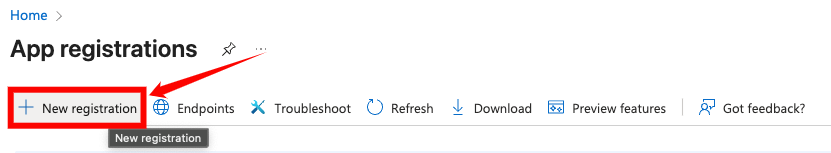

**3.** Enter the required details:

| No.| Field                       | Description                                                                |
|-----|----------------------------|----------------------------------------------------------------------------|
| 1. |**Name**                    | Enter a name for the application (e.g., `qualytics-fabric`).               |
| 2. |**Supported account types** | Select **Accounts in this organizational directory only** (Single tenant). |

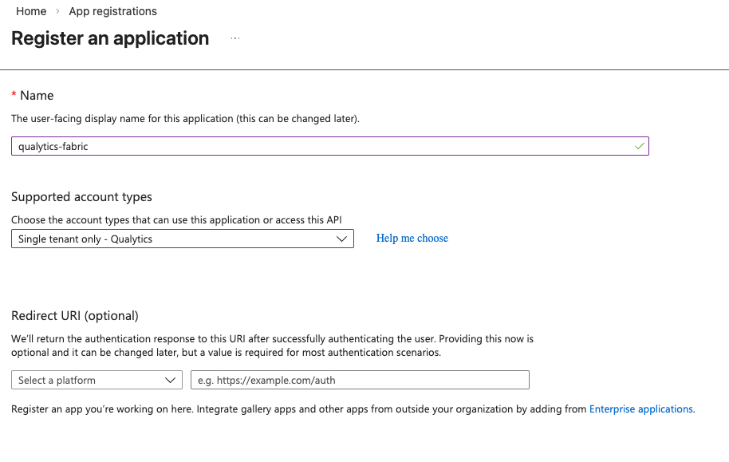

**4.** Click on the **Register** to create the application.

### Step 2: Retrieve the Client ID and Tenant ID

**1.** After registration, you will be taken to the app's **Overview** page.

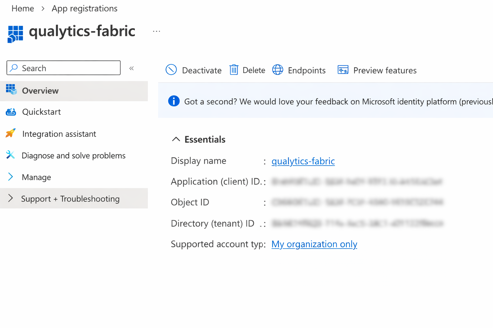{: style="height:300px"}

**2.** Copy the **Application (client) ID** — this is your **Client ID**.

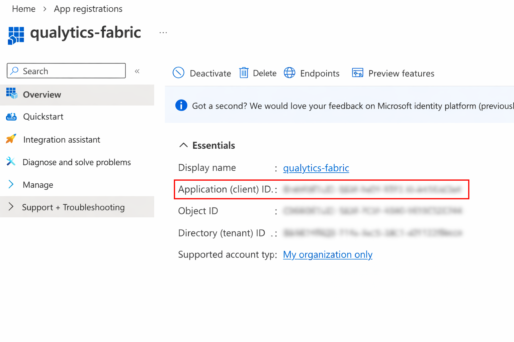

**3.** Copy the **Directory (tenant) ID** — this is your **Tenant ID**.

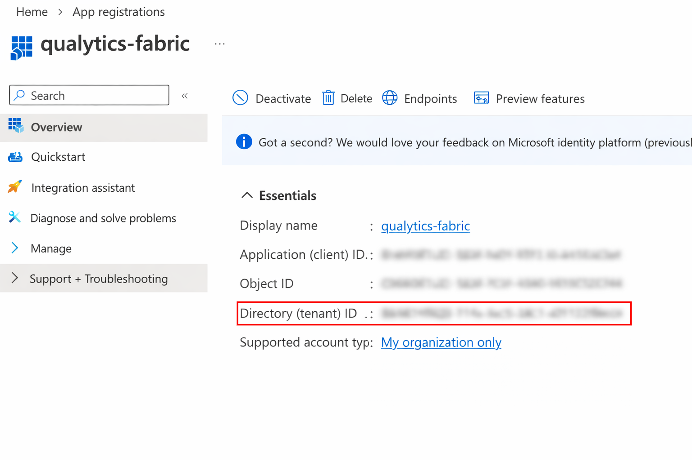

### Step 3: Create a Client Secret

**1.** In the app registration, go to **Client secrets** and click **+ New client secret**.

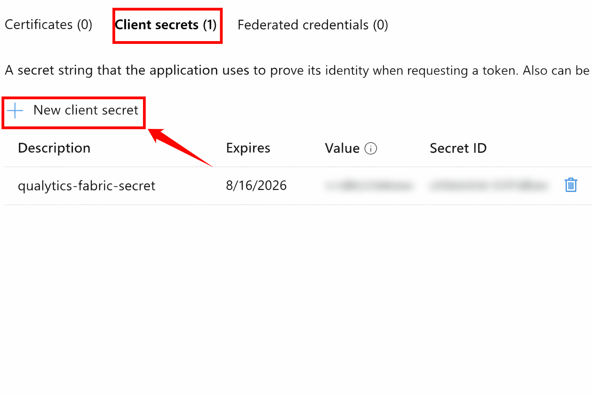

**2.** After clicking **+ New client secret**, enter a description and choose an expiration period.


**3.** Copy the **Value** of the newly created secret immediately — this is your **Client Secret** (it will not be shown again).

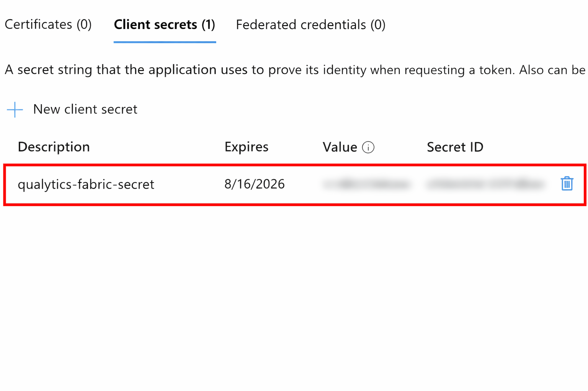

!!! warning
    Make sure to copy the Client Secret value immediately after creation. It will not be displayed again once you navigate away from the page.

### Step 4: Enable Service Principal Access in Fabric

**1.** Sign in to [**Microsoft Fabric**](https://app.fabric.microsoft.com){:target="_blank"} as a Fabric administrator, go to **Settings**, and click on the **Admin portal**.


    
**2.** Under **Tenant settings**, locate **Service principals can call Fabric APIs**, enable the setting, and specify the security group containing your service principal (or allow the entire organization).

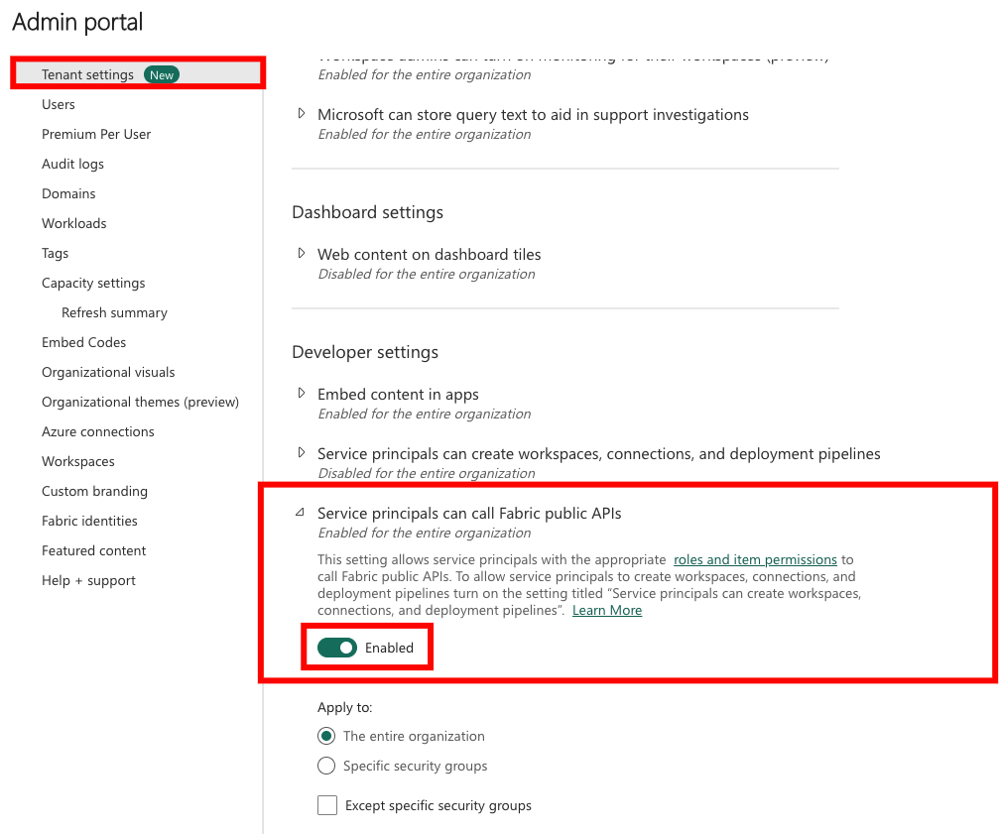

### Step 5: Grant Workspace Access to the Service Principal

**1.** In **Microsoft Fabric**, open your target **Workspace** and click **Manage access**.


**2.** Click **+ Add people or groups**, search for your registered application (e.g., `qualytics-fabric`), and select it.  


**3.** Assign the **Contributor** role (or higher) and click **Add**.

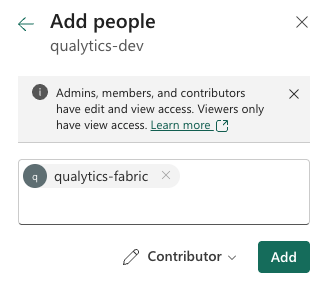

### Retrieve the SQL Analytics Endpoint

**1.** Open your **Lakehouse** or **Warehouse** in the Fabric workspace and copy the **SQL analytics endpoint** from the connection string area.

The endpoint format is:
    ```
    <workspace-guid>.datawarehouse.fabric.microsoft.com
    ```

<!-- Screenshot needed: Lakehouse/Warehouse > SQL analytics endpoint -->

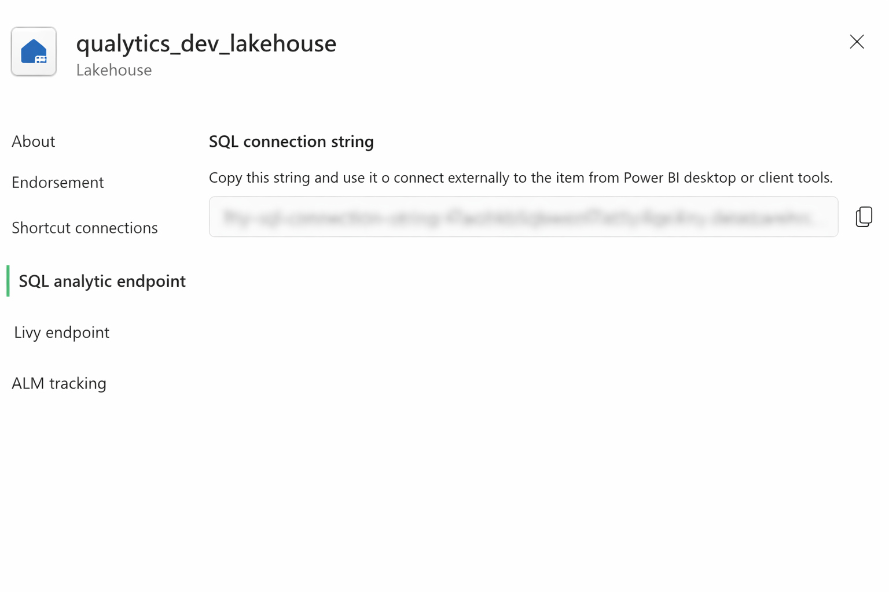{: style="height:300px"}

!!! tip
    Refer to the [**Microsoft Fabric documentation**](https://learn.microsoft.com/en-us/fabric/data-warehouse/connectivity){:target="_blank"} for more information on connectivity and SQL analytics endpoints.

## Add the Source Datastore

A source datastore is a storage location used to connect to and access data from external sources. Fabric Analytics is an example of such a datastore, specifically a type of JDBC datastore that supports connectivity through the JDBC API. Configuring the Fabric Analytics datastore allows the Qualytics platform to access and perform operations on the data, thereby generating valuable insights.

**Step 1:** Log in to your Qualytics account and click on the **Add Source Datastore** button located at the top-right corner of the interface.


**Step 2:** A modal window- **Add Datastore** will appear, providing you with the options to connect a datastore.


| REF. | FIELDS | ACTIONS |
|------|--------|---------|
| 1. | **Name** | Specify the name of the datastore (e.g., The specified name will appear on the datastore cards). |
| 2. | **Toggle Button** | Toggle **ON** to create a new source datastore from scratch, or toggle **OFF** to reuse credentials from an existing connection. |
| 3. | **Connector** | Select **Fabric Analytics** from the dropdown list. |

### Option I: Create a Source Datastore with a new Connection

If the toggle for **Add New Connection** is turned on, then this will prompt you to add and configure the source datastore from scratch without using existing connection details.

**Step 1:** Select the **Fabric Analytics** connector from the dropdown list and add connection details such as Secrets Management, host, port, client ID, client secret, tenant ID, database, and schema.

{: style="height:600px"}

**Secrets Management**: This is an optional connection property that allows you to securely store and manage credentials by integrating with HashiCorp Vault and other secret management systems. Toggle it **ON** to enable Vault integration for managing secrets.

!!! note
    After configuring **HashiCorp Vault** integration, you can use ${key} in any Connection property to reference a key from the configured Vault secret. Each time the Connection is initiated, the corresponding secret value will be retrieved dynamically.

| REF | FIELDS               | ACTIONS                                                                 |
|-----|----------------------|-------------------------------------------------------------------------|
| 1.  | Login URL            | Enter the URL used to authenticate with HashiCorp Vault.                |
| 2.  | Credentials Payload  | Input a valid JSON containing credentials for Vault authentication.     |
| 3.  | Token JSONPath       | Specify the JSONPath to retrieve the client authentication token from the response (e.g., $.auth.client_token). |
| 4.  | Secret URL           | Enter the URL where the secret is stored in Vault.                      |
| 5.  | Token Header Name    | Set the header name used for the authentication token (e.g., X-Vault-Token). |
| 6.  | Data JSONPath        | Specify the JSONPath to retrieve the secret data (e.g., $.data).        |

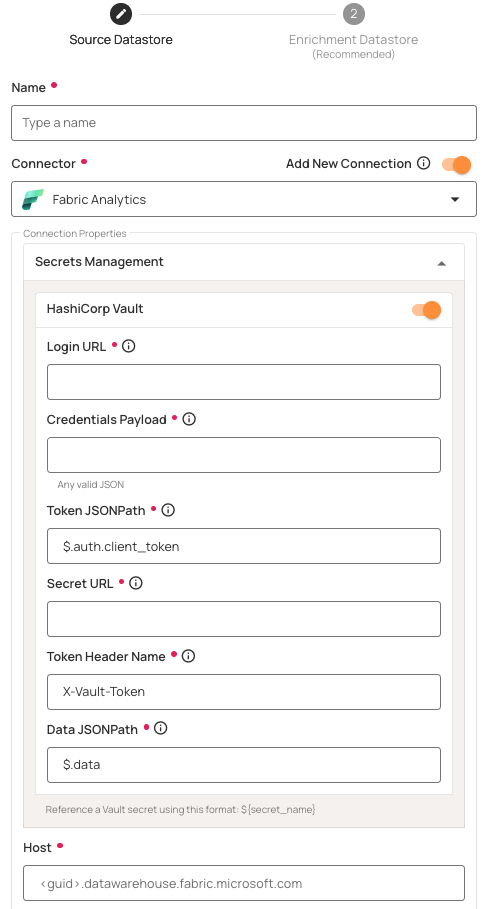

**Step 2:** The configuration form will expand, requesting credential details before establishing the connection.

{: style="height:600px"}

| REF. | FIELDS  | ACTIONS |
|------|---------|---------|
| 1. | Host | Enter the **SQL analytics endpoint** of your Fabric Lakehouse or Warehouse (e.g., `<workspace-guid>.datawarehouse.fabric.microsoft.com`). |
| 2. | Port | Specify the **Port** number. The default port for Fabric Analytics is `1433`. |
| 3. | Client ID | Enter the **Application (Client) ID** from your Microsoft Entra ID app registration. |
| 4. | Client Secret | Enter the **Client Secret** value generated in your app registration. |
| 5. | Tenant ID | Enter the **Directory (Tenant) ID** from your Microsoft Entra ID app registration. |
| 6. | Database | Specify the name of your Fabric **Lakehouse** or **Warehouse**. |
| 7. | Schema | Define the schema within the database that should be used (default: `dbo`). |
| 8. | Teams | Select one or more teams from the dropdown to associate with this source datastore. |
| 9. | Initial Cataloging | Tick the checkbox to automatically perform catalog operation on the configured source datastore to gather data structures and corresponding metadata. |

**Step 3:** After adding the source datastore details, click on the **Test Connection** button to check and verify its connection.


If the credentials and provided details are verified, a success message will be displayed indicating that the connection has been verified.

### Option II: Use an Existing Connection

If the toggle for **Add New Connection** is turned off, then this will prompt you to configure the source datastore using the existing connection details.

**Step 1:** Select a **connection** to reuse existing credentials.

<!-- Screenshot needed: Fabric existing connection selection -->
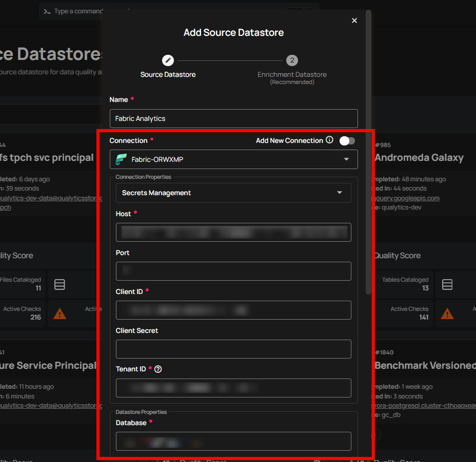{: style="height:500px"}

!!! note
    If you are using existing credentials, you can only edit the details such as Database, Schema, Teams, and Initiate Cataloging.

**Step 2:** Click on the **Test Connection** button to verify the existing connection details. If the connection details are verified, a success message will be displayed.

<!-- Screenshot needed: Fabric test existing connection -->


!!! note
    Clicking on the **Finish** button will create the source datastore and bypass the **enrichment datastore** configuration step.

!!! tip
    It is recommended to click on the **Next** button, which will take you to the **enrichment datastore** configuration page.

## Add Enrichment Datastore

Once you have successfully tested and verified your source datastore connection, you have the option to add the enrichment datastore (recommended). The enrichment datastore is used to store the analyzed results, including any anomalies and additional metadata in tables. This setup provides full visibility into your data quality, helping you manage and improve it effectively.

!!! warning
    Qualytics does not support the Fabric Analytics connector as an enrichment datastore, but you can point to a different enrichment datastore.

**Step 1:** Whether you have added a source datastore by creating a new datastore connection or using an existing connection, click on the **Next** button to start adding the **Enrichment Datastore**.


**Step 2:** A modal window **Link Enrichment Datastore** will appear, providing you with the options to configure an **enrichment datastore**.


| REF. | FIELDS  | ACTIONS |
|------|-----------------------|------------------------------------------------------------------------------------------------------------------|
| 1. | Prefix (Required) | Add a prefix name to uniquely identify tables/files when Qualytics writes metadata from the source datastore to your enrichment datastore. |
| 2. | Caret Down Button | Click the caret down to select either **Use Enrichment Datastore** or **Add Enrichment Datastore**. |
| 3. | Enrichment Datastore | Select an enrichment datastore from the dropdown list. |

### Option I: Create an Enrichment Datastore with a new Connection

If the toggle **Add New Connection** is turned on, then this will prompt you to add and configure the enrichment datastore from scratch without using an existing enrichment datastore and its connection details.

**Step 1:** Click on the caret button and select Add Enrichment Datastore.

<!-- Screenshot needed: Fabric add enrichment caret dropdown -->
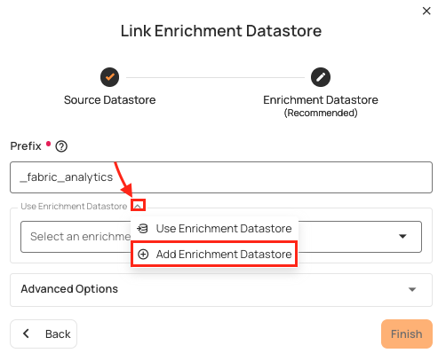

A modal window **Link Enrichment Datastore** will appear. Enter the following details to create an enrichment datastore with a new connection.

<!-- Screenshot needed: Fabric enrichment details modal -->
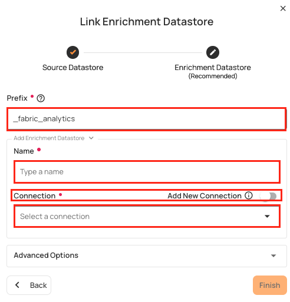

| REF.              | FIELDS       | ACTIONS                                    |
|-------------------|--------------|--------------------------------------------|
| 1.                | Prefix       | Add a prefix name to uniquely identify tables/files when Qualytics writes metadata from the source datastore to your enrichment datastore. |
| 2.                | Name   | Give a name for the enrichment datastore.|
| 3.                |Toggle Button for Add New Connection | Toggle ON to create a new enrichment from scratch or toggle OFF to reuse credentials from an existing connection. |
| 4.                |Connector | Select a datastore connector from the dropdown list.|

**Step 2:** Add connection details for your selected **enrichment datastore** connector.

<!-- Screenshot needed: Fabric enrichment connector configuration -->
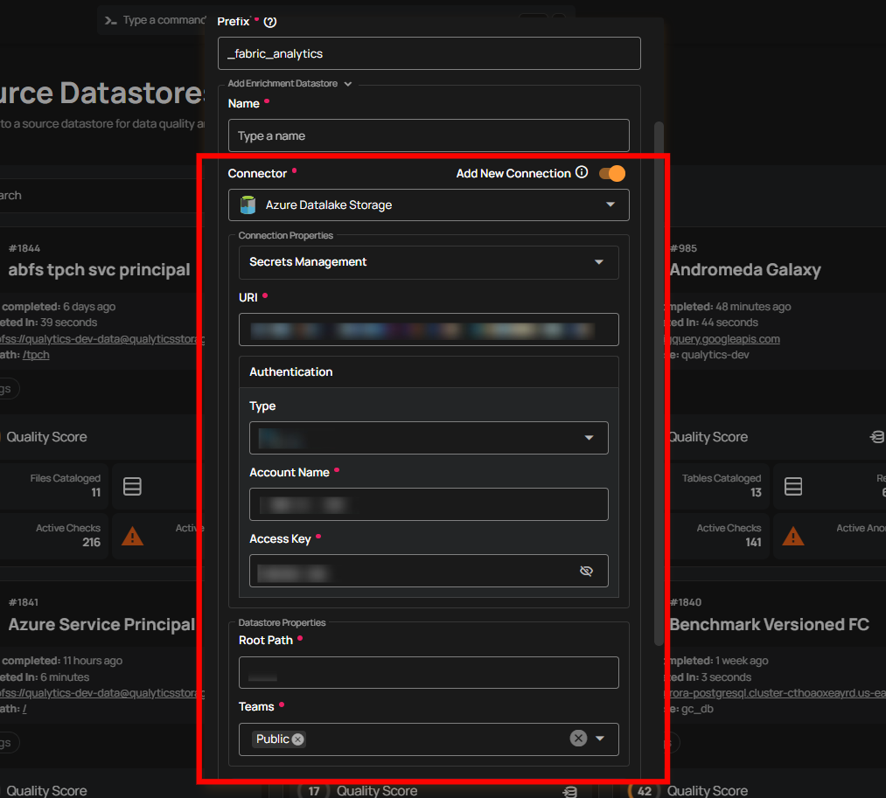{: style="height:500px"}

!!! note
    Qualytics does not support Fabric Analytics as an enrichment datastore. Instead, you can select a different enrichment datastore for this purpose. For demonstration purposes, we are using Microsoft SQL Server as the enrichment datastore. You can use any other JDBC or DFS datastore of your choice for the enrichment datastore configuration.

**Step 3:** Click on the **Test Connection** button to verify the selected enrichment datastore connection. If the connection is verified, a flash message will indicate that the connection with the datastore has been successfully verified.

<!-- Screenshot needed: Fabric enrichment test connection -->


**Step 4:** Click on the **Finish** button to complete the configuration process.

<!-- Screenshot needed: Fabric enrichment finish button -->


When the configuration process is finished, a modal will display a success message indicating that your datastore has been successfully added.

Close the Success dialog and the page will automatically redirect you to the **Source Datastore Details** page where you can perform data operations on your configured **source datastore**.

<!-- Screenshot needed: Fabric source datastore details page -->
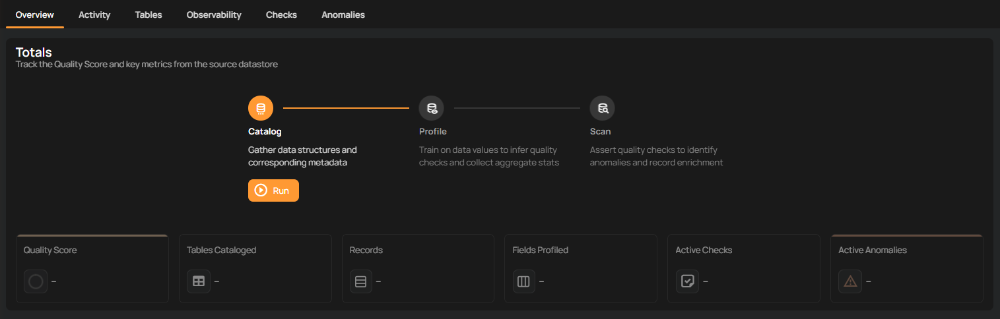

### Option II: Use an Existing Connection

If the **Use enrichment datastore** option is selected from the caret button, you will be prompted to configure the datastore using existing connection details.

**Step 1:** Click on the caret button and select **Use Enrichment Datastore**.

<!-- Screenshot needed: Fabric use enrichment datastore option -->


**Step 2:** A modal window **Link Enrichment Datastore** will appear. Add a prefix name and select an existing enrichment datastore from the dropdown list.

!!! note
    Qualytics does not support Fabric Analytics as an enrichment datastore. Instead, you can select a different enrichment datastore for this purpose. For demonstration purposes, we are using Microsoft SQL Server as the enrichment datastore. You can use any other JDBC or DFS datastore of your choice for the enrichment datastore configuration.

<!-- Screenshot needed: Fabric use existing enrichment datastore -->
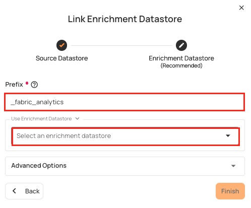

| REF. | FIELDS | ACTIONS  |
|------|--------------|------|
| 1. | Prefix  | Add a prefix name to uniquely identify tables/files when Qualytics writes metadata from the source datastore to your enrichment datastore. |
| 2.  | Enrichment Datastore | Select an enrichment datastore from the dropdown list.  |

**Step 3:** After selecting an existing **enrichment datastore** connection, you will view the following details related to the selected enrichment:

-   **Teams:** The team associated with managing the enrichment datastore is based on the role of public or private. For example, Marked as **Public** means that this datastore is accessible to all the users.
-   **Host:** This is the server address where the enrichment datastore instance is hosted. It is the endpoint used to connect to the enrichment datastore environment.
-   **Database:** Refers to the specific database within the enrichment datastore environment where the data is stored.
-   **Schema:** The schema used in the enrichment datastore. The schema is a logical grouping of database objects (tables, views, etc.). Each schema belongs to a single database.

<!-- Screenshot needed: Fabric selected enrichment datastore details -->
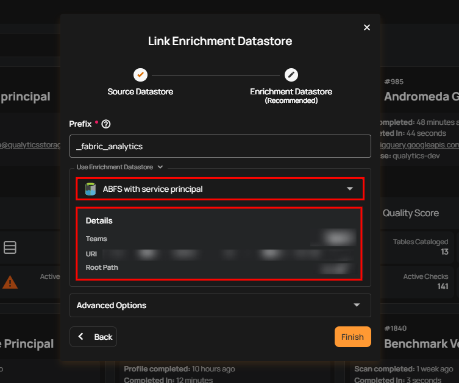

**Step 4:** Click on the **Finish** button to complete the configuration process for the existing **enrichment datastore**.

<!-- Screenshot needed: Fabric click finish for existing enrichment -->
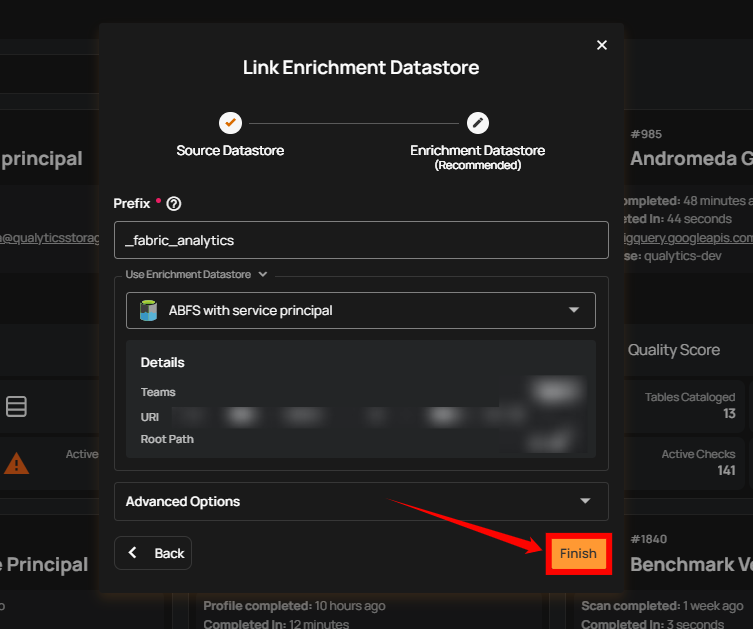

When the configuration process is finished, a modal will display a success message indicating that your data has been successfully added.

Close the success message and you will be automatically redirected to the **Source Datastore Details** page where you can perform data operations on your configured **source datastore**.

<!-- Screenshot needed: Fabric source datastore details page (after enrichment) -->


## API Payload Examples

### Creating a Source Datastore

This section provides a sample payload for creating a Fabric Analytics datastore. Replace the placeholder values with actual data relevant to your setup.

**Endpoint (Post)**: ```/api/datastores (post)```

=== "Creating a source datastore with a new connection"
    ```json
    {
        "name": "your_datastore_name",
        "teams": ["Public"],
        "database": "fabric_database",
        "schema": "dbo",
        "enrich_only": false,
        "trigger_catalog": true,
        "connection": {
            "name": "your_connection_name",
            "type": "fabric",
            "host": "your-workspace-guid.datawarehouse.fabric.microsoft.com",
            "port": "1433",
            "username": "your_client_id",
            "password": "your_client_secret",
            "parameters": {
                "tenant_id": "your_tenant_id"
            }
        }
    }
    ```
=== "Creating a datastore with an existing connection"
    ```json
    {
        "name": "your_datastore_name",
        "teams": ["Public"],
        "database": "fabric_database",
        "schema": "dbo",
        "enrich_only": false,
        "trigger_catalog": true,
        "connection_id": "connection-id"
    }
    ```

### Link an Enrichment Datastore to a Source Datastore

**Endpoint Details:** ```/api/datastores/{datastore-id}/enrichment/{enrichment-id} (patch)```
