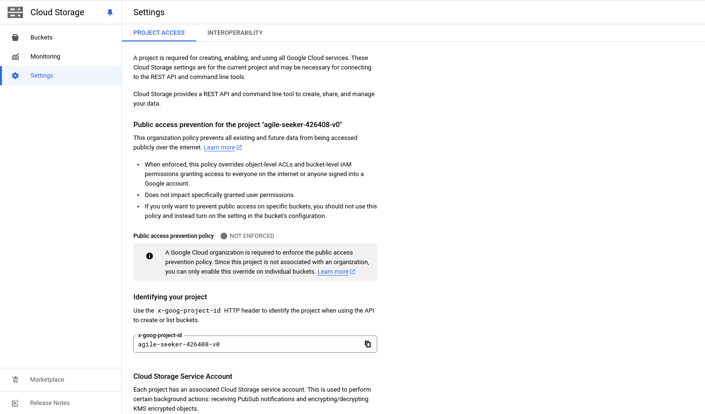
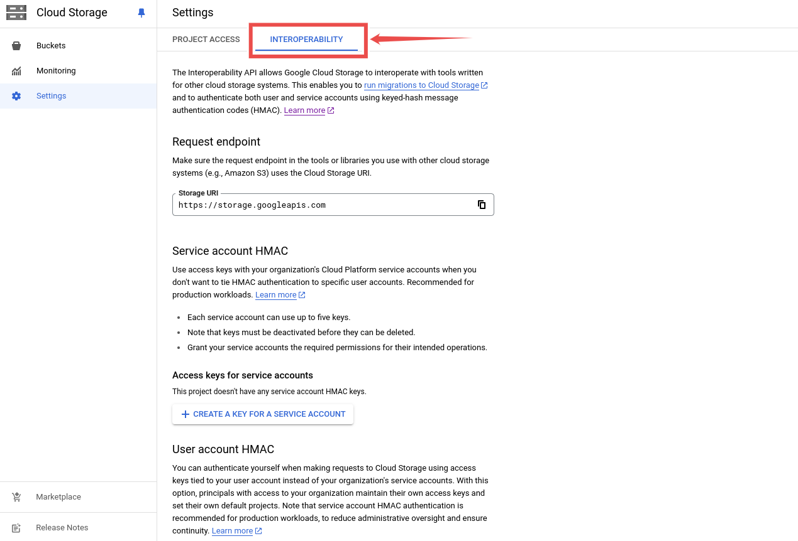
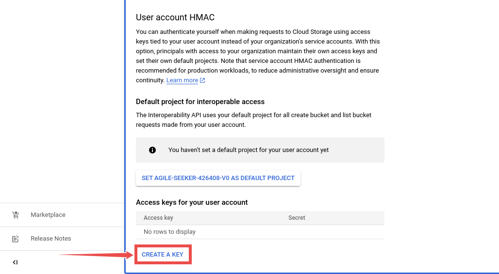
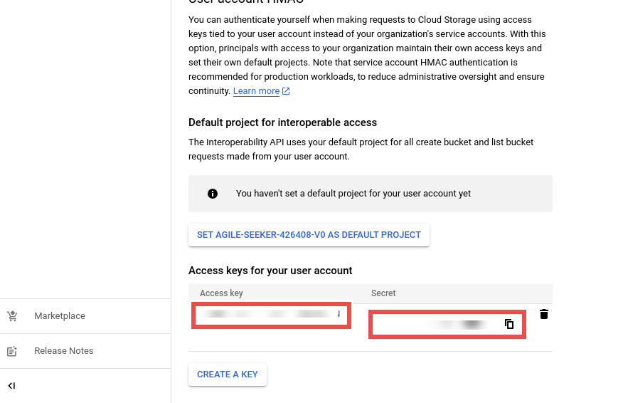

# Google Cloud Storage 

Adding and configuring Google Cloud Storage connection within Qualytics empowers the platform to build a symbolic link with your file system to perform operations like data discovery, visualization, reporting, cataloging, profiling, scanning, anomaly surveillance, and more.

This documentation provides a step-by-step guide on how to add Google Cloud Storage as both a source and enrichment datastore in Qualytics. It covers the entire process, from initial connection setup to testing and finalizing the configuration.

By following these instructions, enterprises can ensure their Google Cloud Storage environment is properly connected with Qualytics, unlocking the platform's potential to help you proactively manage your full data quality lifecycle.

Let’s get started 🚀

## Google Cloud Storage Setup Guide 

This guide will walk you through the steps to set up Google Cloud Storage, including how to retrieve the necessary URIs, access keys, and secret keys, which are essential for integrating this datastore into Qualytics.

### Retrieve Google Cloud Storage URI

To retrieve the Cloud Cloud Storage URI follow the given steps:

1. Go to the [**Cloud Storage Console**](https://console.cloud.google.com/){:target="_blank"}.
2. Navigate to the location of the object (file) that holds the source data.
3. At the top of the Cloud Storage console, locate and note down the path to the object.
4. Create the URI using the following format: 

```
gs://bucket/file
```

- `bucket` is the name of the Cloud Storage bucket.

- `file` is the name of the object (file) containing the data.

### Retrieve the Access Key and Secret Key

You need these keys when integrating Google Cloud Storage with other applications or services, such as when adding it as a datastore in Qualytics. The keys allow you to reuse existing code to access Google Cloud Storage without needing to implement a different authentication mechanism.

To retrieve the access key and secret key in the Google Cloud Storage Console account, follow the given steps: 

**Step 1:** Log in to the Google Cloud Console, navigate to the [**Google Cloud Storage settings**](https://console.cloud.google.com/storage/settings){:target="_blank"}, and this will redirect you to the Settings page.



**Step 2:** Click on the **Interoperability** tab. 



**Step 3:** Scroll down the **Interoperability**  page and under **Access keys for your user account**, click the **CREATE A KEY** button to generate a new Access Key and Secret Key.



**Step 4:** Use these generated Access Key and Secret Key values when adding your Google Cloud Storage account to SimpleBackups.



For example, once you generate the keys, they might look like this:

 - Access Key: `GOOG1234ABCDEFGH5678`

 - Secret Key: `abcd1234efgh5678ijklmnopqrstuvwx`

!!! warning 
    Make sure to store these keys securely, as they provide access to your Google Cloud Storage resources. 

## Add a Source Datastore

A source datastore is a storage location used to connect and access data from external sources. Google Cloud Storage is an example of a source datastore, specifically a type of Distributed File System (DFS) datastore that is designed to handle data stored in distributed file systems. Configuring a DFS datastore enables the Qualytics platform to access and perform operations on the data, thereby generating valuable insights.

**Step 1:** Log in to your Qualytics account and click on the Add Source Datastore button located at the top-right corner of the interface.


**Step 2:** A modal window- Add Datastore will appear, providing you with the options to connect a datastore.


| REF. | FIELDS           | ACTIONS                                                                                     |
|--------|----------------|-------------------------------------------------------------------------------------------------|
| 1.     | Name (Required)         | Specify the name of the datastore (e.g., The specified name will appear on the datastore cards) |
| 2.     | Toggle Button  | Toggle **ON** to create a new source datastore from scratch, or toggle **OFF** to reuse credentials from an existing connection |
| 3.     | Connector (Required)     | Select **Google Cloud Storage** from the dropdown list.                                            |

### Option I: Create a Datastore with a new Connection

If the toggle for **Add New connection** is turned on, then this will prompt you to add and configure the source datastore from scratch without using existing connection details.

**Step 1:** Select the **Google Cloud Storage** connector from the dropdown list and add connection details such as Secrets Management, URI, service account key, root path, and teams.


**Secrets Management**: This is an optional connection property that allows you to securely store and manage credentials by integrating with HashiCorp Vault and other secret management systems. Toggle it **ON** to enable Vault integration for managing secrets.

!!! note 
    After configuring **HashiCorp Vault** integration, you can use ${key} in any Connection property to reference a key from the configured Vault secret. Each time the Connection is initiated, the corresponding secret value will be retrieved dynamically.

| REF | FIELDS               | ACTIONS                                                                 |
|-----|----------------------|-------------------------------------------------------------------------|
| 1.  | Login URL            | Enter the URL used to authenticate with HashiCorp Vault.                |
| 2.  | Credentials Payload  | Input a valid JSON containing credentials for Vault authentication.     |
| 3.  | Token JSONPath       | Specify the JSONPath to retrieve the client authentication token from the response (e.g., $.auth.client_token). |
| 4.  | Secret URL           | Enter the URL where the secret is stored in Vault.                      |
| 5.  | Token Header Name    | Set the header name used for the authentication token (e.g., X-Vault-Token). |
| 6.  | Data JSONPath        | Specify the JSONPath to retrieve the secret data (e.g., $.data).        |


**Step 2:** The configuration form will expand, requesting credential details before establishing the connection.


| REF. | FIELDS                 | ACTIONS                                                                                                       |
|--------|----------------------|-------------------------------------------------------------------------------------------------------------------|
| 1.     | URI (Required)                 | Enter the Uniform Resource Identifier (URI) of the Google Cloud Storage.                                          |
| 2.     | Service Account Key (Required)  | Upload a JSON file that contains the credentials required for accessing the Google Cloud Storage.                  |
| 3.     | Root Path (Required)           | Specify the root path where the data is stored.                                                                   |
| 4.     | Teams (Required)               | Select one or more teams from the dropdown to associate with this source datastore.                                |
| 5.     | Initiate Cataloging (Optional)   | Tick the checkbox to automatically perform catalog operation on the configured source datastore to gather data structures and corresponding metadata. |

**Step 3:** After adding the source datastore details, click on the **Test Connection** button to check and verify its connection.


If the credentials and provided details are verified, a success message will be displayed indicating that the connection has been verified. 

### Option II: Use an Existing Connection

If the toggle for **Add New connection** is turned off, then this will prompt you to configure the source datastore using the existing connection details.

**Step 1:** Select a **connection** to reuse existing credentials.


!!! note
    If you are using existing credentials, you can only edit the details such as Root Path, Teams, and Initiate Cataloging.

**Step 2:** Click on the **Test Connection** button to check and verify the source data connection. If connection details are verified, a success message will be displayed.


!!! note
    Clicking on the **Finish** button will create the source datastore and bypass the **enrichment datastore** configuration step.

!!! tip
    It is recommended to click on the **Next** button, which will take you to the **enrichment datastore** configuration page.

## Add Enrichment Datastore

Once you have successfully tested and verified your source datastore connection, you have the option to add the enrichment datastore (recommended). This datastore is used to store the analyzed results, including any anomalies and additional metadata files. This setup provides full visibility into your data quality, helping you manage and improve it effectively.

**Step 1:** Whether you have added a source datastore by creating a new datastore connection or using an existing connection, click on the **Next** button to start adding the **Enrichment Datastore**.


**Step 2**:  A modal window- **Link Enrichment Datastore** will appear, providing you with the options to configure an **enrichment datastore**.


| REF.              | FIELDS       | ACTIONS                                    |
|-------------------|--------------|--------------------------------------------|
| 1.                | Prefix       | Add a prefix name to uniquely identify tables/files when Qualytics writes metadata from the source datastore to your enrichment datastore. |
| 2.                | Caret Down Button   | Click the caret down to select either **Use Enrichment Datastore** or **Add Enrichment Datastore**.|
| 3.                | Enrichment Datastore         | Select an enrichment datastore from the dropdown list. |

### Option I: Create an Enrichment Datastore with a new Connection

If the toggles for **Add New connection is turned on**, then this will prompt you to add and configure the enrichment datastore from scratch without using an existing enrichment datastore and its connection details.

**Step 1**: Click on the caret button and select Add Enrichment Datastore.


A modal window **Link Enrichment Datastore** will appear. Enter the following details to create an enrichment datastore with a new connection


| REF.              | FIELDS       | ACTIONS                                    |
|-------------------|--------------|--------------------------------------------|
| 1.                | Prefix       | Add a prefix name to uniquely identify tables/files when Qualytics writes metadata from the source datastore to your enrichment datastore. |
| 2.                | Name   | Give a name for the enrichment datastore.|
| 3.                |Toggle Button for add new connection | Toggle ON to create a new enrichment from scratch or toggle OFF to reuse credentials from an existing connection. |
| 4.                |Connector | Select a datastore connector from the dropdown list.|

**Step 2:** Add connection details for your selected **enrichment datastore** connector.


| REF.   | FIELDS               | ACTIONS                                                                                           |
|--------|----------------------|---------------------------------------------------------------------------------------------------|
| 1️.     | URI (Required)                 | Enter the Uniform Resource Identifier (URI) for the Google Cloud Storage.                         |
| 2️.     | Service Account Key (Required)  | Upload a JSON file that contains the credentials required for accessing the Google Cloud Storage.   |
| 3️.     | Root Path (Required)           | Specify the root path where the data is stored.                                                    |
| 4️.     | Teams (Required)               | Select one or more teams from the dropdown to associate with this source datastore.                |

**Step 3:** Click on the **Test Connection** button to verify the selected enrichment datastore connection. If the connection is verified, a flash message will indicate that the connection with the datastore has been successfully verified. 


**Step 4:** Click on the **Finish** button to complete the configuration process. 


When the configuration process is finished, a modal will display a **success message** indicating that **your datastore has been successfully added**.


**Step 5:** Close the Success dialog and the page will automatically redirect you to the **Source Datastore Details** page where you can perform data operations on your configured **source datastore**.


### Option II: Use an Existing Connection

If the toggle for **Use an existing enrichment datastore** is turned on, you will be prompted to configure the enrichment datastore using existing connection details.

**Step 1**: Click on the caret button and select **Use Enrichment Datastore**.


**Step 2**: A modal window **Link Enrichment Datastore** will appear. Add a prefix name and select an existing enrichment datastore from the dropdown list.


| REF.              | FIELDS       | ACTIONS                                    |
|-------------------|--------------|--------------------------------------------|
| 1.                | Prefix       | Add a prefix name to uniquely identify tables/files when Qualytics writes metadata from the source datastore to your enrichment datastore. |
| 2.                | Enrichment Datastore  | Select an enrichment datastore from the dropdown list. |

**Step 3:** After selecting an existing **enrichment datastore** connection, you will view the following details related to the selected enrichment: 

 - **Teams:** The team associated with managing the enrichment datastore is based on the role of public or private. Example- Marked as **Public** means that this datastore is accessible to all the users. 

 - **URI:** Uniform Resource Identifier (URI) points to the specific location of the source data and should be formatted accordingly (e.g., `gs://bucket/file` for Google Cloud Storage).

 - **Root Path:** Specify the root path where the data is stored. This path defines the base directory or folder from which all data operations will be performed.


**Step 4:** Click on the **Finish** button to complete the configuration process for the existing **enrichment datastore**.


When the configuration process is finished, a modal will display a **success message** indicating that **your datastore has been successfully added**.


Close the success message and you will be automatically redirected to the **Source Datastore Details** page where you can perform data operations on your configured **source datastore**.


## API Payload Examples

This section provides detailed examples of API payloads to guide you through the process of creating and managing datastores using Qualytics API. Each example includes endpoint details, sample payloads, and instructions on how to replace placeholder values with actual data relevant to your setup.

### Creating a Source Datastore

This section provides sample payloads for creating the Google Cloud Storage datastore. Replace the placeholder values with actual data relevant to your setup.

**Endpoint:** `/api/datastores (post)`

=== "Create a Source Datastore with a new Connection"
    ```json
            {
            "name": "your_datastore_name",
            "teams": ["Public"],
            "trigger_catalog": true,
            "root_path": "/gcs_root_path",
            "enrich_only": false,
            "connection": {
                "name": "your_connection_name",
                "type": "gcs",
                "uri": "gs://<bucket_name>",
                "secret_key": "gcs_service_account_key"
            }
        }
    ```
=== "Create a Source Datastore with an existing Connection"
    ```json
       {
            "name": "your_datastore_name",
            "teams": ["Public"],
            "trigger_catalog": true,
            "root_path": "/gcs_root_path",
            "enrich_only": false,
            "connection_id": connection-id
        }
    ```
### Creating an Enrichment Datastore
This section provides sample payloads for creating an enrichment datastore. Replace the placeholder values with actual data relevant to your setup.

**Endpoint:**  `/api/datastores (post)`

=== "Create an Enrichment Datastore with a new Connection"
    ```json
        {
            "name": "your_datastore_name",
            "teams": ["Public"],
            "trigger_catalog": true,
            "root_path": "/gcs_root_path",
            "enrich_only": true,
            "connection": {
                "name": "your_connection_name",
                "type": "gcs",
                "uri": "gs://<bucket_name>",
                "secret_key": "gcs_service_account_key"
            }
        }
    ```
=== "Create an Enrichment Datastore with an existing Connection"
    ```json
        {
            "name": "your_datastore_name",
            "teams": ["Public"],
            "trigger_catalog": true,
            "root_path": "/gcs_root_path",
            "enrich_only": true,
            "connection_id": connection-id
        }
    ```
### Link an Enrichment Datastore to a Source Datastore 
Use the provided endpoint to link an enrichment datastore to a source datastore:

**Endpoint Details:** ```/api/datastores/{datastore-id}/enrichment/{enrichment-id} (patch)```

