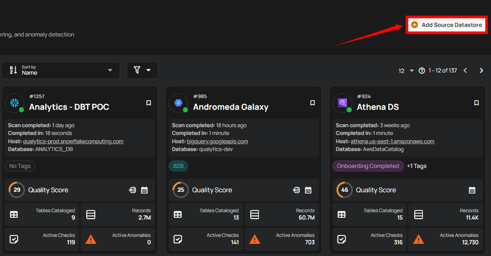
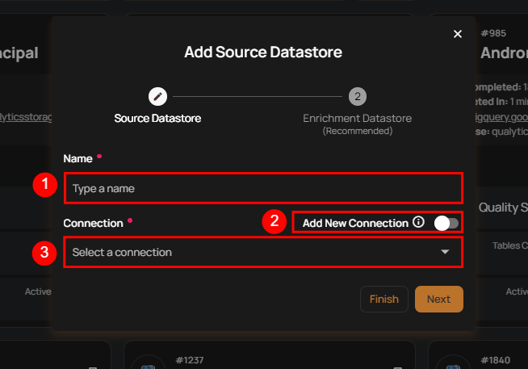
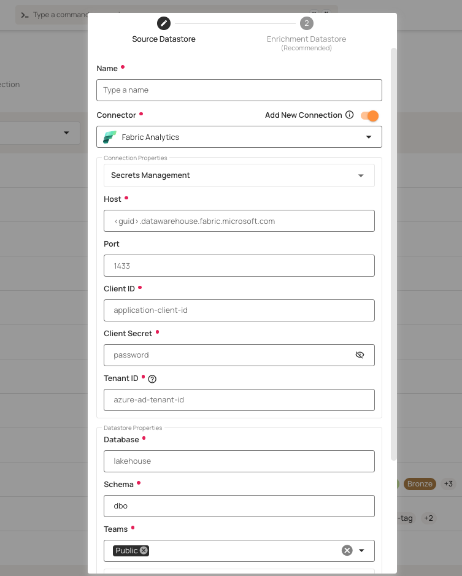
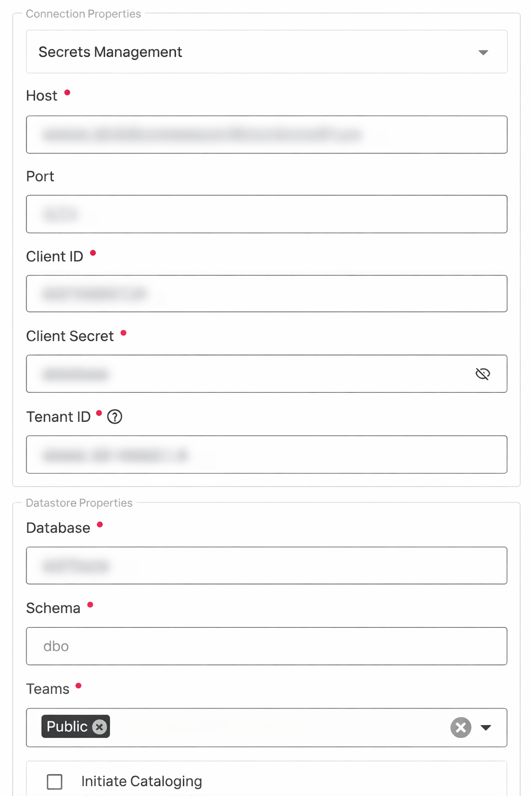
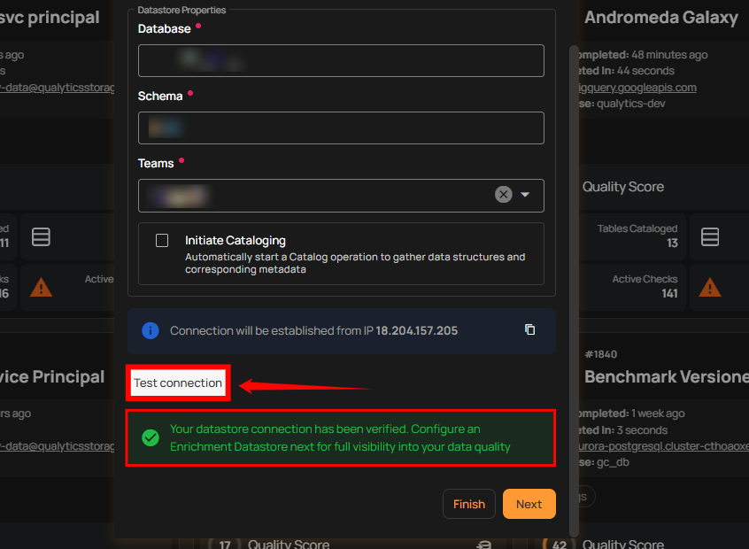
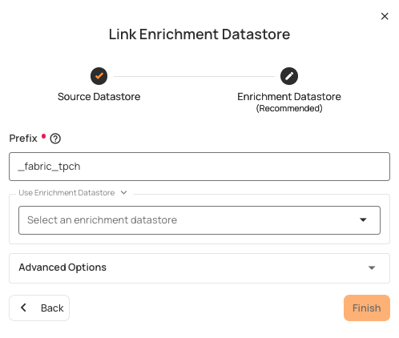
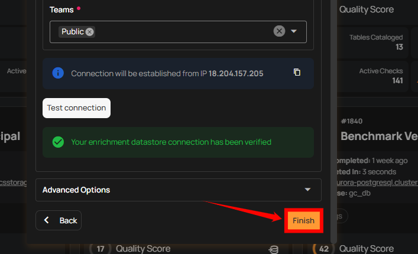
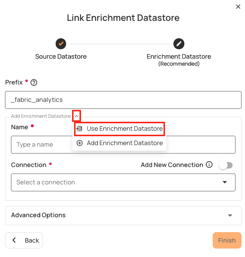

# Microsoft Fabric

Adding and configuring a Microsoft Fabric connection within Qualytics empowers the platform to build a symbolic link with your lakehouse to perform operations like data discovery, visualization, reporting, cataloging, profiling, scanning, anomaly surveillance, and more.

This documentation provides a step-by-step guide on how to add Microsoft Fabric as both a source and enrichment datastore in Qualytics. It covers the entire process, from initial connection setup to testing and finalizing the configuration.

By following these instructions, enterprises can ensure their Microsoft Fabric environment is properly connected with Qualytics, unlocking the platform's potential to help you proactively manage your full data quality lifecycle.

Let's get started 🚀

## Microsoft Fabric Setup Guide

Before connecting Microsoft Fabric to Qualytics, you need to gather your Fabric workspace and lakehouse identifiers and set up one of the two supported authentication methods.

### Prerequisites

To connect Qualytics to Microsoft Fabric, you will need the following:

| REF. | REQUIREMENT | DESCRIPTION |
| ---- | ----------- | ----------- |
| 1.   | Microsoft Fabric Workspace | An active Microsoft Fabric workspace with a Lakehouse created. |
| 2.   | Workspace & Lakehouse IDs | The unique identifiers (UUIDs) for your Fabric workspace and Lakehouse. |
| 3.   | Authentication Credentials | Either a **Service Principal** (Client ID, Client Secret, Tenant ID) or a valid **Access Token**. |

### Authentication Methods

Qualytics supports two authentication methods for connecting to Microsoft Fabric:

#### Option A: Service Principal (Recommended)

Service Principal authentication is recommended for automated and production environments. It uses a Microsoft Entra ID App Registration to authenticate.

**Register a Service Principal:**

1. Navigate to the [**Azure Portal**](https://portal.azure.com){:target="_blank"} and go to **Microsoft Entra ID** > **App registrations**.
2. Click **New registration**.
3. Provide a name (e.g., `qualytics-fabric-connector`) and register the application.
4. Note the **Application (client) ID** and **Directory (tenant) ID** from the overview page.
5. Navigate to **Certificates & secrets** > **New client secret**.
6. Add a description, select an expiration period, and click **Add**.
7. Copy the **Secret Value** immediately — it will not be shown again.

!!! warning
    Store the Client Secret securely. It cannot be retrieved after you navigate away from the page.

**Grant Workspace Access:**

1. In Microsoft Fabric, navigate to your **Workspace**.
2. Click on **Manage access**.
3. Add the Service Principal by searching for the App Registration name.
4. Assign at least **Contributor** role.

**Required credentials for Service Principal:**

| REF. | FIELD | DESCRIPTION |
| ---- | ----- | ----------- |
| 1.   | Client ID | The **Application (client) ID** from the Entra ID App Registration. |
| 2.   | Client Secret | The **Secret Value** generated in the App Registration. |
| 3.   | Tenant ID | The **Directory (tenant) ID** from the Entra ID App Registration. |

#### Option B: Access Token

Access Token authentication is suitable for scenarios where tokens are managed externally or for short-lived sessions. It requires a valid bearer token with permissions to access the Fabric workspace and lakehouse.

| REF. | FIELD | DESCRIPTION |
| ---- | ----- | ----------- |
| 1.   | Access Token | A valid bearer token with appropriate permissions to access your Fabric resources. |

!!! note
    Access tokens have a limited lifespan. Ensure your token management strategy handles token refresh for long-running connections.

### Retrieve Connection Details

To configure the Fabric connector in Qualytics, you need the following details:

| REF. | FIELD | HOW TO OBTAIN |
| ---- | ----- | ------------- |
| 1.   | Workspace ID | From the Fabric workspace URL: `https://app.fabric.microsoft.com/groups/{workspace-id}` |
| 2.   | Lakehouse ID | From the Lakehouse URL: `https://app.fabric.microsoft.com/groups/{workspace-id}/lakehouses/{lakehouse-id}` |
| 3.   | Client ID | The **Application (client) ID** from the Entra ID App Registration (Service Principal only). |
| 4.   | Client Secret | The **Secret Value** generated in the App Registration (Service Principal only). |
| 5.   | Tenant ID | The **Directory (tenant) ID** from the Entra ID App Registration (Service Principal only). |
| 6.   | Access Token | A valid bearer token (Access Token auth only). |

## Add a Source Datastore

A source datastore is a storage location used to connect to and access data from external sources. Microsoft Fabric is an example of a source datastore, specifically a type of JDBC datastore that supports connectivity through the JDBC API. Configuring the JDBC datastore enables the Qualytics platform to access and perform operations on the data, thereby generating valuable insights.

**Step 1:** Log in to your Qualytics account and click on the **Add Source Datastore** button located at the top-right corner of the interface.



**Step 2:** A modal window - **Add Datastore** will appear, providing you with the options to connect a datastore.



| REF. | FIELDS | ACTIONS |
|------|--------|---------|
| 1.   | Name (Required) | Specify the datastore name (e.g., This name will appear on the datastore cards). |
| 2.   | Toggle Button | Toggle ON to create a new source datastore from scratch, or toggle OFF to reuse credentials from an existing connection. |
| 3.   | Connector (Required) | Select **Microsoft Fabric** from the dropdown list. |

### Option I: Create a Source Datastore with a new Connection

If the toggle for **Add New Connection** is turned on, then this will prompt you to add and configure the source datastore from scratch without using existing connection details.

**Step 1:** Select the **Microsoft Fabric** connector from the dropdown list and add connection details such as Secrets Management, workspace ID, lakehouse ID, and your authentication credentials (Service Principal or Access Token).



**Secrets Management**: This is an optional connection property that allows you to securely store and manage credentials by integrating with HashiCorp Vault and other secret management systems. Toggle it **ON** to enable Vault integration for managing secrets.

!!! note
    After configuring **HashiCorp Vault** integration, you can use `${key}` in any Connection property to reference a key from the configured Vault secret. Each time the Connection is initiated, the corresponding secret value will be retrieved dynamically.

| REF. | FIELDS | ACTIONS |
|------|--------|---------|
| 1.   | Login URL | Enter the URL used to authenticate with HashiCorp Vault. |
| 2.   | Credentials Payload | Input a valid JSON containing credentials for Vault authentication. |
| 3.   | Token JSONPath | Specify the JSONPath to retrieve the client authentication token from the response (e.g., $.auth.client_token). |
| 4.   | Secret URL | Enter the URL where the secret is stored in Vault. |
| 5.   | Token Header Name | Set the header name used for the authentication token (e.g., X-Vault-Token). |
| 6.   | Data JSONPath | Specify the JSONPath to retrieve the secret data (e.g., $.data). |


**Step 2:** The configuration form will expand, requesting credential details before establishing the connection.



| REF. | FIELD | ACTIONS |
|------|-------|---------|
| 1.   | Workspace ID (Required) | Enter the Microsoft Fabric [**Workspace ID**](https://learn.microsoft.com/en-us/fabric/admin/portal-workspace){:target="_blank"} (a UUID found in the workspace URL). |
| 2.   | Lakehouse ID (Required) | Enter the Microsoft Fabric **Lakehouse ID** (a UUID found in the Lakehouse URL). |
| 3.   | Auth Type (Required) | Select the authentication method: **Service Principal** or **Access Token**. |
| 4.   | Client ID | Enter the **Application (client) ID** from the [**Microsoft Entra ID App Registration**](https://learn.microsoft.com/en-us/entra/identity-platform/quickstart-register-app){:target="_blank"}. Required when using **Service Principal** authentication. |
| 5.   | Client Secret | Enter the **Client Secret Value** generated in the App Registration. Required when using **Service Principal** authentication. |
| 6.   | Tenant ID | Enter the **Directory (tenant) ID** from the Microsoft Entra ID App Registration. Required when using **Service Principal** authentication. |
| 7.   | Access Token | Enter a valid bearer token. Required when using **Access Token** authentication. |
| 8.   | Catalog (Required) | Add a **Catalog** to fetch data structures and metadata from Microsoft Fabric. |
| 9.   | Database (Optional) | Specify the database name to be accessed. |
| 10.  | Teams (Required) | Select one or more teams from the dropdown to associate with this source datastore. |
| 11.  | Initiate Cataloging (Optional) | Tick the checkbox to automatically perform catalog operation on the configured source datastore to gather data structures and corresponding metadata. |

**Step 3:** After adding the source datastore details, click on the **Test Connection** button to check and verify its connection.



If the credentials and provided details are verified, a success message will be displayed indicating that the connection has been verified.

### Option II: Use an Existing Connection

If the toggle for **Add New Connection** is turned off, then this will prompt you to configure the source datastore using the existing connection details.

**Step 1:** Select a **connection** to reuse existing credentials.


!!! note
    If you are using existing credentials, you can only edit the details such as Catalog, Database, Teams, and Initiate Cataloging.

**Step 2:** Click on the **Test Connection** button to verify the existing connection details. If connection details are verified, a success message will be displayed.


!!! note
    Clicking on the **Finish** button will create the source datastore and bypass the **enrichment datastore** configuration step.

!!! tip
    It is recommended to click on the **Next** button, which will take you to the **enrichment datastore** configuration page.

## Add Enrichment Datastore

Once you have successfully tested and verified your source datastore connection, you have the option to add the enrichment datastore (recommended). The enrichment datastore is used to store the analyzed results, including any anomalies and additional metadata in tables. This setup provides full visibility into your data quality, helping you manage and improve it effectively.

**Step 1:** Whether you have added a source datastore by creating a new datastore connection or using an existing connection, click on the **Next** button to start adding the **Enrichment Datastore**.


**Step 2:** A modal window - **Link Enrichment Datastore** will appear, providing you with the options to configure an **enrichment datastore**.



| REF. | FIELDS | ACTIONS |
|------|--------|---------|
| 1.   | Prefix (Required) | Add a prefix name to uniquely identify tables/files when Qualytics writes metadata from the source datastore to your enrichment datastore. |
| 2.   | Caret Down Button | Click the caret down button to select either **Use Enrichment Datastore** or **Add Enrichment Datastore**. |
| 3.   | Enrichment Datastore | Select an enrichment datastore from the dropdown list. |

### Option I: Create an Enrichment Datastore with a new Connection

If the toggle for **Add New Connection** is turned on, then this will prompt you to add and configure the enrichment datastore from scratch without using an existing enrichment datastore and its connection details.

**Step 1:** Click on the caret button and select **Add Enrichment Datastore**.


A modal window **Link Enrichment Datastore** will appear. Enter the following details to create an enrichment datastore with a new connection.


| REF. | FIELDS | ACTIONS |
|------|--------|---------|
| 1.   | Prefix | Add a prefix name to uniquely identify tables/files when Qualytics writes metadata from the source datastore to your enrichment datastore. |
| 2.   | Name | Give a name for the enrichment datastore. |
| 3.   | Toggle Button for Add New Connection | Toggle ON to create a new enrichment from scratch or toggle OFF to reuse credentials from an existing connection. |
| 4.   | Connector | Select a datastore connector from the dropdown list. |

**Step 2:** Add connection details for your selected **enrichment datastore** connector.


**Secrets Management**: This is an optional connection property that allows you to securely store and manage credentials by integrating with HashiCorp Vault and other secret management systems. Toggle it **ON** to enable Vault integration for managing secrets.

!!! note
    Once the **HashiCorp Vault** is set up, use the `${key}` format in Connection form to reference a Vault secret.

| REF. | FIELDS | ACTIONS |
|------|--------|---------|
| 1.   | Login URL | Enter the URL used to authenticate with HashiCorp Vault. |
| 2.   | Credentials Payload | Input a valid JSON containing credentials for Vault authentication. |
| 3.   | Token JSONPath | Specify the JSONPath to retrieve the client authentication token from the response (e.g., $.auth.client_token). |
| 4.   | Secret URL | Enter the URL where the secret is stored in Vault. |
| 5.   | Token Header Name | Set the header name used for the authentication token (e.g., X-Vault-Token). |
| 6.   | Data JSONPath | Specify the JSONPath to retrieve the secret data (e.g., $.data). |


**Step 3:** The configuration form, requesting credential details after selecting **enrichment datastore** connector.


| REF. | FIELD | ACTIONS |
|------|-------|---------|
| 1.   | Workspace ID (Required) | Enter the Microsoft Fabric [**Workspace ID**](https://learn.microsoft.com/en-us/fabric/admin/portal-workspace){:target="_blank"} (a UUID found in the workspace URL). |
| 2.   | Lakehouse ID (Required) | Enter the Microsoft Fabric **Lakehouse ID** (a UUID found in the Lakehouse URL). |
| 3.   | Auth Type (Required) | Select the authentication method: **Service Principal** or **Access Token**. |
| 4.   | Client ID | Required when using **Service Principal** authentication. |
| 5.   | Client Secret | Required when using **Service Principal** authentication. |
| 6.   | Tenant ID | Required when using **Service Principal** authentication. |
| 7.   | Access Token | Required when using **Access Token** authentication. |
| 8.   | Catalog (Required) | Add a **Catalog** to fetch data structures and metadata from Microsoft Fabric. |
| 9.   | Database (Optional) | Specify the database name. |
| 10.  | Teams (Required) | Select one or more teams from the dropdown to associate with this enrichment datastore. |

**Step 4:** Click on the **Test Connection** button to verify the selected enrichment datastore connection. If the connection is verified, a flash message will indicate that the connection with the enrichment datastore has been successfully verified.


**Step 5:** Click on the **Finish** button to complete the configuration process.



When the configuration process is finished, a success notification appears on the screen indicating that the datastore was added successfully.

**Step 6:** Close the success dialog and the page will automatically redirect you to the **Source Datastore Details** page where you can perform data operations on your configured **source datastore**.


### Option II: Use an Existing Connection

If the **Use Enrichment Datastore** option is selected from the caret button, you will be prompted to configure the datastore using existing connection details.

**Step 1:** Click on the caret button and select **Use Enrichment Datastore**.



**Step 2:** A modal window **Link Enrichment Datastore** will appear. Add a prefix name and select an existing enrichment datastore from the dropdown list.


| REF. | FIELDS | ACTIONS |
|------|--------|---------|
| 1.   | Prefix (Required) | Add a prefix name to uniquely identify tables/files when Qualytics writes metadata. |
| 2.   | Enrichment Datastore | Select an enrichment datastore from the dropdown list. |

**Step 3:** After selecting an existing **enrichment datastore** connection, you will view the following details related to the selected enrichment:

- **Teams:** The team associated with managing the enrichment datastore is based on the role of public or private. Example- Marked as **Public** means that this datastore is accessible to all the users.

- **Host:** This is the server address where the Microsoft Fabric instance is hosted. It is the endpoint used to connect to the Fabric environment.

- **Database:** Refers to the specific database within the Microsoft Fabric environment where the data is stored.

- **Schema:** The schema used in the enrichment datastore. The schema is a logical grouping of database objects (tables, views, etc.). Each schema belongs to a single database.


**Step 4:** Click on the **Finish** button to complete the configuration process for the existing **enrichment datastore**.


When the configuration process is finished, a success notification appears on the screen indicating that the datastore was added successfully.

Close the success message and you will be automatically redirected to the **Source Datastore Details** page where you can perform data operations on your configured **source datastore**.


## API Payload Examples

This section provides detailed examples of API payloads to guide you through the process of creating and managing datastores using Qualytics API. Each example includes endpoint details, sample payloads, and instructions on how to replace placeholder values with actual data relevant to your setup.

### Creating a Source Datastore

This section provides sample payloads for creating a Microsoft Fabric datastore. Replace the placeholder values with actual data relevant to your setup.

**Endpoint:** ```/api/datastores (post)```

=== "Create with Service Principal"
    ```json
    {
        "name": "your_datastore_name",
        "teams": ["Public"],
        "database": "fabric_database",
        "schema": "fabric_catalog",
        "enrich_only": false,
        "trigger_catalog": true,
        "connection": {
            "name": "your_connection_name",
            "type": "fabric",
            "host": "api.fabric.microsoft.com",
            "password": "fabric_client_secret",
            "parameters": {
                "workspace_id": "fabric_workspace_id",
                "lakehouse_id": "fabric_lakehouse_id",
                "client_id": "fabric_client_id",
                "tenant_id": "fabric_tenant_id"
            }
        }
    }
    ```
=== "Create with Access Token"
    ```json
    {
        "name": "your_datastore_name",
        "teams": ["Public"],
        "database": "fabric_database",
        "schema": "fabric_catalog",
        "enrich_only": false,
        "trigger_catalog": true,
        "connection": {
            "name": "your_connection_name",
            "type": "fabric",
            "host": "api.fabric.microsoft.com",
            "parameters": {
                "workspace_id": "fabric_workspace_id",
                "lakehouse_id": "fabric_lakehouse_id",
                "access_token": "fabric_access_token"
            }
        }
    }
    ```
=== "Create with an Existing Connection"
    ```json
    {
        "name": "your_datastore_name",
        "teams": ["Public"],
        "database": "fabric_database",
        "schema": "fabric_catalog",
        "enrich_only": false,
        "trigger_catalog": true,
        "connection_id": connection-id
    }
    ```
### Creating an Enrichment Datastore

This section provides sample payloads for creating an enrichment datastore. Replace the placeholder values with actual data relevant to your setup.

**Endpoint:**  ```/api/datastores (post)```

=== "Create Enrichment with Service Principal"
    ```json
    {
        "name": "your_datastore_name",
        "teams": ["Public"],
        "database": "fabric_database",
        "schema": "fabric_enrichment_catalog",
        "enrich_only": true,
        "connection": {
            "name": "your_connection_name",
            "type": "fabric",
            "host": "api.fabric.microsoft.com",
            "password": "fabric_client_secret",
            "parameters": {
                "workspace_id": "fabric_workspace_id",
                "lakehouse_id": "fabric_lakehouse_id",
                "client_id": "fabric_client_id",
                "tenant_id": "fabric_tenant_id"
            }
        }
    }
    ```
=== "Create Enrichment with Access Token"
    ```json
    {
        "name": "your_datastore_name",
        "teams": ["Public"],
        "database": "fabric_database",
        "schema": "fabric_enrichment_catalog",
        "enrich_only": true,
        "connection": {
            "name": "your_connection_name",
            "type": "fabric",
            "host": "api.fabric.microsoft.com",
            "parameters": {
                "workspace_id": "fabric_workspace_id",
                "lakehouse_id": "fabric_lakehouse_id",
                "access_token": "fabric_access_token"
            }
        }
    }
    ```
=== "Create Enrichment with an Existing Connection"
    ```json
    {
        "name": "your_datastore_name",
        "teams": ["Public"],
        "database": "fabric_database",
        "schema": "fabric_enrichment_catalog",
        "enrich_only": true,
        "connection_id": connection-id
    }
    ```
### Link an Enrichment Datastore to a Source Datastore

Use the provided endpoint to link an enrichment datastore to a source datastore:

**Endpoint Details:** ```/api/datastores/{datastore-id}/enrichment/{enrichment-id} (patch)```
