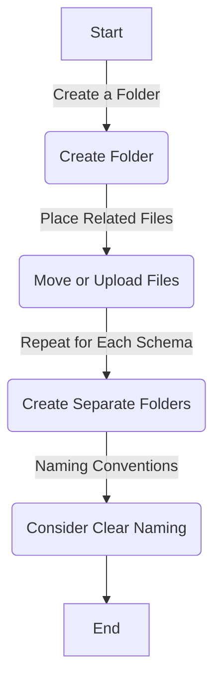
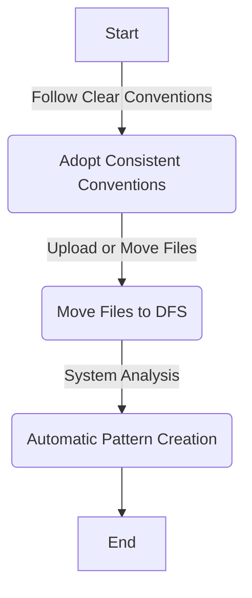

# DFS Datastore Overview

The DFS (Distributed File System) Datastore feature in Qualytics is designed to handle data stored in distributed file systems. 

This includes file systems like Hadoop Distributed File System (HDFS) or similar distributed storage solutions.

## Supported Distributed File Systems

Qualytics supports DFS Datastores, catering to distributed file systems like:

- [**Amazon S3**](./amazon-s3.md)
- [**Google Cloud Storage**](./google-cloud-storage.md)
- [**Windows Azure Storage Blob**](./azure-datalake-storage.md)
- [**Azure Blob File System**](./azure-blob-storage.md)

## Connection Details

Users provide connection details for DFS Datastores, allowing Qualytics to establish a connection to the distributed file system.

## Catalog Operation

The Catalog operation involves walking the directory tree, reading files with supported filename extensions, and creating containers based on file metadata.

## Data Quality and Profiling

DFS Datastores support the initiation of Profile Operations, allowing users to understand the structure and characteristics of the data stored in the distributed file system.

## Containers Overview

For a more detailed understanding of how Qualytics manages and interacts with containers in DFS Datastores, please refer to the [Containers](../container/container.md) section in our comprehensive user guide. 

This section covers topics such as container deletion, field deletion, and the initial profile of a Datastore's containers.

## Multi-Token Filename Globbing and Container Formation

Filenames with similar structures in the same folder are automatically included in a single globbed container during the Catalog operation.

### Use Folders for Precise File Grouping

Organizing files within distinct folders is a straightforward and effective strategy in Distributed File Systems (DFS). 

When all files in a folder share a common schema, it simplifies the process of grouping and managing them. 

This approach ensures precise file grouping without relying on complex glob patterns.

#### How to Use Folders for Shared Schema

##### 1. **Create a Folder:**

!!! example "Begin by creating a new folder in your distributed filesystem."

    - Suppose you have order data files with filenames like `orders_20240229.csv`, `orders-20240228.csv`, `orders-20240227.csv`.

    - Create a folder named `Orders` to group these files.

    **Qualytics Pattern:** Qualytics will automatically create the container `orders_*.csv` based on the filenames.

##### 2. **Place Related Files in the Folder:**

!!! example "Move or upload files that share a common schema into the created folder."
     - Move the order data files into the `Orders` folder.

##### 3. **Repeat for Each Schema:**

!!! example "Create separate folders for different schemas, and organize files accordingly."
    - Suppose you have customer data files with filenames like `customers_us.csv`, `customers_eu.csv`.
    - Create a folder named `Customers` to group these files.

    **Qualytics Pattern:** Qualytics will automatically create the pattern `customers_*.csv` based on the filenames.

##### 4. **Naming Conventions:**

!!! example "Consider adopting clear and consistent naming conventions for folders to enhance organization."

    - Use descriptive names for folders, such as `Orders`, `Customers`, to make it easier to identify the contents.

###### Flowchart: Using Folders for Shared Schema

### Use Filename Conventions for Posix Globs:

This option leverages filename conventions that align with POSIX globs, allowing our system to automatically organize files for you. 

The system intelligently analyzes filename patterns, making the process seamless and efficient.

#### How to Use Filename Conventions for Posix Globs

##### 1. **Follow Clear Filename Conventions:**

!!! example "Adopt clear and consistent filename conventions that lend themselves to POSIX globs."
    - Suppose you have log files with filenames like `app_log_20240229.txt`, `app_log_20240228.txt`, `app_log_20240227.txt`.
    - Use a consistent naming convention like `app_log_*.txt`, where `*` serves as a placeholder for varying elements.
    - _**The `*` in the convention acts as a wildcard, representing any variation in the filename. In this example, it matches the date part (`20240229`, `20240228`, etc.).**_

##### 2. **Upload or Move Files:**

!!! example "Upload or move files with filenames following the adopted conventions to your distributed filesystem."

    - Move log files with the specified naming convention to your DFS.

##### 3. **System Analysis:**

!!! example " Our system will automatically detect and analyze the filename conventions, creating appropriate glob patterns."

    - With filenames like `app_log_20240229.txt`, `app_log_20240228.txt`, the system will create the pattern `app_log_*.txt`.

##### Flowchart: Using Folders for Filename Conventions

### Why not manually creating your own Globs?

While our system offers powerful features to automate file organization, we strongly discourage manually creating globs. 

This option may lead to errors, inconsistencies, and hinder the efficiency of our system. 

We recommend leveraging our automated tools for a seamless and error-free experience.

#### Complexity and Error-Prone:

!!! warning "Manually creating globs can be complex, prone to typos, and susceptible to errors in pattern formation."

    - Suppose you want to group log files with the pattern `app_log_*.txt`. A manual attempt might result in mistakes like `app_log_202*.txt` or `app_log_*.tx`.

#### Inconsistencies Across Files:

!!! warning "Manual glob creation may lead to inconsistencies across different files, making it challenging to establish a uniform file organization."

    - Trying to manually create globs for order data files with varying date formats (`orders_20240229.csv`, `orders-20240228.csv`) can result in inconsistent patterns.

## Explore Deeper Knowledge

If you want to go deeper into the knowledge or if you are curious and want to learn more about DFS filename globbing, you can explore our comprehensive guide here: [How DFS Filename Globbing Works](../dfs-globbing/how-dfs-filename-globbing-works.md).
