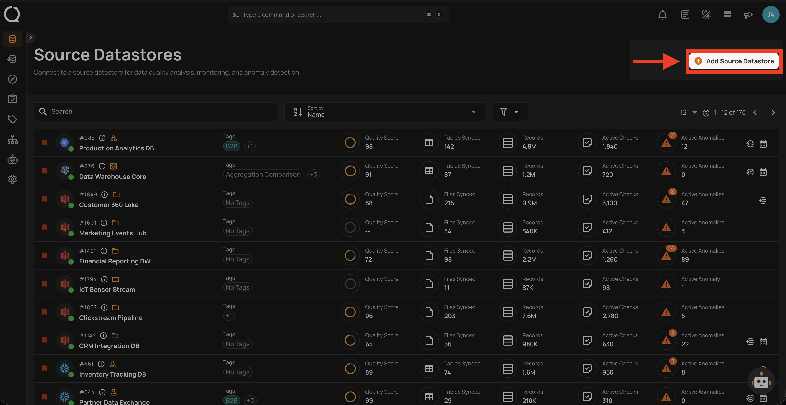
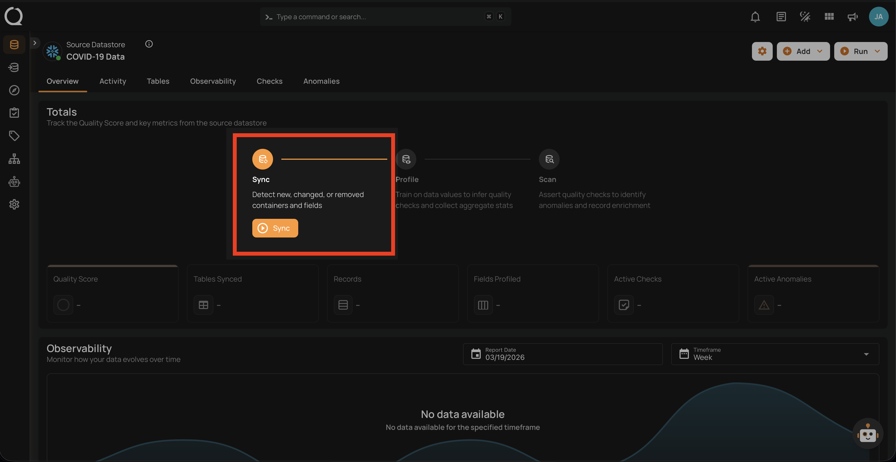

# JDBC Datastore Overview

JDBC Datastore in Qualytics allows you to easily integrate and manage data from relational databases. Using the Java Database Connectivity (JDBC) API, you can securely connect to databases, analyze data, and perform data profiling. Qualytics provides verified connectors for the databases listed below. Because the platform is built on Apache Spark, additional JDBC-accessible databases may be technically compatible — contact us to evaluate feasibility for your specific datastore.

## Adding JDBC Datastore

Log in to your Qualytics account and click on the **Add Source Datastore** button located at the top-right corner of the interface.

For detailed steps on adding a JDBC Datastore, refer to the [**Add the Source Datastore**](../add-datastores/athena.md#add-the-source-datastore) section of the documentation.

## Supported JDBC Databases

Qualytics provides verified connectors for the following relational databases:

* [Athena](../add-datastores/athena.md)  
* [Databricks](../add-datastores/databricks.md)
* [DB2](../add-datastores/db2.md)
* [Fabric Analytics](../add-datastores/fabric-analytics.md)
* [Hive](../add-datastores/hive.md)  
* [MariaDB](../add-datastores/maria-db.md)  
* [Microsoft SQL Server](../add-datastores/microsoft-sql-server.md)  
* [MySQL](../add-datastores/mysql.md)  
* [Oracle](../add-datastores/oracle.md)  
* [PostgreSQL](../add-datastores/postgresql.md)  
* [Presto](../add-datastores/presto.md)  
* [Amazon Redshift](../add-datastores/redshift.md)  
* [Snowflake](../add-datastores/snowflake.md)  
* [Synapse](../add-datastores/synapse.md)  
* [Timescale DB](../add-datastores/timescale-db.md)  
* [Trino](../add-datastores/trino.md)

## Connection Details

To connect to a JDBC datastore, users must provide the required connection details, such as Host/Port or URI. These fields may vary depending on the datastore and are essential for establishing a secure and reliable connection to the target database.

For more information about connections, refer to the [**Connection Overview**](../connections/overview-of-a-connection.md) documentation.

## Sync Operation

After adding a JDBC Datastore, you can initiate a **Sync operation** to extract key metadata from the database. This operation provides:

* A list of containers (schemas, tables, or views).
* Field names within each container.
* Record counts for data analysis and profiling.

For more information about how to run a sync operation, refer to the [**Sync Operation**](../source-datastore/sync.md) documentation.

## Field Types Inference

Qualytics employs weighted histogram analysis during the Sync operation to infer field types automatically. This advanced method ensures accurate detection of data types within the JDBC Datastore, enhancing the precision of data profiling.

## Containers Overview  

Containers are fundamental entities representing structured data sets. These containers could manifest as tables in JDBC datastores or as files within DFS datastores. They play a pivotal role in data organization, profiling, and quality checks within the Qualytics application. For a more detailed understanding of how Qualytics manages and interacts with containers in JDBC Datastores, please refer to the [**Containers overview**](../container/overview.md) documentation.