# Snowflake

Adding and configuring a Snowflake connection within Qualytics empowers the platform to build a symbolic link with your schema to perform operations like data discovery, visualization, reporting, cataloging, profiling, scanning, anomaly surveillance, and more.

This documentation provides a step-by-step guide on how to add Snowflake as both a source and enrichment datastore in Qualytics. It covers the entire process, from initial connection setup to testing and finalizing the configuration.

By following these instructions, enterprises can ensure their Snowflake environment is properly connected with Qualytics, unlocking the platform's potential to help you proactively manage your full data quality lifecycle.

Let’s get started 🚀

## Snowflake Setup Guide

The Snowflake Setup Guide provides step-by-step instructions for configuring warehouses and roles, ensuring efficient data management and access control. It explains how to create a warehouse with minimal requirements and the setup of a default warehouse for a user. It also explains how to create custom read-only and read-write roles and grant the necessary privileges for data access and modification. 

This guide is designed to help you optimize your Snowflake environment for performance and security, whether setting it up for the first time or refining your configuration.

### Warehouse & Role Configuration

This section provides instructions for configuring Snowflake warehouses and roles. It includes creating a warehouse with minimal requirements, assigning a default warehouse for a user, creating custom read-only and read-write roles, and granting privileges to these roles for data access and modification.

#### Create a Warehouse

Use the following command to create a warehouse with minimal requirements:

```sql
CREATE WAREHOUSE qualytics_wh
WITH
    WAREHOUSE_SIZE = 'XSMALL'
    AUTO_SUSPEND = 60
    AUTO_RESUME = TRUE;
```

Set a specific warehouse as the default for a user:

```sql
ALTER USER <username> SET DEFAULT_WAREHOUSE = qualytics_wh;
```

#### Source Datastore Privileges and Permissions

Create a new role called ```qualytics_read_role``` and grant it privileges:

```sql
CREATE ROLE qualytics_read_role;
GRANT USAGE ON WAREHOUSE qualytics_wh TO ROLE qualytics_read_role;
GRANT USAGE ON DATABASE <database_name> TO ROLE qualytics_read_role;
GRANT USAGE ON SCHEMA <database_name>.<schema_name> TO ROLE qualytics_read_role;
GRANT SELECT ON TABLE <database_name>.<schema_name>.<table_name> TO ROLE qualytics_read_role;
GRANT SELECT ON ALL TABLES IN SCHEMA <database_name>.<schema_name> TO ROLE qualytics_read_role;
GRANT SELECT ON ALL VIEWS IN SCHEMA <database_name>.<schema_name> TO ROLE qualytics_read_role;
GRANT SELECT ON FUTURE TABLES IN SCHEMA <database_name>.<schema_name> TO ROLE qualytics_read_role;
GRANT SELECT ON FUTURE VIEWS IN SCHEMA <database_name>.<schema_name> TO ROLE qualytics_read_role;
GRANT ROLE qualytics_read_role TO USER <user_name>;
```

#### Enrichment Datastore Privileges and Permissions

Create a new role called ```qualytics_readwrite_role``` and grant it privileges:

```sql
CREATE ROLE qualytics_readwrite_role;
GRANT USAGE ON WAREHOUSE qualytics_wh TO ROLE qualytics_readwrite_role;
GRANT USAGE, MODIFY ON DATABASE <database_name> TO ROLE qualytics_readwrite_role;
GRANT USAGE, MODIFY ON SCHEMA <database_name>.<qualytics_schema> TO ROLE qualytics_readwrite_role;
GRANT CREATE TABLE ON SCHEMA <database_name>.<qualytics_schema> TO ROLE qualytics_readwrite_role;
GRANT SELECT ON FUTURE VIEWS IN SCHEMA <database_name>.<qualytics_schema> TO ROLE qualytics_readwrite_role;
GRANT SELECT ON FUTURE TABLES IN SCHEMA <database_name>.<qualytics_schema> TO ROLE qualytics_readwrite_role;
GRANT SELECT ON ALL TABLES IN SCHEMA <database_name>.<qualytics_schema> TO ROLE qualytics_readwrite_role;
GRANT SELECT ON ALL VIEWS IN SCHEMA <database_name>.<qualytics_schema> TO ROLE qualytics_readwrite_role;
GRANT ROLE qualytics_readwrite_role TO USER <user_name>;
```

## Authentication Changes in Snowflake

Snowflake has announced a migration plan to phase out **Basic authentication** (username and password) for service accounts in favor of **Key-Pair authentication**. While basic authentication is still supported, organizations should begin planning their migration to ensure uninterrupted service.

### User Type Classification

Snowflake differentiates between user types based on their intended purpose:

| User Type | Purpose | Current Authentication Support |
|-----------|---------|-------------------------------|
| **Human users** (`TYPE=PERSON`) | Interactive users accessing Snowflake | Basic authentication supported |
| **Service users** (`TYPE=SERVICE`) | Applications and services (like Qualytics) | Key-Pair authentication recommended |
| **Legacy service** (`TYPE=LEGACY_SERVICE`) | Temporary transition type | Basic authentication (being phased out) |

### Migration Timeline

Snowflake's migration plan includes:

1. **Current Phase**: Basic authentication still supported for service accounts
2. **Transition Phase**: `LEGACY_SERVICE` user type available for organizations needing additional migration time
3. **Future Phase**: Basic authentication will be fully deprecated for service users

### Recommended Actions

To prepare for this transition:

- **New connections**: Use Key-Pair authentication when creating new Snowflake datastores
- **Existing connections**: Plan migration from Basic to Key-Pair authentication
- **Service accounts**: Ensure proper user type classification (`TYPE=SERVICE`)

### Additional Resources

For detailed information on the migration plan and implementation:

- [Snowflake Security MFA Rollout (User Types & Deprecation)](https://docs.snowflake.com/en/user-guide/security-mfa-rollout){:target="_blank"}
- [Snowflake Key-Pair Authentication Guide](https://docs.snowflake.com/en/user-guide/key-pair-auth){:target="_blank"}

!!! info "Migration Recommendation"
    While Basic authentication is currently supported, migrating to Key-Pair authentication ensures your Snowflake connections remain secure and future-proof as Snowflake implements their deprecation timeline.

## Add a Source Datastore

A source datastore is a storage location used to connect to and access data from external sources. Snowflake is an example of a source datastore, specifically a type of JDBC datastore that supports connectivity through the JDBC API. Configuring the JDBC datastore enables the Qualytics platform to access and perform operations on the data, thereby generating valuable insights.

**Step 1**: Log in to your Qualytics account and click on the **Add Source Datastore** button located at the top-right corner of the interface.

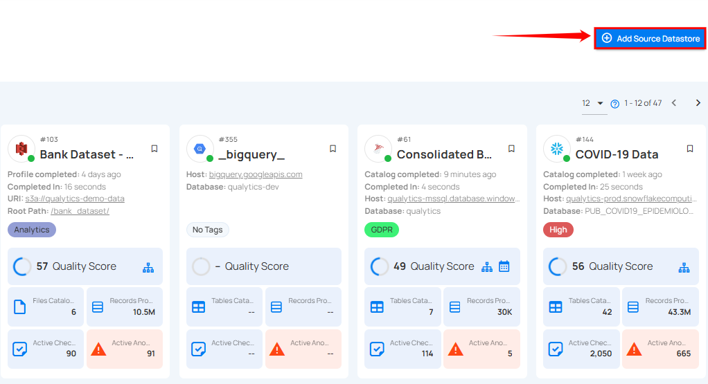

**Step 2**: A modal window - **Add Datastore** will appear, providing you with the options to connect a datastore.

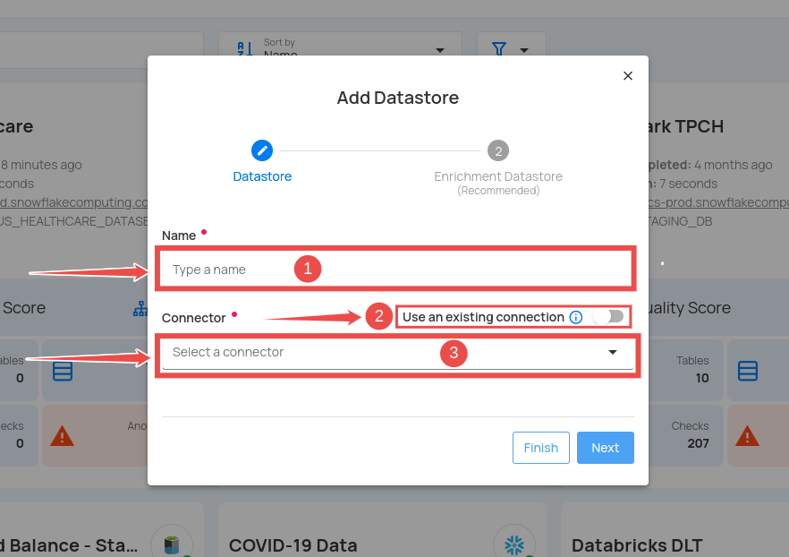

| REF. | FIELDS         | ACTIONS       |
|------|----------------|---------------|
| 1.  | Name (Required) | Specify the name of the datastore. (e.g., The specified name will appear on the datastore cards.) |
| 2.  | Toggle Button | Toggle ON to  create a new source datastore from scratch, or toggle OFF to reuse credentials from an existing connection. |
| 3.  | Connector (Required) | Select **Snowflake** from the dropdown list. |

### Option I: Create a Source Datastore with a New Connection

If the toggle for **Add New connection** is turned on, then this will prompt you to add and configure the source datastore from scratch without using existing connection details.

**Step 1**: Select the **Snowflake** connector from the dropdown list and add the connection details.


**Secrets Management**: This is an optional connection property that allows you to securely store and manage credentials by integrating with HashiCorp Vault and other secret management systems. Toggle it **ON** to enable Vault integration for managing secrets.

!!! note 
    After configuring **HashiCorp Vault** integration, you can use ${key} in any Connection property to reference a key from the configured Vault secret. Each time the Connection is initiated, the corresponding secret value will be retrieved dynamically.

| REF | FIELDS               | ACTIONS                                                                 |
|-----|----------------------|-------------------------------------------------------------------------|
| 1.  | Login URL            | Enter the URL used to authenticate with HashiCorp Vault.                |
| 2.  | Credentials Payload  | Input a valid JSON containing credentials for Vault authentication.     |
| 3.  | Token JSONPath       | Specify the JSONPath to retrieve the client authentication token from the response (e.g., $.auth.client_token). |
| 4.  | Secret URL           | Enter the URL where the secret is stored in Vault.                      |
| 5.  | Token Header Name    | Set the header name used for the authentication token (e.g., X-Vault-Token). |
| 6.  | Data JSONPath        | Specify the JSONPath to retrieve the secret data (e.g., $.data).        |

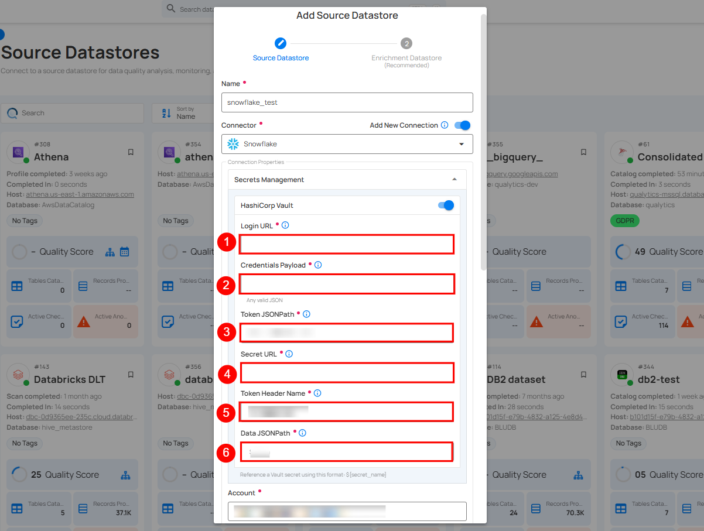

**Step 2**: The configuration form will expand, requesting credential details before establishing the connection.

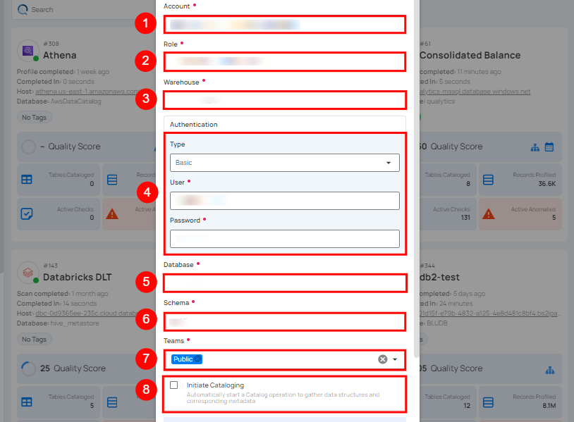

|  REF.  |  FIELDS | ACTIONS |
| ------ | ------- | ------- |
| 1. | [Account](https://docs.snowflake.com/en/user-guide/admin-account-identifier){:target="_blank"} (Required) | Define the account identifier to be used for accessing the Snowflake. 
| 2. | [Role](https://docs.snowflake.com/en/user-guide/security-access-control-overview#roles){:target="_blank"} (Required) | Specify the user role that grants appropriate access and permissions. |
| 3. | [Warehouse](https://docs.snowflake.com/en/user-guide/warehouses-overview#overview-of-warehouses){:target="_blank"} (Required)| Provide the warehouse name that will be used for computing resources. |
| 4 | Authentication | You can choose between Basic authentication or Keypair authentication for validating and securing the connection to your Snowflake instance. <br> <br> **Basic Authentication:** This method uses a username and password combination for authentication. It is a straightforward method where the user's credentials are directly used to access Snowflake. <ul><li>**Type:** Select the authentication type from the dropdown menu.</li><li>**User:** Enter the username that Qualytics will use to connect to Snowflake.</li><li>**Password:** Enter the password associated with the specified user account.</li></ul> **Keypair Authentication:** This method uses a combination of a private key and a corresponding public key for authentication. This is a more secure method compared to basic authentication, as it involves asymmetric cryptography. <ul> <li>**Type:** Select "Keypair" from the dropdown menu.</li><li>**User:** Enter the username that Qualytics will use to connect to Snowflake.</li> <li>**Private Key:** Upload the private key file that will be used for authentication. This key is part of a public-private key pair used to securely authenticate the user.</li> <li>**Private Key Password (Optional):** Enter the password associated with the private key, if any. </li> </ul>|
| 5. | [Database](https://docs.snowflake.com/en/sql-reference/ddl-database#database-schema-share-ddl){:target="_blank"} (Required) | Specify the database name to be accessed. |
| 6. | [Schema](https://docs.snowflake.com/en/sql-reference/ddl-database#database-schema-share-ddl){:target="_blank"} (Required) | Define the schema within the database that should be used. |
| 7. | Teams (Required) | Select one or more teams from the dropdown to associate with this source datastore. |
| 8. | Initiate Cataloging (Optional) | Tick the checkbox to automatically perform catalog operation on the configured source datastore to gather data structures and corresponding metadata. |

**Step 3**: After adding the source datastore details, click on the **Test Connection** button to check and verify its connection.

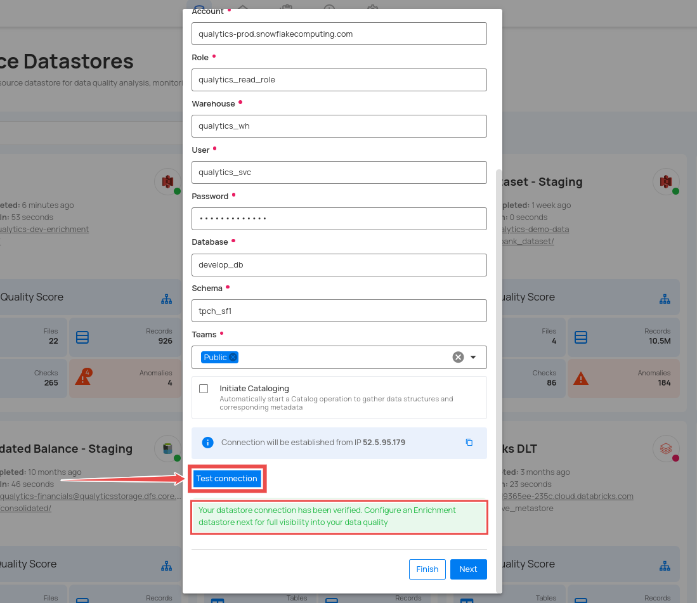

### Option II: Use an Existing Connection

If the toggle for **Add New connection** is turned off, then this will prompt you to configure the source datastore using the existing connection details.

**Step 1**: Select a **connection** to reuse existing credentials.

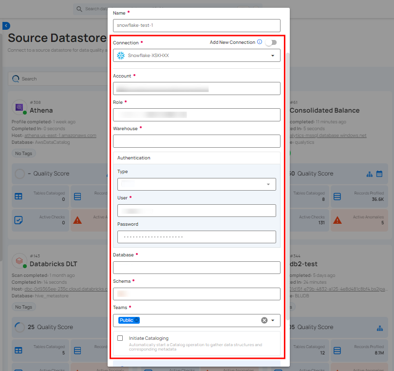

!!! note
    If you are using existing credentials, you can only edit the details such as Database, Schema, Teams and Initiate Cataloging.

**Step 2**: Click on the **Test Connection**  button to check and verify the source data connection. If connection details are verified, a success message will be displayed.

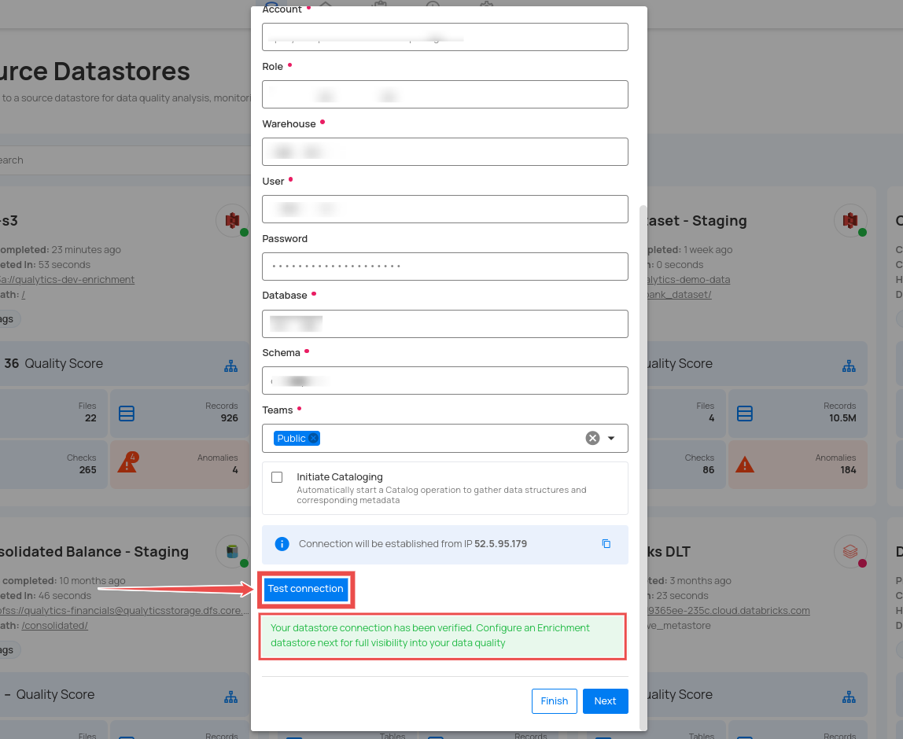

!!! note
    Clicking on the **Finish** button will create the source datastore and bypass the **enrichment datastore** configuration step.

!!! info
    It is recommended to click on the **Next** button, which will take you to the **enrichment datastore** configuration page.

## Add Enrichment Datastore Connection

Once you have successfully tested and verified your source datastore connection, you have the option to add the enrichment datastore **(recommended)**. The enrichment datastore is used to store the analyzed results, including any anomalies and additional metadata in tables. This setup provides full visibility into your data quality, helping you manage and improve it effectively.

**Step 1**: Whether you have added a source datastore by creating a new datastore connection or using an existing connection, click on the **Next** button to start adding the **Enrichment Datastore**.

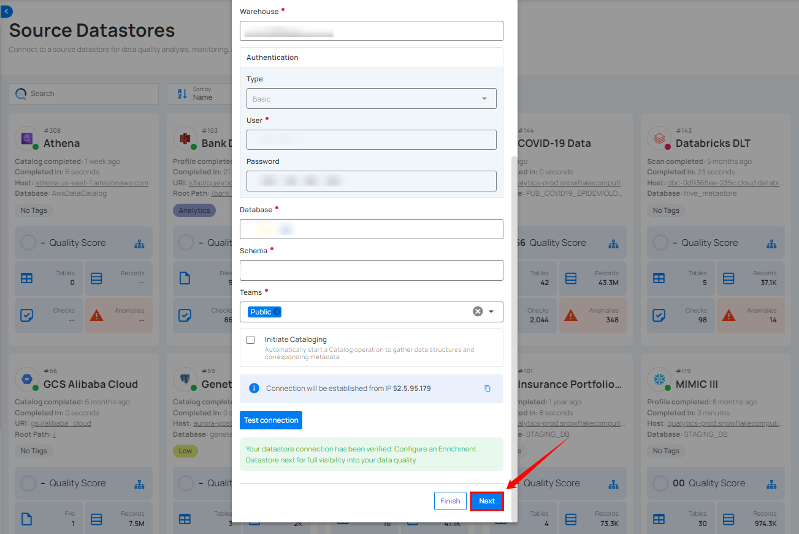

**Step 2**: A modal window - **Link Enrichment Datastore** will appear, providing you with the options to configure an **enrichment datastore**.

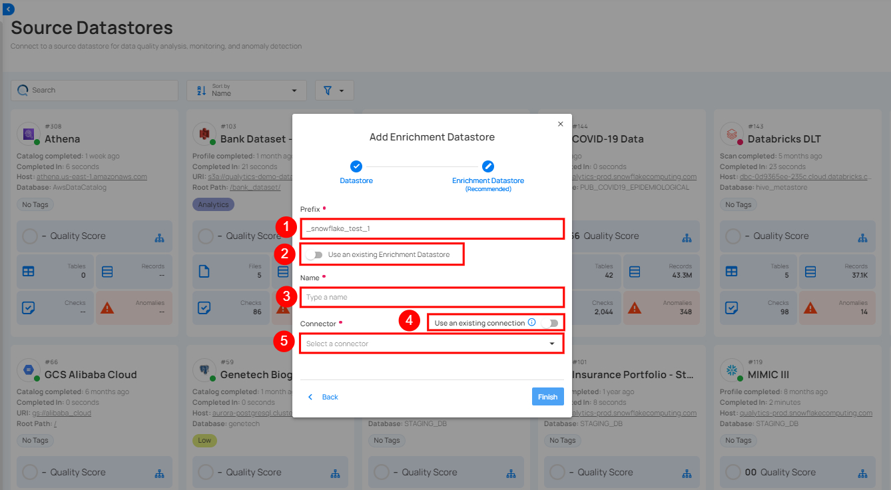

| REF. | FIELDS  | ACTIONS                                                                                                           |
|------|-----------------------|------------------------------------------------------------------------------------------------------------------|
| 1 | Prefix (Required) | Add a prefix name to uniquely identify tables/files when Qualytics writes metadata from the source datastore to your enrichment datastore. |
| 2 | Caret Down Button | Click the caret down to select either **Use Enrichment Datastore** or **Add Enrichment Datastore**.               |
| 3 | Enrichment Datastore | Select an enrichment datastore from the dropdown list.    |

### Option I: Create an Enrichment Datastore with a new Connection

If the toggle for **Add new connection** is turned on, then this will prompt you to add and configure the enrichment datastore from scratch without using an existing enrichment datastore and its connection details.

**Step 1**: Click on the caret button and select Add Enrichment Datastore.

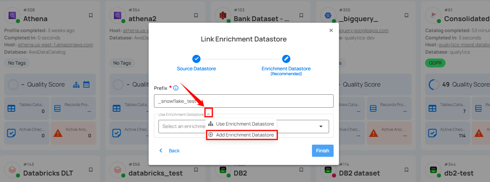

A modal window - **Link Enrichment Datastore** will appear. Enter the following details to create an enrichment datastore with a new connection.

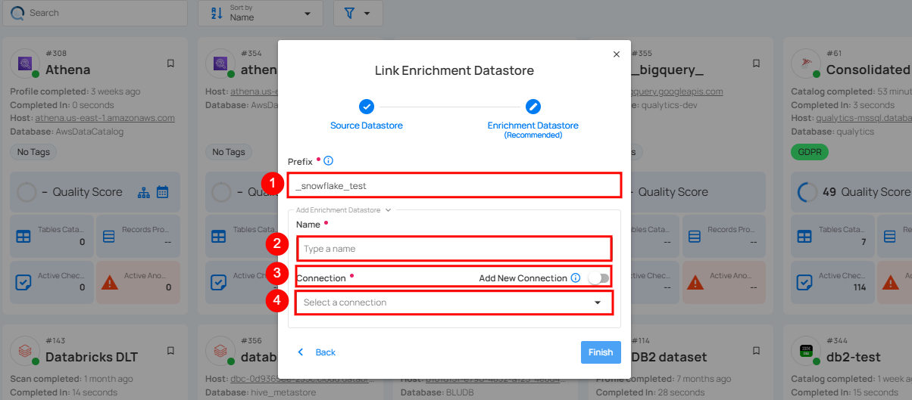

| REF.              | FIELDS       | ACTIONS                                    |
|-------------------|--------------|--------------------------------------------|
| 1.                | Prefix       | Add a prefix name to uniquely identify tables/files when Qualytics writes metadata from the source datastore to your enrichment datastore. |
| 2.                | Name   | Give a name for the enrichment datastore.|
| 3.                |Toggle Button for add new connection | Toggle ON to create a new enrichment from scratch or toggle OFF to reuse credentials from an existing connection. |
| 4.                |Connector | Select a datastore connector from the dropdown list.|

**Step 2**: Add connection details for your selected **enrichment datastore** connector.

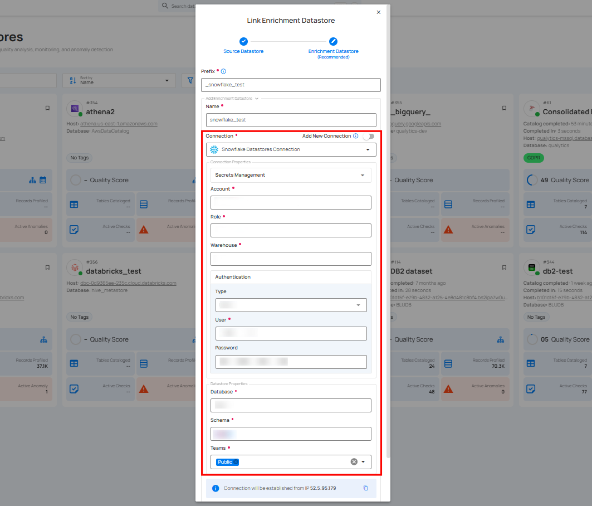

**Secrets Management**: This is an optional connection property that allows you to securely store and manage credentials by integrating with HashiCorp Vault and other secret management systems. Toggle it **ON** to enable Vault integration for managing secrets.

!!! note
    Once **HashiCorp Vault** is set up, use the ${key} format in the Connection form to reference a Vault secret.

| REF | FIELDS               | ACTIONS                                                                 |
|-----|----------------------|-------------------------------------------------------------------------|
| 1.  | Login URL            | Enter the URL used to authenticate with HashiCorp Vault.                |
| 2.  | Credentials Payload  | Input a valid JSON containing credentials for Vault authentication.     |
| 3.  | Token JSONPath       | Specify the JSONPath to retrieve the client authentication token from the response (e.g., $.auth.client_token). |
| 4.  | Secret URL           | Enter the URL where the secret is stored in Vault.                      |
| 5.  | Token Header Name    | Set the header name used for the authentication token (e.g., X-Vault-Token). |
| 6.  | Data JSONPath        | Specify the JSONPath to retrieve the secret data (e.g., $.data).        |

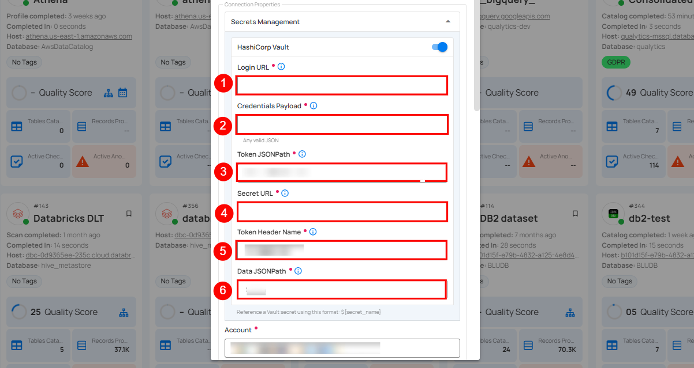

**Step 3:** The configuration form, requesting credential details after selecting the **enrichment datastore** connector.

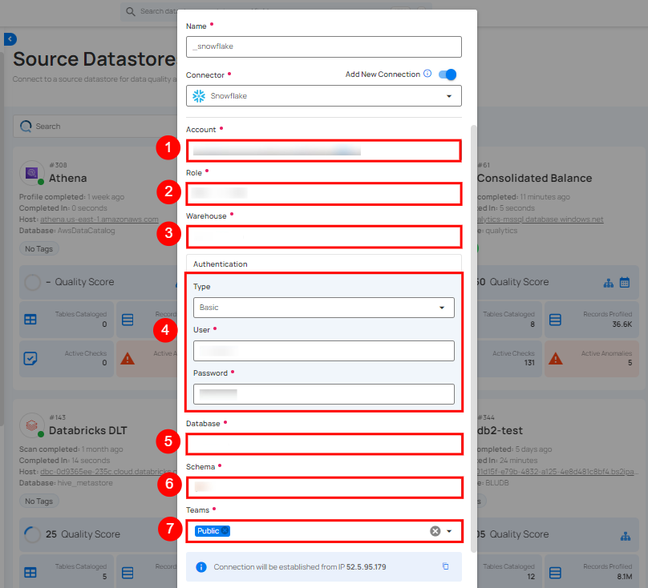

|  REF.  |  FIELDS | ACTIONS |
| ------ | ------- | ------ |
| 1. | [Account](https://docs.snowflake.com/en/user-guide/admin-account-identifier){:target="_blank"} (Required) | Define the account identifier to be used for accessing the Snowflake. 
| 2. | [Role](https://docs.snowflake.com/en/user-guide/security-access-control-overview#roles){:target="_blank"} (Required) | Specify the user role that grants appropriate access and permissions. |
| 3. | [Warehouse](https://docs.snowflake.com/en/user-guide/warehouses-overview#overview-of-warehouses){:target="_blank"} (Required)| Provide the warehouse name that will be used for computing resources. |
| 4. | Authentication | You can choose between Basic authentication or Keypair authentication for validating and securing the connection to your Snowflake instance. <br> <br> **Basic Authentication:** This method uses a username and password combination for authentication. It is a straightforward method where the user's credentials are directly used to access Snowflake. <ul><li>**Type:** Select the authentication type from the dropdown menu.</li><li>**User:** Enter the username that Qualytics will use to connect to Snowflake.</li><li>**Password:** Enter the password associated with the specified user account.</li></ul> **Keypair Authentication:** This method uses a combination of a private key and a corresponding public key for authentication. This is a more secure method compared to basic authentication, as it involves asymmetric cryptography. <ul> <li>**Type:** Select "Keypair" from the dropdown menu.</li><li>**User:** Enter the username that Qualytics will use to connect to Snowflake.</li> <li>**Private Key:** Upload the private key file that will be used for authentication. This key is part of a public-private key pair used to securely authenticate the user.</li> <li>**Private Key Password (Optional):** Enter the password associated with the private key, if any. </li> </ul>|
| 5. | [Database](https://docs.snowflake.com/en/sql-reference/ddl-database#database-schema-share-ddl){:target="_blank"} (Required) | Specify the database name to be accessed. |
| 6. | [Schema](https://docs.snowflake.com/en/sql-reference/ddl-database#database-schema-share-ddl){:target="_blank"} (Required) | Define the schema within the database that should be used. |
| 7. | Teams (Required) | Select one or more teams from the dropdown to associate with this source datastore. |

**Step 4**: Click on the **Test Connection** button to verify the enrichment datastore connection. If the connection is verified, a flash message will indicate that the connection with the enrichment datastore has been successfully verified.

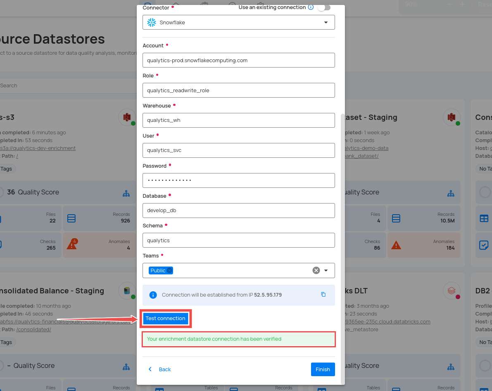

**Step 5**: Click on the **Finish** button to complete the configuration process.

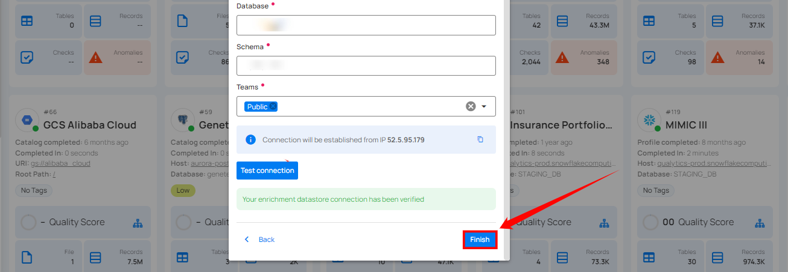

When the configuration process is finished, a modal will display a success message indicating that your datastore has been successfully added.

**Step 6**: Close the Success dialog and the page will automatically redirect you to the **Source Datastore Details** page where you can perform data operations on your configured **source datastore**.

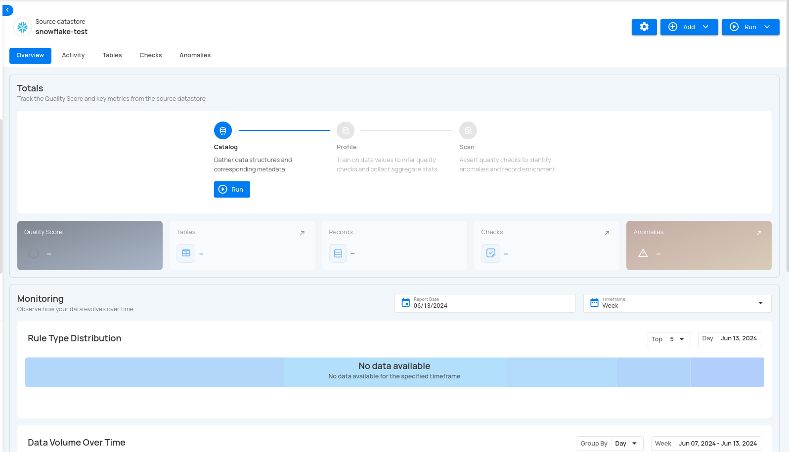

### Option II: Use an Existing Datastore

If the **Use enrichment datastore** option is selected from the caret button, you will be prompted to configure the datastore using existing connection details.

**Step 1**: Click on the caret button and select **Use Enrichment Datastore**.

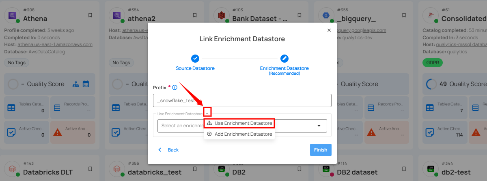

**Step 2**:  A modal window - **Link Enrichment Datastore** will appear. Add a prefix name and select an existing enrichment datastore from the dropdown list.

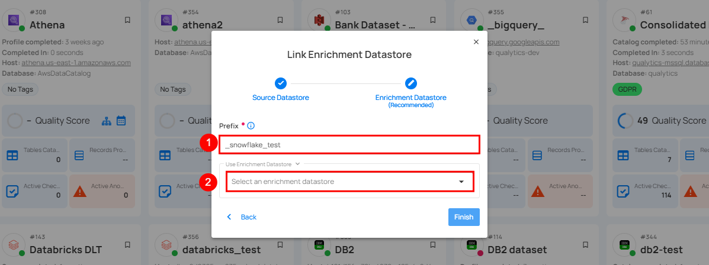

| REF. | FIELDS | ACTIONS |
|------|--------|---------|
| 1.  | Prefix (Required) | Add a prefix name to uniquely identify tables/files for metadata. |
| 2.  | Enrichment Datastore | Select an enrichment datastore from the dropdown list. |

**Step 3**: After selecting an existing **enrichment datastore** connection, you will view the following details related to the selected enrichment:

-  **Teams**: The team associated with managing the enrichment datastore. Example - All users are assigned to the **Public** team, which means that this enrichment datastore is accessible to all users.

-   **Host**: This is the host domain of the Snowflake instance.

-   **Database**: Refers to the specific database within the Snowflake environment. This database is a logical grouping of schemas. Each database belongs to a single Snowflake account.

-   **Schema**: The schema used in the enrichment datastore. The schema is a logical grouping of database objects (tables, views, etc.). Each schema belongs to a single database.

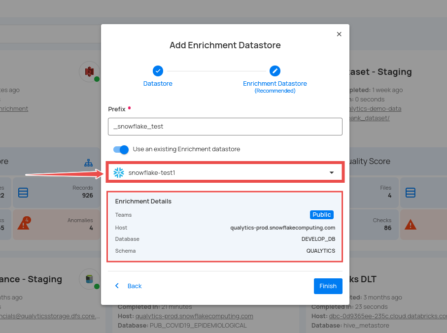

**Step 4**: Click on the **Finish** button to complete the configuration process for the existing **enrichment datastore**.

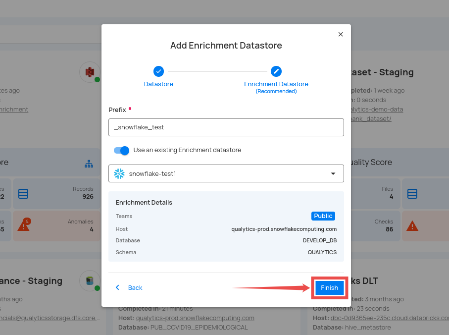

When the configuration process is finished, a modal will display a success message indicating that your data has been successfully added.

Close the success message and you will be automatically redirected to the **Source Datastore Details** page where you can perform data operations on your configured **source datastore**.


## API Payload Examples

This section provides detailed examples of API payloads to guide you through the process of creating and managing datastores using Qualytics API. Each example includes endpoint details, sample payloads, and instructions on how to replace placeholder values with actual data relevant to your setup.

### Creating a Source Datastore

This section provides sample payloads for creating a Snowflake datastore. Replace the placeholder values with actual data relevant to your setup.

**Endpoint:** ```/api/datastores (post)```

=== "Create a Source Datastore with a new Connection"
    ```json
    {
        "name": "your_datastore_name",
        "teams": ["Public"],
        "database": "snowflake_database",
        "schema": "snowflake_schema",
        "enrich_only": false,
        "trigger_catalog": true,
        "connection": {
            "name": "your_connection_name",
            "type": "snowflake",
            "host": "snowflake_host",
            "username": "snowflake_username",
            "password": "snowflake_password",
            "passphrase": "key_passphrase",
            "parameters": {
                "role": "snowflake_read_role",
                "warehouse": "qualytics_wh",
                "authentication_type": "KEYPAIR"
            }
        }
    }
    ```
    !!! note
        If the `authentication_type` parameter is removed, `BASIC` authentication will be used by default.
        
=== "Create a Source Datastore with an existing Connection"
    ```json
    {
        "name": "your_datastore_name",
        "teams": ["Public"],
        "database": "snowflake_database",
        "schema": "snowflake_schema",
        "enrich_only": false,
        "trigger_catalog": true,
        "connection_id": connection-id
    }
    ```
### Creating an Enrichment Datastore

This section provides sample payloads for creating an enrichment datastore. Replace the placeholder values with actual data relevant to your setup.

**Endpoint:** ```/api/datastores (post)```

=== "Create an Enrichment Datastore with a new Connection"
    ```json
    {
        "name": "your_datastore_name",
        "teams": ["Public"],
        "database": "snowflake_database",
        "schema": "snowflake_schema",
        "enrich_only": true,
        "connection": {
            "name": "your_connection_name",
            "type": "snowflake",
            "host": "snowflake_host",
            "username": "snowflake_username",
            "password": "snowflake_password",
            "parameters": {
                "role": "snowflake_readwrite_role",
                "warehouse": "qualytics_wh"
            }
        }
    }
    ```
=== "Create an Enrichment Datastore with an existing Connection"
    ```json
    {
        "name": "your_datastore_name",
        "teams": ["Public"],
        "database": "snowflake_database",
        "schema": "snowflake_schema",
        "enrich_only": true,
        "connection_id": connection-id
    }
    ```

### Link an Enrichment Datastore to a Source Datastore
Use the provided endpoint to link an enrichment datastore to a source datastore:

**Endpoint Details:** ```/api/datastores/{datastore-id}/enrichment/{enrichment-id} (patch)```
