# Teradata

Adding and configuring a Teradata connection within Qualytics empowers the platform to build a symbolic link with your schema to perform operations like data discovery, visualization, reporting, cataloging, profiling, scanning, anomaly surveillance, and more.  

This documentation provides a step-by-step guide on adding Teradata as a source datastore in Qualytics. It covers the entire process from initial connection setup to testing and finalizing the configuration.

By following these instructions, enterprises can ensure their Teradata environment is properly connected with Qualytics, unlocking the platform's potential to help you proactively manage your full data quality lifecycle.

Let’s get started 🚀

## Add the Source Datastore

A source datastore is a storage location used to connect to and access data from external sources. Teradata is an example of such a datastore, specifically a type of JDBC datastore that supports connectivity through the JDBC API. Configuring the Teradata datastore allows the Qualytics platform to access and perform operations on the data, thereby generating valuable insights.

**Step 1**: Log in to your Qualytics account and click on the **Add Source Datastore** button located at the top-right corner of the interface.

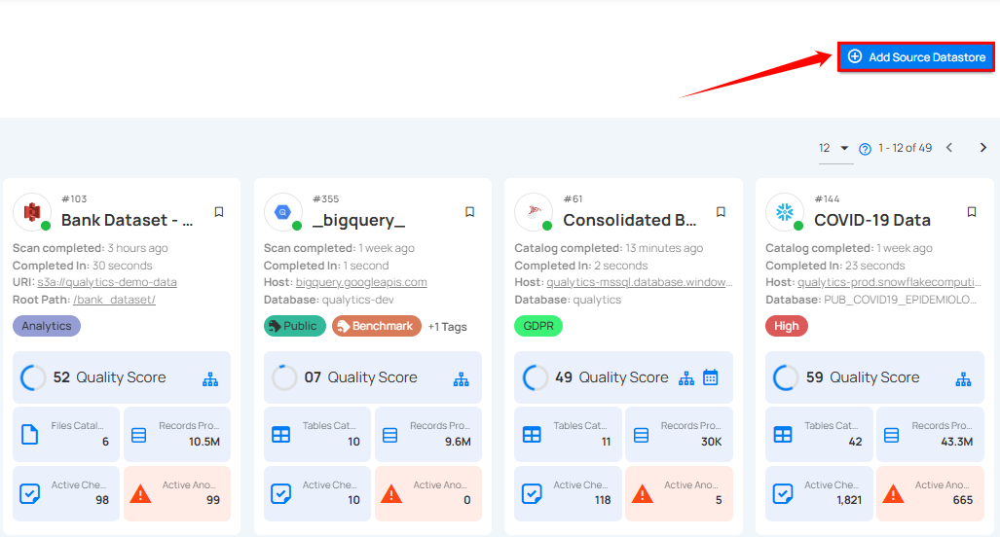

**Step 2**: A modal window- **Add Datastore** will appear, providing you with the options to connect a datastore.


| REF.              | FIELDS       | ACTIONS                                    |
|-------------------|--------------|--------------------------------------------|
| 1.                | Name         | Specify the name of the datastore (e.g., the specified name will appear on the datastore cards) |
| 2.                | Toggle Button    | Toggle **ON** to create a new source datastore from scratch, or toggle **OFF** to reuse credentials from an existing connection |
| 3.                | Connector        | Select **Teradata** from the dropdown list. |

### Option I: Create a Datastore with a new Connection

If the toggle for **Add New connection** is turned on, then this will prompt you to add and configure the source datastore from scratch without using existing connection details.

**Step 1**: Select the **Teradata** connector from the dropdown list and add connection details such as Secret Management, host, port, username, etc.

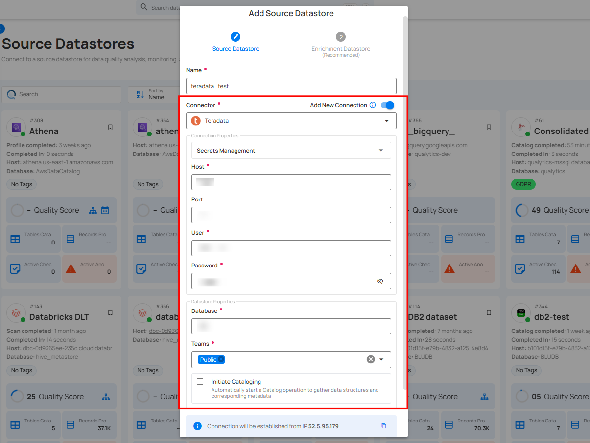

**Secrets Management**: This is an optional connection property that allows you to securely store and manage credentials by integrating with HashiCorp Vault and other secret management systems. Toggle it **ON** to enable Vault integration for managing secrets.

!!! note
    After configuring **HashiCorp Vault** integration, you can use ${key} in any Connection property to reference a key from the configured Vault secret. Each time the Connection is initiated, the corresponding secret value will be retrieved dynamically.

| REF | FIELDS               | ACTIONS                                                                 |
|-----|----------------------|-------------------------------------------------------------------------|
| 1.  | Login URL            | Enter the URL used to authenticate with HashiCorp Vault.                |
| 2.  | Credentials Payload  | Input a valid JSON containing credentials for Vault authentication.     |
| 3.  | Token JSONPath       | Specify the JSONPath to retrieve the client authentication token from the response (e.g., $.auth.client_token). |
| 4.  | Secret URL           | Enter the URL where the secret is stored in Vault.                      |
| 5.  | Token Header Name    | Set the header name used for the authentication token (e.g., X-Vault-Token). |
| 6.  | Data JSONPath        | Specify the JSONPath to retrieve the secret data (e.g., $.data).        |

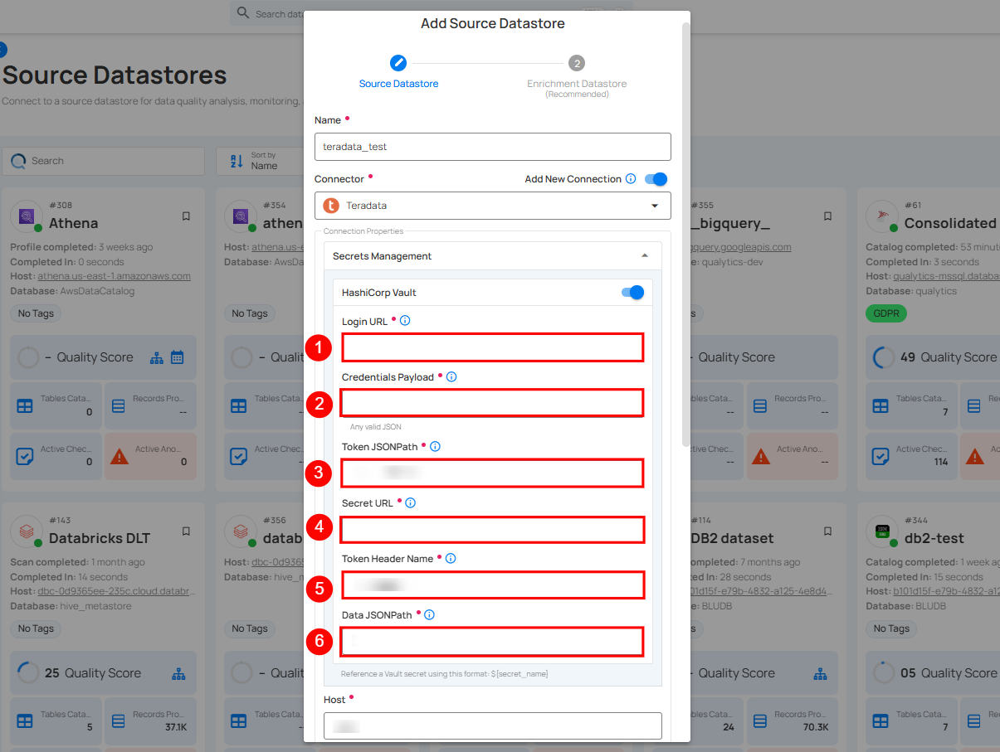

**Step 2**: The configuration form will expand, requesting credential details before establishing the connection.

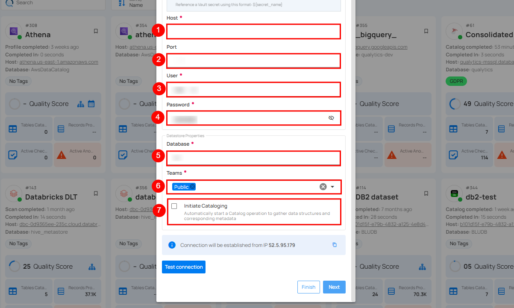

| REF.              | FIELDS                  | ACTIONS                                    |
|-------------------|-------------------------|--------------------------------------------|
| 1.                | Host                    | Get the **Hostname** from your Teradata account and add it to this field. |
| 2.                | Port                    | Specify the **Port** number. |
| 3.                | User                    | Enter the **User ID** to connect.|
| 4.                | Password                | Enter the **password** to connect to the database. |
| 5.                | Database                | Specify the database name. |
| 6.                | Teams                   | Select one or more teams from the dropdown to associate with this source datastore. |
| 7.                | Initial Cataloging      | Check the checkbox to automatically perform a catalog operation on the configured source datastore to gather data structures and corresponding metadata.|

**Step 3**: After adding the source datastore details, click on the **Test Connection** button to check and verify its connection.


If the credentials and provided details are verified, a success message will be displayed indicating that the connection has been verified.

### Option II: Use an Existing Connection

If the toggle for **Use an existing connection** is turned off, then this will prompt you to configure the source datastore using the existing connection details.

**Step 1**: Select a **connection** to reuse existing credentials.

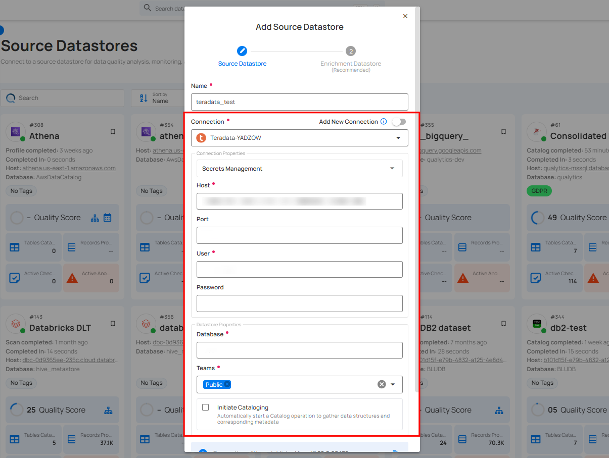

!!! note
    If you are using existing credentials, you can only edit details such as Database, Teams, and Initiate Cataloging.

**Step 2**: Click on the **Test Connection** button to check and verify the source data connection. If connection details are verified, a success message will be displayed.

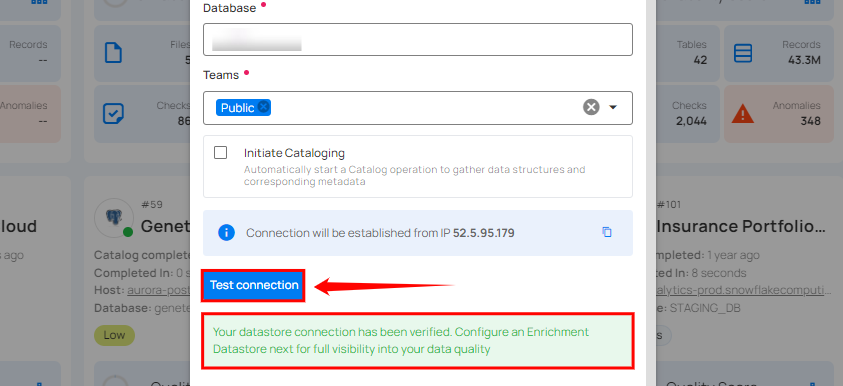

!!! note
    Clicking on the **Finish** button will create the source datastore and bypass the **enrichment datastore** configuration step.

!!! tip
    It is recommended to click on the **Next** button, which will take you to the **enrichment datastore** configuration page.

## Add Enrichment Datastore

After successfully testing and verifying your source datastore connection, you have the option to add an enrichment datastore (recommended). This datastore is used to store analyzed results, including any anomalies and additional metadata in tables. This setup provides comprehensive visibility into your data quality, enabling you to manage and improve it effectively.

!!! warning
    Qualytics does not support the Teradata connector as an enrichment datastore, but you can point to a different enrichment datastore.

**Step 1**: Whether you have added a source datastore by creating a new datastore connection or using an existing connection, click on the **Next** button to start adding the **Enrichment Datastore**.

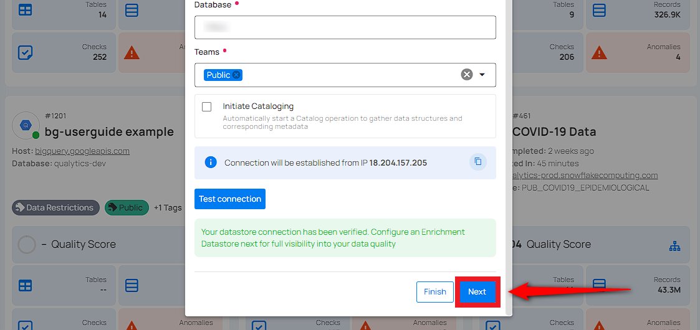

**Step 2**: A modal window- **Link Enrichment Datastore** will appear, providing you with the options to configure an **enrichment datastore**.

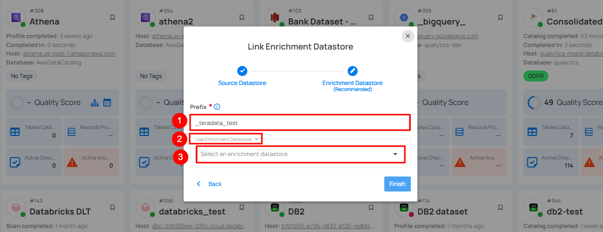

| REF. | FIELDS  | ACTIONS                                                                                                           |
|------|-----------------------|------------------------------------------------------------------------------------------------------------------|
| 1 | Prefix (Required) | Add a prefix name to uniquely identify tables/files when Qualytics writes metadata from the source datastore to your enrichment datastore. |
| 2 | Caret Down Button | Click the caret down to select either **Use Enrichment Datastore** or **Add Enrichment Datastore**.               |
| 3 | Enrichment Datastore | Select an enrichment datastore from the dropdown list.                                                           |

### Option I: Create an Enrichment Datastore with a new Connection

If the toggle **Add new connection** is turned on, then this will prompt you to add and configure the enrichment datastore from scratch without using an existing enrichment datastore and its connection details.

**Step 1**: Click on the caret button and select Add Enrichment Datastore.


A modal window **Link Enrichment Datastore** will appear. Enter the following details to create an enrichment datastore with a new connection.

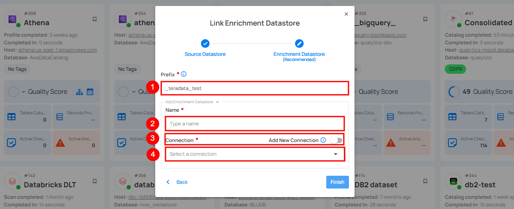

| REF.              | FIELDS       | ACTIONS                                    |
|-------------------|--------------|--------------------------------------------|
| 1.                | Prefix       | Add a prefix name to uniquely identify tables/files when Qualytics writes metadata from the source datastore to your enrichment datastore. |
| 2.                | Name   | Give a name for the enrichment datastore.|
| 3.                |Toggle Button for add new connection | Toggle ON to create a new enrichment from scratch or toggle OFF to reuse credentials from an existing connection. |
| 4.                |Connector | Select a datastore connector from the dropdown list.|

**Step 2**: Add connection details for your selected **enrichment datastore** connector.


!!! note
    Qualytics does not support Teradata as an enrichment datastore. Instead, you can select a different enrichment datastore for this purpose. For demonstration purposes, we are using BigQuery as the enrichment datastore. You can use any other JDBC or DFS datastore of your choice for the enrichment datastore configuration.

**Step 3**: Click on the **Test Connection** button to verify the selected enrichment datastore connection. If the connection is verified, a flash message will indicate that the connection with the datastore has been successfully verified.

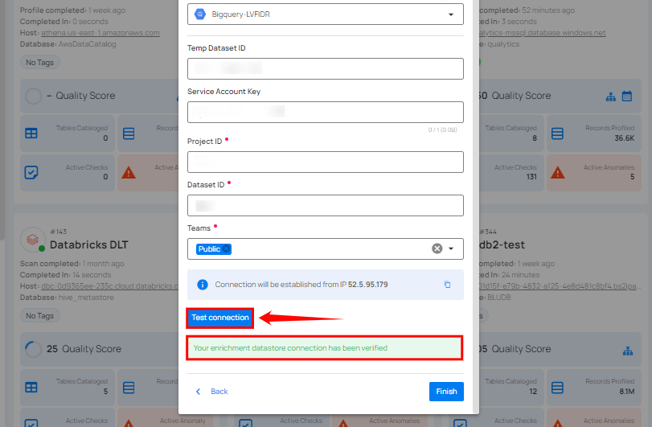

**Step 4**:  Click on the **Finish** button to complete the configuration process.

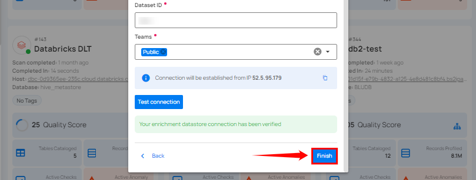

When the configuration process is finished, a modal will display a success message indicating that your datastore has been successfully added.

**Step 5**: Close the success dialog and the page will automatically redirect you to the **Source Datastore Details** page where you can perform data operations on your configured **source datastore**.


### Option II: Use an Existing Connection

If the **Use enrichment datastore** option is selected from the caret button, you will be prompted to configure the datastore using existing connection details.

**Step 1**: Click on the caret button and select **Use Enrichment Datastore**.

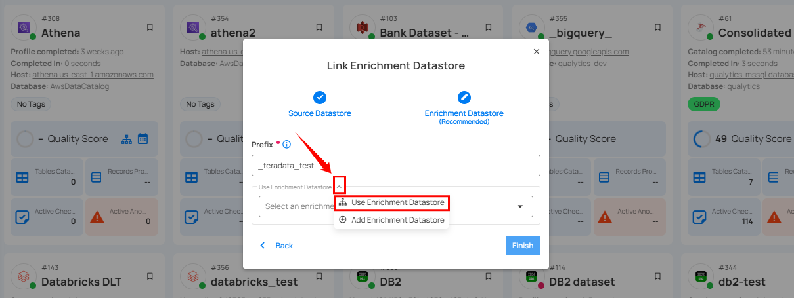

!!! note
    Qualytics does not support Teradata as an enrichment datastore. Instead, you can select a different enrichment datastore for this purpose. For demonstration purposes, we are using BigQuery as the enrichment datastore. You can use any other JDBC or DFS datastore of your choice for the enrichment datastore configuration.

**Step 2**: A modal window **Link Enrichment Datastore** will appear. Add a prefix name and select an existing enrichment datastore from the dropdown list.

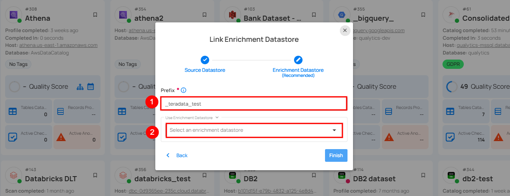

| REF.              | FIELDS       | ACTIONS                                    |
|-------------------|--------------|--------------------------------------------|
| 1.                | Prefix         | Add a prefix name to uniquely identify tables/files when Qualytics writes metadata from the source datastore to your enrichment datastore. |
| 2.                | Enrichment Datastore  | Select an enrichment datastore from the dropdown list. |

**Step 3**: After selecting an existing **enrichment datastore** connection, you will view the following details related to the selected enrichment:

- **Teams**: The team associated with managing the enrichment datastore is based on the role of public or private. For example, marked as **Public** means that this datastore is accessible to all the users.

- **Host**: This is the server address where the enrichment datastore instance is hosted. It is the endpoint used to connect to the enrichment datastore environment.

- **Database**: This refers to the specific database within the enrichment datastore environment where the data is stored.

- **Schema**: The schema used in the enrichment datastore. The schema is a logical grouping of database objects (tables, views, etc.). Each schema belongs to a single database.

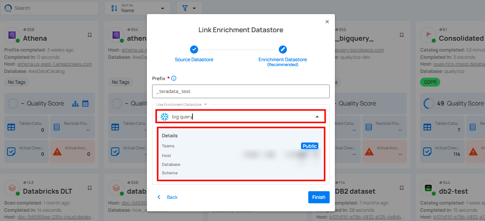

**Step 4**: Click on the **Finish** button to complete the configuration process for the existing **enrichment datastore**.

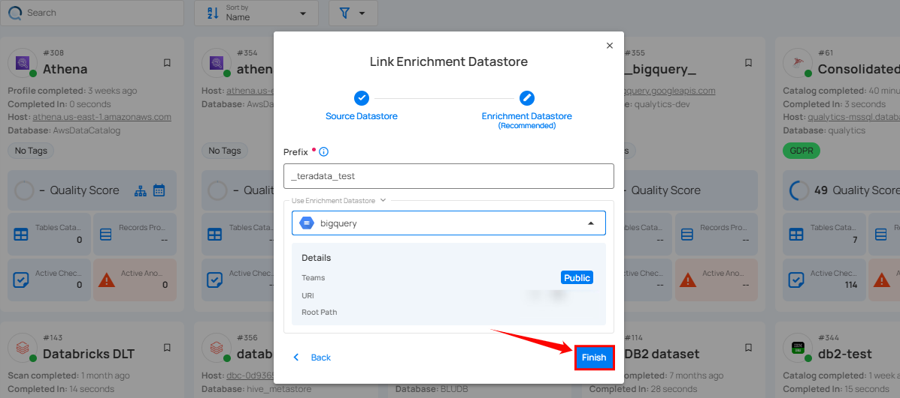

When the configuration process is finished, a modal will display a success message indicating that your datastore has been successfully added.

Close the success message and you will be automatically redirected to the **Source Datastore Details** page where you can perform data operations on your configured **source datastore**.

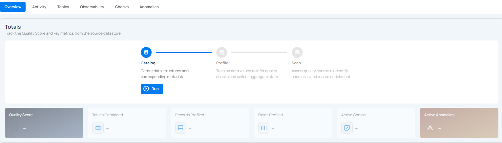

## API Payload Examples

### Creating a Source Datastore

This section provides a sample payload for creating a datastore. Replace the placeholder values with actual data relevant to your setup.

**Endpoint (Post):** ```/api/datastores (post)```

=== "Creating a source datastore with a new connection"
    ```json
    {
        "name": "your_datastore_name",
        "teams": ["Public"],
        "schema": "schema_name",
        "enrich_only": false,
        "trigger_catalog": true,
        "connection": {
            "host": "teradata_host",
            "port": "teradata_port",
            "username": "teradata_user",
            "password": "teradata_password",
            "type": "teradata"
            }
    }
    ```
=== "Creating a datastore with an existing connection"
    ```json
    {
        "name": "your_datastore_name",
        "teams": ["Public"],
        "schema": "schema_name",
        "enrich_only": false,
        "trigger_catalog": true,
        "connection_id": connection_id
    }
    ```
### Link an Enrichment Datastore to a Source Datastore

**Endpoint Patch:**

```/api/datastores/{datastore-id}/enrichment/{enrichment-id} (patch)```
