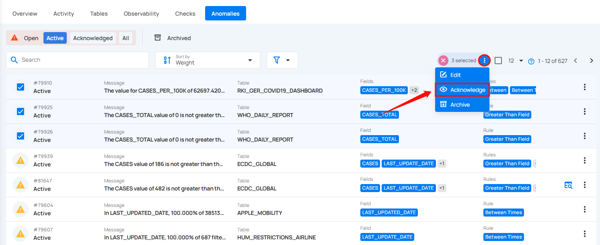

# Acknowledge Anomalies

By acknowledging anomalies, you indicate that they have been reviewed or recognized. This can be done either individually or in bulk, depending on your workflow. Acknowledging anomalies helps you keep track of issues that have been addressed, even if further action is still required.

!!! warning
    Once an anomaly is acknowledged, it remains acknowledged and never reverts to the active state.

## Acknowledge Specific Anomaly

You can acknowledge individual anomalies either directly or through the action menu, giving you precise control over each anomaly's status.

**Step 1:** Log in to your Qualytics account and select the datastore from the left menu on which you want to manage your anomalies.

**Step 2**: Click on the **“Anomalies”** from the Navigation Tab.

**1. Acknowledge Directly**

**Step 1:** Locate the active anomaly you want to acknowledge.

**Step 2:** Click on the **vertical ellipsis (⋮)** located on the right side of the anomaly and select **“Acknowledge”** from the dropdown menu.

After clicking on the **Acknowledge** button your anomaly is successfully moved to the acknowledged state and a confirmation message appears on the screen.

**2. Acknowledge via Action Menu**

**Step 1**: Click on the active anomaly from the list of available anomalies that you want to acknowledge.

**Step 2:** You will be directed to the anomaly details page. Click on the **Acknowledge** button located at the top-right corner of the interface.

After clicking on the **Acknowledge** button your anomaly is successfully moved to the acknowledged state and a confirmation message appears on the screen.

## Acknowledge Anomalies in Bulk

By acknowledging anomalies in bulk, you can quickly mark multiple anomalies as reviewed at once, saving time and ensuring that all relevant issues are addressed simultaneously.

**Step 1:** Hover over the active anomalies and click on the checkbox to select multiple anomalies.

When multiple anomalies are selected, an action toolbar appears, displaying the total number of selected anomalies along with a vertical ellipsis for additional bulk action options.

**Step 2:** Click on the **vertical ellipsis (⋮)** and choose **"Acknowledge"** from the dropdown menu to acknowledge the selected anomalies.

A modal window titled **“Acknowledge Anomalies”** will appear, confirming that this action acknowledges the anomalies as a legitimate data quality concern.

You also have the option to leave a comment in the provided field to provide additional context or details.

**Step 3:** Click on the **Acknowledge** button to acknowledge the anomalies.

After clicking on the **Acknowledge** button your anomalies are successfully moved to the acknowledged state and a confirmation message appears on the screen.