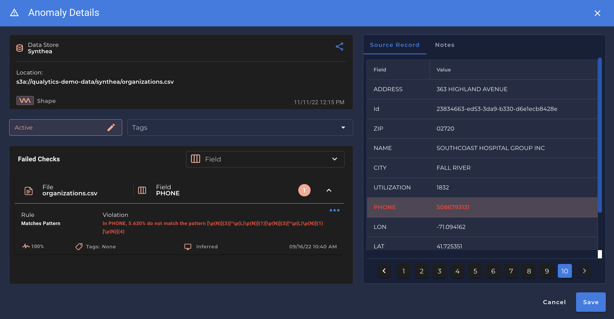
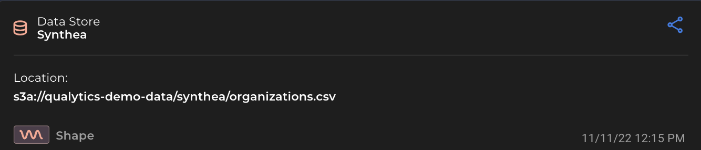
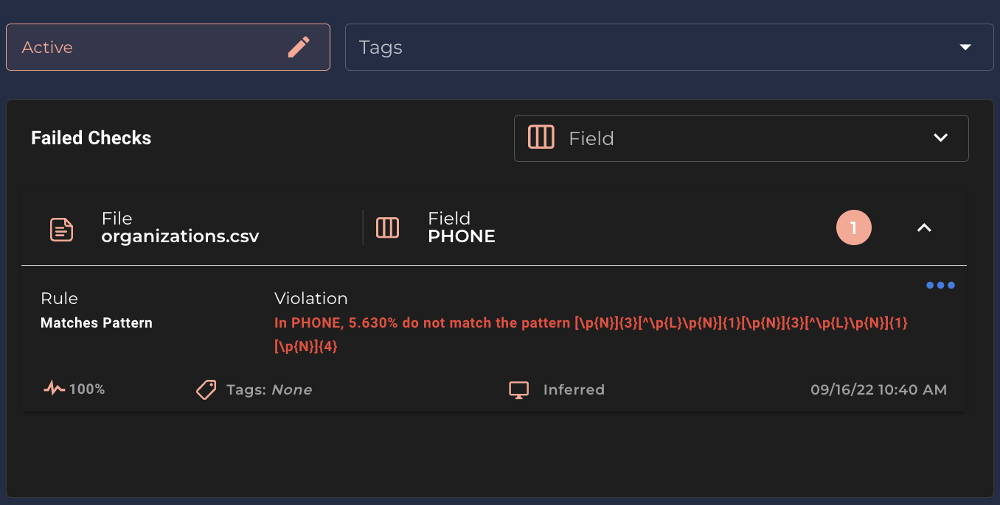
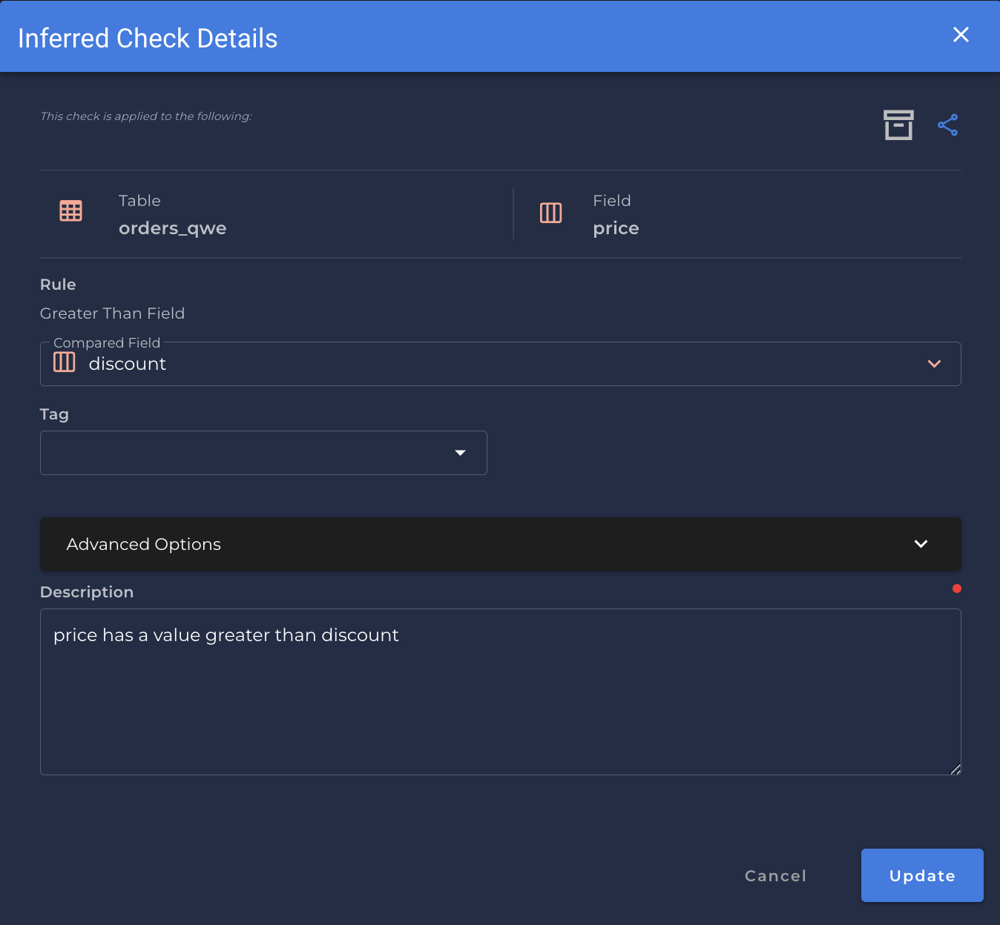

# Anomaly Details

* The `Anomaly Details` tab is shown as a separated section as part of a Scan operation, for a specific anomaly you want to see with more details.

* In `Anomaly Details` you can see all the detailed information on the specific anomaly.

* You have the ability to provide feedback to the platform in a Supervised Learning fashion as well. Specifically, the user can `Acknowledge`, `Resolve` or `Invalidate` an anomaly. 
    *Each of these actions will change the tolerances of the data quality checks behind the anomaly.*

* In the first section you can see:
    
    1. The `Data Store` name
    2. The `Location` where this data is stored.
    3. The `Record Type` of the anomaly.
    4. The `Date Time` of the anomaly creation.

* In the second section you can see:
     

    * The `Status` of the selected Anomaly.   
        *You can edit the status to `Acknowledged`, `Resolved` or `Invalid`.*

    * The `Tags` is a label that represent or inform the anomaly or the quality check.   
        *You can create a tag just typing or you can select a new one.*

    * The `Field` shows all the fields of that specific anomaly found.   
        *You can select the field that you want to filter.*   
        *Shows the number of anomalies found.*

    * The `File`/`Table` is the name of the source.

    * The `Rule` is the name of the Rule for this specific anomaly.   
        *You can check all the Rule types [here.](/checks/what-is#the-definitive-list-of-rule-types)*
    
    * The `Violation` is what the anomaly violated according to the specified rule.   
        *It specifies the field name, the percentage of anomalies found.*

    * The `Frequency` {: style="width:25px;height:25px;margin-bottom:-5px"} of the anomaly defines the percentage calculated for that sample of records.

    * The type of the `Quality Check`  {: style="width:20px;height:20px;margin-bottom:-5px"} can be `Infered` or `Authored`.

# Infered check details

* If you click on the rule section, a new view is shown as `Infered check details`.

* You can archive an anomaly click in the {: style="width:20px;height:20px;margin-bottom:-5px"} button.

* If you expand the section `Advanced Options` you can add a `Filter` clause and also change the `Frequency` percentage for that anomaly.

!!! note
    The `Filter` clause is a `Where` statement against your table. You can type like:   
    `price != 33` or `price > discount + 20`

!!! info
    You can create a computer table and use multiple fields from different tables in a filter clause