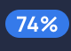

# Anomaly Details

* The `Anomaly Details` modal provides specific details about the Anomaly, including source record and checks that failed assertions, along with ability to take `Notes` and provide feedback to ML methods through updating `Status` of the anomaly.

* Users have the ability to provide feedback to the ML methods through Supervised Learning. Specifically, the user can `Acknowledge`, `Resolve` or `Invalidate` an anomaly. 
    *Each of these actions will change the tolerances of the data quality checks behind the anomaly.*

* Datastore details:
    
    
    1. The `Datastore` name
    2. The `Location` where this data is stored.
    3. The `Record Type` of the anomaly.
    4. The `Date Time` of the anomaly creation.

* Failed Check details:
    <!--  -->
    
    

    * `Status` of the selected Anomaly   
        *Users can edit the status to `Acknowledged`, `Resolved` or `Invalid`.*

    * `Tags`: labels that serve the purpose of grouping anomalies and driving downstream workflows. For more details, see TODO hyperlink the tag   
        *Users can create new or apply existing tags*

    * `Field`: all the fields of that specific anomaly found   
        *Users can filter by Field in this view*   

    * `File`/`Table`: datastore in which anomaly was found

    * `Rule`: rule type that failed the assertion(s)  
        *You can check all the Rule types [here.](/checks/what-is#the-definitive-list-of-rule-types)*
    
    * `Violation`: details of how the anomaly failed the assertion(s) of rule(s)   

    * `Coverage` {: style="width:25px;height:25px;margin-bottom:-5px"}: the expected tolerance of the rule

    * `Type`  {: style="width:20px;height:20px;margin-bottom:-5px"}: `Infered` or `Authored`

# Infered check details

* Clicking into a `Rule` will highlight its details and enables users to edit the rule as well:

* An anomaly can be archived via the {: style="width:20px;height:20px;margin-bottom:-5px"} button.

* If you expand the section `Advanced Options` you can add a `Filter` clause and also change the `Coverage` percentage for that anomaly.

!!! note
    The `Filter` clause is a `WHERE` statement against your table. For example:   
    `price != 33` or `price > discount + 20`

!!! info
    You can create a computed table and use multiple fields from different tables in a filter clause