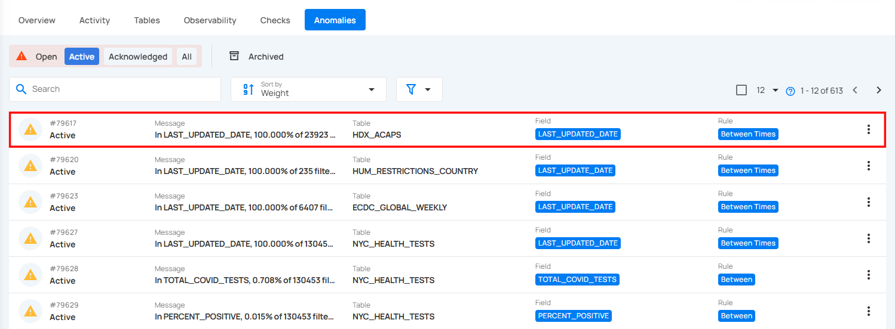
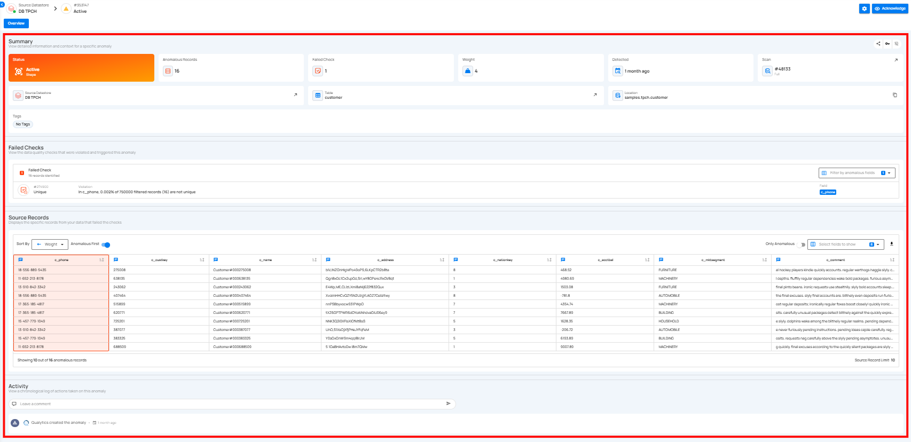
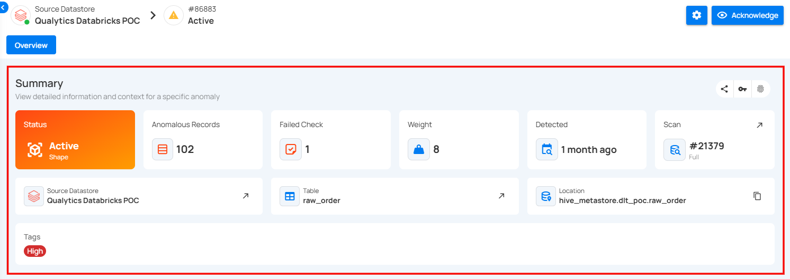
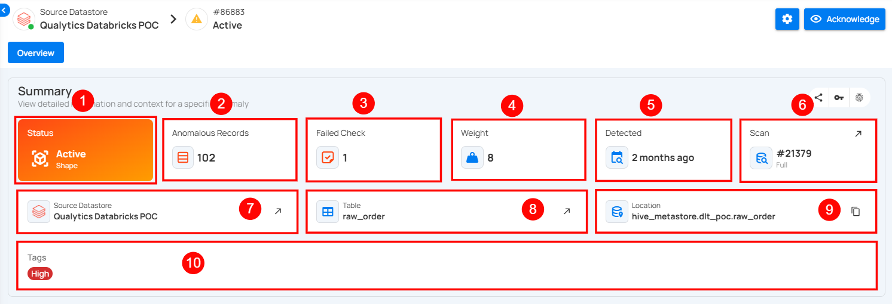
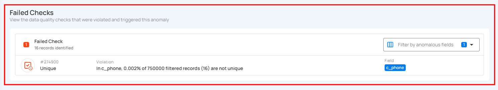
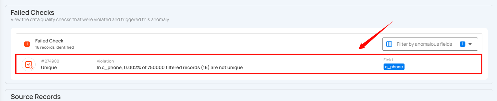
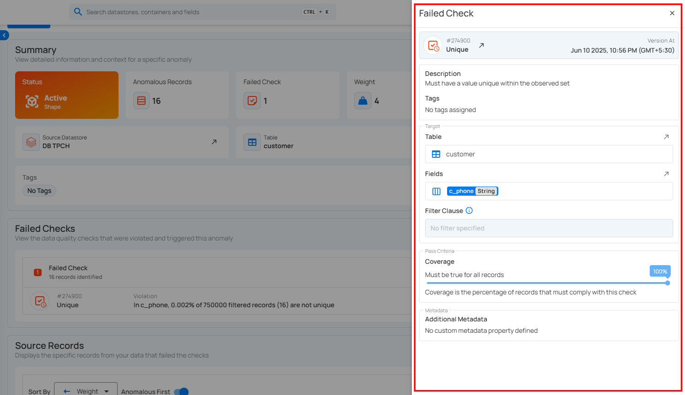
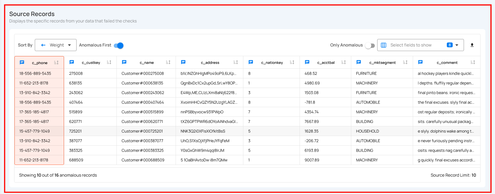
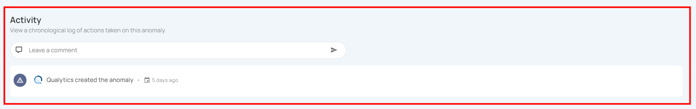
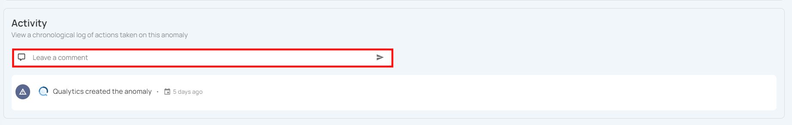

# Anomaly Insights

Anomaly Insights provides key insights into a specific data anomaly, including its status, anomalous record count, failed checks, and weight. It also shows when the anomaly was detected, the triggering scan, and the related datastore, table, and location. This view helps users quickly understand the scope and source of the anomaly for easier investigation and resolution.

Let’s get started 🚀

**Step 1:** Click on the anomaly that you want to see the details of.

You will be navigated to the details section, where you can view the **Summary**, **Failed Checks**, **Source Records** and **Activity** information.

## Description

The **Description** section displays a detailed, business-friendly explanation of the anomaly. When an anomaly is detected during a scan operation, the system automatically generates a description based on the quality check that failed, including relevant context such as filter conditions, thresholds, and the nature of the data quality issue.

Users with **Editor** permission or higher can edit the description to add additional context, clarify the business impact, or document investigation findings. This makes it easier for team members to understand and address data quality issues.

### Editing the Description

To edit an anomaly's description:

**Step 1:** Open the Anomaly Details modal or navigate to the Anomaly Overview page.

**Step 2:** Locate the **Description** section. If the anomaly is in an editable state (not archived), you will see a **pencil icon** (✏️) next to the "Description" label.

**Step 3:** Click the **pencil icon** to enter edit mode. The description text will become editable in a text area.

**Step 4:** Make your changes to the description text.

**Step 5:** Click **Save** to persist your changes, or click **Cancel** to discard them and revert to the original description.

!!! note
    - Only users with the **Editor** role (or higher) on the respective datastore can edit the description
    - Archived anomalies cannot be edited—restore the anomaly first if you need to modify the description
    - All changes to the description are tracked in the **Activity** section, maintaining a complete audit trail of modifications

## Summary Section

The **Summary** section provides a quick overview of the anomaly's key attributes. It includes the anomaly's status, total anomalous records, failed checks, weight, detection time, scan information, and the corresponding datastore and table. This section helps users quickly understand where the anomaly occurred and its potential impact.

| No. | Field | Description |
| :---- | :---- | :---- |
| 1 | Status and Type | Shows the current state and category of the anomaly. In this case, the anomaly is **Active** and of type **Shape**, indicating it relates to the structure or distribution of the data. |
| 2 | Anomalous Records | Indicates the total number of records affected by the anomaly. Here, **102** records were identified as anomalous. |
| 3 | Failed Check | Displays the number of data quality checks that were violated and triggered this anomaly. In this instance, **1** check failed. |
| 4 | Weight | Represents the significance or impact of the anomaly. A higher weight value implies a more critical issue. This anomaly has a weight of **8**. |
| 5 | Detected | Shows how long ago the anomaly was first detected. When you hover over the time the anomaly was detected, a pop-up appears displaying the complete date and time. |
| 6 | Scan | Indicates the scan operation that detected the anomaly. Scan ID **#21379** is shown here, and it was an incremental scan. When you click on the expand icon, you will be directed to the Scan Results page where you can view the specific scan that detected the anomaly. |
| 7 | Source Datastore | Identifies the dataset that contains the anomaly. This anomaly occurred in the "Qualytics Databricks POC" datastore. Clicking the expand icon opens a detailed view and navigates to the dataset’s page for more information about the source datastore. |
| 8 | Table | Points to the specific table involved in the anomaly. The affected table is raw_order. Clicking on the expand icon navigates to the table’s page, providing more in-depth information about the table structure and contents. |
| 9 | Location | Displays the full path of the table in the datastore. This helps users trace the exact location of the anomaly within the data pipeline. You can click on the copy icon to copy the full location path of the table where the anomaly was detected. |
| 10 | Tags | Highlights the severity or categorization of the anomaly. The tag High indicates a high-priority issue. You can add or remove tags from the anomaly by clicking on the tag badge. |

### Failed Checks

The **Failed Checks** section lists the data quality checks that were violated and subsequently triggered the anomaly. Each listed item displays the check ID, type of violation, and a summarized description of the failure condition.

Click on a failed check to view the corresponding quality check information.

A right-side panel will open, allowing you to view the details without navigating to a different page.

### Source Records

The Source Records section displays all the data and fields related to the detected anomaly from the dataset. It is an Enrichment Datastore that is used to store the analyzed results, including any anomalies and additional metadata in files; therefore, it is recommended to add/link an enrichment datastore with your connected source datastore.

For more information on Source Records, please refer to the [Source Records](source-record.md) section in the documentation.

### Activity Section

The **Activity** section provides a complete timeline of actions and events related to the anomaly. It helps users track how the anomaly has been handled and by whom, ensuring better collaboration and accountability.

Users can leave comments to discuss the issue, add context, or communicate decisions. All comments are timestamped and attributed to the respective user.

!!! note
    Users can’t add, edit, or delete comments in the **Activity** section when an anomaly is archived **(Duplicated, Invalid, or Resolved)**. Restore the anomaly to make updates, then revert its status if needed.

