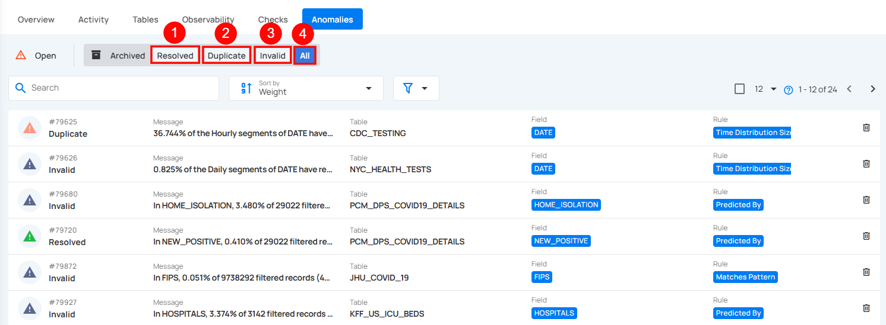

# Anomaly Status

Anomaly status provides a structured way to track the lifecycle of data quality issues—from detection to resolution. Each anomaly is assigned a status that indicates its current state, helping teams prioritize actions and maintain oversight. These statuses are divided into two main categories: Open, for anomalies that still need attention, and Archived, for those that have been resolved, dismissed, or categorized for reference.

Let’s get started 🚀

## Open Anomalies

Open anomalies are data quality issues that have been detected but not yet resolved or archived. This category is divided into three sub-statuses that help track the progress and handling of each anomaly.

**1. Active**: By clicking on the Active button, the user can see anomalies that are currently unresolved and have not been acknowledged, archived, or resolved. It may require immediate attention.

**2. Acknowledged**:  By clicking on the Acknowledged button, the user can see an anomalies that has been reviewed and marked as acknowledged, though it may still need further action.

**3. All**:  By clicking on the All button, the user can view all open anomalies, including those marked as Active and Acknowledged, providing a complete view of ongoing issues.

## Archived Anomalies

Archived anomalies are issues that have already been reviewed and moved out of the active monitoring flow. These anomalies are categorized based on how they were resolved or classified, helping maintain a clear historical record without cluttering ongoing monitoring efforts.

**1. Resolved**: This indicates that the anomaly was a legitimate data quality concern and has been addressed.

**2. Duplicate**: This indicates that the anomaly is a duplicate of an existing record and has already been addressed.

**3. Invalid**: This indicates that the anomaly is not a legitimate data quality concern and does not require further action.

**4. Discarded**: This indicates that the anomaly is no longer being reviewed or considered relevant. It helps remove outdated or unnecessary anomalies from the active list without marking them as invalid or resolved.

**5. All**: Displays all archived anomalies, including those marked as Resolved, Duplicate, and Invalid, giving a comprehensive view of all past issues.

!!! note 
    For more information refer to the [Archived Anomalies Documentation](archive-anomalies.md).
