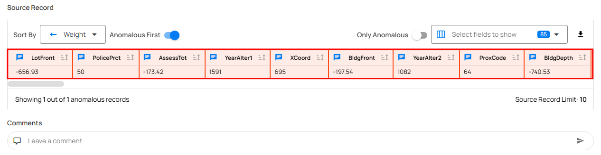
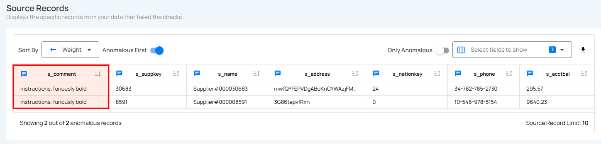

# Anomaly Types

Anomalies in Qualytics are classified into two primary types, **Record Anomalies** and **Shape Anomalies**, each targeting different aspects of data integrity. Record anomalies flag individual rows that fail specific quality checks, such as missing or invalid values. Shape anomalies, on the other hand, detect structural issues in the dataset, like missing columns or schema mismatches. Together, these types provide a comprehensive approach to identifying both value-level and schema-level data quality issues.

Let’s get started 🚀

## Record Anomaly

A record anomaly identifies a single record (row) as anomalous and provides specific details regarding why it is considered anomalous. The simplest form of a record anomaly is a row that lacks an expected value for a field.

**Example**: Consider a data quality check that requires the salary field to be greater than 40,000. Based on this rule, any record that does not meet this condition will be identified and labeled as a record anomaly by Qualytics. In the sample table illustrated below, the row with id 3 will be flagged as a record anomaly because the salary of 30,000 is less than the required 40,000. This precise identification allows for targeted investigation and correction of specific data issues.

| ID | Name | Age | Salary |
| :---- | :---- | :---- | :---- |
| 1. | John Doe | 28 | 50000 |
| 2. | Jane Smith | 35 | 75000 |
| 3. | Bob Johnson | 22 | 30000 |

## Shape Anomaly

A shape anomaly identifies an anomalous structure within the analyzed data. The simplest shape anomaly is a dataset that doesn't match the expected schema because it lacks one or more fields. Some shape anomalies only apply to a subset of the data being analyzed and can therefore produce a count of the number of rows that reflect the anomalous concern. Where that is possible, the shape anomaly's anomalous_record_count is populated.

!!! note
    Sometimes, shape anomalies only affect a subset of the dataset. This means that only certain rows exhibit the structural issue, rather than the entire dataset.

**Example**: Consider a dataset where the s_comment field is expected to contain standard supplier comments. In the example below, two records have the text "instructions. furiously bold", which does not match the expected format. Because this text breaks the structural pattern defined for the field, these records are flagged as a shape anomaly.

| s_suppkey | s_name | s_comment |
| :---- | :---- | :---- |
| 30683 | Supplier#000030683 | instructions. furiously bold |
| 8591 | Supplier#000008591 | instructions. furiously bold |

!!! note
    When a shape anomaly affects only a portion of the dataset, Qualytics can count the number of rows that have the structural problem. This count is stored in the anomalous_record_count field, providing a clear measure of how widespread the issue is within the dataset. Example: Imagine a dataset that is supposed to have columns for id, name, age, and salary. If some rows are missing the salary column, this would be flagged as a shape anomaly. If this issue only affects 50 out of 1,000 rows, the anomalous_record_count would be 50, indicating that 50 rows have a structural issue. 