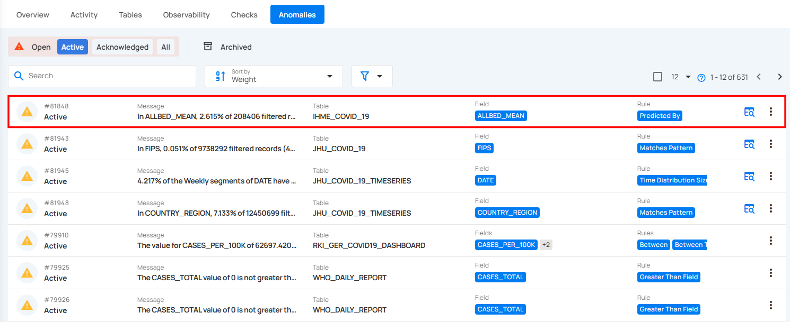
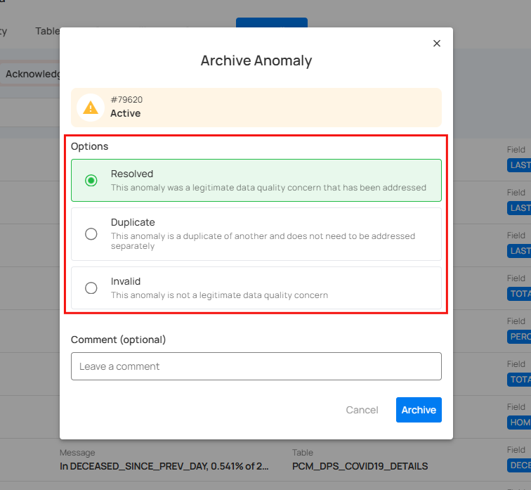
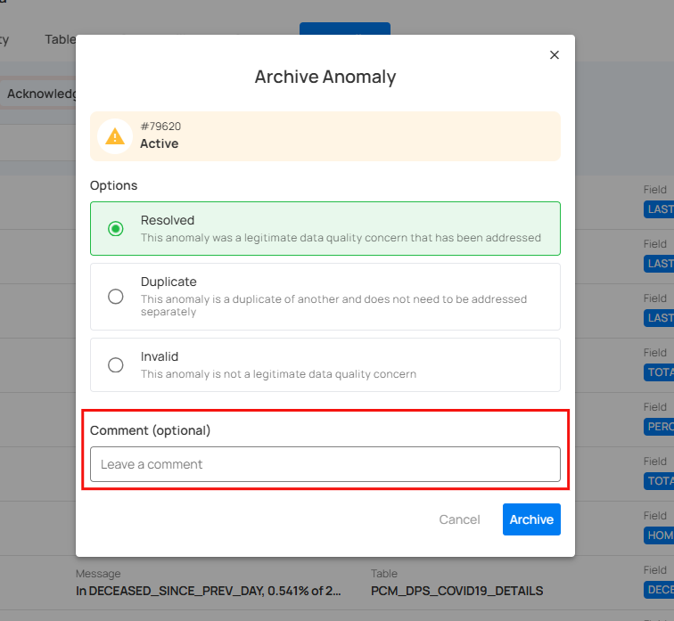
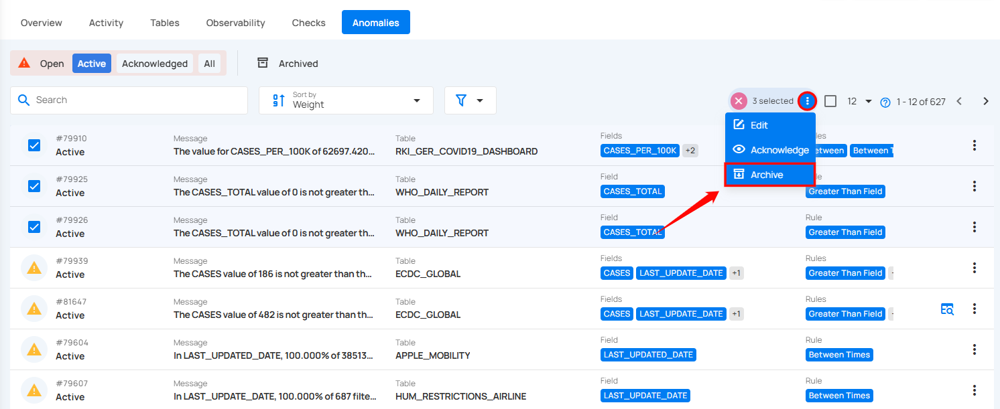
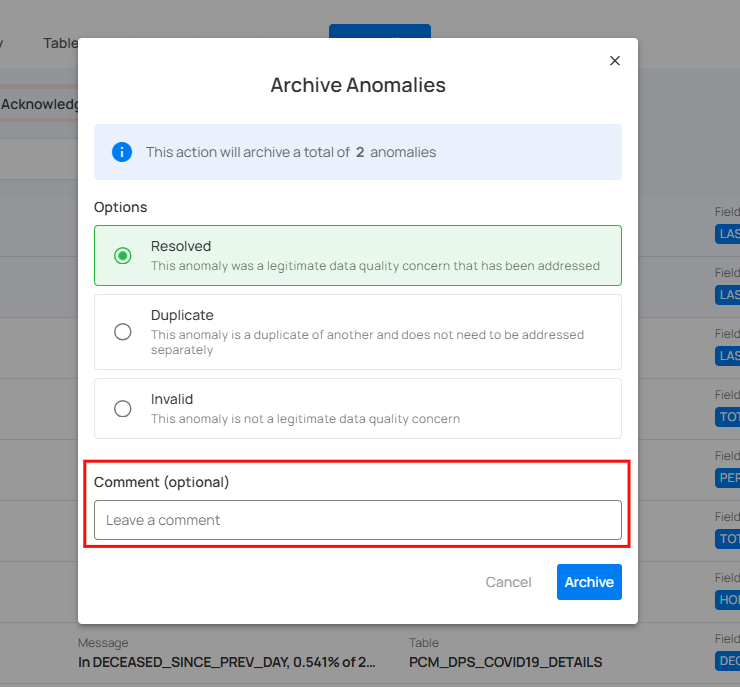

# Archive Anomalies

By archiving anomalies, you move them to an inactive state, while still keeping them available for future reference or analysis. Archiving helps keep your active anomaly list clean without permanently deleting the records.

## Archive Specific Anomalies

You can archive individual anomalies either directly or through the action menu.

### 1. Archive Directly

**Step 1:** Locate the anomaly (whether Active or Acknowledged) you want to archive.

**Step 2:** Click on the **vertical ellipsis (⋮)** located on the right side of the anomaly and select **“Archive”** from the drop down menu.

**Step 3:** A modal window titled **“Archive Anomaly”** will appear, providing you with the following archive options:

* **Resolved**: Choose this option if the anomaly was a legitimate data quality concern and has been addressed. This helps maintain a record of resolved issues while ensuring that they are no longer active.  
* **Duplicate**: Choose this option if the anomaly is a duplicate of an existing record and has already been addressed. No further action is required as the issue has been previously resolved.  
* **Invalid**: Select this option if the anomaly is not a legitimate data quality concern and does not require further action. Archiving anomalies as invalid helps differentiate between real issues and those that can be dismissed, improving overall data quality management.

You also have the option to leave a comment in the provided field to provide additional context or details.

**Step 4:** Once you've made your selection, click the **Archive** button to proceed.

**Step 5:** After clicking on the **Archive** button your anomaly is moved to the archive and a flash message will appear saying **“The Anomaly has been successfully archived”**.

### 2. Archive via Action Menu

**Step 1**: Click on the anomaly from the list of available (whether Active or Acknowledged) anomalies that you want to archive.

**Step 2:** You will be directed to the anomaly details page. Click on the **Settings** icon located at the top right corner of the interface and select **“Archive”** from the drop down menu.

**Step 3:** A modal window titled **“Archive Anomaly”** will appear, providing you with the following archive options:

* **Resolved**: Choose this option if the anomaly was a legitimate data quality concern and has been addressed. This helps maintain a record of resolved issues while ensuring that they are no longer active.  
* **Duplicate**: Choose this option if the anomaly is a duplicate of an existing record and has already been addressed. No further action is required as the issue has been previously resolved.  
* **Invalid**: Select this option if the anomaly is not a legitimate data quality concern and does not require further action. Archiving anomalies as invalid helps differentiate between real issues and those that can be dismissed, improving overall data quality management.

You also have the option to leave a comment in the provided field to provide additional context or details.

**Step 4:** Once you've made your selection, click the **Archive** button to proceed.

**Step 5:** After clicking on the **Archive** button your anomaly is moved to the archive and a flash message will appear saying **“The Anomaly has been successfully archived”**.

## Archive Anomalies in Bulk

To handle multiple anomalies efficiently, you can archive them in bulk, allowing you to quickly move large volumes of anomalies into the archived state.

**Step 1:** Hover over the anomaly (whether Active or Acknowledged) and click on the checkbox to select multiple anomalies.

When multiple anomalies are selected, an action toolbar appears, displaying the total number of selected anomalies along with a vertical ellipsis for additional bulk action options.

**Step 2:** Click on the **vertical ellipsis (⋮)** and choose **"Archive"** from the dropdown menu to archive the selected anomalies.

**Step 3:** A modal window titled **“Archive Anomaly”** will appear, providing you with the following archive options:

* **Resolved**: Choose this option if the anomaly was a legitimate data quality concern and has been addressed. This helps maintain a record of resolved issues while ensuring that they are no longer active.  
* **Duplicate**: Choose this option if the anomaly is a duplicate of an existing record and has already been addressed. No further action is required as the issue has been previously resolved.  
* **Invalid**: Select this option if the anomaly is not a legitimate data quality concern and does not require further action. Archiving anomalies as invalid helps differentiate between real issues and those that can be dismissed, improving overall data quality management.

You also have the option to leave a comment in the provided field to provide additional context or details.

**Step 4:** Once you've made your selection, click on the **Archive** button to proceed.

**Step 5:** After clicking on the **Archive** button your anomaly is moved to the archive and a flash message will appear saying **“The Anomalies have been successfully archived”**.

