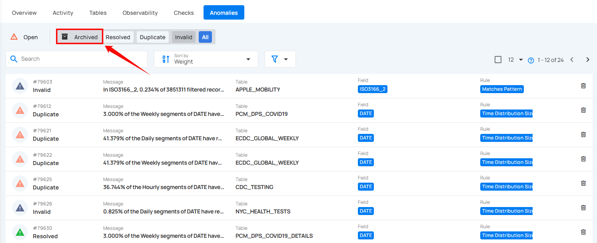
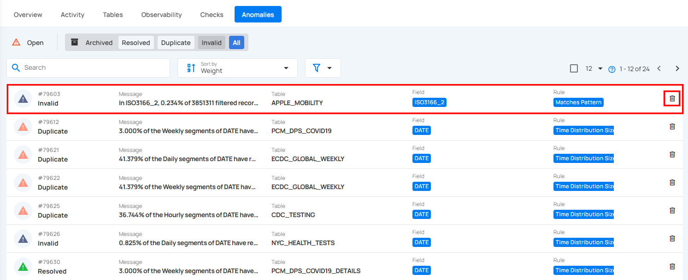
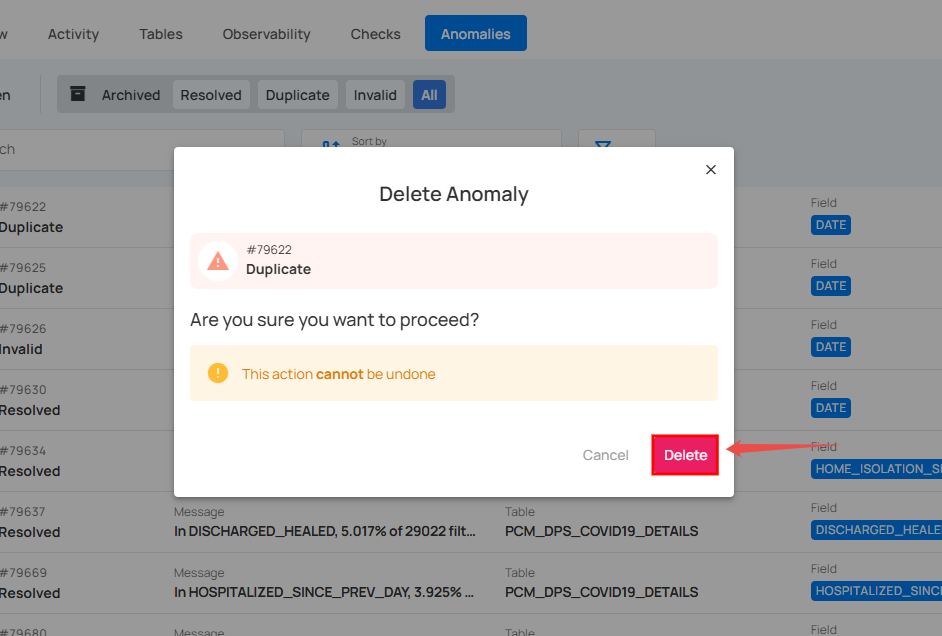
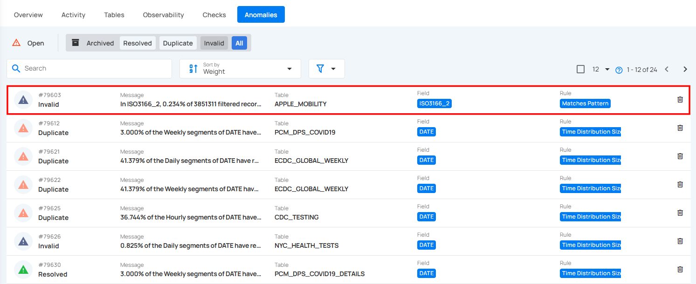
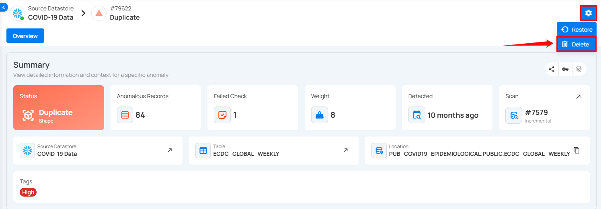
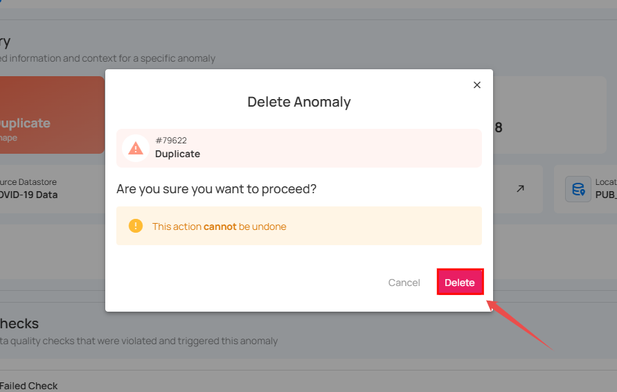
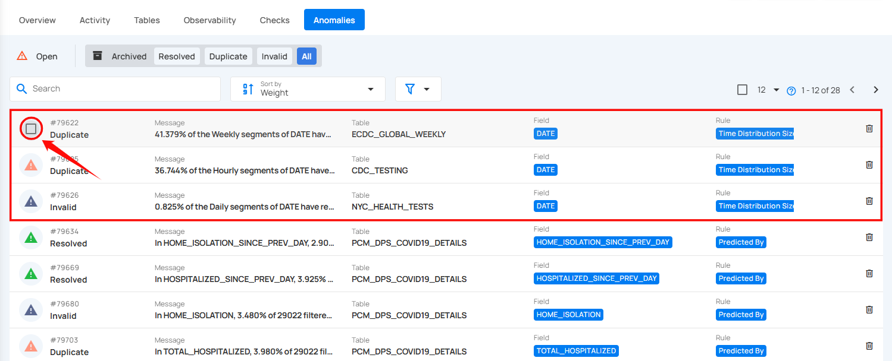
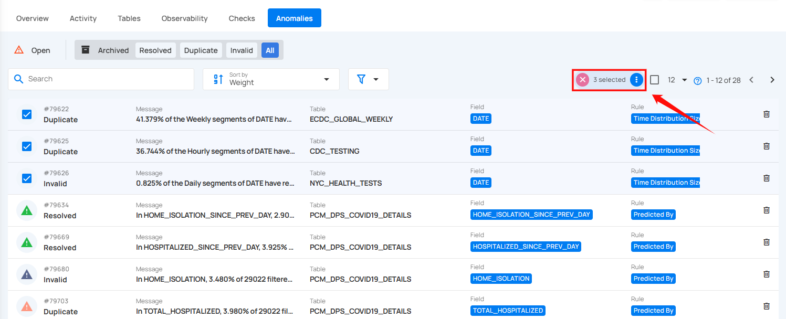
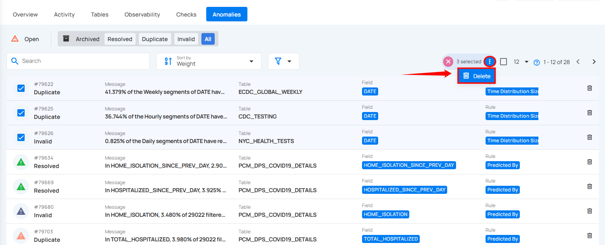
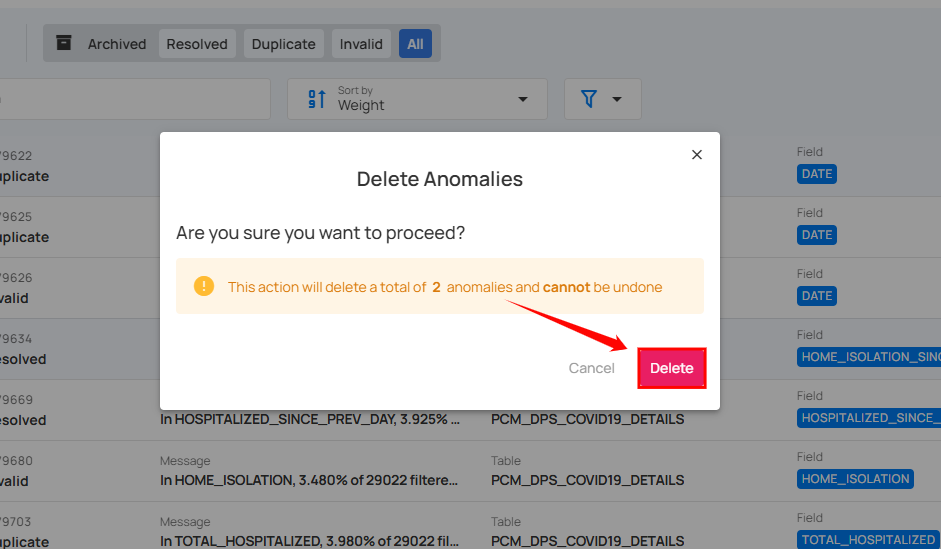

# Delete Anomalies

Deleting anomalies allows you to permanently remove records that are no longer relevant or were logged in error. This can be done individually or for multiple anomalies at once, ensuring that your anomaly records remain clean and up to date.

!!! note
    You can only delete archived anomalies, not active or acknowledged anomalies. If you want to delete an active or acknowledged anomaly, you must first move it to the archive, and then you can delete it. 

!!! warning
    Deleting an anomaly is a one-time action. It cannot be restored after deletion.

## Delete Specific Anomaly

You can delete individual anomalies using one of two methods:

#### 1. Delete Directly

**Step 1:** Click on **Archived** from the **navigation bar** in the **Anomalies** section to view all archived anomalies.

**Step 2:** Locate the anomaly, that you want to delete and click on the **Delete** icon located on the right side of the anomaly.

**Step 3:** A confirmation modal window will appear, click on the **Delete** button to permanently remove the anomaly from the system.

**Step 4:** After clicking the **Delete** button, the selected anomaly is deleted, and a success message is displayed.

#### 2. Delete via Action Menu

**Step 1:** Click on the archived anomaly from the list of archived anomalies that you want to delete.

**Step 2:** You will be directed to the anomaly details page. Click on the **Settings** icon located at the top right corner of the page and select **“Delete”** from the drop down menu.

**Step 3:** A confirmation modal window will appear, click on the **Delete** button to permanently remove the anomaly from the system.

**Step 4:** After clicking the **Delete** button, the selected anomaly is deleted, and a success message is displayed.

## Delete Anomalies in Bulk

For more efficient management, you can delete multiple anomalies at once using the bulk delete option, allowing for faster cleanup of unwanted records.

**Step 1:** Hover over the archived anomalies and click on the checkbox to select anomalies in bulk.

When multiple checks are selected, an action toolbar appears, displaying the total number of checks chosen along with a vertical ellipsis for additional bulk action options.

**Step 2:** Click on the **vertical ellipsis (⋮)** and choose **"Delete"** from the dropdown menu to delete the selected anomalies.

**Step 3:** A confirmation modal window will appear, click on the **Delete** button to permanently remove the selected anomalies from the system.

**Step 4:** After clicking the **Delete** button, the selected anomaly is deleted, and a success message is displayed.