# Anomaly Insights

Anomaly Insights provides key insights into a specific data anomaly, including its status, anomalous record count, failed checks, and weight. It also shows when the anomaly was detected, the triggering scan, and the related datastore, table, and location. This view helps users quickly understand the scope and source of the anomaly for easier investigation and resolution.

Let's get started 🚀

**Step 1:** Click on the anomaly that you want to see the details of.

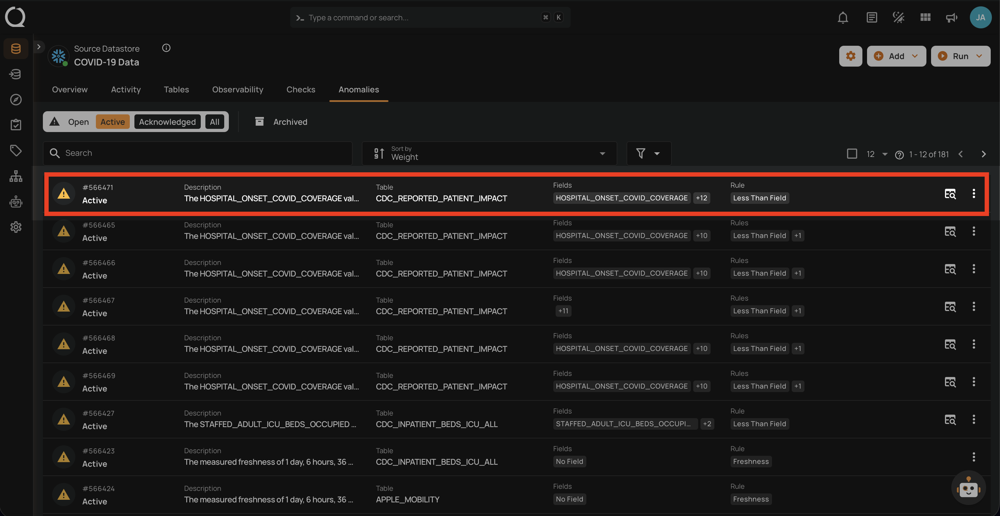

You will be navigated to the details section, where you can view the **Summary**, **Description**, **Failed Checks**, **Source Records**, **Tickets** and **History** information.

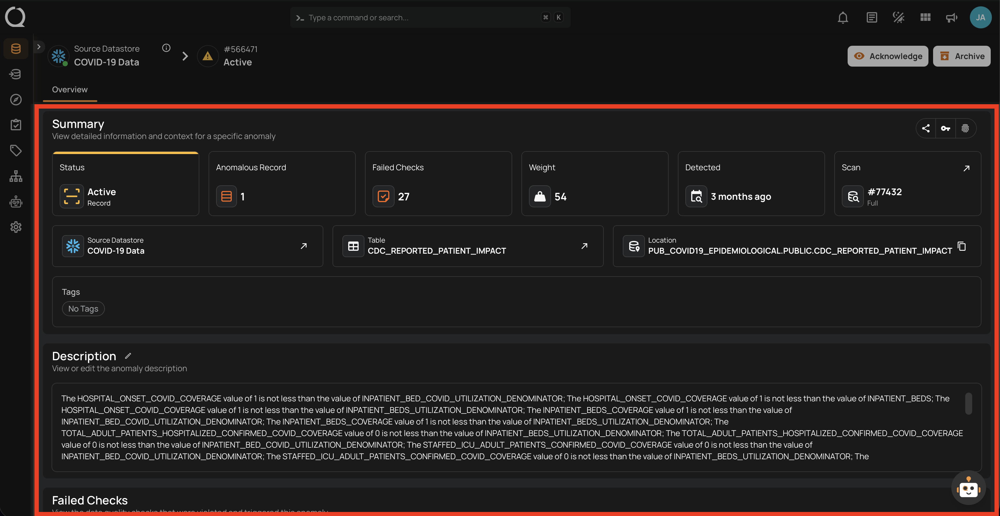

## Summary

The **Summary** section provides a quick overview of the anomaly's key attributes. It includes the anomaly's status, total anomalous records, failed checks, weight, detection time, scan information, and the corresponding datastore and table. This section helps users quickly understand where the anomaly occurred and its potential impact.

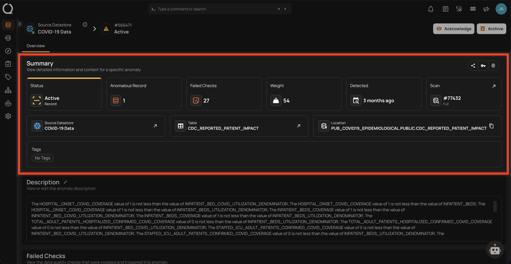

| No. | Field | Description |
| :---- | :---- | :---- |
| 1 | Status and Type | Shows the current state and category of the anomaly. In this case, the anomaly is **Active** and of type **Record**, indicating it relates to individual data records. |
| 2 | Anomalous Records | Indicates the total number of records affected by the anomaly. Here, **1** record was identified as anomalous. |
| 3 | Failed Check | Displays the number of data quality checks that were violated and triggered this anomaly. In this instance, **27** checks failed. |
| 4 | Weight | Represents the significance or impact of the anomaly. A higher weight value implies a more critical issue. This anomaly has a weight of **54**. |
| 5 | Detected | Shows how long ago the anomaly was first detected. When you hover over the time the anomaly was detected, a pop-up appears displaying the complete date and time. |
| 6 | Scan | Indicates the scan operation that detected the anomaly. Scan ID **#77432** is shown here, and it was an incremental scan. When you click on the expand icon, you will be directed to the Scan Results page where you can view the specific scan that detected the anomaly. |
| 7 | Source Datastore | Identifies the dataset that contains the anomaly. This anomaly occurred in the "COVID-19 Data" datastore. Clicking the expand icon opens a detailed view and navigates to the dataset's page for more information about the source datastore. |
| 8 | Table | Points to the specific table involved in the anomaly. The affected table is CDC_REPORTED_PATIENT_IMPACT. Clicking on the expand icon navigates to the table's page, providing more in-depth information about the table structure and contents. |
| 9 | Location | Displays the full path of the table in the datastore. This helps users trace the exact location of the anomaly within the data pipeline. You can click on the copy icon to copy the full location path of the table where the anomaly was detected. |
| 10 | Tags | Highlights the severity or categorization of the anomaly. The tag High indicates a high-priority issue. You can add or remove tags from the anomaly by clicking on the tag badge. |

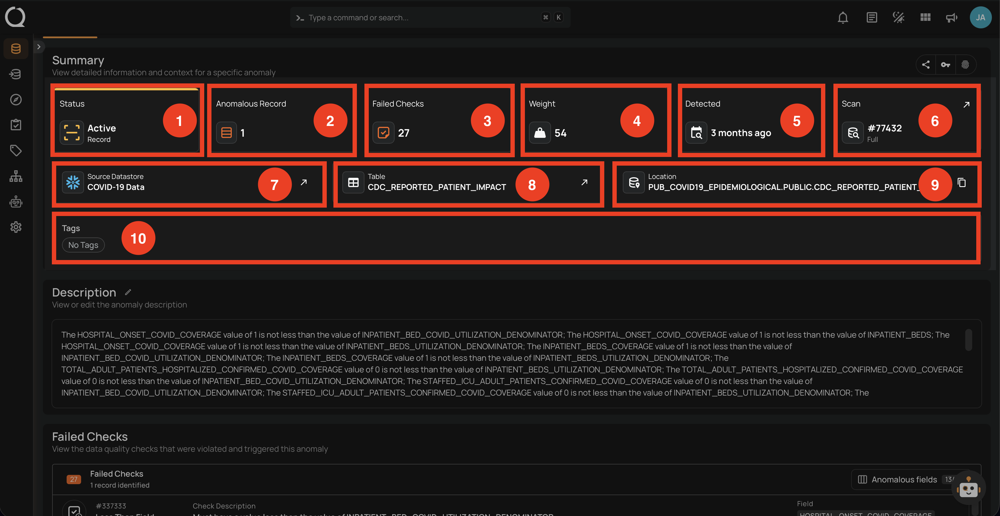

## Description

The **Description** section displays a detailed, business-friendly explanation of the anomaly. When an anomaly is detected during a scan operation, the system automatically generates a description based on the quality check that failed, including relevant context such as filter conditions, thresholds, and the nature of the data quality issue.

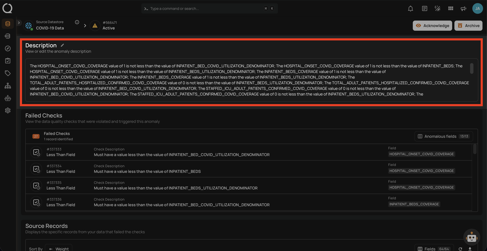

Users with **Editor** permission or higher can edit the description to add additional context, clarify the business impact, or document investigation findings. This makes it easier for team members to understand and address data quality issues.

### Editing the Description

**Step 1:** Click the **Edit :material-pencil-outline:** button next to the "Description" label to enter edit mode.

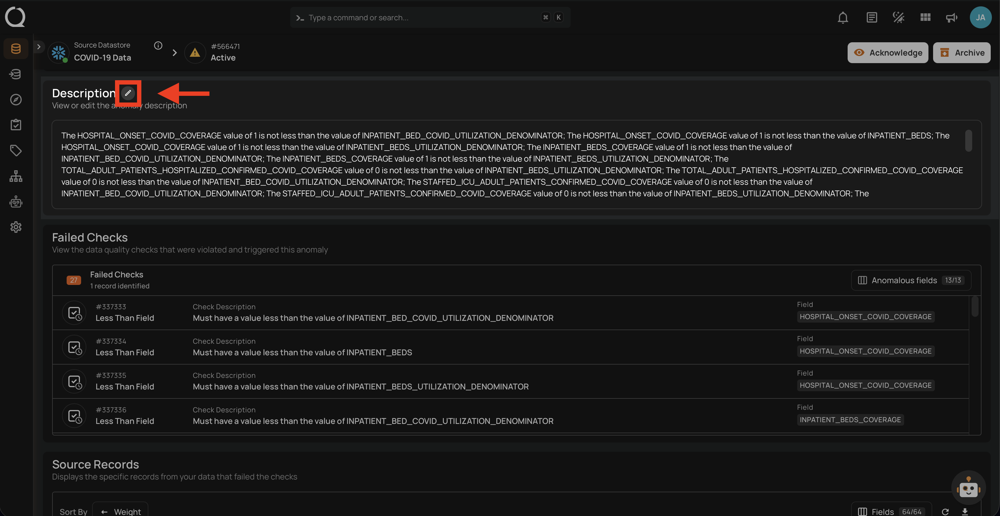

**Step 2:** Make your changes to the description text in the editable text area.

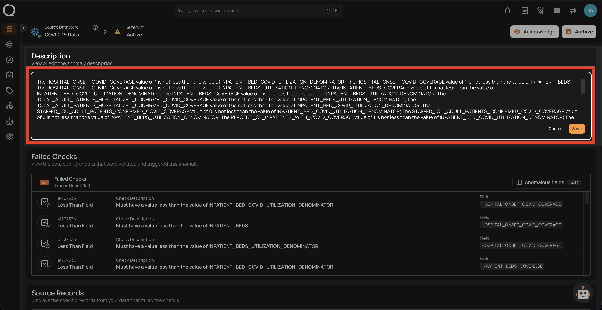

**Step 3:** Click **Save** to persist your changes, or click **Cancel** to discard them and revert to the original description.

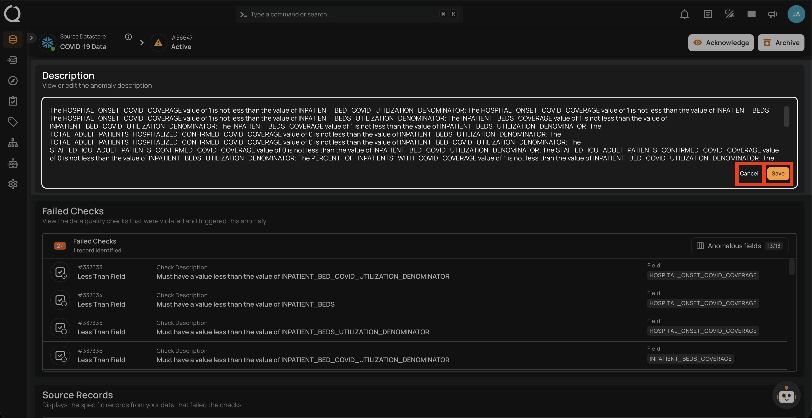

!!! info
    Only users with the **Editor** role (or higher) on the respective datastore can edit the description. For more details, see the [Team Permissions](../../settings/security/team-permissions.md){:target="_blank"} page.

!!! note
    - Archived anomalies cannot be edited — restore the anomaly first if you need to modify the description
    - All changes to the description are tracked in the **History** section, maintaining a complete audit trail of modifications

## Failed Checks

The **Failed Checks** section lists the data quality checks that were violated and subsequently triggered the anomaly. Each listed item displays the check ID, type of violation, and a summarized description of the failure condition.

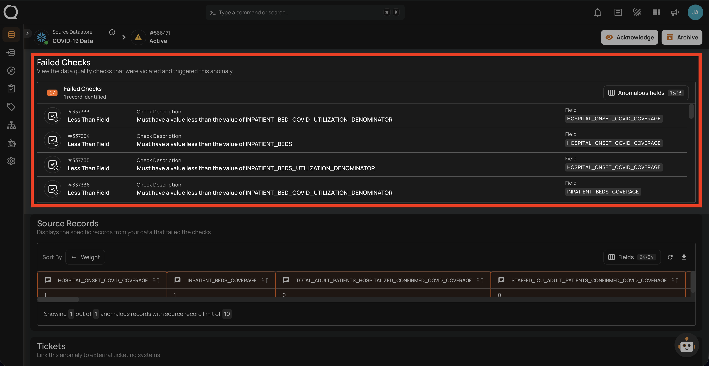

Click on a failed check to view the corresponding quality check information. A right-side panel will open, allowing you to view the details without navigating to a different page.

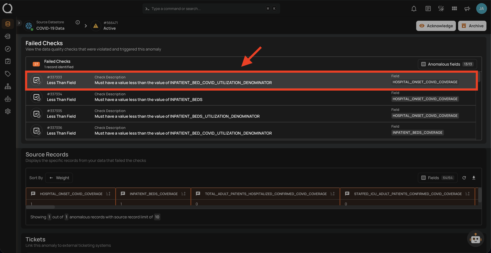

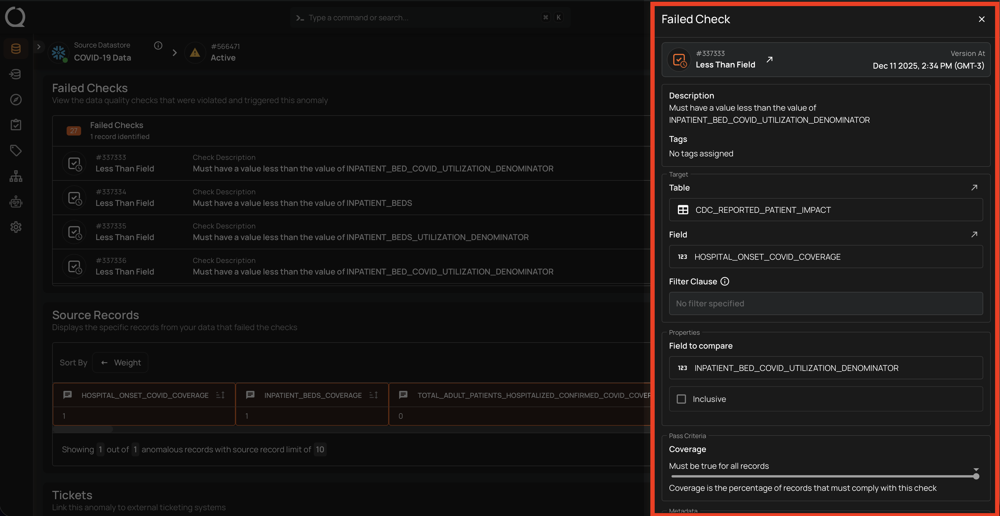

### Anomalous Fields

The **Anomalous Fields** button allows you to filter the failed checks list by the specific fields that triggered the anomaly. The button displays a badge with the count of selected fields out of the total anomalous fields (e.g., `13/13`).

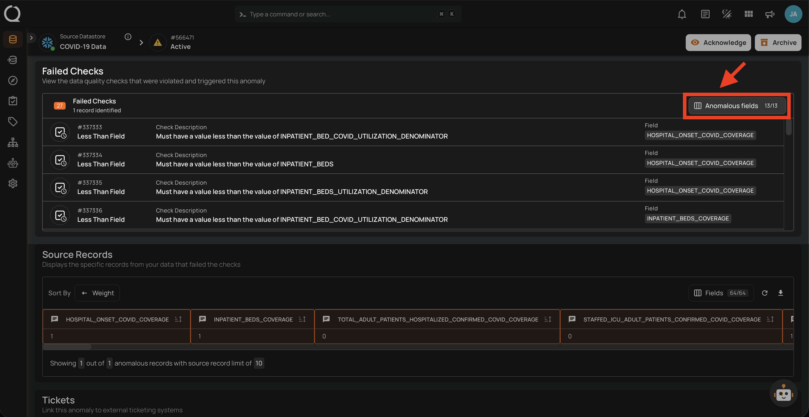

Click the **Anomalous Fields** button to open a dropdown with a searchable list of all fields involved in the failed checks. Each field has a toggle to show or hide its related failed checks.

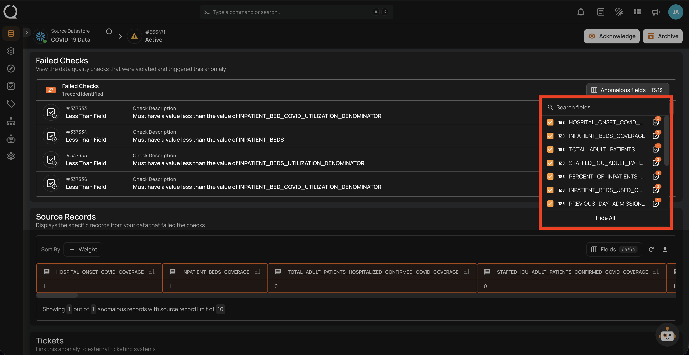

Use the **Hide All** option at the bottom of the dropdown to deselect all fields at once. When all fields are hidden, the option changes to **Show All**, allowing you to re-enable them.

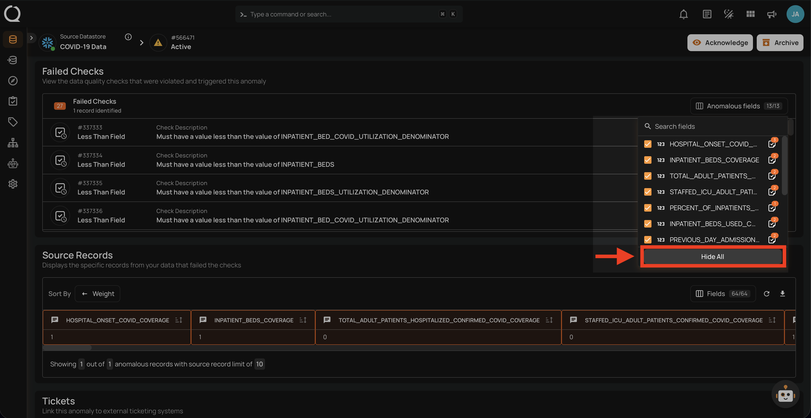

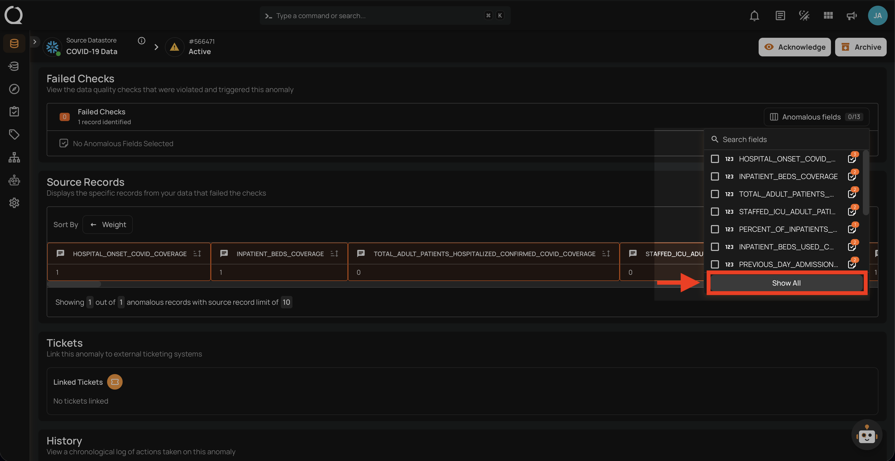

## Source Records

The Source Records section displays all the data and fields related to the detected anomaly from the dataset. It is an Enrichment Datastore that is used to store the analyzed results, including any anomalies and additional metadata in files; therefore, it is recommended to add/link an enrichment datastore with your connected source datastore.

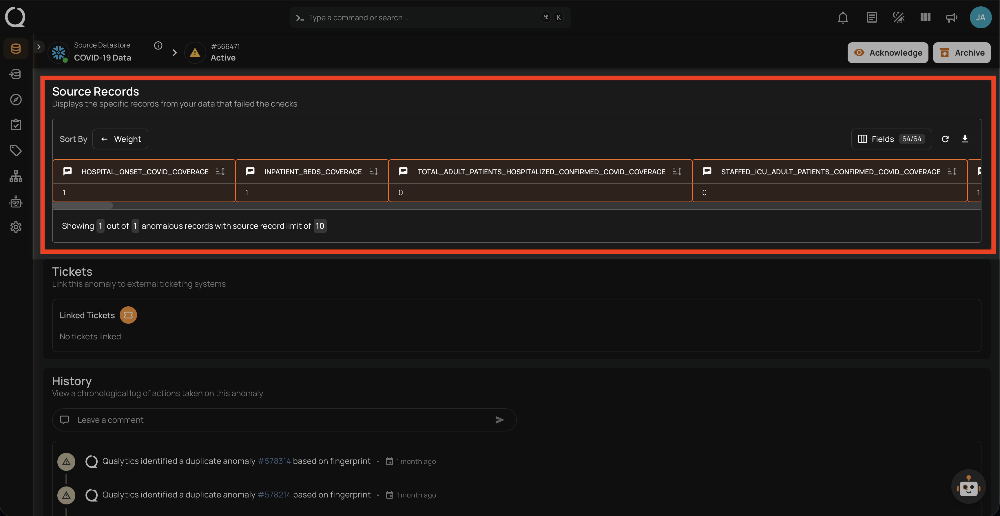

### Sort By

The **Sort By** option allows you to organize the source record columns. Click the **Sort By** button to open a dropdown with the available sorting options.

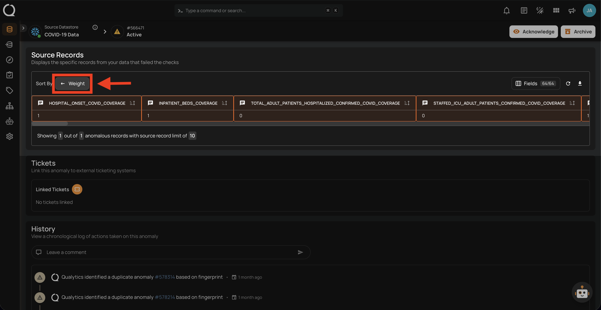

The available sort options are:

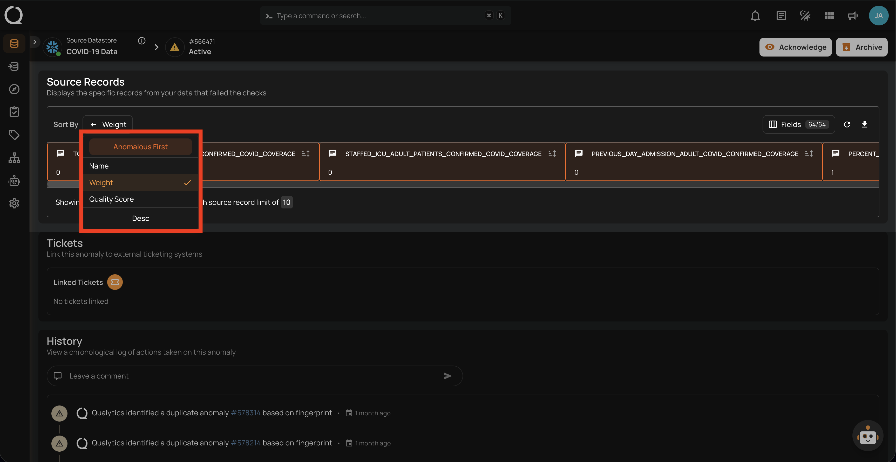

| Option | Description |
| :---- | :---- |
| **Anomalous First** | Prioritizes anomalous fields at the beginning of the table. This option is enabled by default and is automatically disabled when the **Only Anomalous** filter is active. |
| **Name** | Sorts columns alphabetically by field name. |
| **Weight** | Sorts columns by the field weight value (default). |
| **Quality Score** | Sorts columns by the field quality score. |
| **Asc / Desc** | Toggles between ascending and descending order for the selected sort option. |

### Fields

The **Fields** button displays a badge with the count of visible fields out of the total fields (e.g., `64/64`). Click it to open a searchable dropdown where you can control which columns are displayed in the source records table.

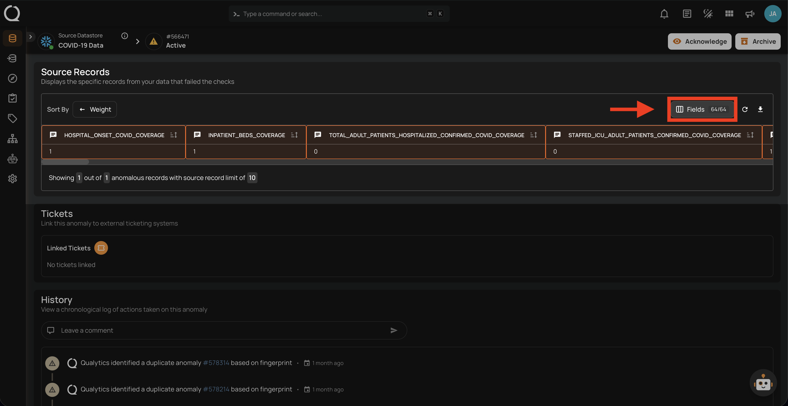

The dropdown lists all available fields with toggles to show or hide each one individually.

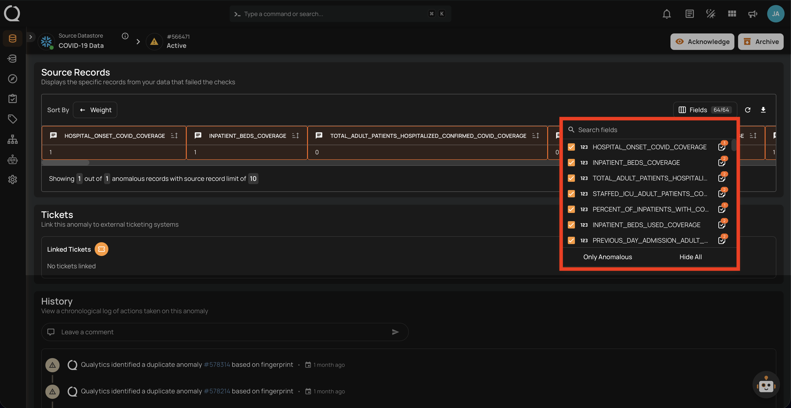

At the bottom of the dropdown, two actions are available:

- **Only Anomalous**: Filters the visible fields to display only the ones that triggered failed checks. This is useful for focusing on the fields that caused the anomaly.

    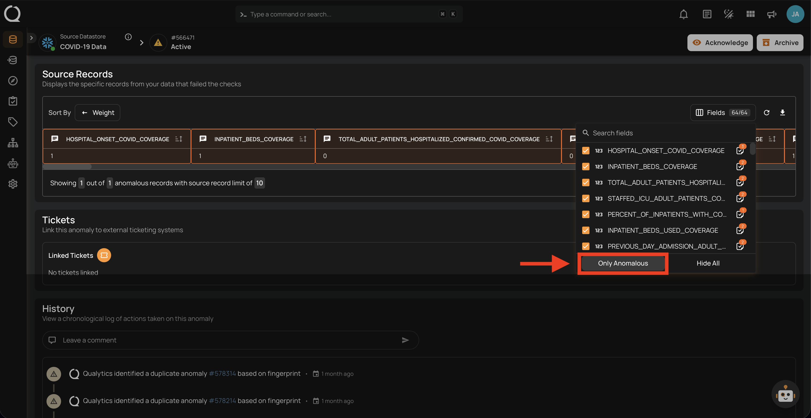

- **Hide All / Show All**: Deselects or selects all fields at once. When all fields are hidden, the option changes to **Show All** to re-enable them.

    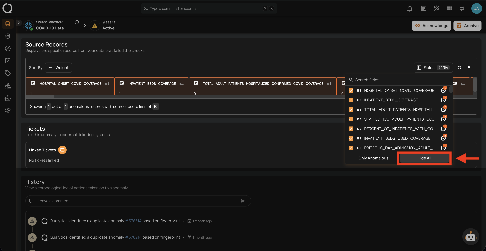

    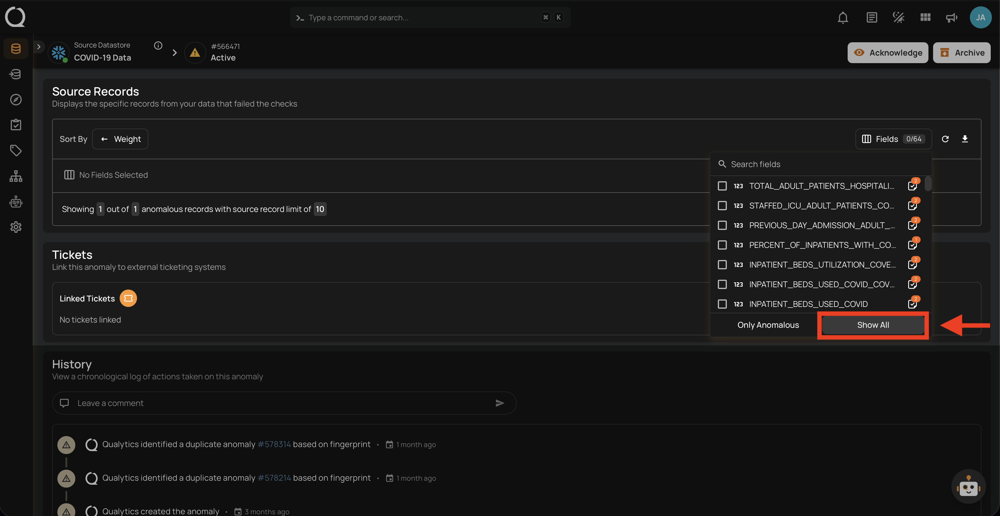

    

### Refresh Source Records

Source records are cached locally for up to **8 hours** to improve performance. If you need to view the most recent data, click the **Refresh :material-refresh:** button in the source records toolbar to bypass the cache and fetch the latest records directly from the API.

A tooltip on the button displays the **last updated timestamp**, helping you track when the data was last refreshed.

For more information, please refer to the [Force Refresh Source Records](source-record.md#force-refresh-source-records) section in the documentation.

### Download All Source Records

Click the **Download :material-download:** button to export all source records as a compressed `.csv` file, with a maximum size of **250MB**.

!!! note
    The download includes only the records that were captured during the scan. The number of available records depends on the **maximum source records per anomaly** configured in the [scan settings](../../source-datastore/operations/scan.md#configuration). If you need more records, increase the limit and re-run the scan.

## Tickets

The **Tickets** section allows you to link the anomaly to external ticketing systems for tracking and resolution workflows. This integration helps bridge data quality issues with your team's existing project management tools. Qualytics currently supports **ServiceNow** and **Jira Cloud** integrations. Ticket status is synchronized periodically from the external system. The **last synced** timestamp on each ticket card indicates when the status was last updated.

!!! warning
    Before using the Tickets feature, you must first configure a ticketing integration (ServiceNow or Jira) in the platform settings. For setup instructions, see the [Ticketing Integrations](../../settings/integrations/ticketing/ticketing.md){:target="_blank"} page.

!!! info
    Linking, creating, and unlinking tickets requires at least the **Author** role on the respective datastore, along with the **Manager** global role. For more details, see the [Team Permissions](../../settings/security/team-permissions.md){:target="_blank"} page.

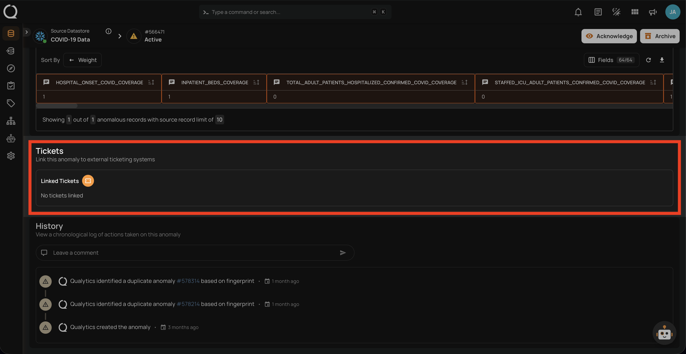

### Linking an Existing Ticket

You can link an existing ticket from your external ticketing system to an anomaly for tracking purposes.

**Step 1:** Click the **Add :material-ticket-outline:** button in the Tickets section toolbar to open the link/create dialog.

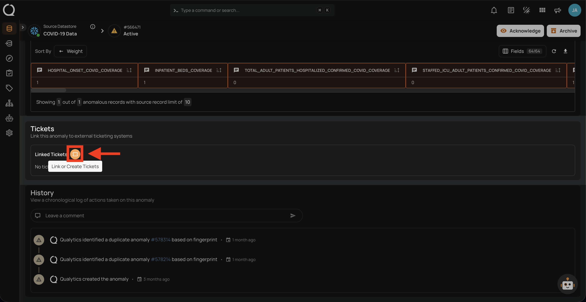

**Step 2:** In the **Link Ticket** modal, use the search field to find an existing ticket by keyword. Select the ticket you want to link from the search results.

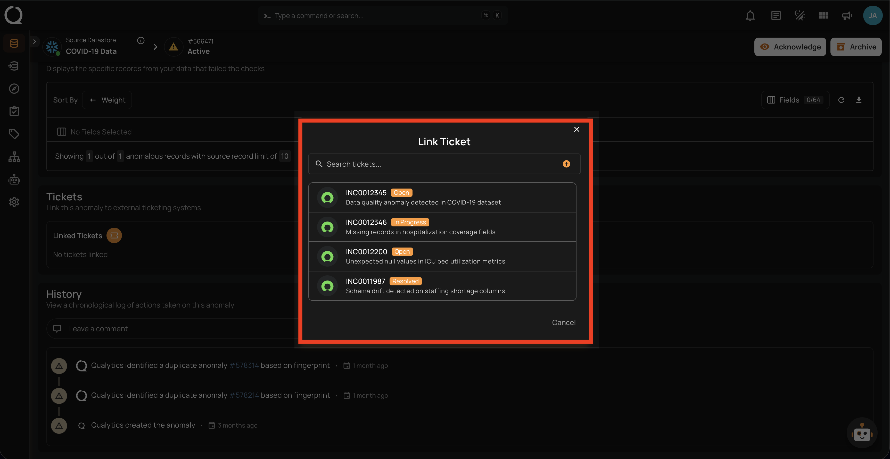

**Step 3:** The ticket will appear in the Tickets section as a linked card, displaying the ticket number, status badge, description, and the last synced timestamp.

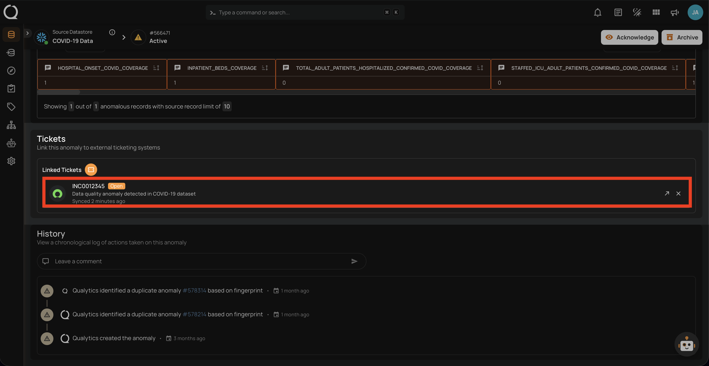

### Creating a New Ticket

If no existing ticket matches the anomaly, you can create a new one directly from the anomaly details.

!!! note
    There is no limit to the number of tickets that can be linked to a single anomaly. However, the same ticket cannot be linked to the same anomaly more than once.

**Step 1:** Click the **Add :material-ticket-outline:** button to open the dialog, then click the **Create New Ticket :material-plus-circle:** button.

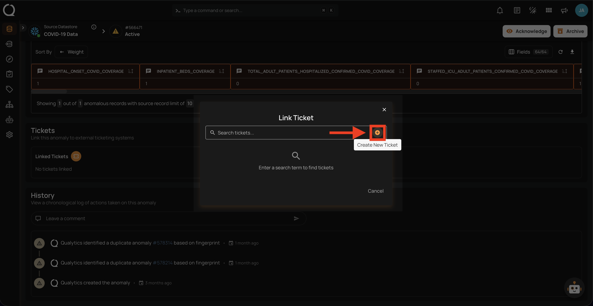

**Step 2:** Fill in the ticket form fields. The available fields depend on the configured ticketing system.

#### ServiceNow

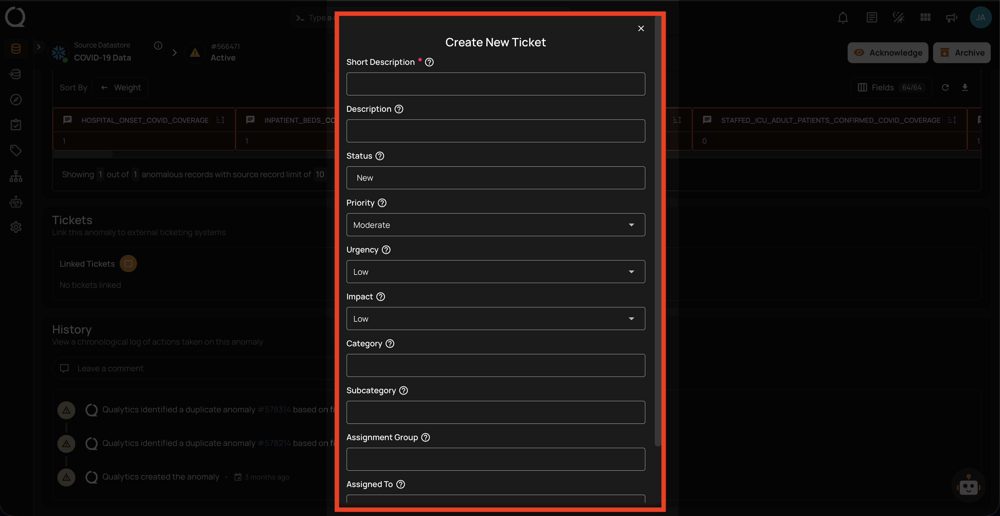

| Field | Description |
| :---- | :---- |
| Short Description * | A brief summary of the data quality issue. |
| Description | A detailed explanation of the anomaly and its impact. |
| Status | The initial incident status. Supports text names (New, In Progress, On Hold, Resolved, Closed, Canceled) or numeric codes (1, 2, 3, 6, 7, 8). |
| Priority | The ticket priority level (Critical, High, Moderate, Low, Planning). |
| Urgency | How quickly the incident needs to be resolved (High, Medium, Low). |
| Impact | The impact of the incident on business operations (High, Medium, Low). |
| Category | The ServiceNow incident category for classification. |
| Subcategory | A more specific classification within the selected category. |
| Assignment Group | The group responsible for resolving the ticket (sys_id). |
| Assigned To | The individual assigned to work on the ticket (sys_id). |

\* Required field.

#### Jira

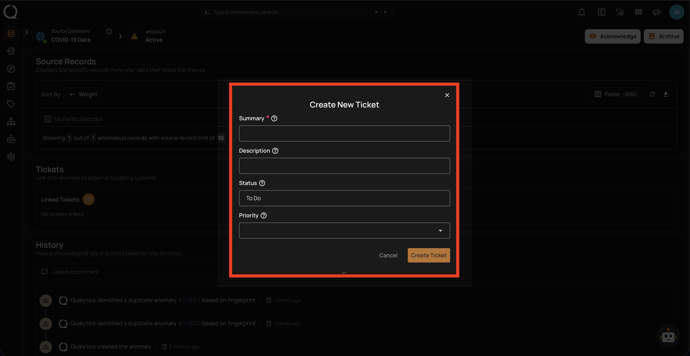

| Field | Description |
| :---- | :---- |
| Summary * | A brief summary of the data quality issue. |
| Description | A detailed explanation of the anomaly and its impact. |
| Status | The initial issue status (e.g., To Do, In Progress, Done). |
| Priority | The priority level of the issue (Highest, High, Medium, Low, Lowest). |

\* Required field.

**Step 3:** Click **Create Ticket** to submit the ticket. The new ticket will be created in the external ticketing system and automatically linked to the anomaly.

### Viewing a Linked Ticket

Click the **View :material-arrow-top-right:** button on a linked ticket card to open the ticket directly in the external ticketing system (ServiceNow or Jira) in a new browser tab.

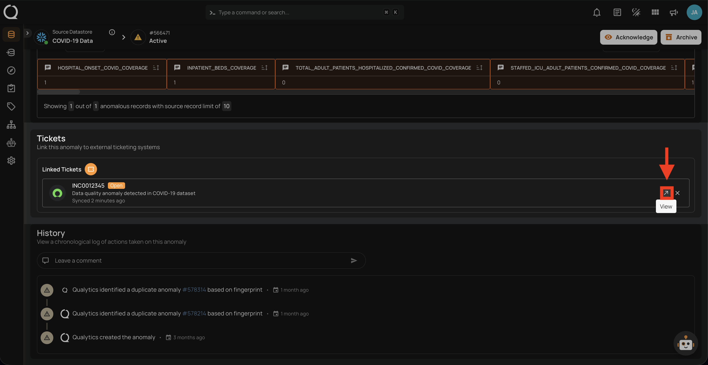

### Unlinking a Ticket

Click the **Unlink :material-close-thick:** button on a linked ticket card to remove the association between the ticket and the anomaly. The ticket itself remains in the external system — only the link in Qualytics is removed.

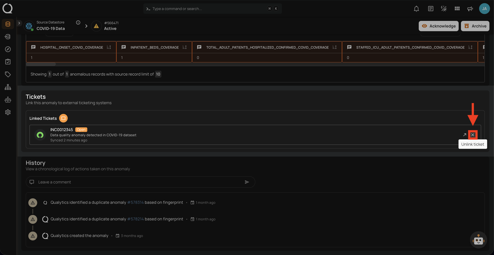

## History

The **History** section provides a chronological log of all actions taken on the anomaly. It automatically records system events such as anomaly creation, duplicate identification based on fingerprint matching, status changes, description edits, and tag updates. Each entry includes the user or system that performed the action and a timestamp.

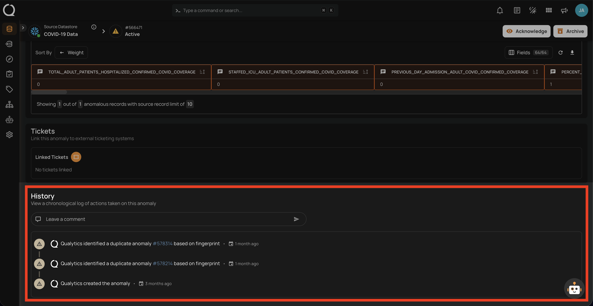

!!! warning
    Comments cannot be added, edited, or deleted when an anomaly is archived **(Resolved, Duplicate, Invalid, or Discarded)**. Restore the anomaly first to enable commenting.

### Adding a Comment

Users can leave comments to discuss the issue, add context, or communicate decisions. All comments are timestamped and attributed to the respective user.

!!! info
    Adding a comment requires at least the **Viewer** role on the datastore. For more details, see the [Team Permissions](../../settings/security/team-permissions.md){:target="_blank"} page.

**Step 1:** Type your comment in the **"Leave a comment"** input field.

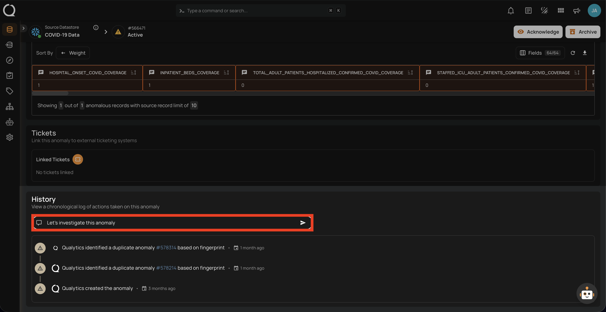

**Step 2:** Click the **Send :material-send:** button to post your comment.

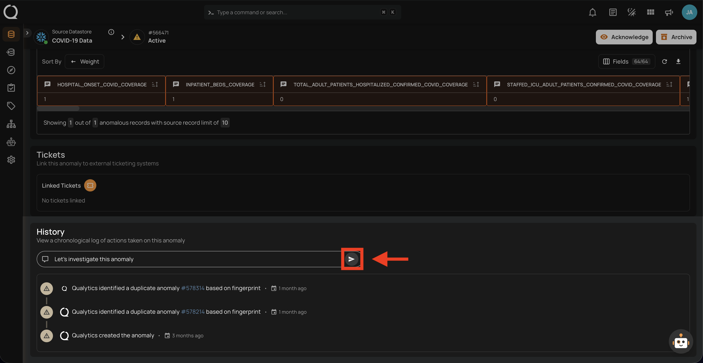

The comment will appear in the timeline with your name, the message, and a timestamp.

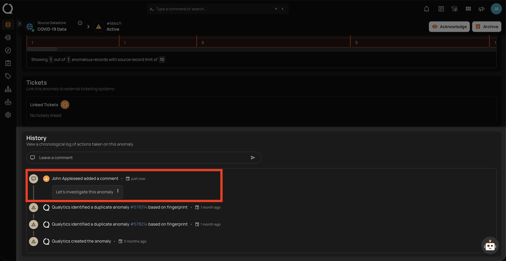

### Editing a Comment

!!! info
    Only the **comment author** can edit their own comments. Admin users cannot edit comments from other users. For more details, see the [Team Permissions](../../settings/security/team-permissions.md){:target="_blank"} page.

**Step 1:** Click the **vertical ellipsis :material-dots-vertical:** on the comment you want to edit.

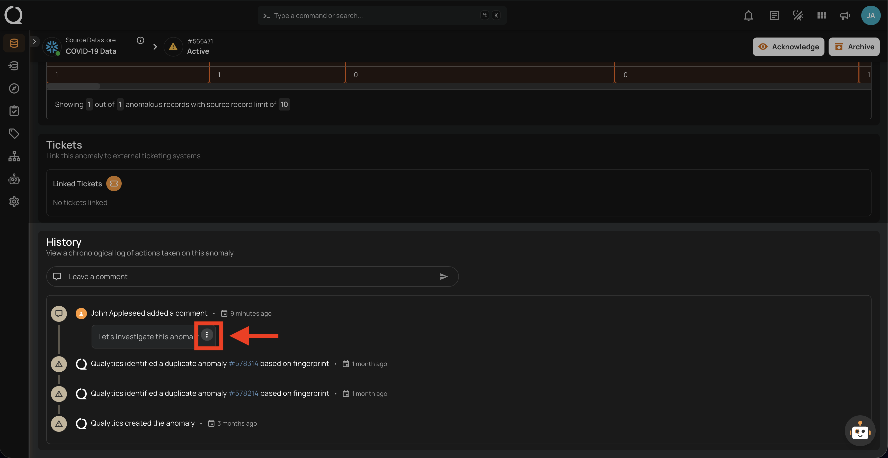

**Step 2:** Select **Edit :material-pencil-outline:** from the dropdown menu. The comment text will become editable.

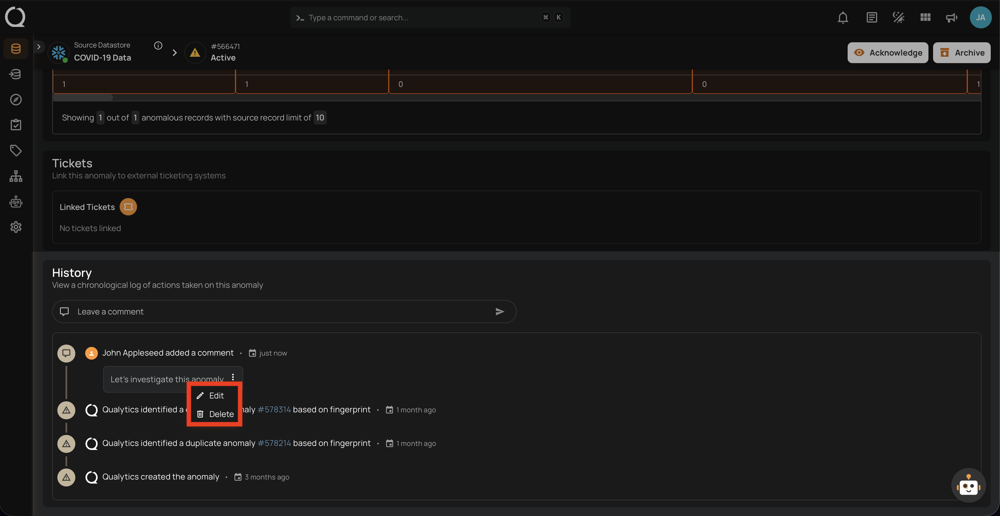

**Step 3:** Make your changes and click **Save** to persist them, or click **Cancel** to discard the changes.

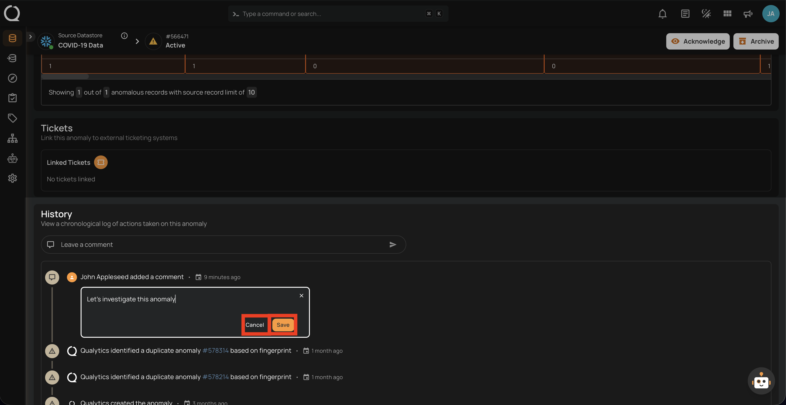

### Deleting a Comment

!!! info
    The **comment author** can delete their own comments. **Admin** users can delete any comment. For more details, see the [Team Permissions](../../settings/security/team-permissions.md){:target="_blank"} page.

**Step 1:** Click the **vertical ellipsis :material-dots-vertical:** on the comment you want to delete.

**Step 2:** Select **Delete :material-trash-can-outline:** from the dropdown menu.

A confirmation flash message will appear indicating the comment has been successfully deleted.

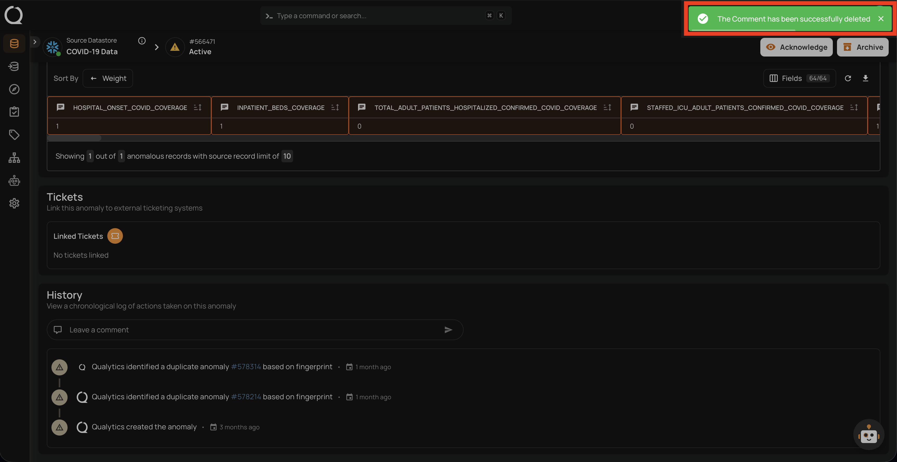

