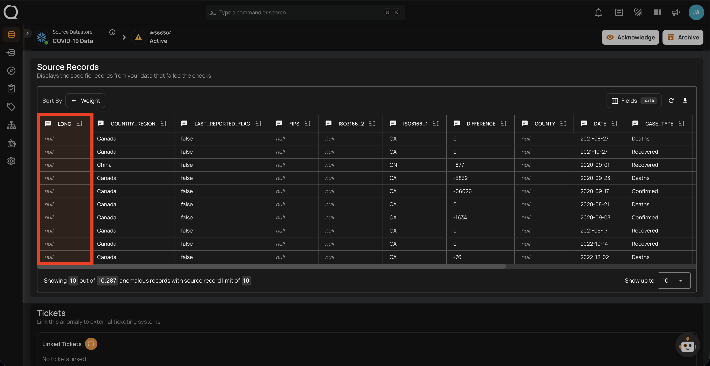
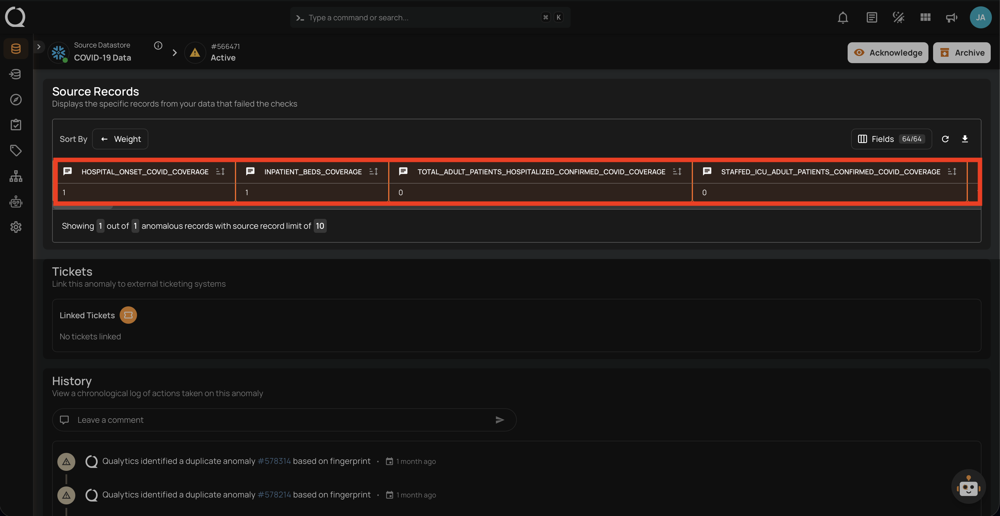
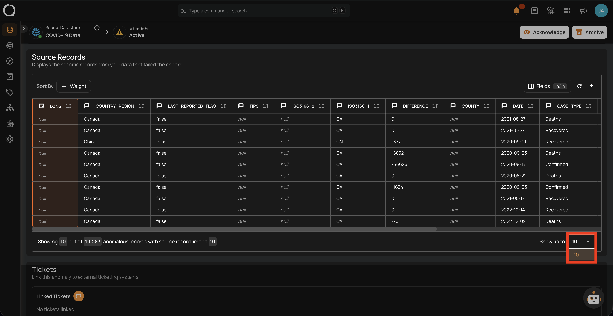
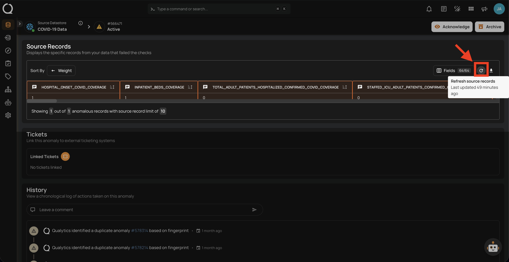
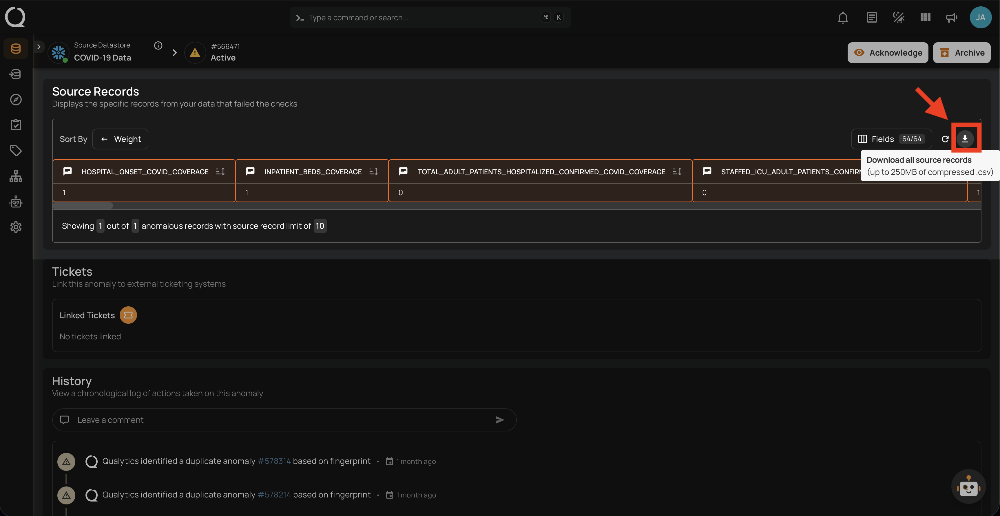
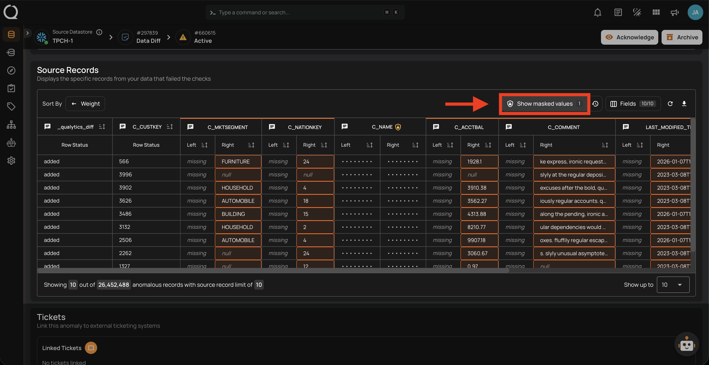
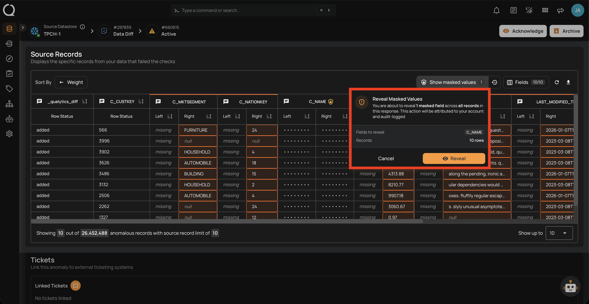
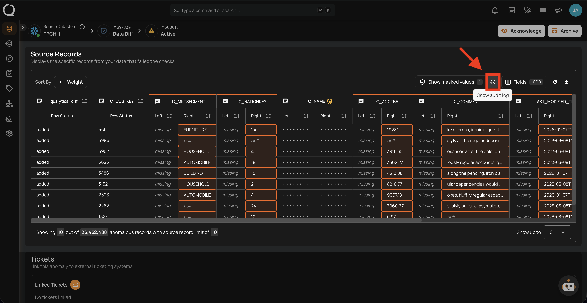
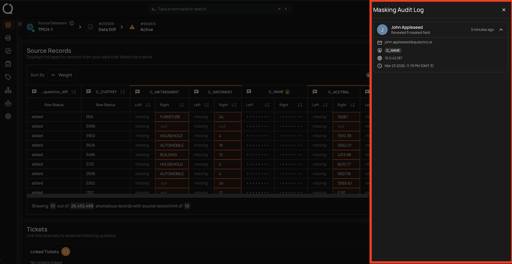
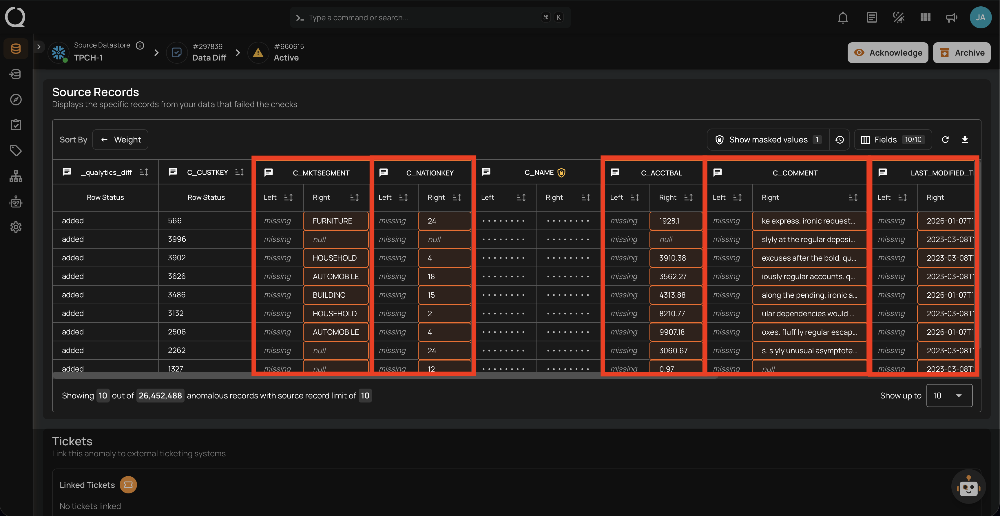

# Source Records

The **Source Records** page provides a detailed view of all records from your dataset that have failed data quality checks and been identified as anomalies. It serves as the primary interface for reviewing anomalous data at the row level, with visual highlights indicating the specific fields that triggered the anomalies. All displayed records are sourced from the linked **Enrichment Datastore**, which stores the results of data quality scans along with relevant metadata.

If the Anomaly Type is **Shape**, you will find the highlighted column(s) having anomalies in the source record.

If the Anomaly Type is **Record**, you will find the highlighted row(s) in the source record indicating failed checks. 

!!! note 
    In anomaly detection, source records are displayed as part of the Anomaly Details. For a Record anomaly, the specific record is highlighted. For a Shape anomaly, 10 samples from the underlying anomalous records are highlighted.

## Source Record Visualization

The number of source records displayed per anomaly is determined by the **Maximum Source Examples per Anomaly** setting, which can be configured during [scan setup](../../source-datastore/operations/scan.md#configuration){:target="_blank"}. The available limits are 10, 100, 1,000, or 10,000 records. The interface includes sticky headers that remain visible when scrolling through large datasets, making navigation easier during data review.

## Force Refresh Source Records

Source records are cached locally for up to **8 hours** to improve performance. If you need to view the most recent data, click the **Refresh :material-refresh:** button in the source records toolbar to bypass the cache and fetch the latest records directly from the API.

A tooltip on the button displays the **last updated timestamp**, helping you track when the data was last refreshed.

## Download Source Records

Click the **Download :material-download:** button to export all source records as a compressed `.csv` file, with a maximum size of **250MB**.

!!! note
    The download includes only the records that were captured during the scan. The number of available records depends on the **maximum source records per anomaly** configured in the [scan settings](../../source-datastore/operations/scan.md#configuration){:target="_blank"}. If you need more records, increase the limit and re-run the scan.

## Masked Fields in Source Records

If a container contains [masked fields](../../fields/field-status/managing-field-status/mask-a-field.md){:target="_blank"}, their values are obfuscated by default in source records.

Users with **Editor** permission can reveal masked values for an anomaly using the reveal toggle. Toggling reveal shows all source records attached to that anomaly at once — reveal is per-anomaly, not per-record.

### Revealing Masked Values

**Step 1:** Click the **Show masked values :material-shield-lock-outline:** toggle in the source records toolbar to initiate the reveal process.

**Step 2:** A confirmation dialog will appear indicating the number of masked fields to be revealed and the number of records affected. Click **Reveal :material-eye:** to proceed, or **Cancel** to discard.

### Masking Audit Log

Every reveal action is recorded in the **masking audit log** with the user identity, timestamp, IP address, and the specific fields accessed — this log is reviewable by Administrators.

**Step 1:** Click the **Show Audit Log :material-history:** button in the source records toolbar to open the audit log panel.

**Step 2:** A right-side panel will open displaying the **Masking Audit Log** with details including the user name, email, revealed fields, IP address, and timestamp of each reveal action.

!!! info
    To protect sensitive data consistently, masking also applies to anomaly assertion context (the values embedded in check detail descriptions). That surface does not support inline reveal — use the source record reveal toggle to investigate specific values.

## Comparison Source Records

Anomalies identified by the Data Diff rule type, configured with Row Identifiers, are displayed with a detailed source record comparison. This visualization highlights differences between rows, making it easier to identify specific discrepancies.

