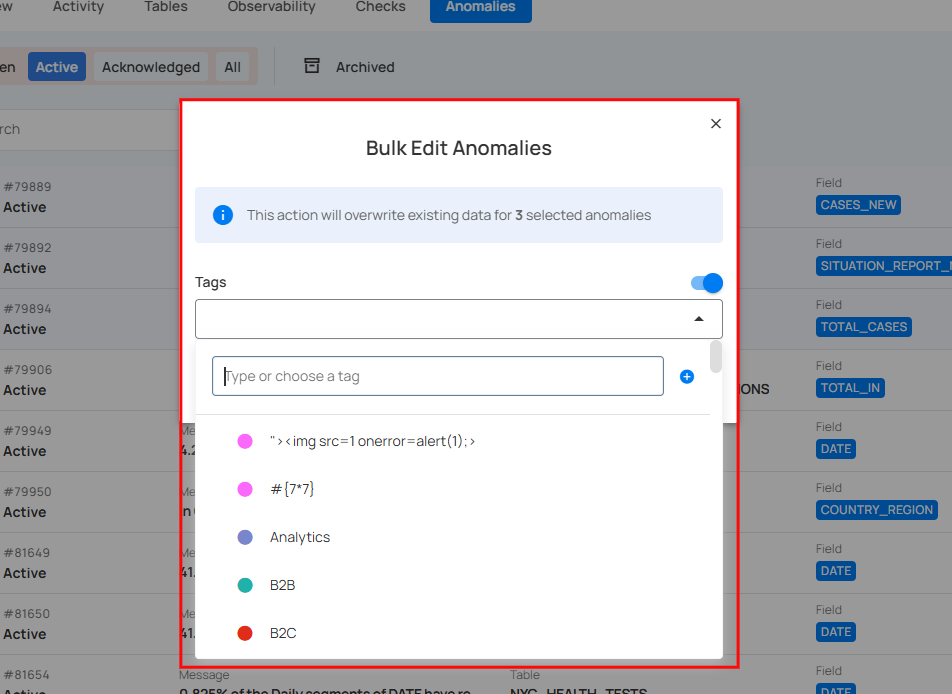
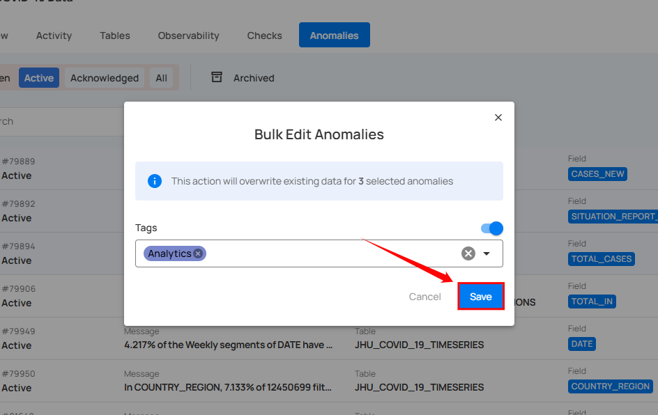

# Edit Anomalies

By editing anomalies, you can only update their tags, allowing you to categorize and organize anomalies more effectively without altering their core details.

!!! note
    When editing multiple anomalies in bulk, only the tags can be modified.

**Step 1:** Hover over the anomaly (whether Active or Acknowledged) and click on the checkbox.

You can edit multiple anomalies by selecting the checkboxes next to each anomaly to choose multiple anomalies at once.

When multiple anomalies are selected, an action toolbar appears, displaying the total number of selected anomalies along with a vertical ellipsis for additional bulk action options.

**Step 2:** Click on the **vertical ellipsis (⋮)** and choose **"Edit"** from the dropdown menu to edit the selected anomalies.

A modal window titled **“Bulk Edit Anomalies”** will appear. Here you can only modify the **“tags”** of the selected anomalies.

**Step 3**: Turn on the toggle and assign tags to the selected anomalies.

**Step 4:** Once you have assigned the tags, click on the **“Save”** button.

After clicking the **Save** button, the selected anomalies will be updated with the assigned tags.

