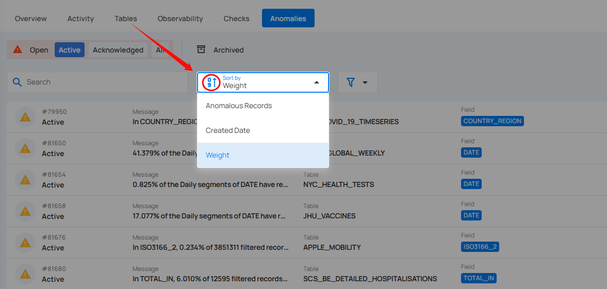

# Filter and Sort

Filter and Sort options allow you to organize your anomaly by various criteria, such as Weight, Anomalous Record, Created Date. You can also apply filters to refine your list of anomaly based on Timeframe, Type and Rule etc.

## Sort

You can sort your anomalies by **Anomalous Records**, **Created Date**, and **Weight** to easily organize and prioritize them according to your needs.

| No. | Sort By Option | Description |
| :---- | :---- | :---- |
| 1 | Anomalous Records | Sorts anomalies based on the number of anomalous records identified. |
| 2 | Created Date | Sorts anomalies according to the date they were detected. |
| 3 | Weight | Sort anomalies by their assigned weight or importance level. |

Whatever sorting option is selected, you can arrange the data either in ascending or descending order by clicking the caret button next to the selected sorting criteria.

## Filter

You can filter your anomalies based on values like **Timeframe**, **Type**, **Rule**, and **Tags** etc.

| No. | Field | Description |
| :---- | :---- | :---- |
| 1 | Timeframe | Filtering anomalies detected within specific time ranges (e.g., anomalies detected in the last week or year). |
| 2 | Type | Filter anomalies based on anomaly type (Record or Shape). |
| 3 | Rule | Filter anomalies based on specific rules applied to the anomaly. By clicking on the caret down button next to the Rule field, the available rule types will be dynamically populated based on the rule types present in the results. The rules displayed are based on the current dataset and provide more granular control over filtering. Each rule type will show a counter next to it, displaying the total number of occurrences for that rule in the dataset. For example, the rule type **Between** is displayed with a total of **3** occurrences. |
| 4 | Table | Filters anomalies based on the table where they occurred. |
| 5 | Field | Filters anomalies based on the column in the table where the issue was found. |
| 6 | Check | Filters anomalies based on the check that generated them. |

| No. | Filter | Description |
| :---- | :---- | :---- |
| 7 | Tags | Tag Filter displays only the tags associated with the currently visible items, along with their color icon, name, type, and the number of matching records. Selecting one or more tags refines the list based on your selection. If no matching items are found, a No options found message is displayed. |
