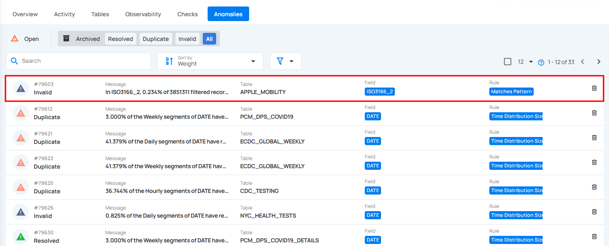
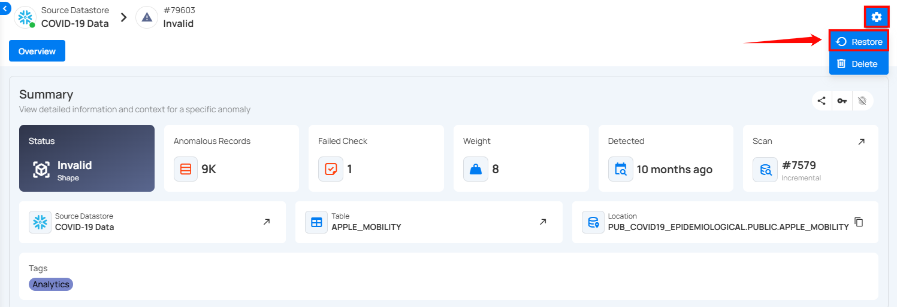

# Restore Anomalies

By restoring archived anomalies, you can bring them back into the **acknowledged** state for further investigation or review. These anomalies will not return to the **active** state once they have been acknowledged.

**Step 1**: Click on the anomaly that you want to restore from the list of archived anomalies.

**Step 2:** You will be directed to the anomaly details page. Click on the **Settings** icon located at the top right corner of the page and select **“Restore”** from the drop down menu.

After clicking on the **Restore** button, the selected anomaly is now restored in an acknowledged state and a confirmation message appears on the screen.