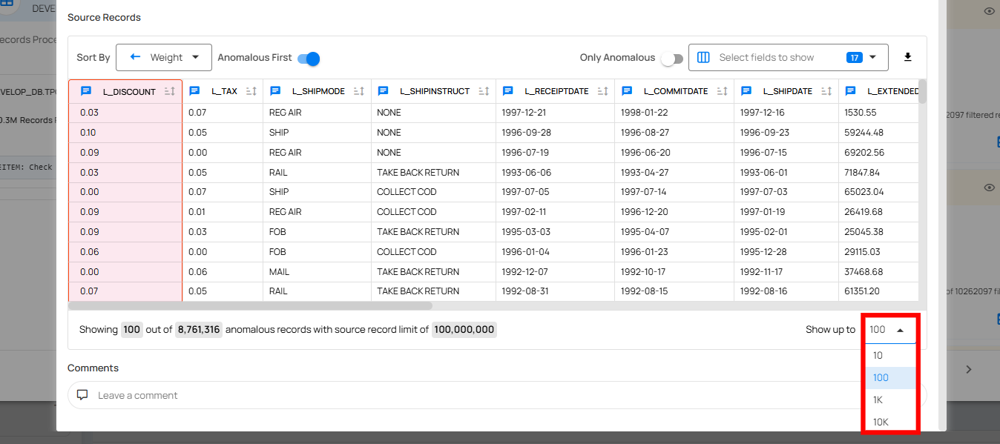
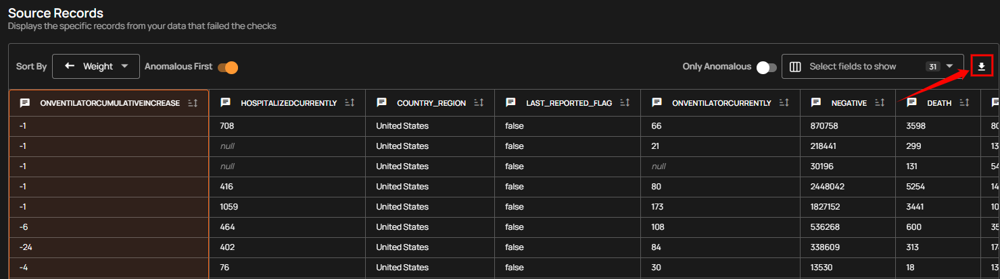

# Source Records

The **Source Records** page provides a detailed view of all records from your dataset that have failed data quality checks and been identified as anomalies. It serves as the primary interface for reviewing anomalous data at the row level, with visual highlights indicating the specific fields that triggered the anomalies. All displayed records are sourced from the linked **Enrichment Datastore**, which stores the results of data quality scans along with relevant metadata.

If the Anomaly Type is **Shape**, you will find the highlighted column(s) having anomalies in the source record.

If the Anomaly Type is **Record**, you will find the highlighted row(s) in the source record indicating failed checks. 

!!! note 
    In anomaly detection, source records are displayed as part of the Anomaly Details. For a Record anomaly, the specific record is highlighted. For a Shape anomaly, 10 samples from the underlying anomalous records are highlighted.

## Source Record Visualization

Users can view source records with selectable display limits of 10, 100, 1,000, or 10,000 records for comprehensive dataset analysis. The interface includes sticky headers that remain visible when scrolling through large datasets, making navigation easier during data review.

## Download Source Record

User can download the source records that were captured for an anomaly during the scan run. The download always includes only the records that were selected to be stored in the [scan settings](../source-datastore/scan.md#configuration) at the time the scan was configured.
 
**For example**, if the user selected **100** as the maximum number of source records per anomaly, then **100 anomalous records will be shown on the Source Records** page and the same **100 records will be available for download**. If the **user selected 10**, only those **10 records will be displayed and downloadable**. If the user needs to download more source records, the limit must be increased in the scan settings and the scan must be re-run, as records that were not captured during the scan cannot be downloaded later.

## Comparison Source Records

Anomalies identified by the Data Diff rule type, configured with Row Identifiers, are displayed with a detailed source record comparison. This visualization highlights differences between rows, making it easier to identify specific discrepancies.

