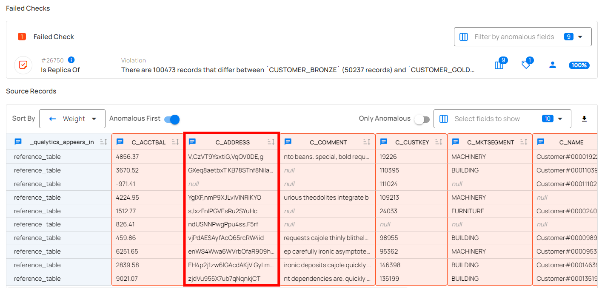
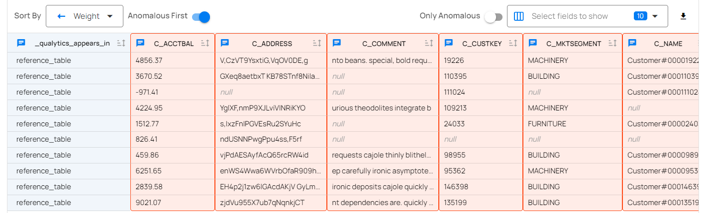

# Source Records

The **Source Records** page provides a detailed view of all records from your dataset that have failed data quality checks and been identified as anomalies. It serves as the primary interface for reviewing anomalous data at the row level, with visual highlights indicating the specific fields that triggered the anomalies. All displayed records are sourced from the linked **Enrichment Datastore**, which stores the results of data quality scans along with relevant metadata.

If the Anomaly Type is **Shape**, you will find the highlighted column(s) having anomalies in the source record.

If the Anomaly Type is **Record**, you will find the highlighted row(s) in the source record indicating failed checks. 

!!! note 
    In anomaly detection, source records are displayed as part of the Anomaly Details. For a Record anomaly, the specific record is highlighted. For a Shape anomaly, 10 samples from the underlying anomalous records are highlighted.

## Comparison Source Records

Anomalies identified by the Is Replica Of data quality rule type, configured with Row Identifiers, are displayed with a detailed source record comparison. This visualization highlights differences between rows, making it easier to identify specific discrepancies.

