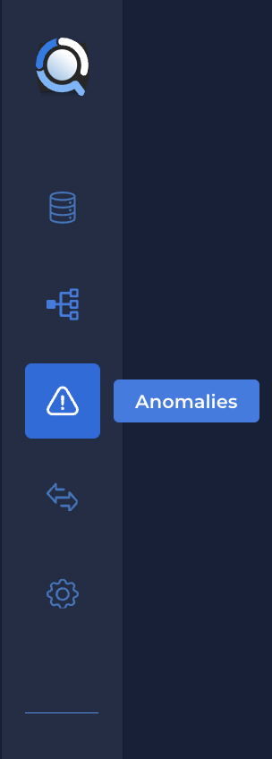
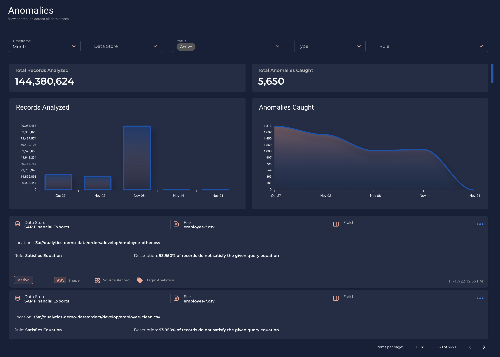
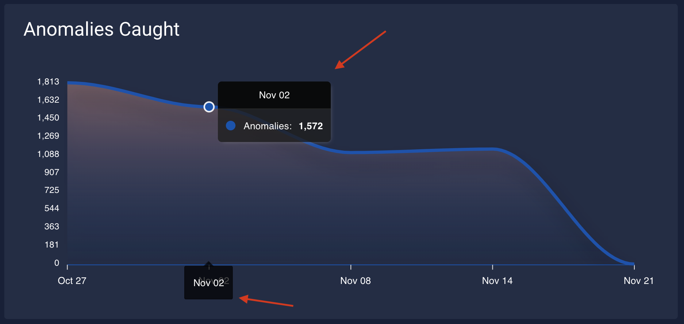
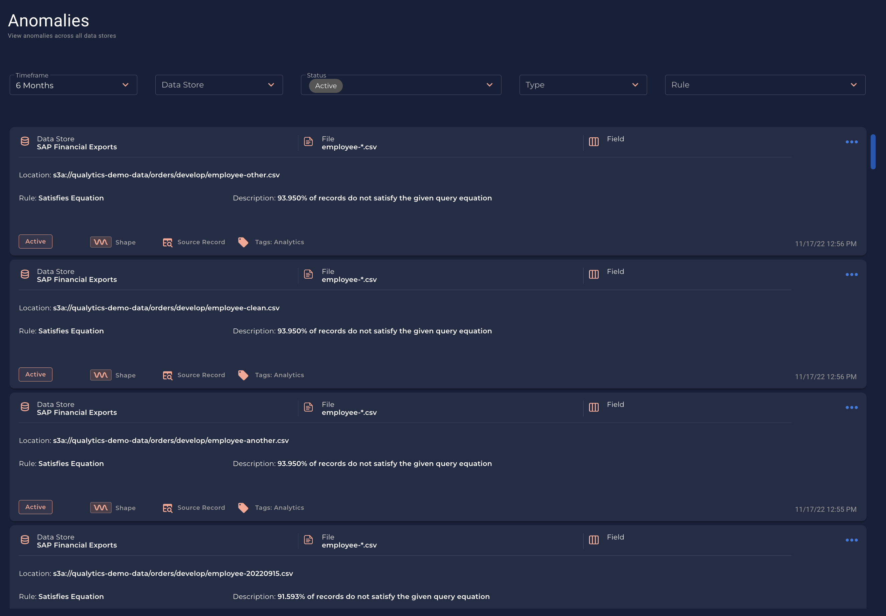

# Universal Anomalies

* The universal Anomalies enables users to interact with all Anomalies from all data stores. This page is available through the main navigation and includes high-level universal analytics as well.

* The general `Anomalies` tab is shown as a separated section as an overview of the anomalies of your ecosystem. 

* You can access this section in the menu:

    {: style="height:350px"}

* In this view, you can see the details of all the grouped datastores or filter for a specific data store.

    

---

# Records Analyzed

* You can see a detailed bar chart that shows all the records analyzed during a `timeframe`

    

---

# Anomalies Caught

* Also, you can see a detailed graph of `Anomalies Caught` during a `timeframe`.

    

---

# List of all the anomalies

* You can also see the list of all anomalies that exists in your Qualytics App

    
