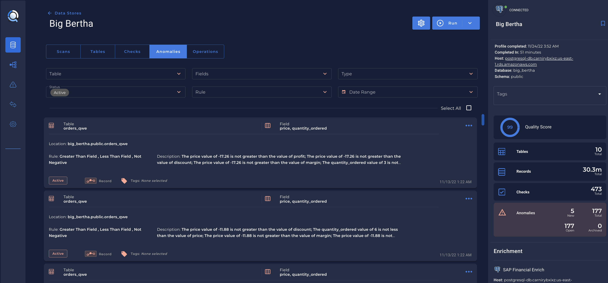
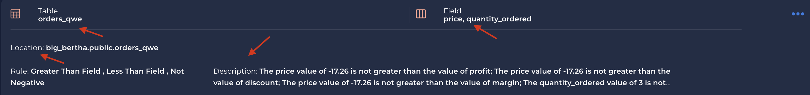
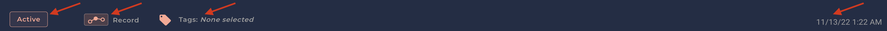

# What is an Anomaly?

* An `Anomaly` can be a single data, record or a batch of data, depending on what your data source is composed. Is something that deviates from the standard, normal, or expected. This can be in the form of a single data point, record, or a batch of data.

* An `Anomaly` works together with one or more Infered or Authored `Quality Checks`.

* The Anomalies tab shows all anomalies found as part of a Scan operation:

* Once you have your first [Scan](/operations/scan) executed, the Qualytics App will show the anomalies with the following information:

    

    1. `Table`/`File`: The `Table` or `File` name where the anomaly it's located.
    2. `Field`: The field(s) where Qualytics found an anomaly.
    3. `Location`: Is the fully qualified name where the table and field is located.
    4. `Rule`: Is the `Infered` or `Authored` check for this specific field.
    5. `Description`: Is the description of what the `Scan` found as an `Anomaly` when executed.

    

    1. `Status`: The status of the anomaly. If it's `active`, `acknowledged`, `resolved` or `invalid`.
    2. `Type`: The specification type can be `Record` or `Shape`.
    3. `Tag`: Is the label you can add related to the anomaly.
    4. `Date time`: Is the date time which the anomaly was generated.

!!! note
    When the <spam id='required'>`New`</spam> message is shown, means that this is a new active anomaly.
    
---
# Status

* The `Anomaly Status` can be `Active`, `Acknowledged`, `Resolved` and `Invalid`.

    1. `Active`: When the anomaly is active, and you need to do some action.
    2. `Acknowledged`: When you know the existence of this anomaly but you didn't solve yet.
    3. `Resolved`: It's an anomaly which you already solved in a record perspective.
    4. `Invalid`: When Qualytics creates an anomaly but you know that it's correct, so you can make it as an `invalid` anomaly.

---

# Type 

* An anomaly type can be `Record` or `Shape`.

* `Record anomaly` is an issue with exactly one record.
    1. Should also present the source record if available or a note explaining why it is not available.

* `Shape anomaly` is an issue with more than one record.

    1. Should also present the number of records analyzed and the applicable anomalous frequency calculated for that sample of records.
