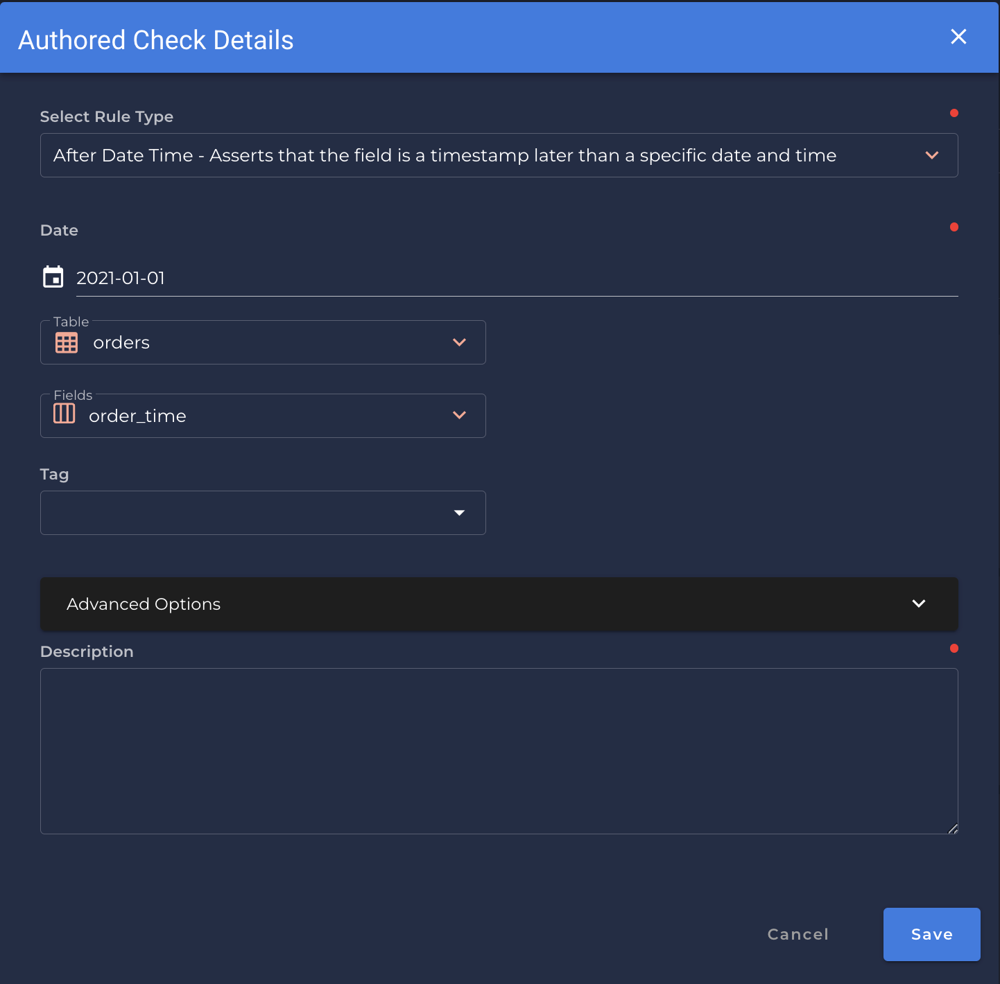

# After Date Time <spam id='single-field'>`single field`</spam>

---
*Asserts that the field is a timestamp later than a specific date and time.*

{: style="height:450px"}

!!! example
    `order_time` is later than `2021-01-01`

=== "`Record Anomaly` error message"
    The `[field_name]` value of '`[x date time]`' is not later than `[selected_date_time]`

=== "`Shape Anomaly` error message"
    In `[field_names]`, `[x]`% are not later than `[selected_date_time]`

--- 