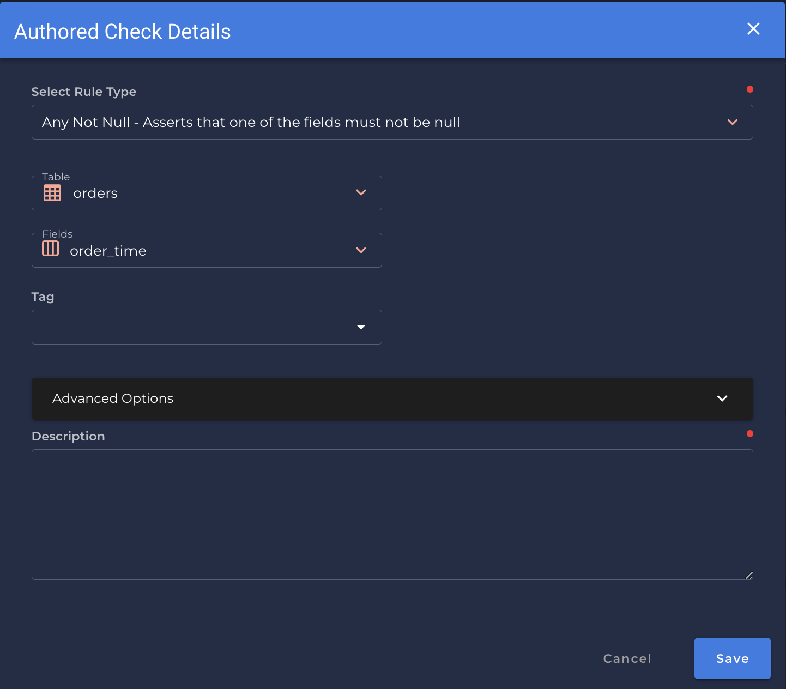

# Any Not Null <spam id='multiple-fields'>`multiple fields`</spam>

--- 

*Asserts that one of the fields must not be null*

| Accepted Field Types   |                      |
| :--------------------: | :------------------: |
| `Date`                 | :white_check_mark:   |
| `Timestamp`            | :white_check_mark:   |
| `Integral`             | :white_check_mark:   |
| `Fractional`           | :white_check_mark:   |
| `String`               | :white_check_mark:   |
| `Boolean`              | :white_check_mark:   |

{: style="height:450px"}

!!! example
    At least one of the fields `order_time` is not null.

=== "`Record Anomaly` error message"
    There is no value set for any of '`[field_name]`'

=== "`Shape Anomaly` error message"
    In `[field_names]`, `[x]`% have no value set for any of `[selected_field_name]`

--- 