# Check Templates

Check Templates empower users to efficiently create, manage, and apply standardized checks across various datastores, acting as blueprints that ensure consistency and data integrity across different datasets and processes.

Check Templates streamline the validation process by enabling check management independently of specific data assets such as datastores, containers, or fields. These templates reduce manual intervention, minimize errors, and provide a reusable framework that can be applied across multiple datasets, ensuring all relevant data adheres to defined criteria. This not only saves time but also enhances the reliability of data quality checks within an organization.

Let's get started 🚀

**Step 1:** Log in to your Qualytics account and click the **“Library”** button on the left side panel of the interface.


**Step 2:** Click on the **“Add Check Template”** button located in the top right corner.

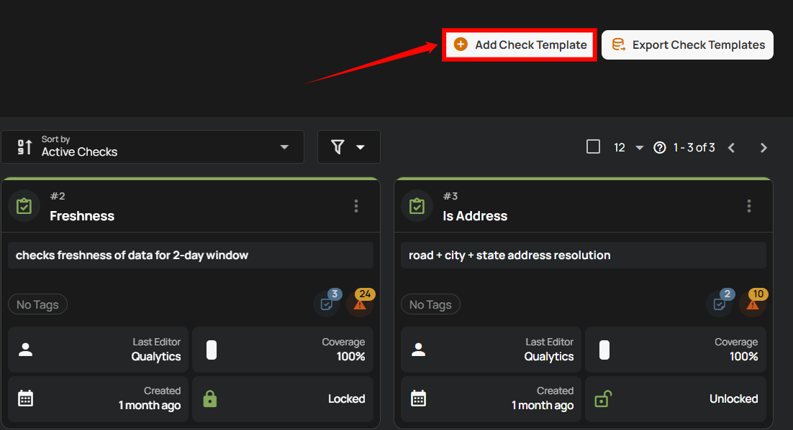

A modal window titled **“Check Template Details”** will appear, providing you with the options to add the check template details.

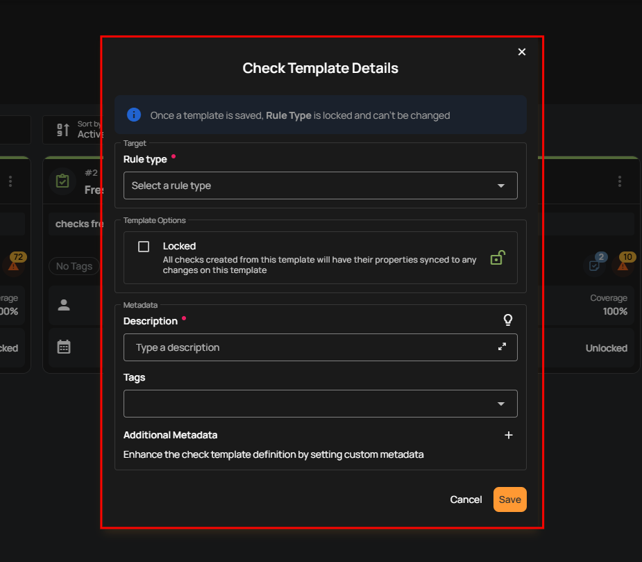

**Step 3:** Enter the following details to add the check template:

- **Rule Type (Required)**  
- **Filter Clause**
- **Template Locked**
- **Description (Required)**  
- **Tags**  
- **Additional Metadata**  

**1. Rule Type (Required):** Select a Rule Type from the dropdown menu for data validation, such as checking for non-null values, matching patterns, comparing numerical values, or verifying datetime constraints. Each rule type defines the specific validation logic to be applied.

For more details about the available rule types, refer to the "[Check Rule Types](./overview-of-a-check.md#check-rule-types)" section.

!!! note
    Different rule types have different sets of fields and options appearing when selected.

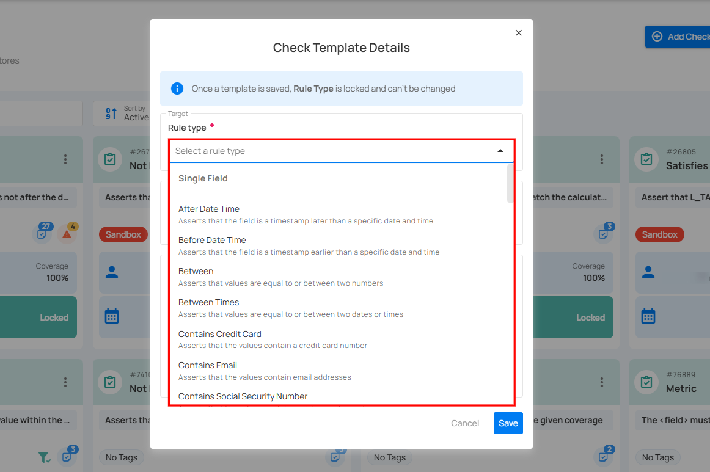

**2. Filter Clause:** Specify a valid [Spark SQL](https://spark.apache.org/docs/latest/sql-ref.html) `WHERE` expression to filter the data on which the check will be applied.

The filter clause defines the conditions under which the check will be applied. It typically includes a `WHERE` statement that specifies which rows or data points should be included in the check.

**Example:** A filter clause might be used to apply the check only to rows where a certain column meets a specific condition, such as `WHERE status \= 'active'`.

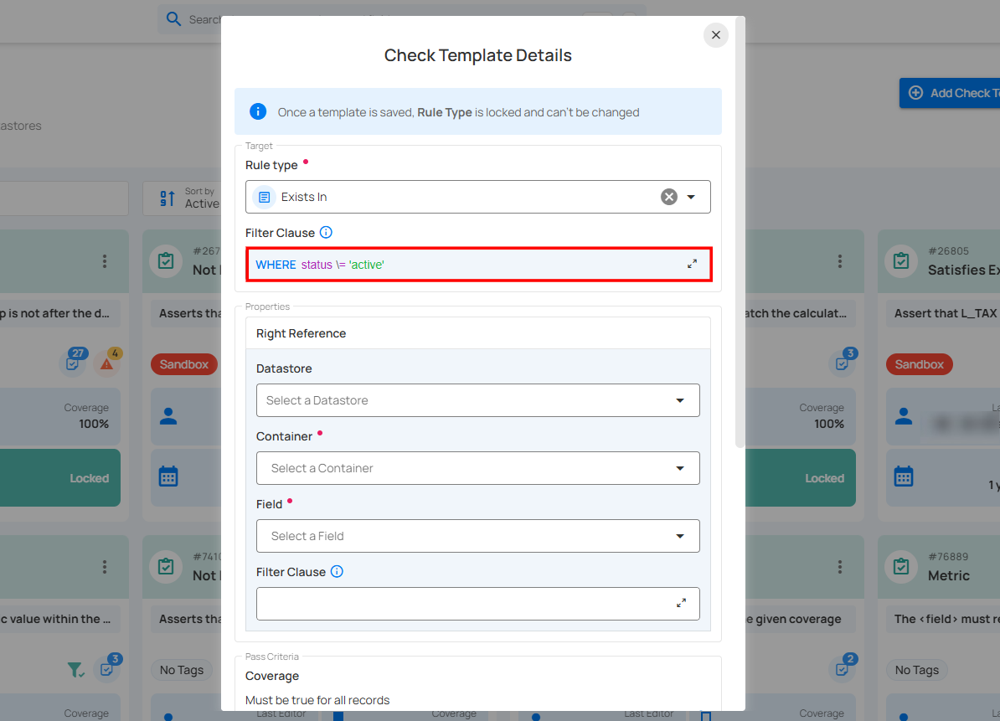

**Using each() in Filter Clauses**

The each() keyword allows you to define a single Check Template that automatically expands into multiple checks — one for each value in a provided array.

This makes it easier to apply the same check logic across multiple dimensions (such as regions, countries, or product categories) without manually creating separate checks.

**Syntax:**

```
<field_name> = each('<VALUE_1>', '<VALUE_2>', '<VALUE_3>', ...)
```
**Example:**

```
country_code = each('BRA', 'USA', 'ESP', 'CHN')
```
When this template is applied, Qualytics creates four checks, each using one of the specified
values for **country_code**

**Behavior:**

- The **each()** keyword can be used only in the filter clause of a Check Template.
- It is **not supported** on individual checks.
- If used in a check filter directly, an error appears, **each()** is not supported on a Check’s filter clause.
- You can include multiple **each()** clauses in the same filter clause.
- Each clause is expanded independently, generating all possible permutations of values.

!!! note
    Permutation logic runs only when a check is **created from a template** or when the **template is updated and saved**. Editing an existing check does **not** trigger permutations.

**Checks Created by each()**

<!--ARCADE EMBED START--><div style="position: relative; padding-bottom: calc(48.0208% + 41px); height: 0px; width: 100%;"><iframe src="https://demo.arcade.software/mCGecmHRiwak8lOLlWOX?embed&embed_mobile=tab&embed_desktop=inline&show_copy_link=true" title="Arcade Flow (Mon Nov 10 2025)" frameborder="0" loading="lazy" webkitallowfullscreen mozallowfullscreen allowfullscreen allow="clipboard-write" style="position: absolute; top: 0; left: 0; width: 100%; height: 100%; color-scheme: light;" ></iframe></div><!--ARCADE EMBED END-->

**Example:**

```
region = each('EU', 'US') AND category = each('Retail', 'Wholesale')
```
→ Produces **4 checks** (2 × 2 permutations).

- During template execution, the ControlPlane automatically expands **each()** array to create all necessary permutations of checks.

**Locked vs. Unlocked Templates**

The way checks are added or removed depends on whether the template is locked.

| Template State | Behavior |
|----------------|----------|
| **Locked**     | Removing a value from an `each()` array deletes the corresponding check. Adding a new value creates a new check. |
| **Unlocked**   | Adding a new value creates a new check. Removing a value does not delete existing checks. |

**Example**

Filter Clause:
`country_code = each('ITA', 'MEX', 'ESP')`

**Result**

- The system generates three checks — one each for Italy, Mexico, and Spain.

- Adding **'BRA'** creates a new check for **Brazil**.

- If the template is **locked** and **'ESP'** is removed, the Spain check is deleted.

- If the template is **unlocked**, existing checks remain even after removing values.

!!! notes
    - each() can be combined with other standard filter operators (=, >, <, IN, etc.).
    - Multiple each() filters can be used within the same clause to support complex filtering logic.
    - This feature applies only to checks generated from templates — not to manually created checks.
    - When templates are applied, each() arrays are expanded automatically to generate the required checks behind the scenes.

Adjust the **Coverage** setting to specify the percentage of records that must comply with the check.

!!! note
    The Coverage setting applies to most rule types and allows you to specify the percentage of records that must meet the validation criteria.

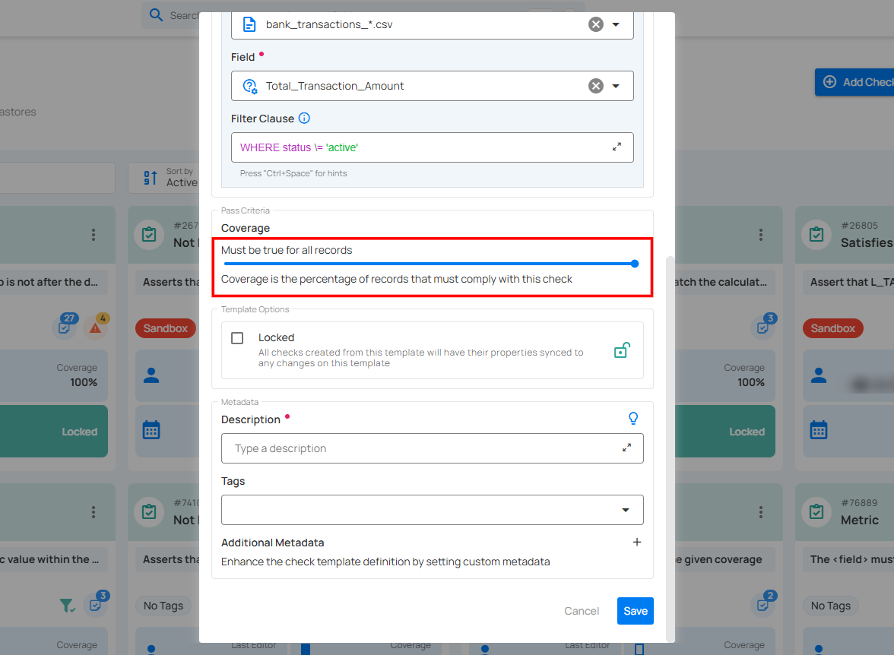

**3. Template Locked:** Check or uncheck the **"Template Locked"** option to determine whether all checks created from this template will have their properties automatically synced to any changes made to the template.

For more information about the template state, jump to the "[**Template State**](#template-state)" section below.  


**4. Description (Required):** Enter a detailed description of the check template, including its purpose, applicable data, and relevant information to ensure clarity for users. If you're unsure of what to include, click on the "💡" **lightbulb** icon to apply a suggested description based on the rule type.

**Example:** "The < field > must exist in `bank_transactions_*.csv.Total_Transaction_Amount` (Bank Dataset - Staging)".

This description clarifies that the specified field must be present in a particular file (`bank_transactions_*.csv`) and column (`Total_Transaction_Amount`) within the Bank Dataset.

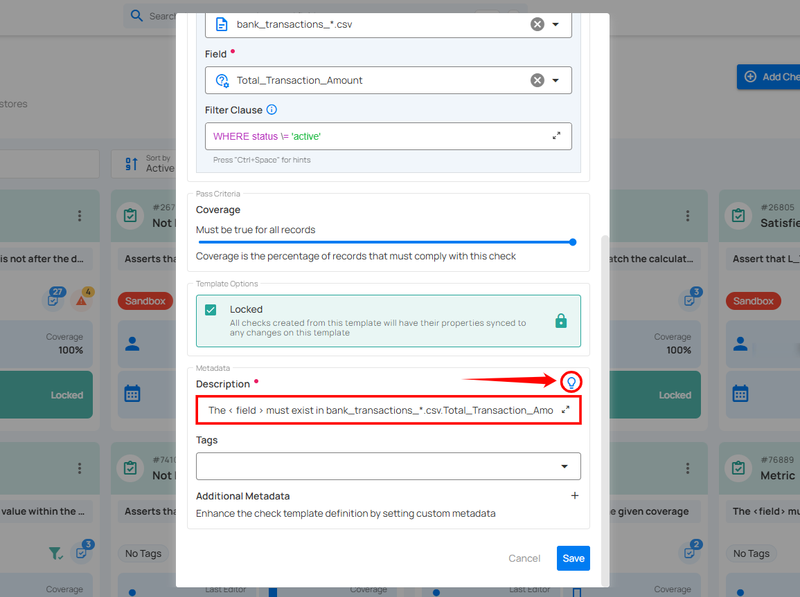

**5. Tags:** Assign relevant tags to your check template to facilitate easier searching and filtering based on categories like **"data quality,"** **"financial reports,"** or **"critical checks."**

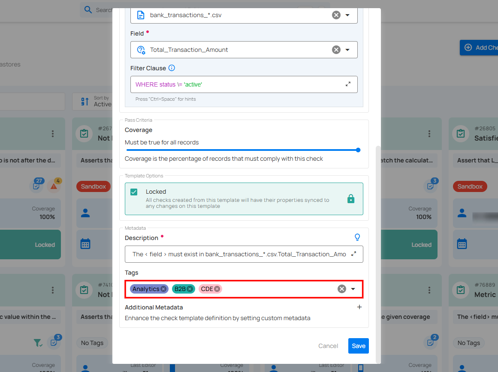

**6. Additional Metadata:** Add key-value pairs as additional metadata to enrich your check. Click the plus icon **(+)** next to this section to open the metadata input form, where you can add key-value pairs.

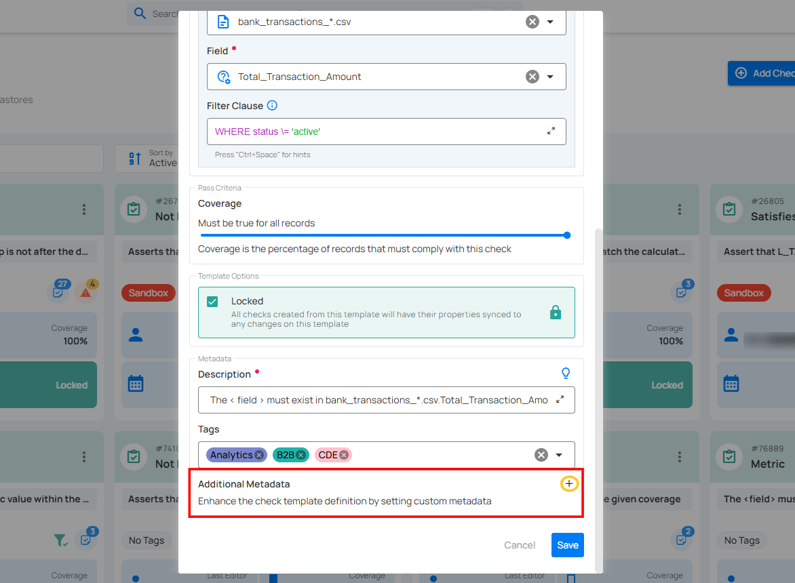

Enter the desired key-value pairs (e.g., **DataSourceType: SQL Database** and **PriorityLevel: High**). After entering the necessary metadata, click **"Confirm"** to save the custom metadata.  

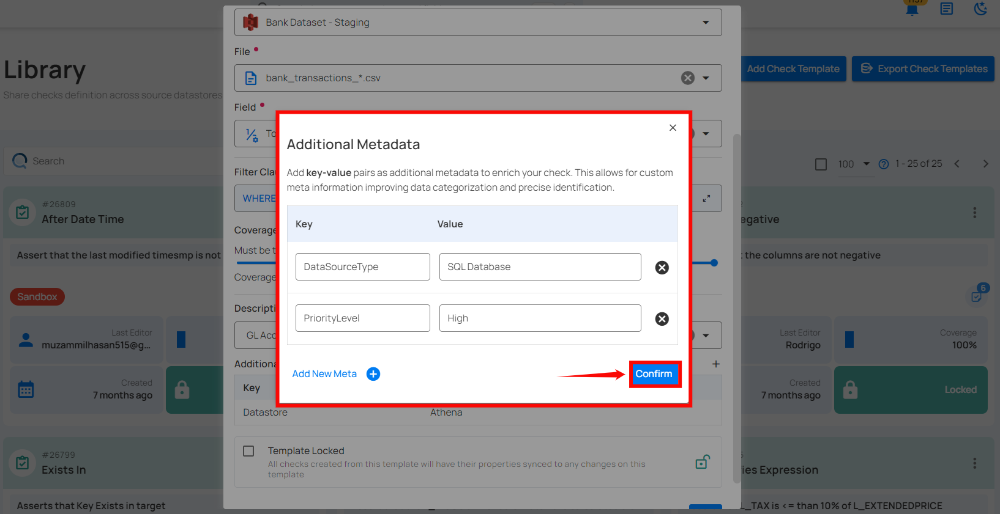

**Step 4:** Once you have entered all the required fields, click the **“Save”** button to finalize the template.

!!! warning
    Once a template is saved, the selected rule type becomes locked and cannot be changed.

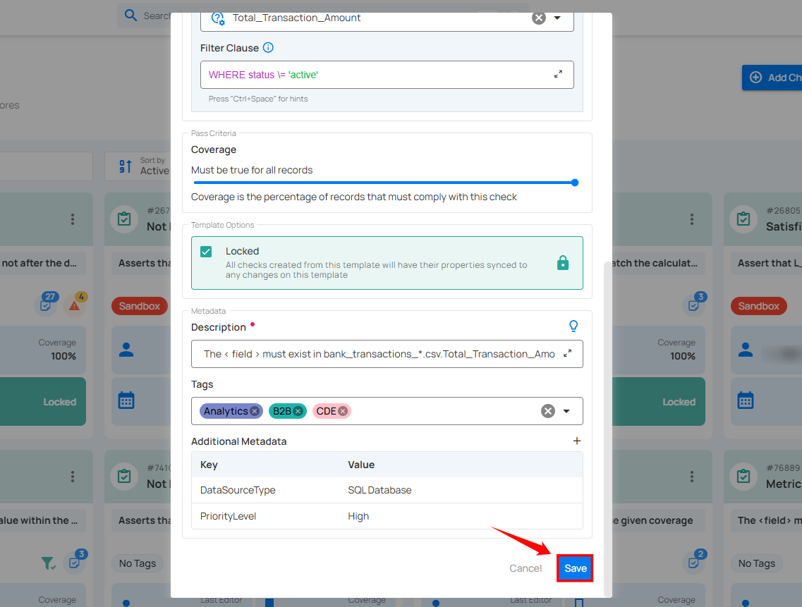

After clicking the **Save** button, a success notification appears on the screen confirming that the check template was created successfully.

After saving the check template, you can now **Apply a Check Template to create Quality Checks**, which will enforce the validation rules defined in the template across your datastores. This ensures consistent data quality and compliance with the criteria you’ve established.

Once a check template is created, you can view its details by clicking on it, where three tabs are displayed at the top: **Overview**, **Checks**, and **Anomalies**.

## Overview

The **Overview** tab gives a complete view of a check template, showing its key details, configuration, and recent activities. In the **Summary** section, users can also use redirect buttons to quickly navigate to related tabs like **Checks** and **Active Anomalies**. Information is divided into three sections: **Summary**, **Activity**, and **Definition**.

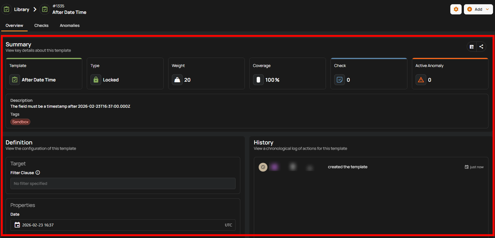

### Summary

The Summary section provides a quick overview of the check template’s key details, including its name, type, priority, coverage, associated checks, active anomalies, description, and tags — helping users quickly understand its purpose and current status.

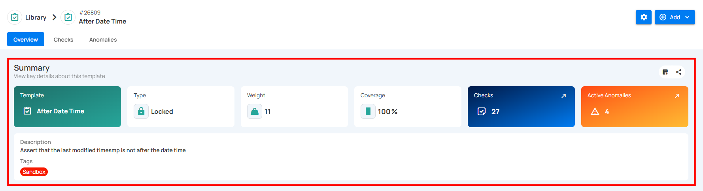

| REF. | Field | Description |
| :---- | :---- | :---- |
| 1 | Template | The rule type of the check template, indicating its purpose (e.g., “After Date Time”). |
| 2 | Type | Indicates whether the template is **Locked** (cannot be edited) or **Unlocked** (editable). |
| 3 | Weight | A numeric value representing the importance or priority level of the template in scoring or decision-making. |
| 4 | Coverage | The percentage of relevant dataset elements to which this template is applied. |
| 5 | Checks | The total number of checks currently using this template. You can click on the **(↗)** button to navigate directly to the Checks tab.|
| 6 | Active Anomalies | The count of unresolved anomalies detected by checks associated with this template. You can click on the **(↗)** button to navigate directly to the Anomalies tab.|
| 7 | Description | A short statement explaining the logic or purpose of the check template. |
| 8 | Tags | Used to categorize and filter templates (e.g., “Sandbox”). Users can change the tags by clicking the tag badge. |

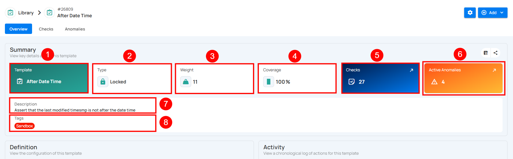

### Definition

The Definition section displays the configuration details of a check template. It outlines the target conditions, specific properties, and any additional metadata associated with the template, providing clarity on how and where it is applied.

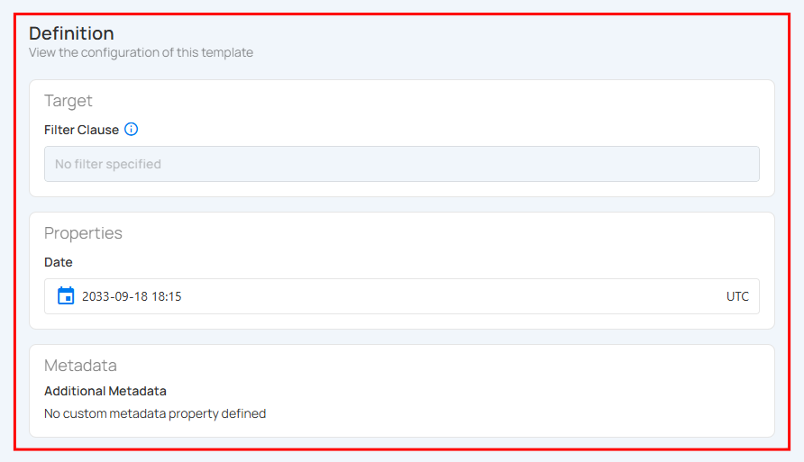

| REF. | Field | Description |
| :---- | :---- | :---- |
| 1 | Target | Defines the filter condition applied to the dataset. If no filter is specified, the check template applies to all data in the target scope.|
| 2 | Properties | Displays configuration details specific to the check type. Content varies based on the selected check: <br><ul><li> **Field Count checks**: Shows "Number of Fields". </li><li> **Metric checks**: Shows "Comparison", "Min Value", and "Max Value".</li> |
| 3 | Metadata | Displays any custom metadata properties linked to the template. If none are defined, this section remains empty. |

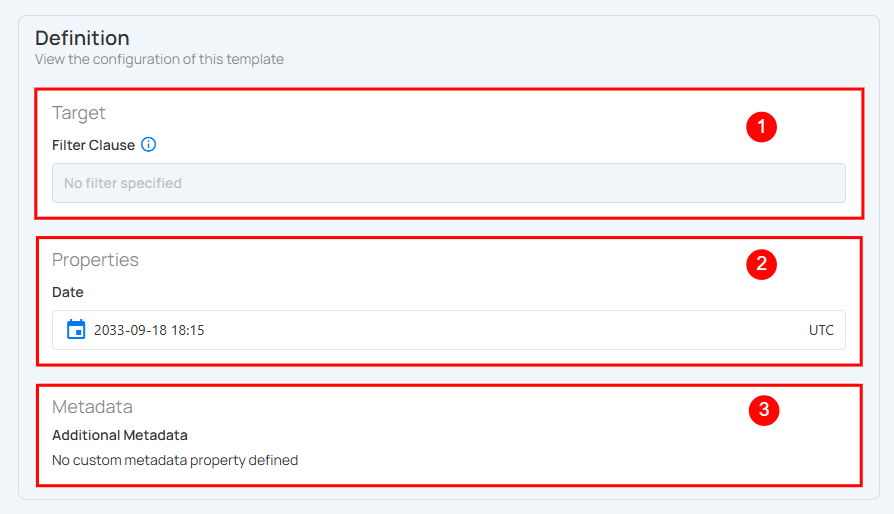

### Activity

The Activity section provides a chronological log of all actions and updates related to this template. It tracks key events such as creation, modifications, and other relevant activities, along with timestamps to show when they occurred.

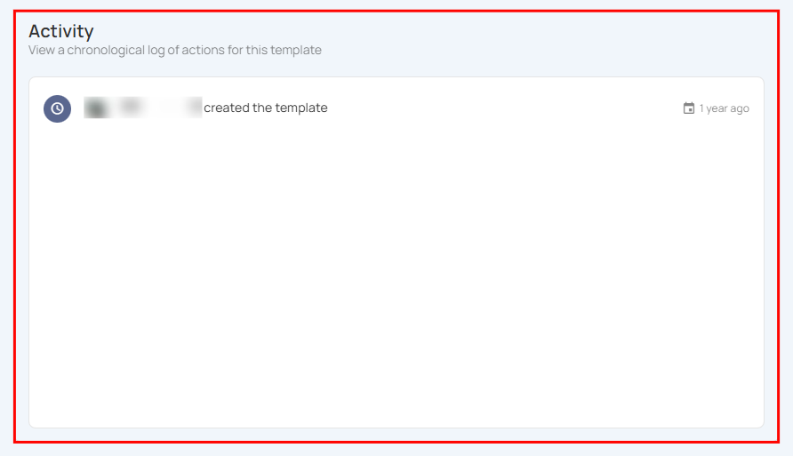

You can hover over a timestamp to view the full date and last modified time.

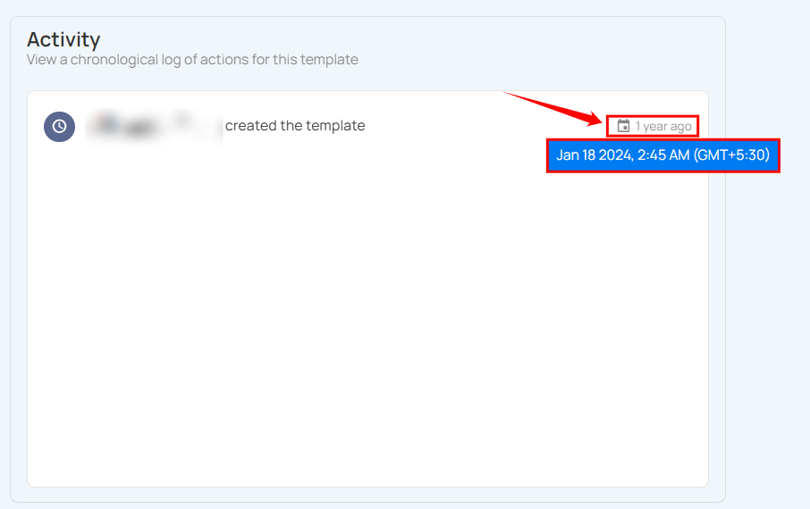

## Checks

The **Checks** tab provides a comprehensive view of all checks linked to the chosen datastore, container, or field, along with their source details such as computed table and field information. By clicking options such as **Active, Important, Favorite, Draft, Archived** (Invalid and Discarded), or **All,** users can instantly view checks based on their status. This categorization helps in organizing, reviewing, and managing checks more effectively for consistent data quality oversight.

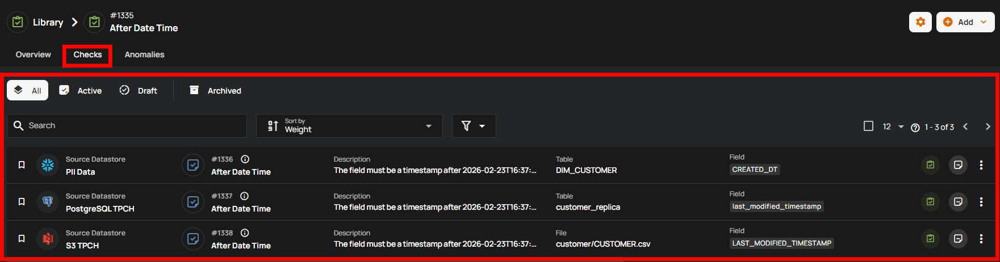

Alternatively, users can navigate to the **Checks** tab directly from the **Overview** tab by clicking the redirect button in the **Checks** section of the Summary panel.

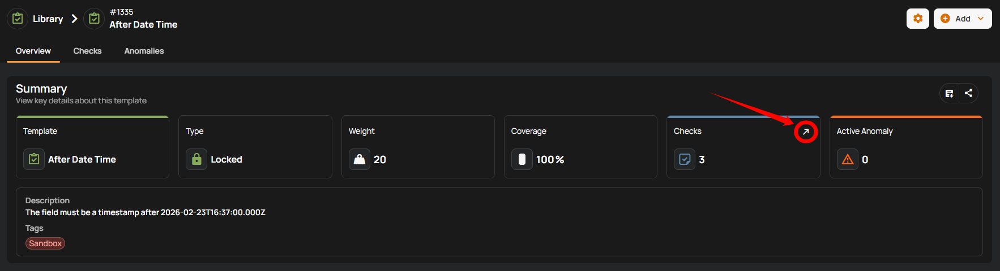

## Anomalies

The **Anomalies** tab displays all anomalies detected for the selected check template, along with details such as source datastore, computed table, field, rule, and the number of anomalous records. Users can view anomalies based on their status: **Open, Active, Acknowledged, Archived,** or **All** and sort them based on specific parameters.

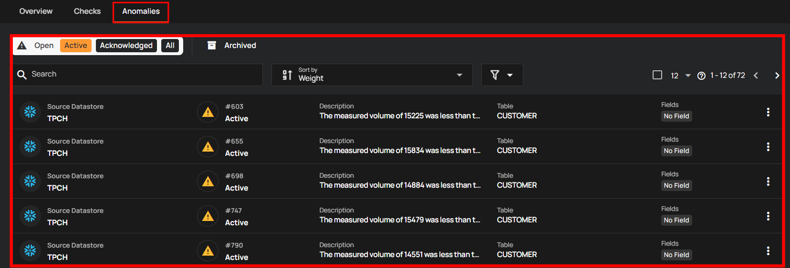

Alternatively, users can navigate to the **Anomalies** tab directly from the **Overview** tab by clicking the redirect button in the **Active Anomalies** section of the Summary panel.

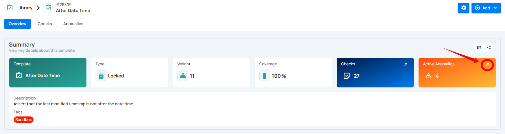

## Multiple Checks Creation

Users can create multiple checks at once by selecting a template and adding multiple targets. Each target will generate its own check.

**Step 1:** Click on the **Add** button located in the top right corner and select **Multiple Checks** from the dropdown.

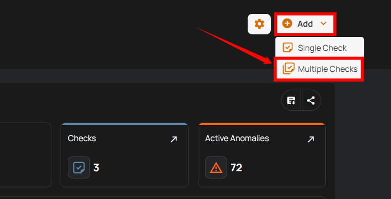

A **Bulk Add Quality Checks** modal window will appear. Fill in the details:

| No. | Field | Description |
| :---- | :---- | :---- |
| 1.| Datastore | Select the datastore where the check should be applied. |
| 2.| File/Table | Choose the file/table within the selected datastore. |
| 3.| Field | Select the field to apply the check on. |
| 4.| Filter Clause | Specify a valid [Spark SQL](https://spark.apache.org/docs/latest/sql-ref.html) `WHERE` expression to filter the data on which the check will be applied. |

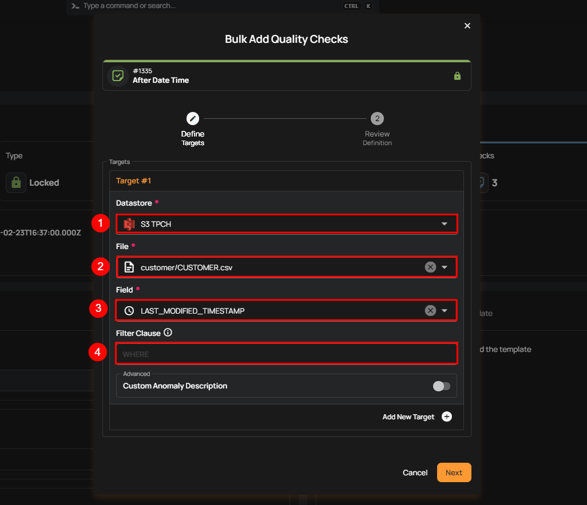
  
**Step 2:** Click on the **Add Target** button to create another check. You can keep adding targets to create as many checks as you need within the same template.

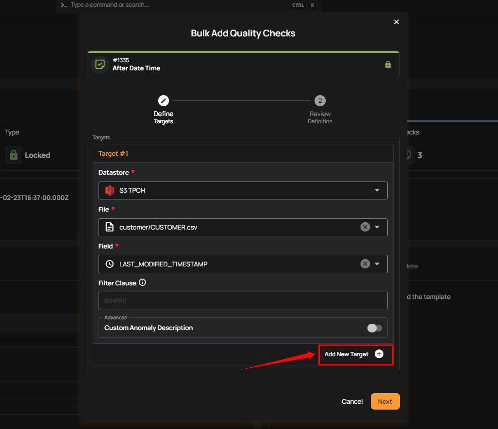

## Template State

Any changes to a template may or may not impact its related checks, depending on whether the template state is locked or unlocked. Managing the template state allows you to control whether updates automatically apply to all related checks or let them function independently.

**Unlocked**

- Quality Checks can evolve independently of the template. Subsequent updates to an unlocked Check Template do not affect its related quality checks.

**Locked**

- Quality Checks from a locked Check Template will inherit changes made to the template. Subsequent updates to a locked Check Template do affect its related quality checks.

!!! info
    Tags will be synced independently of unlocked and locked Check Templates, while Description and Additional Metadata will not be synced. This behavior is general for Check Templates.

=== "Template State"

    ``` mermaid
    graph TD
    A[Start] -->|Is `Template Locked` enabled?| B{Yes/No}
    B -->|No| E[The quality check can evolve independently]
    B -->|Yes| C[They remain synchronized with the template]
    C --> D[End]
    E --> D[End]
    ```