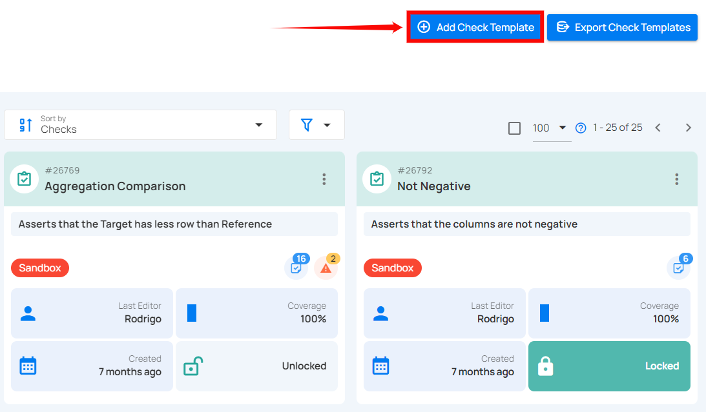
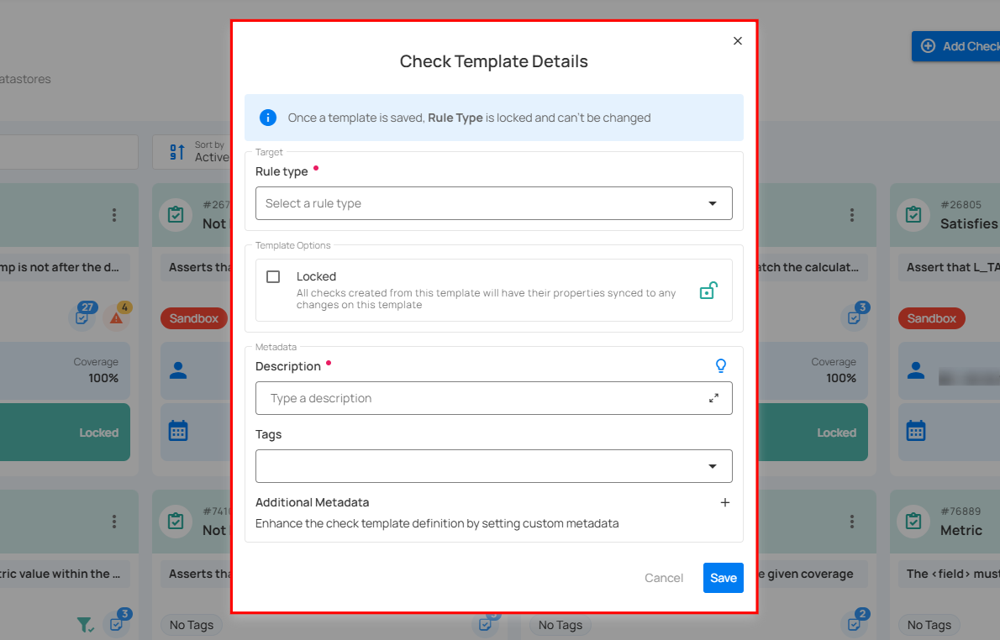
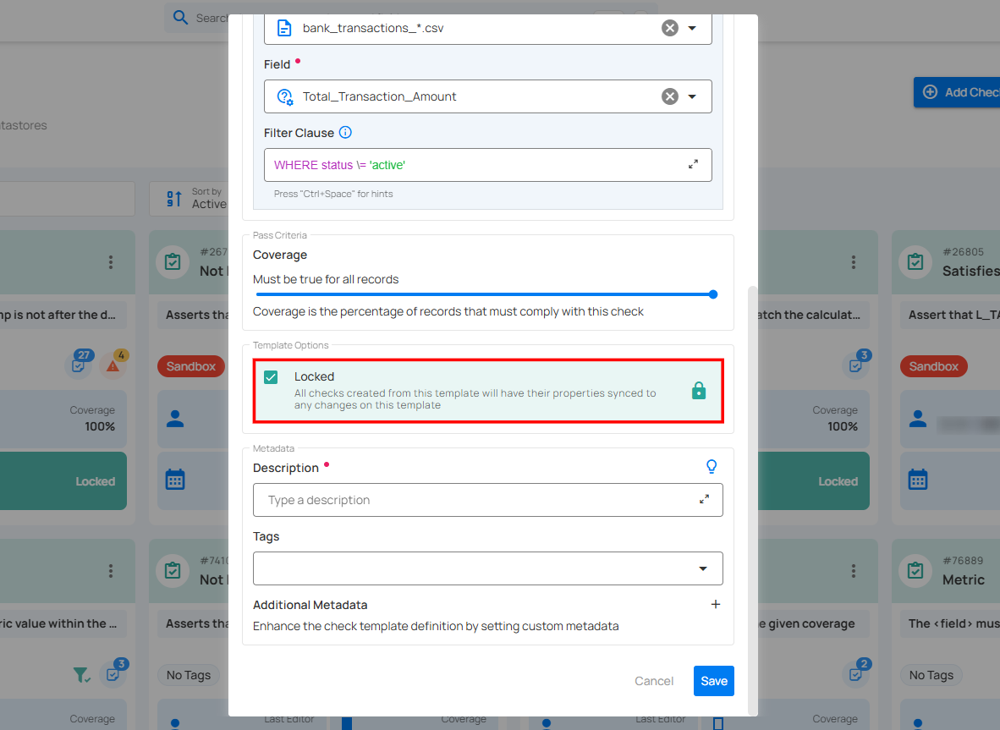
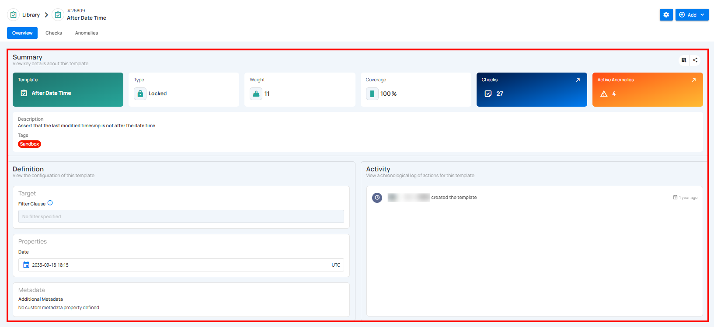

# Check Templates

Check Templates empower users to efficiently create, manage, and apply standardized checks across various datastores, acting as blueprints that ensure consistency and data integrity across different datasets and processes.

Check Templates streamline the validation process by enabling check management independently of specific data assets such as datastores, containers, or fields. These templates reduce manual intervention, minimize errors, and provide a reusable framework that can be applied across multiple datasets, ensuring all relevant data adheres to defined criteria. This not only saves time but also enhances the reliability of data quality checks within an organization.

Let's get started 🚀

**Step 1:** Log in to your Qualytics account and click the **“Library”** button on the left side panel of the interface.


**Step 2:** Click on the **“Add Check Template”** button located in the top right corner.



A modal window titled **“Check Template Details”** will appear, providing you with the options to add the check template details.



**Step 3:** Enter the following details to add the check template:

- **Rule Type (Required)**  
- **Filter Clause**
- **Template Locked**
- **Description (Required)**  
- **Tags**  
- **Additional Metadata**  

**1. Rule Type (Required):** Select a Rule Type from the dropdown menu for data validation, such as checking for non-null values, matching patterns, comparing numerical values, or verifying date-time constraints. Each rule type defines the specific validation logic to be applied.

For more details about the available rule types, refer to the "[Check Rule Types](./overview-of-a-check.md#check-rule-types)" section.

!!! note
    Different rule types have different sets of fields and options appearing when selected.


**2. Filter Clause:** Specify a valid [Spark SQL](https://spark.apache.org/docs/latest/sql-ref.html) `WHERE` expression to filter the data on which the check will be applied.

The filter clause defines the conditions under which the check will be applied. It typically includes a `WHERE` statement that specifies which rows or data points should be included in the check.

**Example:** A filter clause might be used to apply the check only to rows where a certain column meets a specific condition, such as `WHERE status \= 'active'`.


Adjust the **Coverage** setting to specify the percentage of records that must comply with the check.

!!! note
    The Coverage setting applies to most rule types and allows you to specify the percentage of records that must meet the validation criteria.


**3. Template Locked:** Check or uncheck the **"Template Locked"** option to determine whether all checks created from this template will have their properties automatically synced to any changes made to the template.

For more information about the template state, jump to the "[**Template State**](#template-state)" section below.  



**4. Description (Required):** Enter a detailed description of the check template, including its purpose, applicable data, and relevant information to ensure clarity for users. If you're unsure of what to include, click on the "💡" **lightbulb** icon to apply a suggested description based on the rule type.

**Example:** "The < field > must exist in `bank_transactions_*.csv.Total_Transaction_Amount` (Bank Dataset - Staging)".

This description clarifies that the specified field must be present in a particular file (`bank_transactions_*.csv`) and column (`Total_Transaction_Amount`) within the Bank Dataset.


**5. Tags:** Assign relevant tags to your check template to facilitate easier searching and filtering based on categories like **"data quality,"** **"financial reports,"** or **"critical checks."**


**6. Additional Metadata:** Add key-value pairs as additional metadata to enrich your check. Click the plus icon **(+)** next to this section to open the metadata input form, where you can add key-value pairs.


Enter the desired key-value pairs (e.g., **DataSourceType: SQL Database** and **PriorityLevel: High**). After entering the necessary metadata, click **"Confirm"** to save the custom metadata.  


**Step 4:** Once you have entered all the required fields, click the **“Save”** button to finalize the template.

!!! warning
    Once a template is saved, the selected rule type becomes locked and cannot be changed.


After clicking the **Save** button, a success notification appears on the screen confirming that the check template was created successfully.

After saving the check template, you can now **Apply a Check Template to create Quality Checks**, which will enforce the validation rules defined in the template across your datastores. This ensures consistent data quality and compliance with the criteria you’ve established.

Once a check template is created, you can view its details by clicking on it. The details view displays key information such as its purpose, configuration, associated checks, dataset usage, performance metrics, activities, and metadata.



### Summary

The Summary section provides a quick overview of the check template’s key details, including its name, type, priority, coverage, associated checks, active anomalies, description, and tags — helping users quickly understand its purpose and current status.


| REF. | Field | Description |
| :---- | :---- | :---- |
| 1 | Template | The rule type of the check template, indicating its purpose (e.g., “After Date Time”). |
| 2 | Type | Indicates whether the template is **Locked** (cannot be edited) or **Unlocked** (editable). |
| 3 | Weight | A numeric value representing the importance or priority level of the template in scoring or decision-making. |
| 4 | Coverage | The percentage of relevant dataset elements to which this template is applied. |
| 5 | Checks | The total number of checks currently using this template. You can click on the **(↗)** icon to navigate directly to the Checks tab.|
| 6 | Active Anomalies | The count of unresolved anomalies detected by checks associated with this template. You can click on the **(↗)** icon to navigate directly to the Anomalies tab.|
| 7 | Description | A short statement explaining the logic or purpose of the check template. |
| 8 | Tags | Used to categorize and filter templates (e.g., “Sandbox”). Users can change the tags by clicking the tag badge. |


### Definition

The Definition section displays the configuration details of a check template. It outlines the target conditions, specific properties, and any additional metadata associated with the template, providing clarity on how and where it is applied.


| REF. | Field | Description |
| :---- | :---- | :---- |
| 1 | Target | Defines the filter condition applied to the dataset. If no filter is specified, the check template applies to all data in the target scope.|
| 2 | Properties | Displays configuration details specific to the check type. Content varies based on the selected check: <br><ul><li> **Field Count checks**: Shows "Number of Field". </li><li> **Metric checks**: Shows "Comparison", "Min Value", and "Max Value".</li> |
| 3 | Metadata | Displays any custom metadata properties linked to the template. If none are defined, this section remains empty. |


### Activity

The Activity section provides a chronological log of all actions and updates related to this template. It tracks key events such as creation, modifications, and other relevant activities, along with timestamps to show when they occurred.


You can hover over a timestamp to view the full date and last modified time.


## Template State

Any changes to a template may or may not impact its related checks, depending on whether the template state is locked or unlocked. Managing the template state allows you to control whether updates automatically apply to all related checks or let them function independently.

**Unlocked**

- Quality Checks can evolve independently of the template. Subsequent updates to an unlocked Check Template do not affect its related quality checks.

**Locked**

- Quality Checks from a locked Check Template will inherit changes made to the template. Subsequent updates to a locked Check Template do affect its related quality checks.

!!! info
    Tags will be synced independently of unlocked and locked Check Templates, while Description and Additional Metadata will not be synced. This behavior is general for Check Templates.

=== "Template State"

    ``` mermaid
    graph TD
    A[Start] -->|Is `Template Locked` enabled?| B{Yes/No}
    B -->|No| E[The quality check can evolve independently]
    B -->|Yes| C[They remain synchronized with the template]
    C --> D[End]
    E --> D[End]
    ```