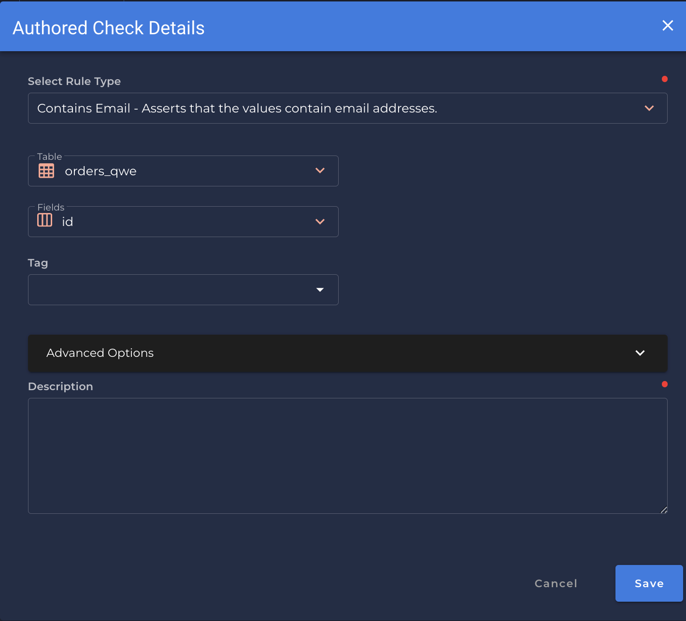

# Contains Email <spam id='single-field'>`single field`</spam>
---
*Asserts that the values are email addresses.*

{: style="height:450px"}

!!! example
    `id` contains an email address.

=== "`Record Anomaly` error message"

    The `[field_name]` value of '`[x value]`' does not contain an email address.

=== "`Shape Anomaly` error message"
    In `[field_names]`, `[x]`% do not contain email addresses.

---