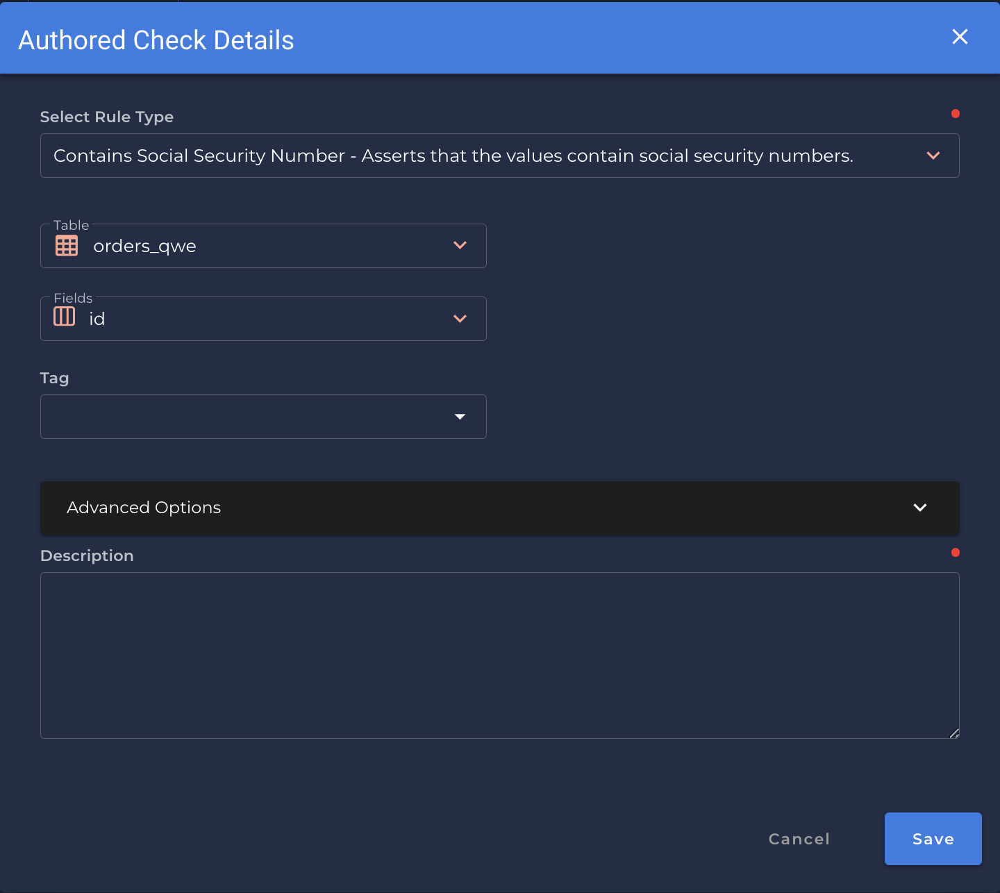

# Social Security Number <spam id='single-field'>`single field`</spam>

---

*Asserts that the values are social security numbers.*

{: style="height:450px"}

!!! example
    The `id` contains a social security number.
    
=== "`Record Anomaly` error message"
    The `[field_name]` value of `['x']` does not contain a social security number.

=== "`Shape Anomaly` error message"
    In `[field_names]`, `[x]`% do not contains social security numbers.

---