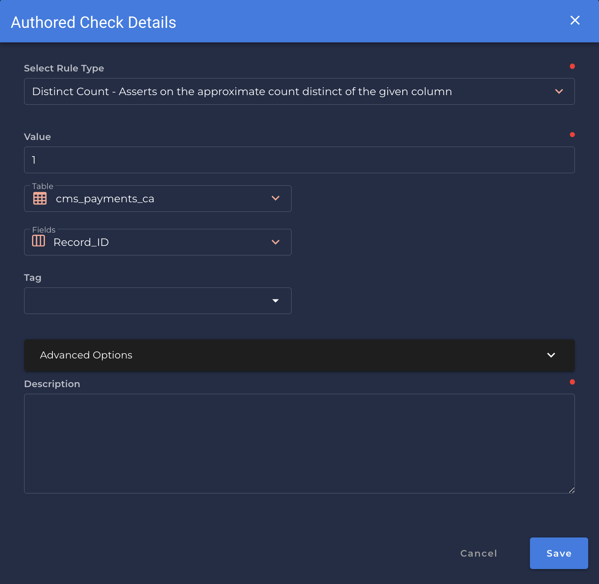

### Distinct Count <spam id='single-field'>`single field`</spam>
* *Asserts on the approximate count distinct of the given column.*
{: style="height:450px"}

!!! example
    The distinct count of `Record_Id` is `0.0`.

=== "`Shape Anomaly only` error message"
    In `[field_names]`, The distinct count of the records is not `0.0`.

---
