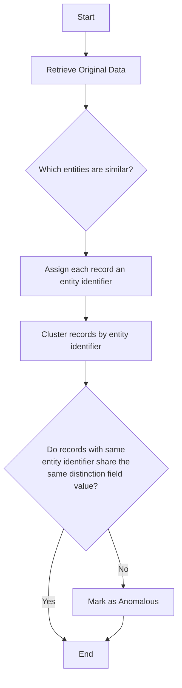

# Entity Resolution

### Definition

*Asserts that every distinct entity is appropriately represented once and only once*

### In-Depth Overview

This check performs automated entity name clustering to identify entities with similar names that likely represent
the same entity. It then assigns each cluster a unique entity identifier and asserts that every row with the same 
entity identifier shares the same value for the designated `distinction field`

### Field Scope

**Single:** The rule evaluates a single specified field.

**Accepted Types**

| Type     |                                                          |
|----------|----------------------------------------------------------|
| `String` | 
:octicons-check-16:
 |

### General Properties



### Specific Properties

| Name                                                | Description                                                                 |
|-----------------------------------------------------|-----------------------------------------------------------------------------|
| 
Distinction Field
   | The field that must hold a distinct value for every distinct entity         |
| 
Pair Substrings
     | Considers entities a match if one entity is part of the other               |
| 
Pair Homophones
     | Considers entities a match if they sound alike, even if spelled differently |
| 
Spelling Similarity
 | The minimum similarity required for clustering two entity names             |

### Anomaly Types



### Example

**Objective**: *If you have a `businesses` table with an `id` field and a `name` field, this check can be configured to
resolve `name` and use `id` as the `distinction field`.  During each scan, similar names will be grouped and assigned the
same `entity identifier` and any rows that share the same `entity identifier` but have different values for `id` will be
identified as anomalies.*

**Sample Data**

| BUSINESS_ID | BUSINESS_NAME   |
|-------------|-----------------|
| 1           | ACME Boxing     |
| 2           | Frank's Flowers |
| 3           | ACME Boxes      |

**Anomaly Explanation**

In the sample data above, the entries with `BUSINESS_ID` **1** and **3** do not satisfy the rule because their `BUSINESS_NAME`
values will be marked as similar yet they do not share the same `BUSINESS_ID` 

=== "Flowchart"

