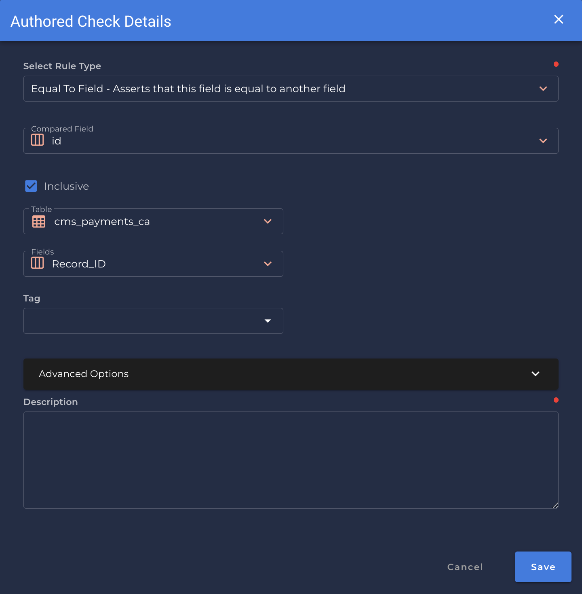

# Equal To Field

---

*Asserts that this field is equal to another field.*
                                        
{: style="height:450px"}

!!! example
    `Record_Id` has the same values as `Id`.

=== "`Record Anomaly` error message"

    The `[field_name]` value of '`[x value]`' is not equal to the value of `[compared_field_name]`.

=== "`Shape Anomaly` error message"
    In `[field_names]`, `[x]`% of the fiels are not equal.

---