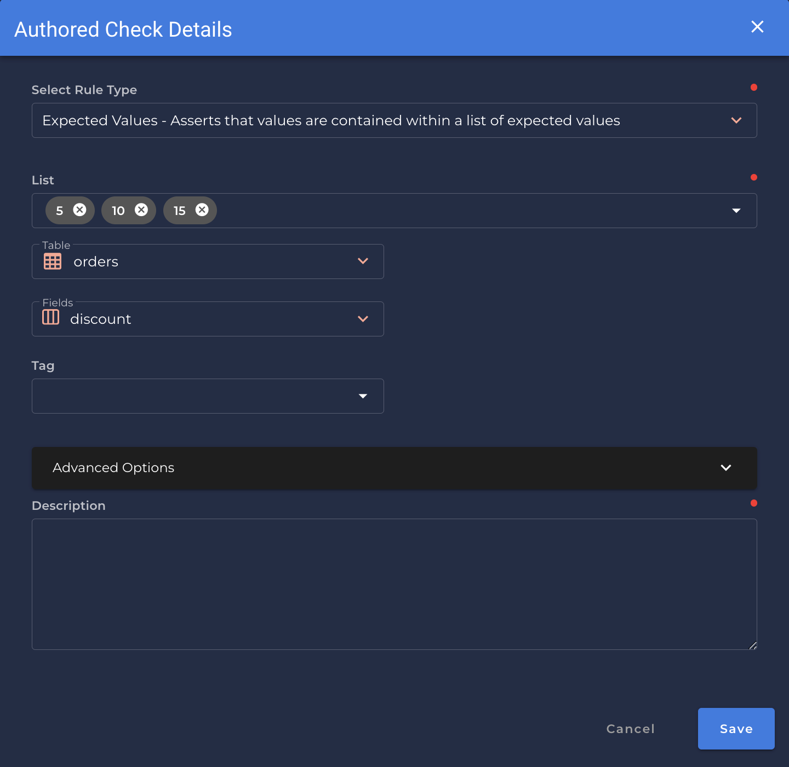

# Expected Values <spam id='single-field'>`single field`</spam>

---

*Asserts that values are contained within a list of expected values.*

{: style="height:450px"}

!!! example
    `discount` is one of the expected values `[5, 10, 15]`

=== "`Record Anomaly` error message"

    The `[field_name]` value of '`[x value]`' does not appear in the list of expected values.

=== "`Shape Anomaly` error message"
    In `[field_names]`, `[x]`% of values do not appear in the list of expected values.

---