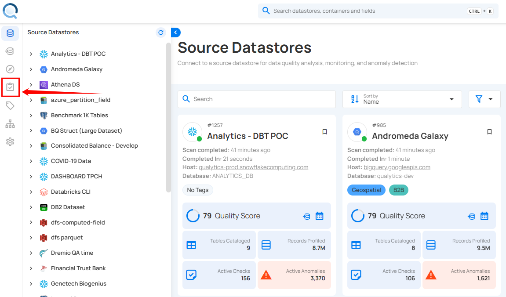
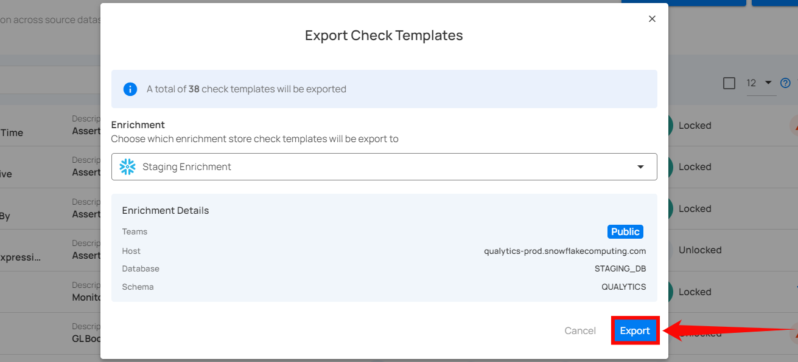
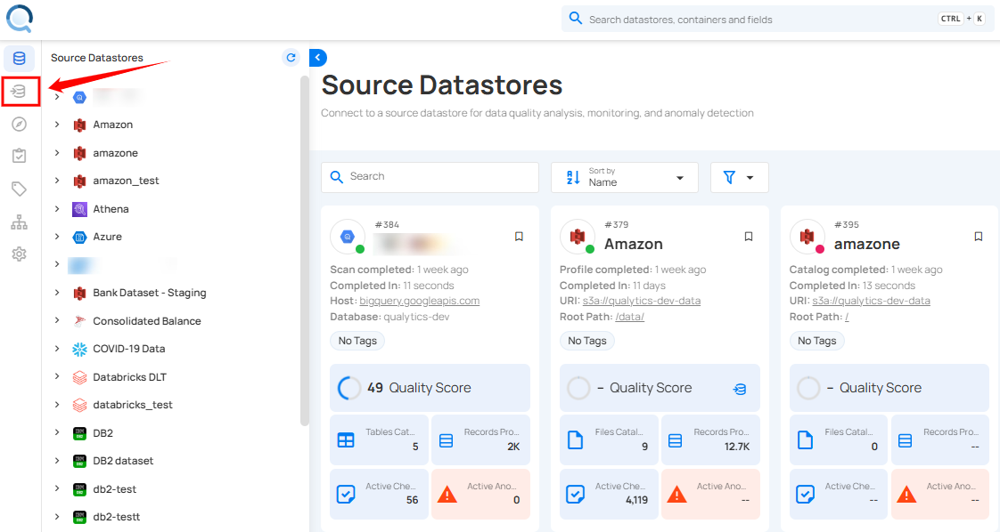
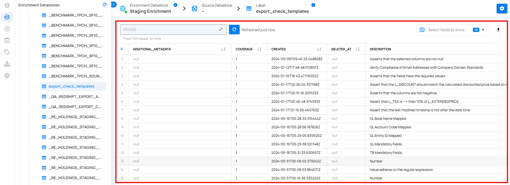
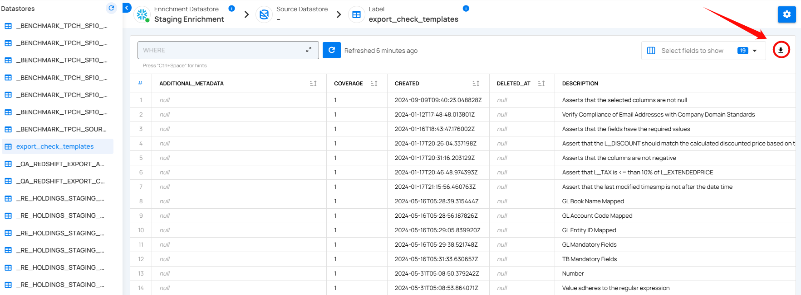

# Export Check Templates

You can export check templates to easily share or reuse your quality check settings across different systems or projects. This saves time by eliminating the need to recreate the same checks repeatedly and ensures that your quality standards are consistently applied. Exporting templates helps maintain accuracy and efficiency in managing data quality across various environments.

Let’s get started 🚀

**Step 1:**  Log in to your Qualytics account and click the **“Library”** button on the left side panel of the interface.

**Step 2:** Click on the **“Export Check Template”** button located in the top right corner.

**Step 3:** A modal window titled **“Export Check Templates”** will appear, where you have to select the enrichment store to which the check templates will be exported.

**Step 4:**  Once you have selected the enrichment store, click on the **“Export”** button

After clicking **“Export,”** the process starts, and a message will confirm that the metadata will be available in your Enrichment Datastore shortly.

## Review Exported Check Templates

**Step 1:** Once the checks have been exported, navigate to the **“Enrichment Datastores”** located on the left menu.

**Step 2:** In the **“Enrichment Datastores”** section, select the datastore where you exported the checks templates. The exported check templates will now be visible in the selected datastore.

When you export check templates, you can reuse them for other datastores, share them with teams, or save them as a backup. Once exported, the templates can be imported and customized to fit different datasets, making them versatile and easy to adapt.

You also have the option to download them as a CSV file, allowing you to share or store them for future use.

