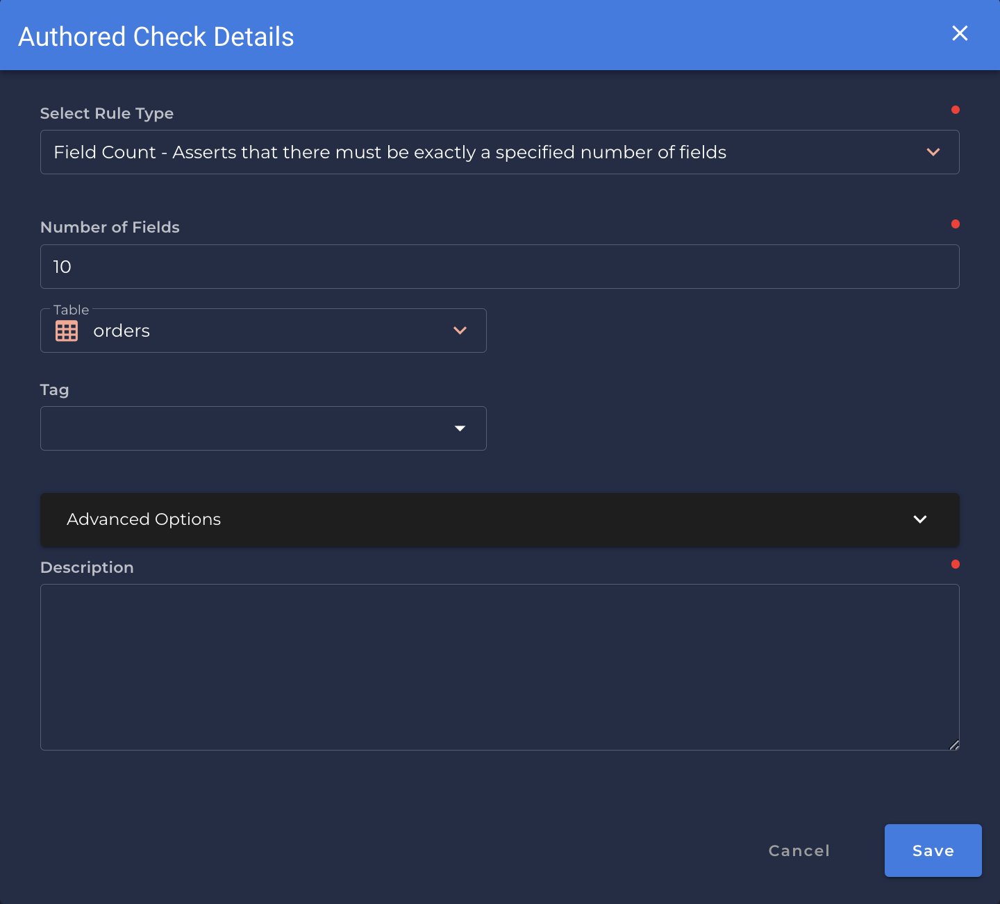

# Field Count <spam id='single-field'>`single field`</spam>

---

*Asserts that there must be exactly a specified number of fields.*

| Accepted Field Types   |                      |
| :--------------------: | :------------------: |
| `Date`                 | :white_check_mark:   |
| `Timestamp`            | :white_check_mark:   |
| `Integral`             | :white_check_mark:   |
| `Fractional`           | :white_check_mark:   |
| `String`               | :white_check_mark:   |
| `Boolean`              | :white_check_mark:   |

{: style="height:450px"}

!!! example
    `orders` has a field count of `10`.

=== "`Shape Anomaly` error message"
    In `[field_names]`, the field count is not `[value]`.

---