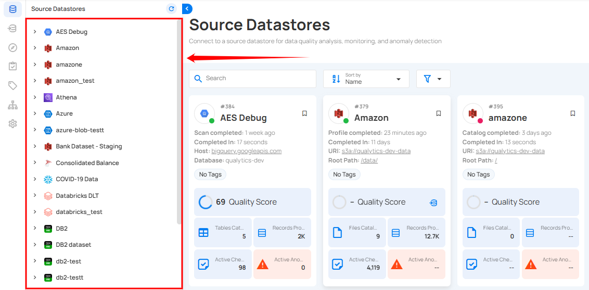
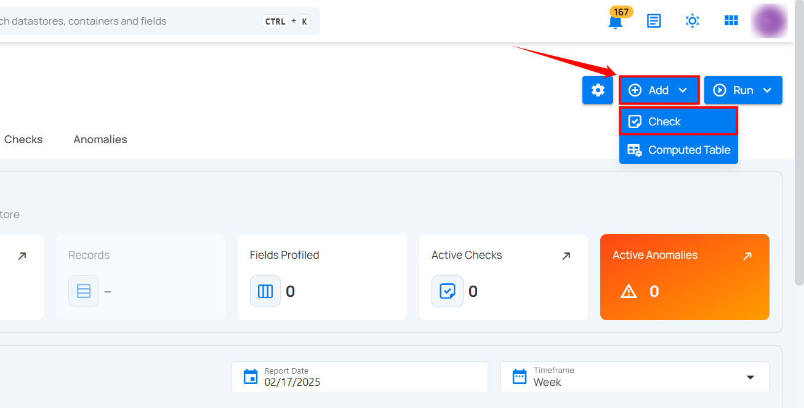
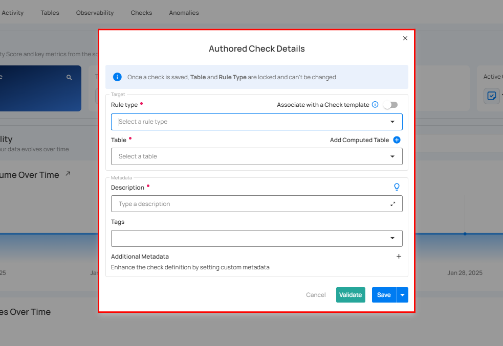
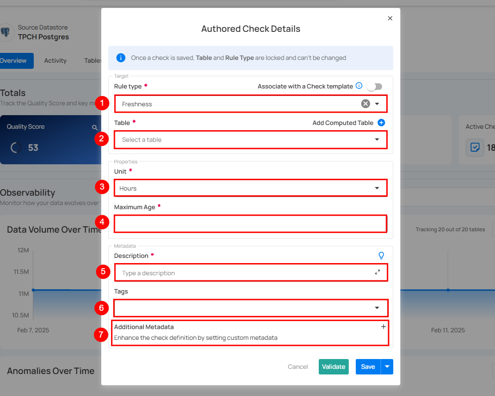
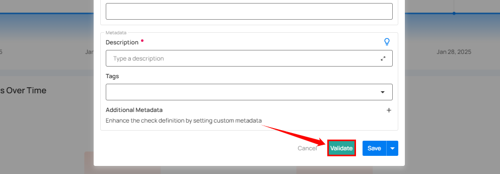
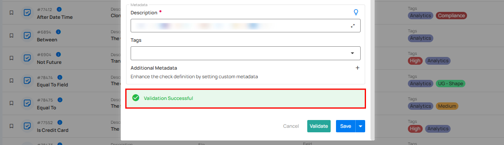
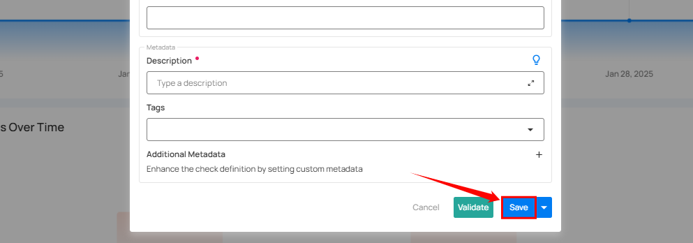
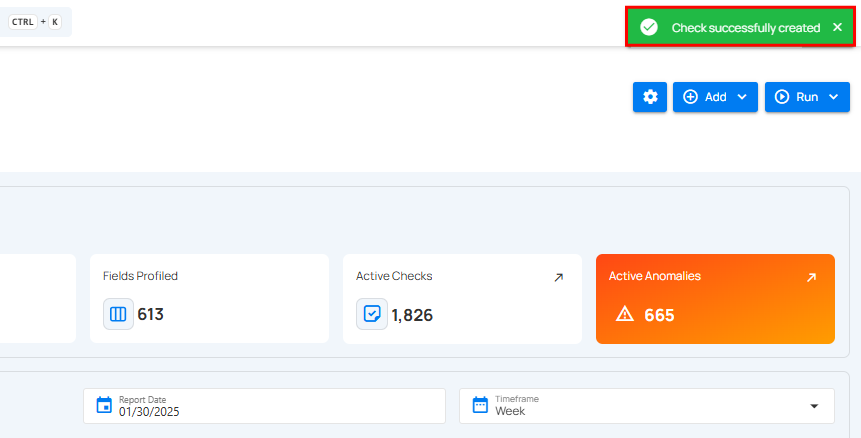

# Freshness Check

A Freshness Check ensures data stays up-to-date by monitoring its last update time. It prevents stale data from impacting reports and dashboards while detecting outdated information early. By setting a maximum age threshold, it helps identify pipeline failures and ensures accurate, real-time analytics for reliable business insights.

Let's get started 🚀

## Importance of Freshness Check

A Freshness Check ensures data is always up-to-date for real-time analytics. It prevents stale data from affecting reports and dashboards while detecting pipeline failures early.

* Keeps data up-to-date for real-time analytics.

* Prevents stale data from affecting reports and dashboards.

* Detects data pipeline failures early.

## How It Works

A **Freshness Check** monitors when a dataset (table, file, or view) was last updated. If the data is **older than the allowed limit**, the system **triggers an alert**.

### Process Flow 

1. **Data Update:** System records the last update timestamp.

2. **Threshold Definition:** A **Maximum Age** (e.g., 1 hour, 24 hours) is set.

3. **Scan:** The system checks if the data is within the allowed time.

4. **Result Evaluation:**

   * **Pass** → Data is updated within the allowed time.

   * **Fail** → Data is older than the limit, triggering an **alert**.  

## How Freshness is Measured Across Platforms

Qualytics performs volumetric and freshness measurements differently depending on the data platform and container type (table, view, or computed).

### Snowflake

#### Tables

Freshness and volumetrics are retrieved directly from the `INFORMATION_SCHEMA`. (System-level metadata is used — not the Incremental Field.)

#### Views and Computed Objects

- **Volumetrics:** `SELECT COUNT(*) FROM <object>`

- **Freshness:** `SELECT MAX(<incremental_identifier>) FROM <object>` (Here, the Incremental Field defined in Table Settings determines freshness.)

### Oracle

#### Tables

- **Volumetrics:** Retrieved from the `information_schema`

- **Freshness:** Determined using `SELECT MAX(<incremental_identifier>)`

#### Views and Computed Objects

- **Volumetrics:** `SELECT COUNT(*) FROM <object>`

- **Freshness:** `SELECT MAX(<incremental_identifier>) FROM <object>`

### S3

- **Freshness:** Based on the file modification time.

- **Volumetrics:** Depends on file format.
  - CSV, Excel → file load + row count.
  - Delta or structured formats → row counts extracted from metadata.

### BigQuery

Same behavior as Snowflake:

- **Tables:** Retrieved from `INFORMATION_SCHEMA`.
- **Views/Computed:** `SELECT COUNT(*)` and `SELECT MAX(<incremental_identifier>)`.

!!! note
    - For regular tables, freshness is evaluated from `INFORMATION_SCHEMA` — the configured Incremental Field is not used.
    - For views or computed tables, freshness is derived from the Incremental Field defined in Table Settings.
         
## Configuring Freshness Check

**Step 1:** Log in into your Qualytics account and select the **datastore** from the left menu on which you want to add a volumetric check.

**Step 2:** Click the **Add** button and select **Checks**.

**Step 3:** A modal window appears. Enter the required details to configure the **Freshness Check.**

**Step 4:** Enter the details to configure the volumetric check:

| No. |                Field |                     Description |
| :---- | :---- | :---- |
| 1. |          Rule Type | Select the Freshness Rule type from the dropdown. |
| 2. |            Table | Select the table for the rule to apply. |
| 3. |            Unit | Select time unit (**Hours, Minutes, Days**) for freshness measurement. |
| 4. |       Maximum Age | Set the time limit for data freshness. If exceeded, the check fails. |
| 5. |        Description | Enter a description for the check. |
| 6. |               Tag | Add tags for categorizing the check. |
| 7. |  Additional Metadata | Add custom metadata for additional details. |

**Step 5:** After completing all the check details, click on the "Validate" button. This will perform a validation operation on the check without saving it. The validation allows you to verify that the logic and parameters defined for the check are correct. It ensures that the check will work as expected by running it against the data without committing any changes.

If the validation is successful, a green message will appear saying "Validation Successful".

**Step 6:** Once you have a successful validation, click the **"Save"** button.

After clicking on the **“Save”** button your check is successfully created and a success flash message will appear saying **“Check successfully created”.**

## Example 

A company needs **hourly updates** on sales data to ensure real-time reports. A **Freshness Check** is set up with a **1-hour threshold**.

### Before Running the Check (Data is Fresh)

| No. | Order ID | Customer | Amount ($) | Last Updated |
| :---- | ----- | ----- | ----- | ----- |
| 01 |             12345 |   John Doe |      49.99 |    10:30 AM |
| 02 |             12346 |   Jane Smith |      89.50 |    10:35 AM |

* **Current Time:** **`11:00 AM`**

* **Threshold:** **1 Hour**

* **Pass (Data is fresh)**

### When Freshness Check Fails (Data is Stale)

| No. |    Order ID |    Customer |   Amount($) |  Last Updated |
| :---- | :---- | :---- | :---- | :---- |
| 01 |    12345 |    John Doe |   49.99 |  09:30 AM |
| 02 |    12346 |    Jane Smith |   89.50 |  09:35 AM |

* **Current Time:** `11:00 AM.`

* **Threshold:** **1 Hour.**

* **Fail (Data is older than 1 hour).**
