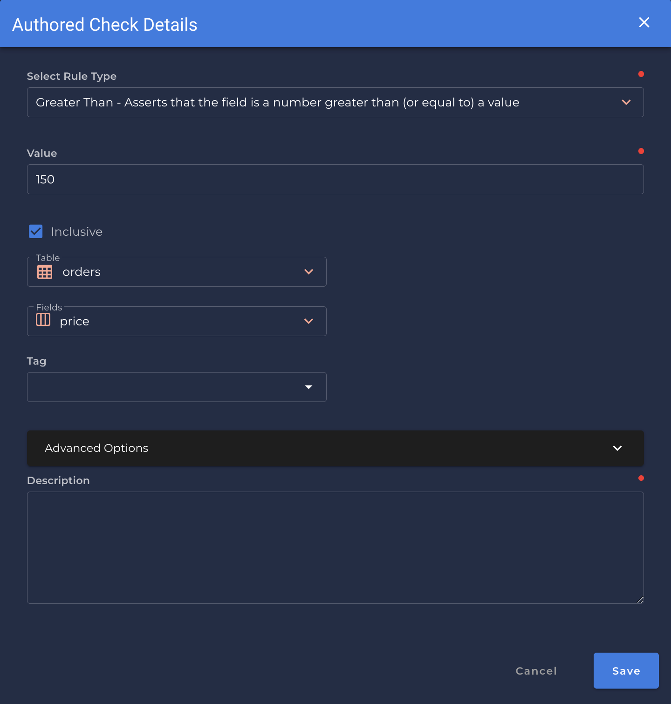

# Greater Than <spam id='single-field'>`single field`</spam>

---

*Asserts that the field is a number greater than (or equal to) a value.*

{: style="height:450px"}

!!! example
    `price` is greater than `150`

=== "`Record Anomaly` error message"

    The `[field_name]` value of '`[x value]`' is not greater than `[value]`.

=== "`Shape Anomaly` error message"
    In `[field_names]`, `[x]`% are not greater than`[value]`.

---