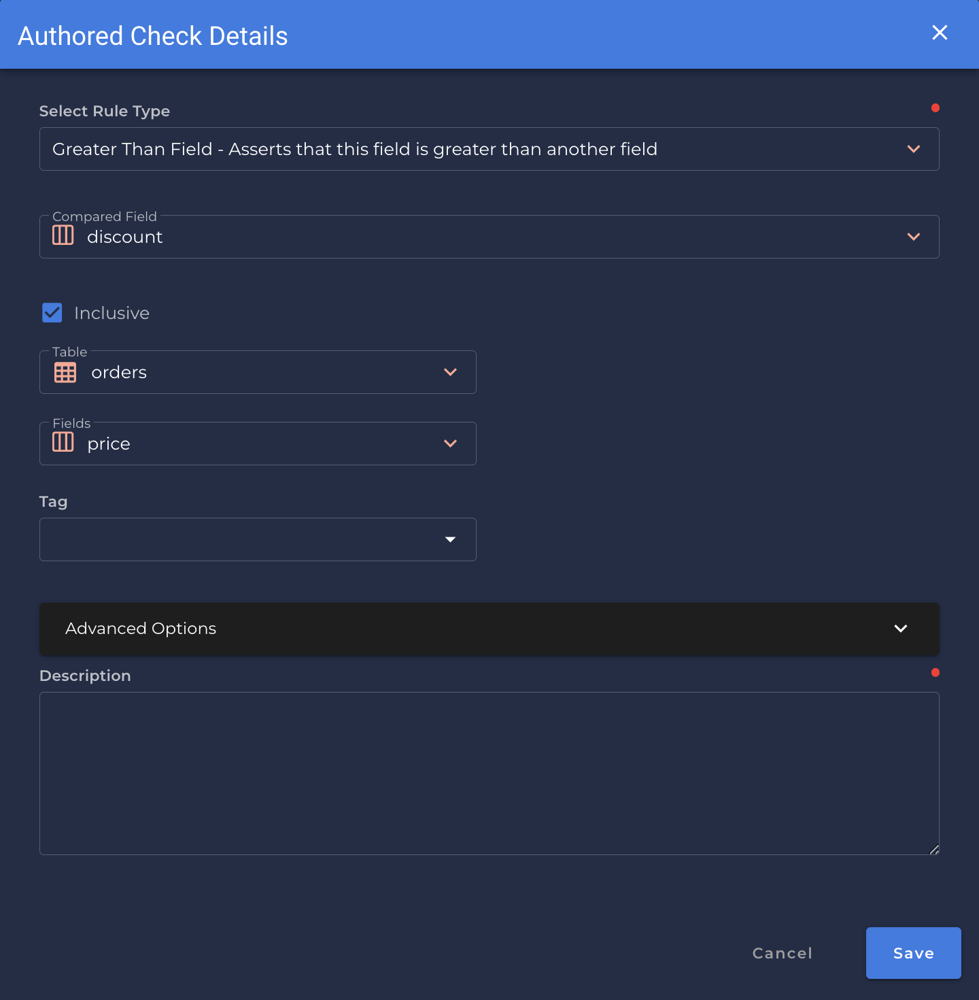

# Greater Than Field

---

*Asserts that this field is greater than another field.*
                                               
{: style="height:450px"}
!!! example
    `price` has a value greater than `discount`.

=== "`Record Anomaly` error message"

    The `[field_name]` value of '`[x value]`' is not greater than the value of `[value]`.

=== "`Shape Anomaly` error message"
    In `[field_names]`, `[x]`% are not equal to `[compared_field_name]`.

---