# Inferred Check

Qualytics automatically generates inferred checks during a Profile operation. These checks typically cover 80-90% of the rules needed by users. They are created and maintained through profiling, which involves statistical analysis and machine learning methods.

Let's get started 🚀

## Navigation

**Step 1:** Log in to your Qualytics account and select the datastore from the left menu.

**Step 2:** Click on the **"Checks"** from the Navigation Tab.

**Step 3:** In the top-right corner, click on the "**Run**" button, then select "**Profile**" from the dropdown menu. This action will initiate the profiling process that generates inferred checks.

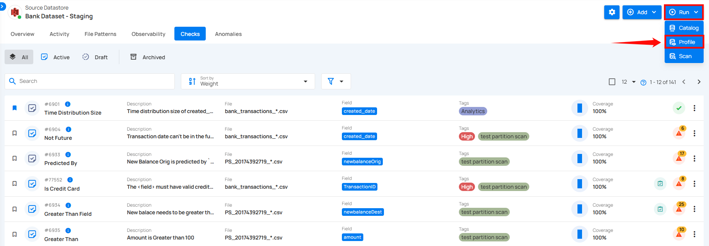

!!! note
    Inferred checks will be automatically updated with the next Profiling run. Manually updating an inferred check will take it out of the automatic update workflow.

To understand how Inferred checks work, you can follow the steps from the documentation [**Profile Operation.**](../source-datastore/profile.md)

After the profiling run is complete, inferred checks will be automatically created based on the analysis of your data.

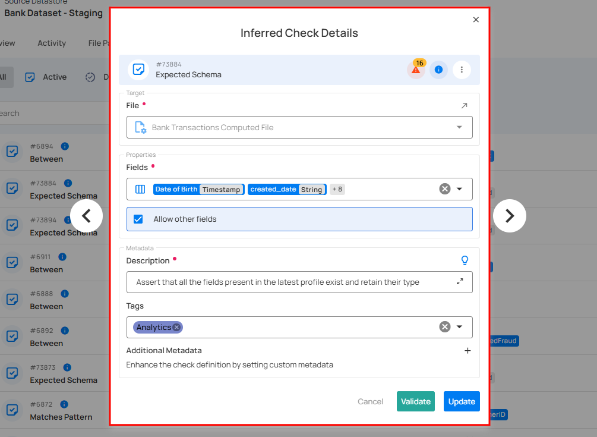

**1. Check Summary**: Provides a summary of the schema validation check, including its unique identifier, type, status, and associated warnings or information. It serves as a quick reference for users to assess the check's current state and access relevant actions.

For demonstration purposes, the applied rule type is **Expected Schema**.

**Check ID**: A unique identifier assigned to this particular check.

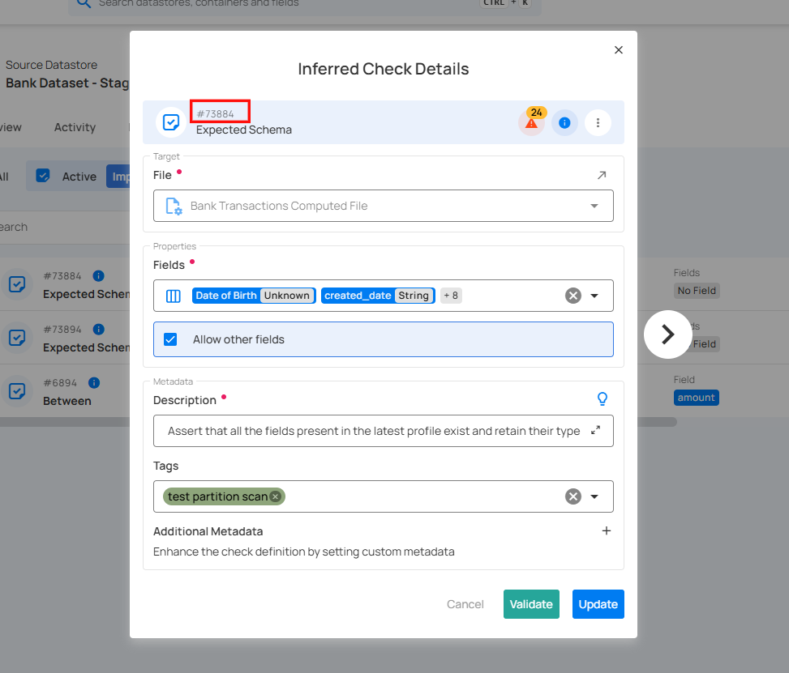

**Check Type**: Indicates the nature of the validation being performed on the check.

**Warnings**: Indicates the presence of active anomalies detected in the dataset. Clicking on this icon opens a dropdown menu with the following options:

* **View**: Displays detailed information about the detected anomalies.

* **Acknowledge**: Marks the anomaly as reviewed or acknowledged.

* **Archive**: Moves the anomaly record to the archive for future reference.

**Open Details**: Provides additional details or guidance about the check. Clicking this icon typically displays more context or documentation related to schema validation.

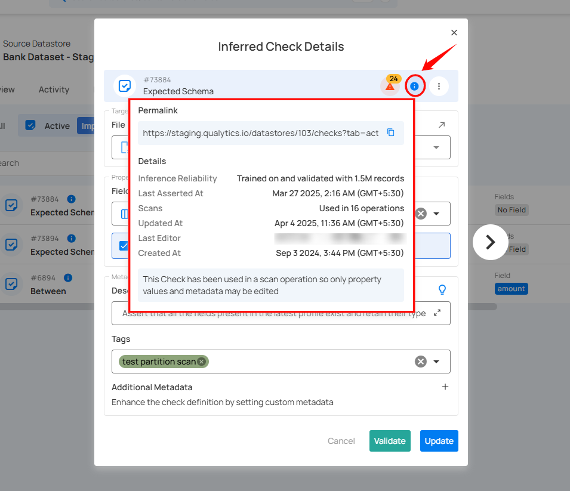

**Check Actions**: Opens a dropdown menu with more actions related to managing or modifying the check.

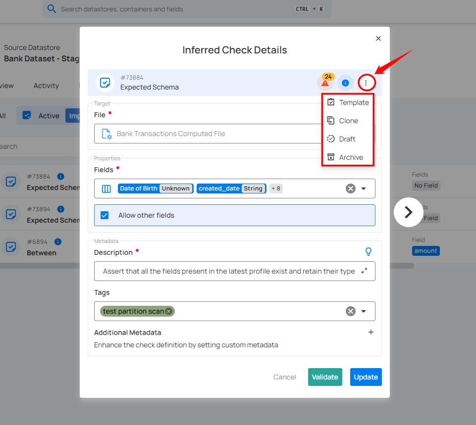

**2. Target**: Specifies the dataset and file that the inferred check will be applied to. This section ensures that the validation rules are correctly assigned to the intended source datastore. Users can select a different file if needed by clicking the dropdown.

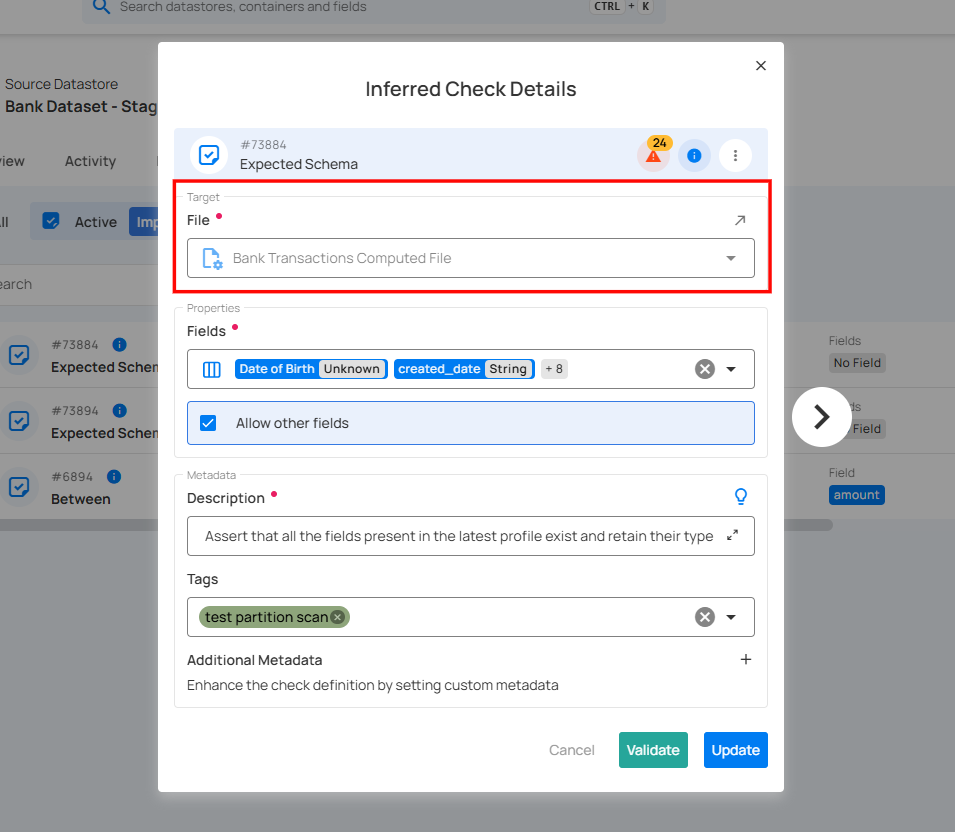

**3. Fields List**: Displays the fields that are expected to be present in the dataset.

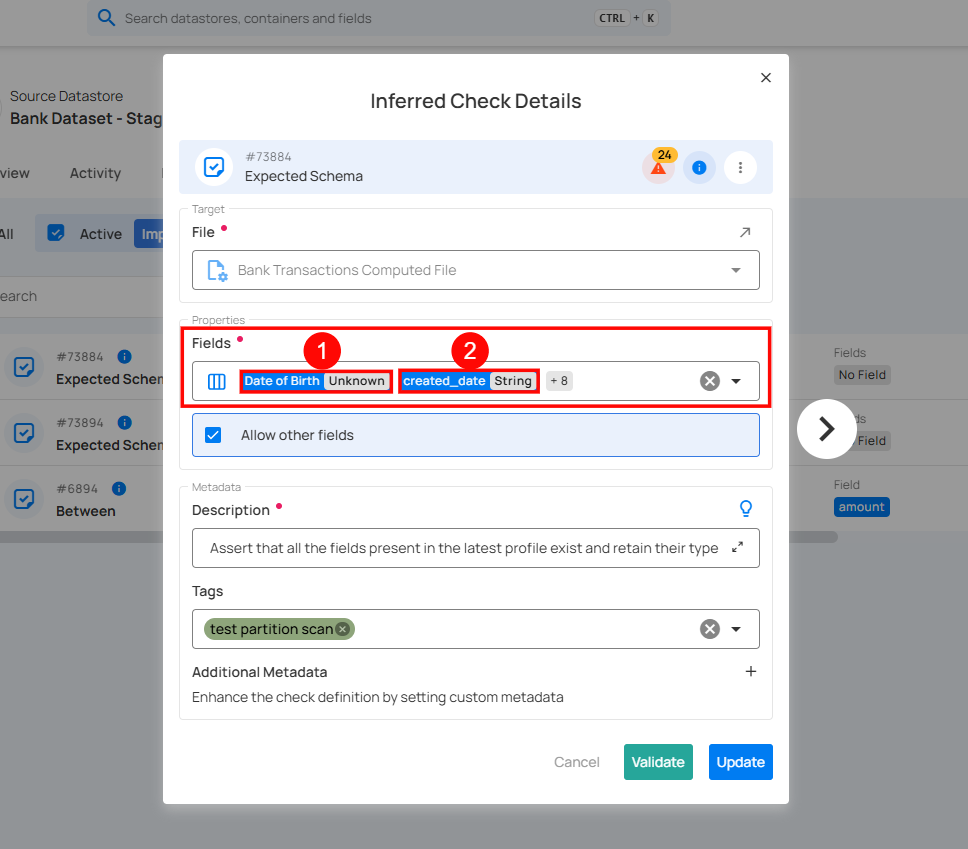

| **No.** | **Fields**             | **Description**                                                                 |
|---------|---------------------------|------------------------------------------------------------------------------------|
| 1       | LAST_MODIFIED_TIMESTAMP | Stores the date and time when the record was last updated, using the **Timestamp** data type.     |
| 2       | PS_AVAILQTY  | Stores the available quantity value using the **Integral (integer)** data type. |

**4. Allow Other Fields (Checkbox)**:

* If **checked**, the validation process allows additional fields beyond those explicitly listed.
* If **unchecked**, any unexpected field in the dataset will trigger an error.

**5. Description**: Enter a detailed description of the check template, including its purpose, applicable data, and relevant information to ensure clarity for users. If you're unsure of what to include, click on the **"💡" lightbulb** icon to apply a suggested description based on the rule type.

**6. Tags**: Tags help categorize and organize checks for easier filtering and management. In this example, the tags **Supply-Info, Procurement, Payments, B2B,** and **Aggregation Comparison** indicate that the check is associated with these business domains or functional categories.

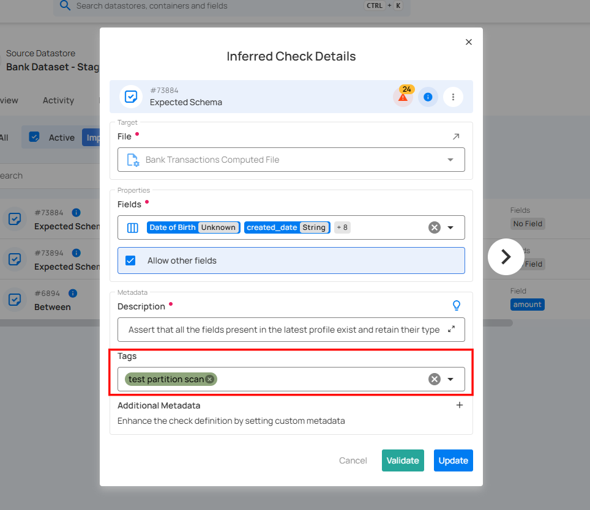

**7. Additional Metadata**: Add key-value pairs as additional metadata to enrich your check. Click the plus icon **(+)** next to this section to open the metadata input form, where you can add key-value pairs.

Enter the desired key-value pairs. After entering the necessary metadata, click **"Confirm"** to save the custom metadata.

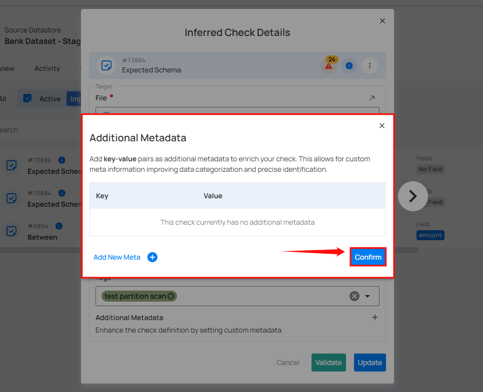

!!! note
    The **Target** field is non-editable. It automatically reflects the selected dataset and cannot be modified manually.

**Step 4**: After completing all the check details, click on the **"Validate"** button. This will perform a validation operation on the check without saving it. The validation allows you to verify that the logic and parameters defined for the check are correct. It ensures that the check will work as expected by running it against the data without committing any changes.

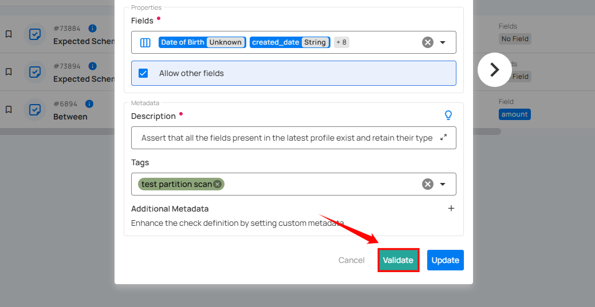

If the validation is successful, a green message will appear saying **"Validation Successful"**.

**Step 5**: Once you have a successful validation, click the **"Update"** button.

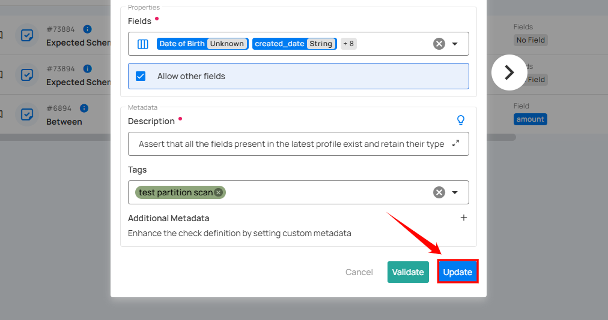

After clicking on the **“Update”** button, your check is successfully updated and a success flash message will appear saying **“Check successfully updated”**.

## Inference Engine

1. After metadata is generated by a [**Profile Operation**](../source-datastore/profile.md), Inference Engine is initiated to kick off Inductive and Unsupervised learning methods.  
     
2. Available data is partitioned into a training set and a testing set.  
     
3. The engine applies numerous machine learning models and techniques to the training data in an effort to discover well-fitting data quality constraints.

4. Those inferred constraints are then filtered by testing them against the held out testing set and only those that assert true above a certain threshold are converted and exposed to users as Inferred Checks.