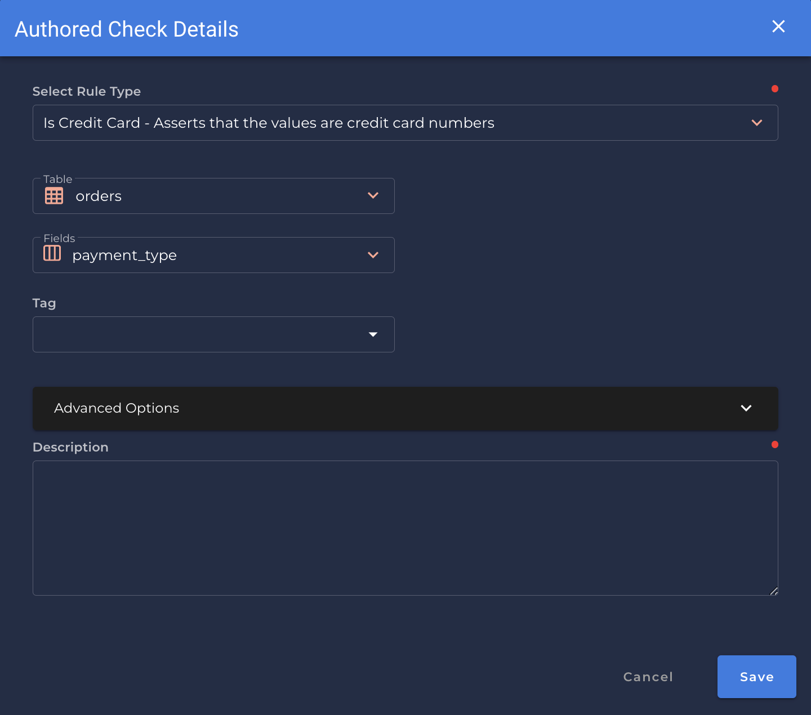

# Is Credit Card -- started here

---

*Asserts that the values are credit card numbers.*

| Accepted Field Types   |                      |
| :--------------------: | :------------------: |
| `Date`                 | :white_check_mark:   |
| `Timestamp`            | :white_check_mark:   |
| `Integral`             | :white_check_mark:   |
| `Fractional`           | :white_check_mark:   |
| `String`               | :white_check_mark:   |
| `Boolean`              | :white_check_mark:   |

{: style="height:450px"}

!!! example
    `payment_type` is formatted as a credit card number.

=== "`Record Anomaly` error message"

    The `[field_name]` value of '`[x value]`' does not adhere to a credit card format.

=== "`Shape Anomaly` error message"
    In `[field_names]`, `[x]`% do not adhere to a credit card format.

---