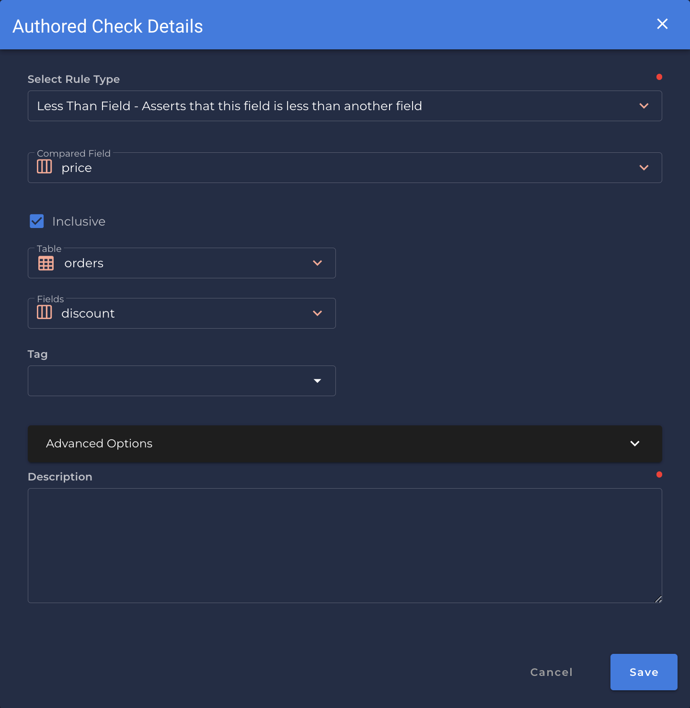

### Less Than Field
* *Asserts that this field is less than another field.*

{: style="height:450px"}
!!! example
    `discount` has a value less than `price`.

=== "`Record Anomaly` error message"

    The `[field_name]` value of '`[x value]`' is not less than the value of `[compared_field_name]`.

=== "`Shape Anomaly` error message"
    In `[field_names]`, `[x]`% are not less than `[compared_field_name]`.

---