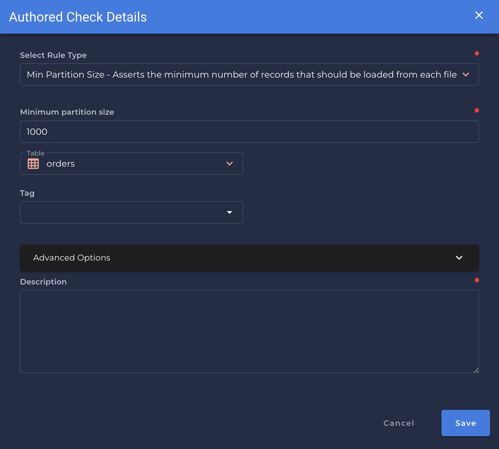

# Min Partition Size <spam id='none-field'>`none field`</spam>

---

*Asserts the minimum number of records that should be loaded from each file or table partition.*

| Accepted Field Types   |                      |
| :--------------------: | :------------------: |
| `Date`                 | :white_check_mark:   |
| `Timestamp`            | :white_check_mark:   |
| `Integral`             | :white_check_mark:   |
| `Fractional`           | :white_check_mark:   |
| `String`               | :white_check_mark:   |
| `Boolean`              | :white_check_mark:   |

{: style="height:450px"}
!!! example
    `orders` has at least `1000` records.

=== "`Shape Anomaly` error message"
    In `[field_names]`, fewer than `[value]` records were loaded.

---