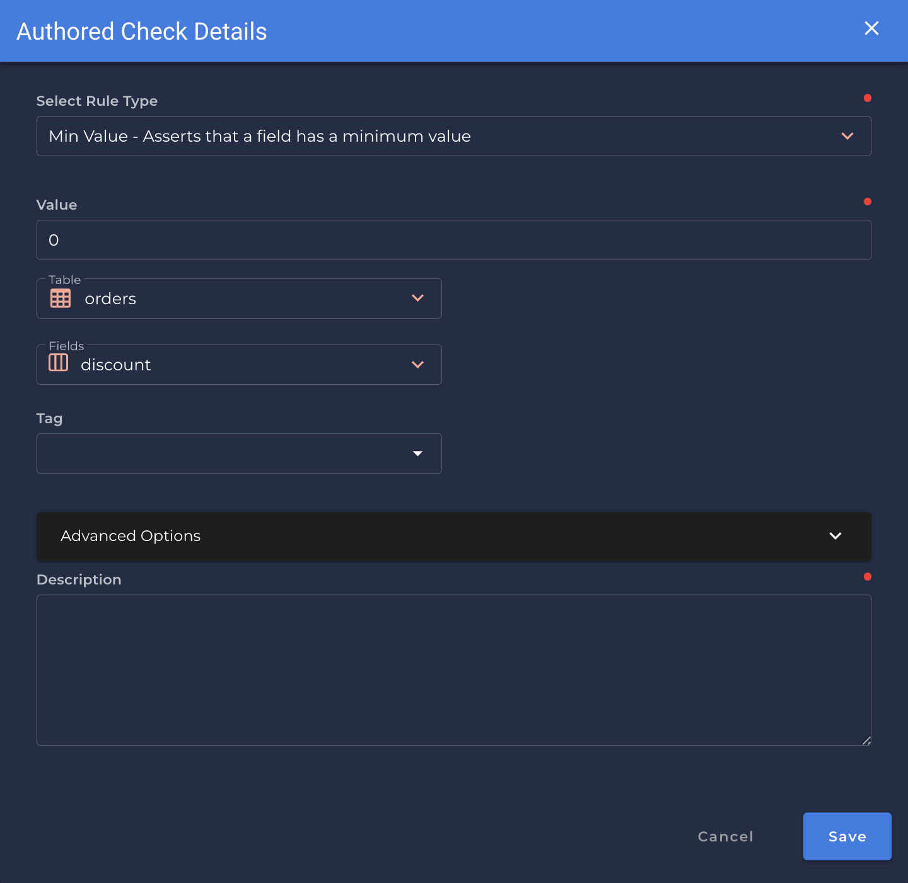

# Min Value <spam id='single-field'>`single field`</spam>

---

*Asserts that a field has a minimum value.*

| Accepted Field Types   |                      |
| :--------------------: | :------------------: |
| `Integral`             | :white_check_mark:   |
| `Fractional`           | :white_check_mark:   |

{: style="height:450px"}

!!! example
    `discount` has a minimum value of `0`.

=== "`Record Anomaly` error message"

    The `[field_name]` value of '`[x value]`' is less than the min value of `[value]`

=== "`Shape Anomaly` error message"
    In `[field_names]`, `[x]`% are less than the min value of `[value]`.

---