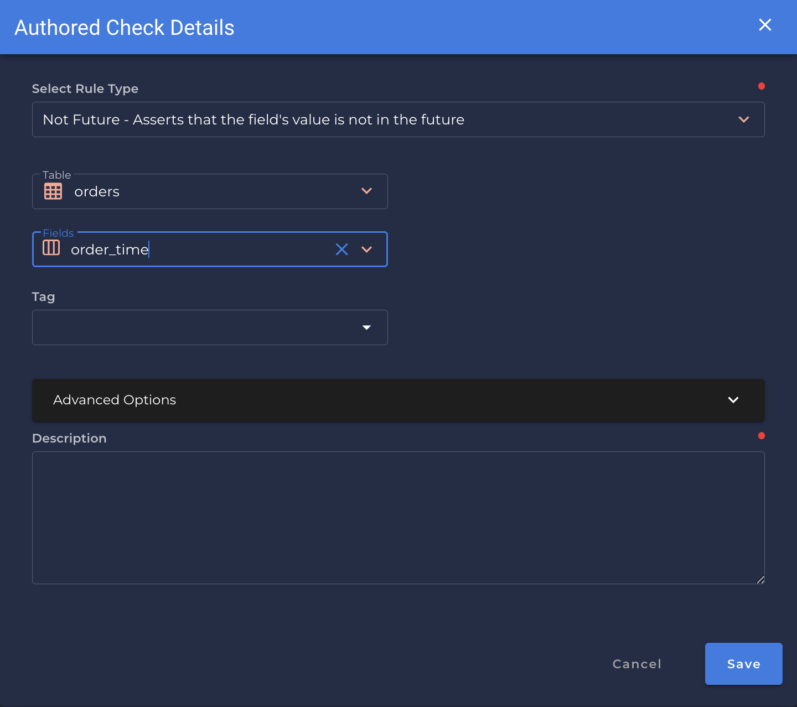

# Not Future

---

*Asserts that the field's value is not in the future.*

{: style="height:450px"}

!!! example
    `order_time` is a time in the past.

=== "`Record Anomaly` error message"

    The value for `[field_name]` of '`[x value]`' is in the future.

=== "`Shape Anomaly` error message"
    In `[field_names]`, `[x]`% are future times.

---