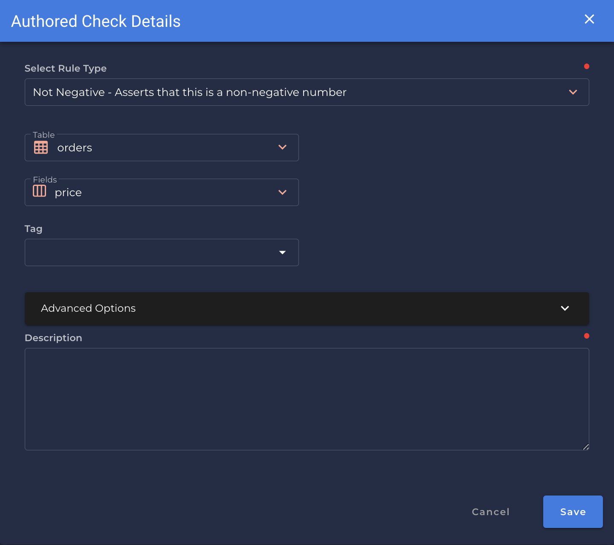

### Not Negative <spam id='single-field'>`single field`</spam>
* *Asserts that this is a non-negative number.*

{: style="height:450px"}

!!! example
    `price`is a non-negative number.

=== "`Record Anomaly` error message"

    The value for `[field_name]` of '`[x value]`' is a negative number.

=== "`Shape Anomaly` error message"
    In `[field_names]`, `[x]`% are negative numbers.

---