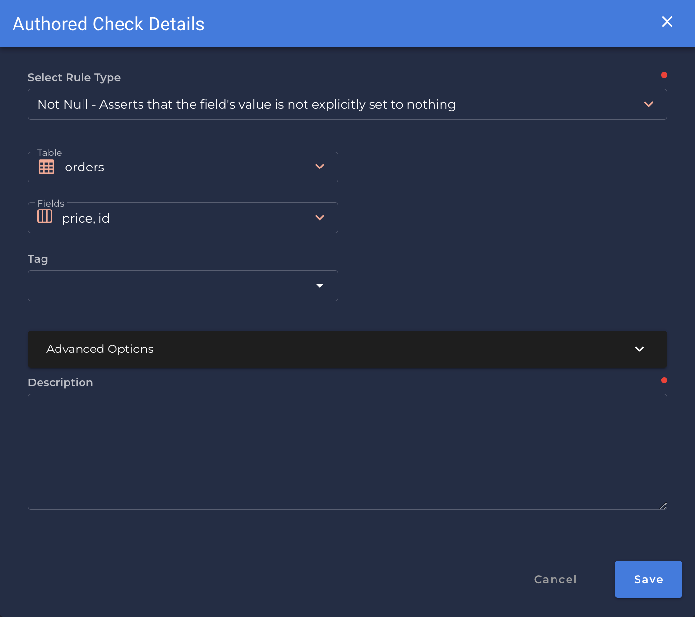

### Not Null <spam id='multiple-fields'>`multiple fields`</spam>
* *Asserts that the field's value is not explicitly set to nothing.*

{: style="height:450px"}

!!! example
    `price` and `id` are a non-negative number.

=== "`Record Anomaly` error message"

    The is not assigned value for `[field_name]`.

=== "`Shape Anomaly` error message"
    In `[field_names]`, `[x]`% are not assigned values.

---