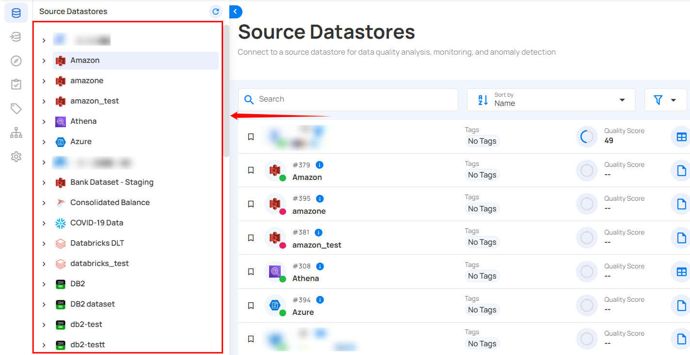
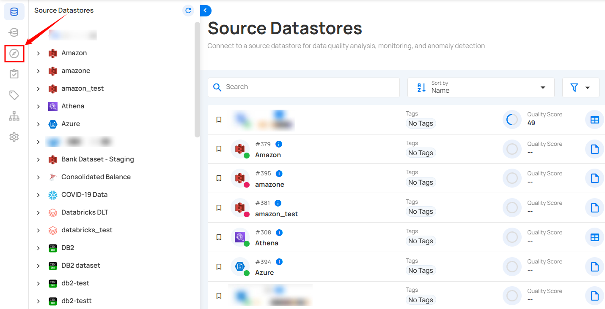

# Checks Overview

Checks in Qualytics are rules applied to data that ensure quality by validating accuracy, consistency, and integrity. Each check includes a data quality rule, along with filters, tags, tolerances, and notifications, allowing efficient management of data across tables and fields.

Let’s get started 🚀

## Checks Types

In Qualytics, you will come across two types of checks:

### Inferred Checks

Qualytics automatically generates inferred checks during a Profile operation. These checks typically cover 80-90% of the rules needed by users. They are created and maintained through profiling, which involves statistical analysis and machine learning methods.

For more details on Inferred Checks, please refer to the [**Inferred Check**](../checks/inferred-check.md) documentation.

### Authored Checks

Authored checks are manually created by users within the Qualytics platform or API. You can author many types of checks, ranging from simple templates for common checks to complex rules using Spark SQL and User-Defined Functions (UDF) in Scala.

For more details on Authored Checks, please refer to the [**Authored Checks**](../checks/authored-check.md) documentation.

## Editing Computed Assets from Checks

Qualytics allows users to edit **computed tables** and **computed fields** directly from **check interfaces**. This feature helps users quickly update computed logic while working on data quality checks—without leaving the check context.

### What You Can Do

#### Edit Computed Assets from a Check

From a **Check Details** screen, users can:

- Edit the **computed table** used by the check
- Edit the **computed field** used by the check

The edit action opens the same **Edit Computed** dialog available from the container page, but directly within the check context.This allows users to quickly adjust logic when a check fails or needs refinement.

### Keyboard Shortcut

#### `E` — Edit Computed Asset

When focused on a computed asset within a check:

- Press **`E`** to open **Edit Computed**
- This opens the **Edit Computed Table** or **Edit Computed Field** dialog

!!! note   
    On this screen, the “E” keyboard shortcut is used to open Edit Computed.
    
### Dependency Protection

Qualytics automatically protects dependencies when computed assets are edited.

#### When a Dependency Is Affected

If an edit to a computed table or field would impact an existing check—for example:

- Renaming or removing a field used by the check
- Modifying a query that drops a referenced column

Qualytics will display a **warning message** before the change is applied.

The warning clearly lists:

- Fields that will be removed
- Checks and anomalies that depend on those fields

#### Proceeding with the Change

If you choose **Proceed Anyway**:

- The affected check(s) will be **deleted**
- Related anomalies will also be removed
- Qualytics will automatically redirect you to the most appropriate page (for example, the container page)

This behavior ensures system consistency and prevents broken references.

### Important Considerations

- There are no strict limitations on editing computed assets
- Changes may impact dependent checks
- Always review dependency warnings before proceeding
- To preserve an existing check, avoid removing or renaming fields it depends on

## View & Manage Checks

**Checks** tab in Qualytics provides users with an interface to view and manage various checks associated with their data. These checks are accessible through two different methods, as discussed below.

### Method 1: Datastore-Specific Checks

**Step 1:** Log in to your Qualytics account and select the datastore from the left menu.

**Step 2:** Click the **"Checks"** from the navigation tab.

You will see a list of all the checks that have been applied to the selected datastore.

You can switch between different types of checks to view them categorically (such as All, Active, Draft, and Archived).

### Method 2: Explore Section

**Step 1:** Log in to your Qualytics account and click the **Explore** button on the left side panel of the interface.

**Step 2:** Click the **"Checks"** from the navigation tab.

You'll see a list of all the checks that have been applied to various tables and fields across different source datastores.

## Check Templates

Check Templates empower users to efficiently create, manage, and apply standardized checks across various datastores, acting as blueprints that ensure consistency and data integrity across different datasets and processes.

Check templates streamline the validation process by enabling check management independently of specific data assets such as datastores, containers, or fields. These templates reduce manual intervention, minimize errors, and provide a reusable framework that can be applied across multiple datasets, ensuring all relevant data adheres to defined criteria. This not only saves time but also enhances the reliability of data quality checks within an organization.

For more details about check templates, please refer to the [**Check Templates**](../checks/checks-template.md) documentation.

## Apply Check Template for Quality Checks

You can export check templates to make quality checks easier and more consistent. Using a set template lets you quickly verify that your data meets specific standards, reducing mistakes and improving data quality. Exporting these templates simplifies the process, making finding and fixing errors more efficient, and ensuring your quality checks are applied across different projects or systems without starting from scratch.

For more details on how to apply check templates for quality checks, please refer to the [**Apply Check Template for Quality Checks**](../checks/apply-check-template-for-quality-checks.md) documentation.

## Export Check Templates

You can export check templates to easily share or reuse your quality check settings across different systems or projects. This saves time by eliminating the need to recreate the same checks repeatedly and ensures that your quality standards are consistently applied. Exporting templates helps maintain accuracy and efficiency in managing data quality across various environments.

For more details about export check templates, please refer to the [**Export Check Templates**](../checks/export-check-templates.md) documentation.

## Manage Checks in Datastore

Managing your checks within a datastore is important to maintain data integrity and ensure quality. You can categorize, create, update, archive, restore, delete, and clone checks, making it easier to apply validation rules across the datastores. The system allows for checks to be set as active, draft, or archived based on their current state of use. You can also define reusable templates for quality checks to streamline the creation of multiple checks with similar criteria. With options for important and favorite, users have full flexibility to manage data quality efficiently.

For more details on how to manage checks in datastores, please refer to the [**Manage Checks in Datastore**](../datastore-checks/overview.md) documentation.

## Check Rule Types

In Qualytics, a variety of check rule types are provided to maintain data quality and integrity. These rules define specific criteria that data must meet, and checks apply these rules during the validation process.

For more details about check rule types, please refer to the [**Rule Types Overview**](../checks/rule-types-overview.md) documentation.

| Rule Type                                                                             | Description                                                                                        |
|---------------------------------------------------------------------------------------|----------------------------------------------------------------------------------------------------|
| [After Date Time](../checks/after-date-check.md)                                      | Asserts that the field is a timestamp later than a specific date and time.                         |
| [Aggregation Comparison](../checks/aggregation-comparison-check.md)                                   | Verifies that the specified comparison operator evaluates true when applied to two aggregation expressions.                                                 |
| [Any Not Null](../checks/any-not-null-check.md)                                       | Asserts that one of the fields must not be null.                                                    |
| [Before Date Time](../checks/before-date-time-check.md)                                | Asserts that the field is a timestamp earlier than a specific date and time.                       |
| [Between](../checks/between-check.md)                                                 | Asserts that values are equal to or between two numbers.                                           |
| [Between Times](../checks/between-times-check.md)                                     | Asserts that values are equal to or between two dates or times.                                    |
| [Contains Credit Card](../checks/contains-credit-card-check.md)                       | Asserts that the values contain a credit card number.                                              |
| [Contains Email](../checks/contains-email-check.md)                                   | Asserts that the values contain email addresses.                                                   |
| [Contains Social Security Number](../checks/contains-social-security-number-check.md) | Asserts that the values contain social security numbers.                                 |
| [Contains Url](../checks/contains-url.md)                                             | Asserts that the values contain valid URLs.                                                        |
| [Data Diff](../checks/data-diff-check.md)                                   | Asserts that the dataset created by the targeted field(s) has differences compared to the referred field(s).                         |
| [Distinct Count](../checks/distinct-count-check.md)                                   | Asserts on the approximate count distinct of the given column.                                      |
| [Entity Resolution](../checks/entity-resolution.md)                                   | Asserts that every distinct entity is appropriately represented once and only once.                                                 |
| [Equal To](../checks/equal-to-check.md)                                   | Asserts that all of the selected fields equal a value.                                                |
| [Equal To Field](../checks/equal-to-field-check.md)                                   | Asserts that this field is equal to another field.                                                 |
| [Exists in](../checks/exists-in-check.md)                                             | Asserts if the rows of a compared table/field of a specific Datastore exists in the selected table/field.|
| [Expected Schema](../checks/expected-schema-check.md)                                 | Asserts that all selected fields are present and that all declared data types match expectations.                                 |
| [Expected Values](../checks/expected-values-check.md)                                 | Asserts that values are contained within a list of expected values.                                 |
| [Field Count](../checks/field-count-check.md)                                         | Asserts that there must be exactly a specified number of fields.                                    |
| [Freshness Check](../checks/freshness-check.md)                                         | Asserts that data was added or updated in the data asset after a declared time.                                    |
| [Greater Than](../checks/greater-than-check.md)                                       | Asserts that the field is a number greater than (or equal to) a value.                              |
| [Greater Than Field](../checks/greater-than-field-check.md)                           | Asserts that this field is greater than another field.                                              |
| [Is Address](../checks/is-address.md)                                                 | Asserts that the values contain the specified required elements of an address.|
| [Is Credit Card](../checks/is-credit-card-check.md)                                   | Asserts that the values are credit card numbers.                                                    |
| [Is Replica Of](../checks/is-replica-of-check.md) (_is sunsetting_)                      | Asserts that the dataset created by the targeted field(s) is replicated by the referred field(s).     |
| [Is Type](../checks/is-type-check.md)                                                 | Asserts that the data is of a specific type.                                                       |
| [Less Than](../checks/less-than-check.md)                                             | Asserts that the field is a number less than (or equal to) a value.                                 |
| [Less Than Field](../checks/less-than-field-check.md)                                 | Asserts that this field is less than another field.                                                 |
| [Matches Pattern](../checks/matches-pattern-check.md)                                 | Asserts that a field must match a pattern.                                                          |
| [Max Length](../checks/max-length-check.md)                                           | Asserts that a string has a maximum length.                                                         |
| [Max Partition Size](../checks/max-partition-size-check.md)                                             | Asserts the maximum number of records that should be loaded from each file or table partition.                                                           |
| [Max Value](../checks/max-value-check.md)                                             | Asserts that a field has a maximum value.                                                           |
| [Metric](../checks/metric-check.md)                                                   | Records the value of the selected field during each scan operation and asserts that the value is within a specified range (inclusive).|
| [Min Length](../checks/min-length-check.md)                                           | Asserts that a string has a minimum length.                                                         |
| [Min Partition Size](../checks/min-partition-size-check.md)                           | Asserts the minimum number of records that should be loaded from each file or table partition.      |
| [Min Value](../checks/min-value-check.md)                                             | Asserts that a field has a minimum value.                                                           |
| [Not Exists In](../checks/not-exists-in-check.md)                                     | Asserts that values assigned to this field do not exist as values in another field.                 |
| [Not Future](../checks/not-future-check.md)                                           | Asserts that the field's value is not in the future.                                                |
| [Not Negative](../checks/not-negative-check.md)                                       | Asserts that this is a non-negative number.                                                         |
| [Not Null](../checks/not-null-check.md)                                               | Asserts that the field's value is not explicitly set to nothing.                                    |
| [Positive](../checks/positive-check.md)                                               | Asserts that this is a positive number.                                                             |
| [Predicted By](../checks/predicted-by-check.md)                                       | Asserts that the actual value of a field falls within an expected predicted range.                  |
| [Required Values](../checks/required-values-check.md)                                 | Asserts that all of the defined values must be present at least once within a field.                |
| [Satisfies Expression](../checks/satisfies-expression-check.md)                       | Evaluates the given expression (any valid `Spark SQL`) for each record.                             |
| [Sum](../checks/sum-check.md)                                                         | Asserts that the sum of a field is a specific amount.                                               |
| [Time Distribution Size](../checks/time-distribution-size-check.md)                   | Asserts that the count of records for each interval of a timestamp is between two numbers.          |
| [Unique](../checks/unique-check.md)                                                   | Asserts that the field's value is unique.                                                           |
| [Volumetric](../checks/volumetric-check.md)                                          | Asserts that the data volume (rows or bytes) remains within dynamically inferred thresholds based on historical trends (daily, weekly, monthly).|